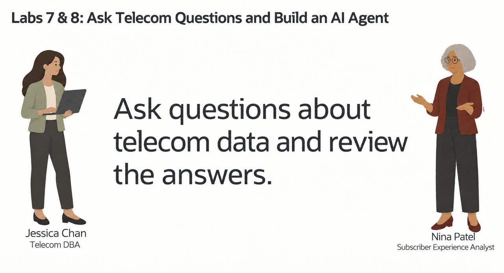
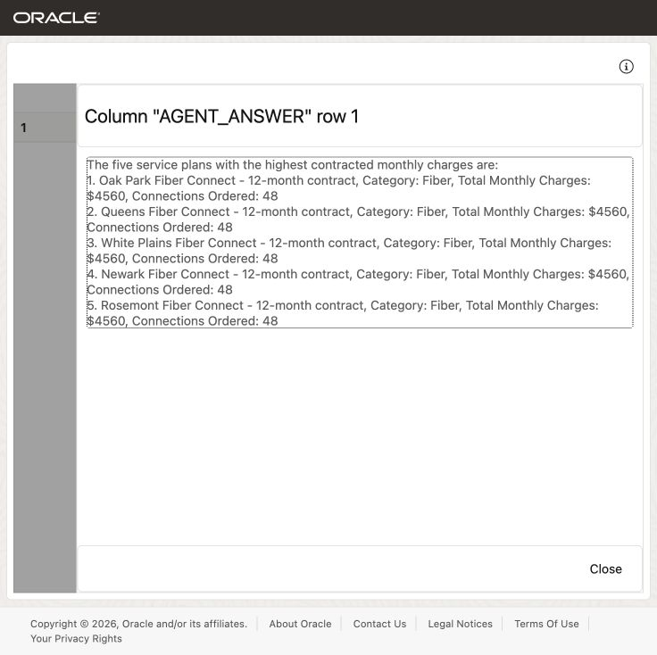
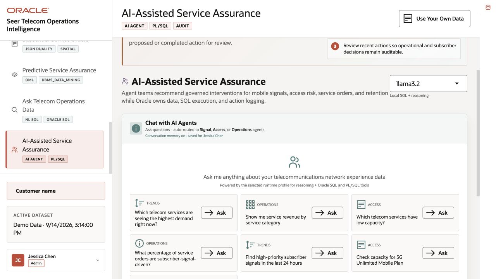
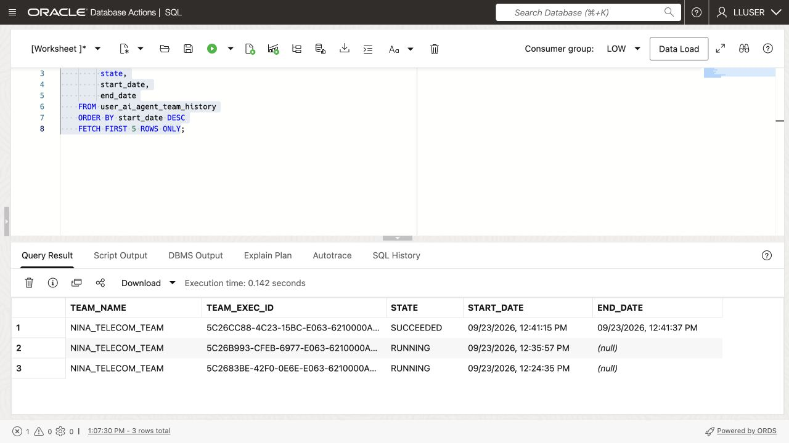
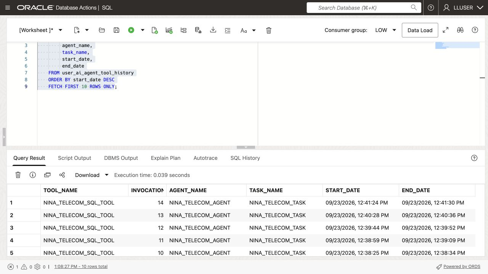

# Build a Telecom Agent with Select AI Agent



## Introduction

Nina Patel has used Select AI for individual questions. Her subscriber-review screen now needs an assistant that can handle a request and follow-up questions.

Jessica, the DBA, gives Nina's agent one SQL tool. It uses the `GENAI` profile and the telecommunications tables configured in the previous lab. Database privileges determine what the tool can access.

In this lab, you create an agent, give it the built-in SQL query tool, and run a question through its team. The instructions ask for read-only answers. SQL still runs with the database user’s privileges. `LLUSER` owns the workshop objects, so it is not an example of a production account with restricted access.

<details>
<summary><strong>Key terms: agent, tool, task, and team</strong></summary>

> - An **agent** is an AI assistant configured to follow instructions and use assigned tools.
>
> - A **tool** is a function the agent is allowed to call. In this lab, the tool runs SQL through the `GENAI` profile.
>
> - A **task** tells the agent what to do and which tools it may use.
>
> - A **team** connects the agent and task so an application or SQL session can run them together.

</details>

### Objectives

- Confirm that the `GENAI` profile from the previous lab is available.
- Verify which telecommunications tables the SQL tool may use.
- Register a SQL tool instructed to answer read-only questions for the telecommunications schema.
- Create an agent, task, and team with `DBMS_CLOUD_AI_AGENT`.
- Run a telecommunications question through the team.
- Review the agent's tool history and explain why the agent has only one tool.

Estimated Time: **15 minutes**

### Hands-on Scenario

| Step                | Telecommunications focus                                                                                  |
| ------------------- | ---------------------------------------------------------------------------------------------- |
| Problem    | Nina needs a telecommunications answer that can feed a subscriber-review screen.                            |
| Database task | The agent uses one SQL tool; database privileges determine its access.      |
| Your role       | You follow Nina as she turns a Select AI question into a small telecommunications assistant.              |
| What You Will See   | An agent receives a request, calls its SQL tool, and returns a telecommunications answer.                 |
| Oracle features | Select AI Agent, `DBMS_CLOUD_AI_AGENT`, AI profiles, and a built-in SQL tool.                   |
| Result             | Nina has an agent with one SQL tool. Its instructions request read-only answers; database privileges determine its access.                |

> **Prerequisite:** Complete [Lab 7: Ask Telecom Questions with Select AI](?lab=selectai). This lab uses the `GENAI` SQL profile and the loader's `GENAI_AGENT` reasoning profile.

## Task 1: Check the profile and table access

The agent's SQL tool uses the existing `GENAI` profile. The profile's `object_list` tells Select AI which tables to consider when it generates SQL. Database privileges provide the second control: the SQL still runs as the current database user and cannot read tables that user cannot access.

1. Check the profile:

    ```sql
    <copy>
    SELECT profile_name,
           status
    FROM user_cloud_ai_profiles
    WHERE profile_name IN ('GENAI', 'GENAI_AGENT');
    </copy>
    ```

    Both profiles should be enabled. `GENAI` generates and runs SQL; `GENAI_AGENT` handles the agent's decisions and final response. The loader prepares the second profile with the same OCI credential and compartment, using Llama 3.3 70B in Chicago. If either profile is missing, ask the workshop administrator to complete setup.

2. Check the tables listed in the profile:

    ```sql
    <copy>
    SELECT profile_name,
           attribute_name,
           attribute_value
    FROM user_cloud_ai_profile_attributes
    WHERE profile_name = 'GENAI'
      AND attribute_name = 'object_list';
    </copy>
    ```

    The list should contain only the workshop tables needed for this lab: `SERVICE_PLANS`, `SERVICE_ORDERS`, `SERVICE_ORDER_LINES`, and `SUBSCRIBERS`. The `object_list` guides SQL generation; it is not a replacement for database grants.

3. Check the agent objects already in your schema:

    ```sql
    <copy>
    SELECT agent_name,
           status
    FROM user_ai_agents
    ORDER BY agent_name;
    </copy>
    ```

  The workshop objects use names beginning with `NINA_TELECOM_`. If you already ran this lab, you can reuse the existing objects or run the reset block in the appendix before starting again.

## Task 2: Register the SQL tool

The SQL tool is the agent's only database capability in this lab. It uses the `GENAI` profile, so the profile lists the tables whose definitions Select AI uses to generate SQL.

1. Register the tool:

    ```sql
    <copy>
    BEGIN
      DBMS_CLOUD_AI_AGENT.CREATE_TOOL(
        tool_name   => 'NINA_TELECOM_SQL_TOOL',
        attributes  => '{"tool_type": "SQL", "tool_params": {"profile_name": "genai"}}',
        description => 'Read-only SQL access to the workshop telecommunications tables'
      );
    END;
    /
    </copy>
    ```

    The tool lets the agent ask Select AI to generate and run SQL. It uses the profile’s table list and the current database user’s privileges.
  
2. Confirm the tool definition:

    ```sql
    <copy>
    SELECT tool_name,
           status,
           description
    FROM user_ai_agent_tools
    WHERE tool_name = 'NINA_TELECOM_SQL_TOOL';
    </copy>
    ```
  
## Task 3: Create Nina's agent, task, and team

The tool by itself does nothing. Nina's agent needs a role, a task needs instructions, and a team connects the two.

1. Create the agent:

    ```sql
    <copy>
    BEGIN
      DBMS_CLOUD_AI_AGENT.CREATE_AGENT(
        agent_name  => 'NINA_TELECOM_AGENT',
        attributes  => '{"profile_name": "GENAI_AGENT", "role": "You are Nina Patel''s telecommunications data assistant. Answer questions using the approved SQL tool. Use database results for service plan, service order, monthly service charge, and subscriber facts. Do not invent values."}',
        description => 'Telecommunications assistant for Nina Patel'
      );
    END;
    /
    </copy>
    ```

2. Create the task:

    ```sql
    <copy>
    BEGIN
      DBMS_CLOUD_AI_AGENT.CREATE_TASK(
        task_name  => 'NINA_TELECOM_TASK',
        attributes => '{"instruction": "Answer this telecommunications question: {query}. Send the complete question as natural language to NINA_TELECOM_SQL_TOOL with action runsql. The SQL tool generates SQL itself, so do not write SQL in its query argument. Call the tool only once. When the tool returns status success, immediately finish the task and give the user that result. Do not call the tool again after success. Do not change database records. Connections means SUM(service_order_lines.connection_count), not a count of orders.", "tools": ["NINA_TELECOM_SQL_TOOL"], "enable_human_tool": "false"}',
        description => 'Answer read-only service plan and subscriber questions'
      );
    END;
    /
    </copy>
    ```
  
3. Create the team:

    ```sql
    <copy>
    BEGIN
      DBMS_CLOUD_AI_AGENT.CREATE_TEAM(
        team_name  => 'NINA_TELECOM_TEAM',
        attributes => '{"agents": [{"name": "NINA_TELECOM_AGENT", "task": "NINA_TELECOM_TASK"}], "process": "sequential"}',
        description => 'Read-only telecommunications question team'
      );
    END;
    /
    </copy>
    ```

    Run the team to use Nina's agent, task instructions, and SQL tool together.
  
## Task 4: Run a telecommunications question

Database Actions does not support the `SELECT AI AGENT` command directly. Use `DBMS_CLOUD_AI_AGENT.RUN_TEAM` in SQL Worksheet and provide the team name in the function call.

1. Ask the agent:

    ```sql
    <copy>
    SELECT DBMS_CLOUD_AI_AGENT.RUN_TEAM(
             team_name   => 'NINA_TELECOM_TEAM',
             user_prompt => 'Which five service plans have the highest contracted monthly charges? Sum service_order_lines.line_total only for service_orders whose order_status is exactly ''confirmed'', ''active'', or ''completed'' (stored lowercase). Include the service plan name, category, total monthly charges, and SUM(service_order_lines.connection_count) as connections ordered. Send this full question unchanged as natural language to the SQL tool, then finish with its successful result.',
             params      => '{"conversation_id": "' || DBMS_CLOUD_AI.CREATE_CONVERSATION() || '"}'
           ) AS agent_answer;
    </copy>
    ```

    

    Database Actions does not keep an agent conversation ID for this call, so the query creates one and passes it to `RUN_TEAM`. The ID lets Oracle record the prompt and response in the agent conversation history.

2. Review the answer.

    Look for the service plan ranking, category, monthly charges, and connections ordered. The exact wording may vary because an AI provider generates the response, but the answer should be based on the telecommunications tables available through `GENAI`.
  
    > **Note:** This team is instructed to answer without changing records. Instructions and descriptions are not a security boundary: LLUSER owns the tables. A production version needs a separate database user that can only read the required tables and rows.

3. Optional challenge: ask a follow-up question that connects the plan with the highest monthly charges to its subscribers and service orders. A more detailed request may take longer because the agent has to interpret more steps.

Open **AI-Assisted Service Assurance** to see the demo's agent question interface. The selected runtime at capture time was local `llama3.2`. This interface example does not show `DBMS_CLOUD_AI_AGENT` running. No agent question, intervention or data-changing action was submitted while taking the capture.



## Task 5: Inspect what the agent did

Nina needs more than a final answer. She also wants to know whether the agent called the approved tool and how the request was processed.

1. Review the latest team runs:

    ```sql
    <copy>
    SELECT team_name,
         team_exec_id,
         state,
         start_date,
         end_date
    FROM user_ai_agent_team_history
    ORDER BY start_date DESC
    FETCH FIRST 5 ROWS ONLY;
    </copy>
    ```

    

    Look for `SUCCEEDED` in your latest run. A `RUNNING` status does not confirm completion.

2. Review the latest tool calls:

    ```sql
    <copy>
    SELECT tool_name,
         invocation_id,
         agent_name,
         task_name,
         start_date,
         end_date
    FROM user_ai_agent_tool_history
    ORDER BY start_date DESC
    FETCH FIRST 10 ROWS ONLY;
    </copy>
    ```

    

  The history should show `NINA_TELECOM_SQL_TOOL`. Nina and Jessica can use it to check which tool the agent called.

## Conclusion: Review the agent's tool use

In Lab 7, Nina used Select AI to turn a question into SQL. In this lab, she gave an agent a role, a task, and one approved SQL tool. The agent can handle a broader request and decide when it needs database information, while the database still controls the profile, object list, privileges, and tool history.

The application can call this assistant with a request. Jessica can review its tools and disable the tool or team when access is no longer needed.

Two controls apply to table access. The profile’s `object_list` guides which tables the tool considers. Database grants and row-level policies determine which data the session can read. Give an application agent only the access it needs.

This example asks the agent to read data. To enforce read-only access in an application, use a database user with only the required read privileges. Before an agent is allowed to change data, the team should add a narrowly defined function tool, clear instructions, and a confirmation step for the user.

## Appendix: Reset the workshop objects

Run this block only if you want to recreate the objects used in this lab. It removes only the four names created here.

```sql
<copy>
BEGIN
  DBMS_CLOUD_AI_AGENT.DROP_TEAM('NINA_TELECOM_TEAM', TRUE);
  DBMS_CLOUD_AI_AGENT.DROP_TASK('NINA_TELECOM_TASK', TRUE);
  DBMS_CLOUD_AI_AGENT.DROP_AGENT('NINA_TELECOM_AGENT', TRUE);
  DBMS_CLOUD_AI_AGENT.DROP_TOOL('NINA_TELECOM_SQL_TOOL', TRUE);
END;
/
</copy>
```

## Next Steps

Read the [Oracle AI Database Select AI Agent documentation](https://docs.oracle.com/en/database/oracle/oracle-database/26/selai/).

## Acknowledgements

* **Author** - Matt Kowalik
* **Contributor** - Kevin Lazarz
* **Last Updated By/Date** - Matt Kowalik, September 2026
