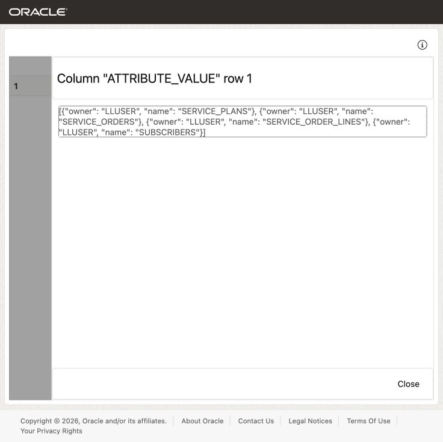
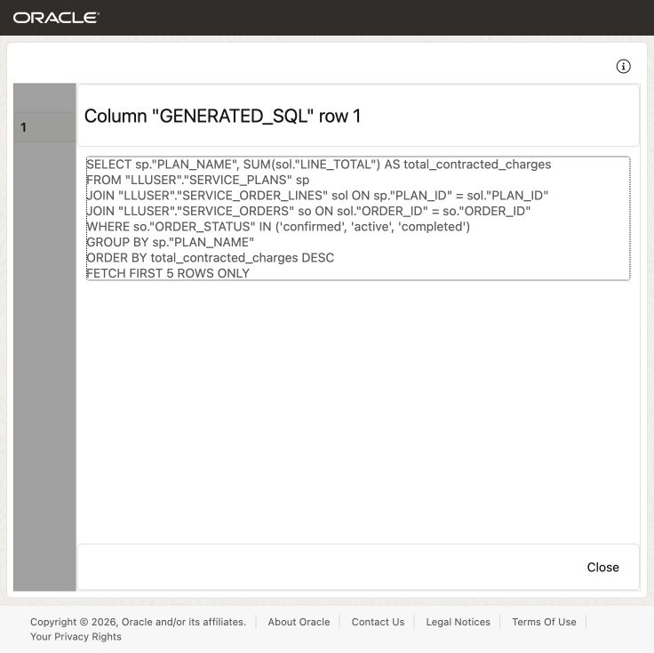
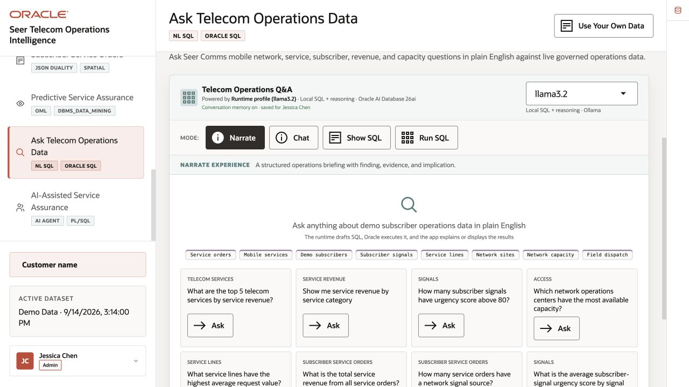
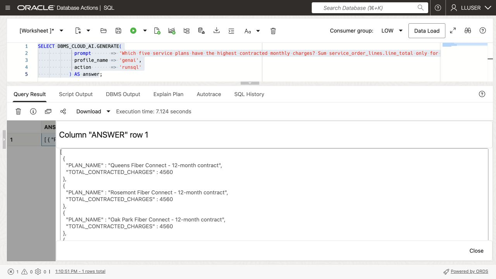
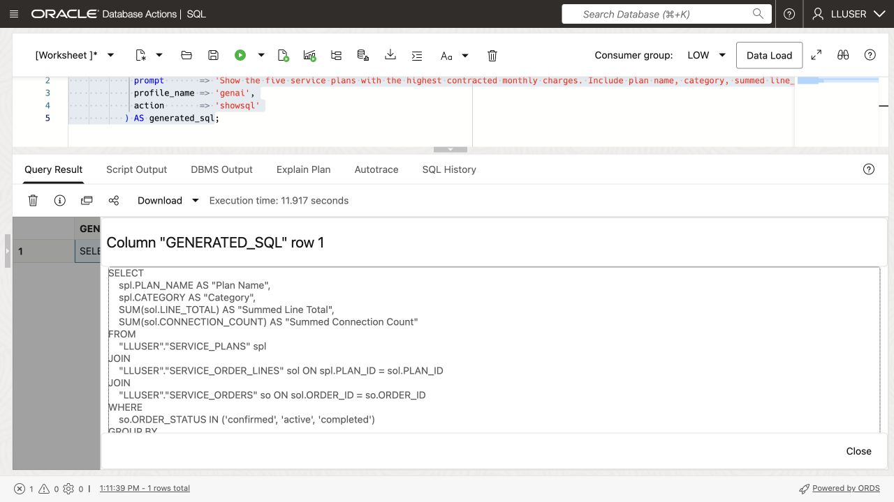
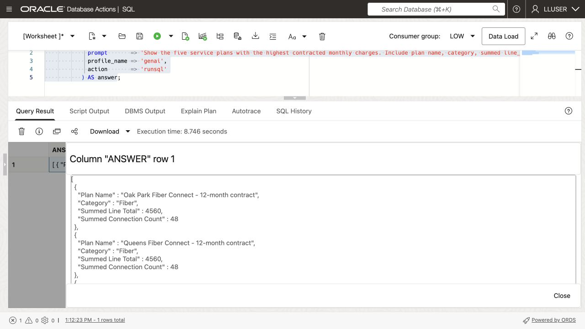
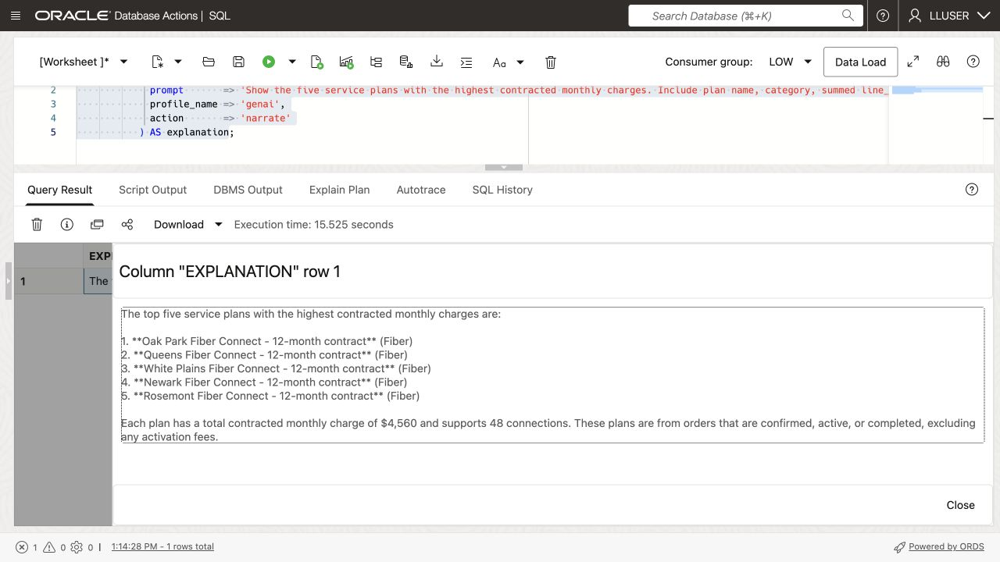

# Ask Telecom Questions with Select AI


## Introduction

> **Validation status:** Tested as LLUSER in a manually provisioned database on 23 September 2026. Screenshots show that run. Load a fresh workshop schema before starting these exercises.

Nina Patel is a subscriber experience analyst at SEER Telecomms. She knows the business questions she wants to ask, but she does not want every answer to depend on finding the right table, column, join, and filter first.

Jessica, the DBA, has already configured a Select AI profile for the telecommunications schema. Nina can ask a question in ordinary language. Select AI uses the profile and table and column definitions to generate SQL, run it, or explain the result.

Nina still needs to review the generated SQL. The model can misunderstand a question or choose the wrong columns. The useful pattern is simple: ask a question, inspect the SQL, run it only when it makes sense, and refine the question when the result is not what the analyst needs.

In this lab, you check the available Select AI profile, ask a telecommunications question, inspect the SQL behind the answer, and improve the question for an answer Nina can use.


<details>
<summary><strong>Key terms: Select AI, AI profile, generated SQL, and natural-language prompt</strong></summary>

> - **Select AI** lets a user work with database information through a natural-language question.
>
> - An **AI profile** connects Select AI to an AI provider and identifies the database objects that may be used for the question.
>
> - **Generated SQL** is the SQL statement created from the question. Nina should inspect it before relying on the result.
>
> - A **natural-language prompt** is the question sent to Select AI, such as `Which five service plans have the highest contracted monthly charges? Sum service_order_lines.line_total only for confirmed, active, or completed service_orders.`

</details>

### Objectives

- Check which Select AI profile is available in the schema.
- Add the telecommunications tables that Select AI may use to the profile.
- Generate SQL from a telecommunications question and inspect it.
- Run a natural-language question through `DBMS_CLOUD_AI.GENERATE`.
- Improve a question so the result contains the details Nina needs.
- Explain why generated SQL still requires review.

Estimated Time: **10 minutes**

### Hands-on Scenario

| Step                | Telecommunications focus                                                                                |
| ---------------------| ----------------------------------------------------------------------------------------------|
| Problem    | Nina needs answers from telecommunications data without writing every query from scratch.               |
| Database task | The question must be translated into SQL against the shared telecommunications schema.                |
| Your role       | You follow Nina as she checks, reviews, and improves a Select AI question.                   |
| What You Will See   | A natural-language question becomes SQL that can be inspected and run in the database.       |
| Oracle features | Select AI, `DBMS_CLOUD_AI`, AI profiles, and natural-language-to-SQL generation.             |
| Result             | Nina gets a repeatable way to ask telecommunications questions while keeping SQL review in the process. |

> **SQL Worksheet reminder:** See [Getting Started Task 2: Open SQL Worksheet](?lab=getting-started#Task2:OpenSQLWorksheet) for the steps to paste and run SQL.

## Task 1: Check the Select AI profile

Select AI uses an AI profile to identify the AI provider and the database objects available for natural-language questions. The workshop database should already contain a profile for the `LLUSER` schema.

1. Run this query:

    ```sql
    <copy>
    SELECT profile_name,
           status,
           description
    FROM user_cloud_ai_profiles
    ORDER BY profile_name;
    </copy>
    ```

    The workshop profile is expected to be named `GENAI`. Confirm that it is enabled. The AI model must also accept on-demand requests in the profile’s region. The instructor configures the model and region before the lab. Check [Oracle’s regional model availability](https://docs.oracle.com/en-us/iaas/Content/generative-ai/model-endpoint-regions.htm) before deployment; a model appearing in the catalog does not necessarily support on-demand calls in that region. If the query shows a different profile name, use that name in the following tasks.

2. Review the profile attributes:
  
    ```sql
    <copy>
    SELECT profile_name,
           attribute_name,
           attribute_value
    FROM user_cloud_ai_profile_attributes
    ORDER BY profile_name, attribute_name;
    </copy>
    ```

    The attributes show how the profile is configured and which database objects are available to Select AI. Do not copy credentials. In Task 2, you will change only the profile's `object_list`.

## Task 2: Add the telecommunications tables to the profile

The profile needs a list of tables that Select AI may use. Nina's questions require service plans, service orders, order lines, and subscribers, so Jessica adds those four tables to the `GENAI` profile.

1. Add the telecommunications tables to the profile:

    ```sql
    <copy>
    BEGIN
      DBMS_CLOUD_AI.SET_ATTRIBUTE(
        profile_name    => 'genai',
        attribute_name  => 'object_list',
        attribute_value => '[{"owner": "' || USER || '", "name": "SERVICE_PLANS"}, {"owner": "' || USER || '", "name": "SERVICE_ORDERS"}, {"owner": "' || USER || '", "name": "SERVICE_ORDER_LINES"}, {"owner": "' || USER || '", "name": "SUBSCRIBERS"}]'
      );
    END;
    /
    </copy>
    ```

2. Confirm the object list:

    ```sql
    <copy>
    SELECT profile_name,
           attribute_name,
           attribute_value
    FROM user_cloud_ai_profile_attributes
    WHERE profile_name = 'GENAI'
      AND attribute_name = 'object_list';
    </copy>
    ```

    <!-- capture:CAP-24 -->
    

    *Live LLUSER capture, 23 September 2026.*


    The result should list `SERVICE_PLANS`, `SERVICE_ORDERS`, `SERVICE_ORDER_LINES`, and `SUBSCRIBERS`. Select AI can now use these tables when it translates Nina's questions into SQL.
  
    

## Task 3: Ask a question and inspect the SQL

Nina starts with a simple question: which service plans have the highest contracted monthly charges? She first asks Select AI to show the SQL without running it.

Database Actions does not support the `SELECT AI` keyword. In SQL Worksheet, use `DBMS_CLOUD_AI.GENERATE` and provide the profile name directly.

1. Run the question with the `GENAI` profile:

    ```sql
    <copy>
    SELECT DBMS_CLOUD_AI.GENERATE(
             prompt       => 'Which five service plans have the highest contracted monthly charges? Sum service_order_lines.line_total only for service_orders whose order_status is exactly ''confirmed'', ''active'', or ''completed'' (stored lowercase).',
             profile_name => 'genai',
             action       => 'showsql'
           ) AS generated_sql;
    </copy>
    ```

    <!-- capture:CAP-25 -->
    

    *Live LLUSER capture, 23 September 2026.*

  
    

2. Read the generated SQL before running it.

    Check that the statement joins SERVICE_PLANS, SERVICE_ORDER_LINES, and SERVICE_ORDERS, groups by plan, returns five rows, sums LINE_TOTAL, and filters the stated service order statuses. Exclude ACTIVATION_FEE from monthly recurring charges. Select AI can generate a valid-looking statement that does not answer the question precisely, so the generated SQL is part of the result Nina reviews.

<!-- application-capture:APP-08 -->

The demo's **Ask Telecom Operations Data** screen illustrates the distinction between **Narrate**, **Chat**, **Show SQL** and **Run SQL**. At capture time its selected runtime was local `llama3.2` through Ollama. This interface example does not establish that the demo uses the `GENAI` profile or executes the Select AI commands in this lab.



*Application capture, 23 September 2026. Separate demo dataset.*

## Task 4: Run the question in the database

Nina has reviewed the SQL. She now asks Select AI to run the question and return the database result.

1. Run the same question with the `runsql` action:

    ```sql
    <copy>
    SELECT DBMS_CLOUD_AI.GENERATE(
             prompt       => 'Which five service plans have the highest contracted monthly charges? Sum service_order_lines.line_total only for service_orders whose order_status is exactly ''confirmed'', ''active'', or ''completed'' (stored lowercase).',
             profile_name => 'genai',
             action       => 'runsql'
           ) AS answer;
    </copy>
      ```

    <!-- capture:CAP-26 -->
    

    *Live LLUSER capture, 23 September 2026.*

  
    

2. Compare the answer with the SQL you inspected in Task 3.

    Select AI has generated and run SQL against the telecommunications schema. The query still runs under Nina's database privileges, and the result comes from the database tables rather than from a separate copy of the telecommunications data.

    > **Note:** Select AI can generate incorrect SQL or misunderstand a question. Use `showsql` when the exact query matters, and treat the generated answer as a starting point for review.

## Task 5: Improve the business question

Nina's first question gives her a service plan ranking, but she also needs enough detail to decide what to review. She changes the question to request the service plan category, total monthly charges, and connections ordered.

1. Use `showsql` to inspect this revised prompt:

    ```sql
    <copy>
    SELECT DBMS_CLOUD_AI.GENERATE(
             prompt       => 'Show the five service plans with the highest contracted monthly charges. Include plan name, category, summed line_total, and summed connection_count. Include only service_orders whose order_status is exactly ''confirmed'', ''active'', or ''completed'' (stored lowercase); exclude activation fees.',
             profile_name => 'genai',
             action       => 'showsql'
           ) AS generated_sql;
    </copy>
    ```

    <!-- capture:CAP-27 -->
    

    *Live LLUSER capture, 23 September 2026.*

  
    

2. Review the generated SQL, then run the revised question with `runsql`:

    ```sql
    <copy>
    SELECT DBMS_CLOUD_AI.GENERATE(
             prompt       => 'Show the five service plans with the highest contracted monthly charges. Include plan name, category, summed line_total, and summed connection_count. Include only service_orders whose order_status is exactly ''confirmed'', ''active'', or ''completed'' (stored lowercase); exclude activation fees.',
             profile_name => 'genai',
             action       => 'runsql'
           ) AS answer;
    </copy>
    ```

    <!-- capture:CAP-28 -->
    

    *Live LLUSER capture, 23 September 2026.*

  
    

3. Compare the first and second questions.

  The revised prompt asks for the columns Nina needs in her review. She still checks that the SQL uses the right joins, totals, and service order statuses.

## Task 6: Explain the result

Nina wants a short explanation of the revised result. Select AI can run the SQL and ask the AI provider to describe the returned rows.

1. Run the revised question with the `narrate` action:

    ```sql
    <copy>
    SELECT DBMS_CLOUD_AI.GENERATE(
             prompt       => 'Show the five service plans with the highest contracted monthly charges. Include plan name, category, summed line_total, and summed connection_count. Include only service_orders whose order_status is exactly ''confirmed'', ''active'', or ''completed'' (stored lowercase); exclude activation fees.',
             profile_name => 'genai',
             action       => 'narrate'
           ) AS explanation;
    </copy>
    ```

    <!-- capture:CAP-29 -->
    

    *Live LLUSER capture, 23 September 2026.*

  
    

2. Review the explanation against the SQL result.

  The explanation is a convenience for a analyst. The SQL result remains the record Nina can inspect, repeat, and use to check whether the explanation is accurate.

  > **Note:** The `narrate` action sends the query result to the AI provider configured in the profile. Use it only for data approved for that provider.

## Conclusion: Ask, Inspect, and Refine

Nina asked a telecommunications question, inspected the generated SQL, ran it, and refined the prompt. Select AI reduced the SQL she needed to write. Reviewing the query helped her check that it answered her question.

Nina can ask questions in ordinary language and inspect the queries behind the answers. The queries use the shared telecommunications schema and run with the database user’s access rights.

Select AI does not replace judgment. A good workflow is to show the SQL, check the tables and filters, run the statement, and compare the answer with the business question.

## Next Steps

For the full list of Select AI actions, profile attributes, and supported providers, see the [Oracle AI Database 26ai Select AI documentation](https://docs.oracle.com/en/database/oracle/oracle-database/26/selai/).

## Acknowledgements

* **Author** - Matt Kowalik
* **Contributor** - Kevin Lazarz
* **Last Updated By/Date** - Matt Kowalik, September 2026
