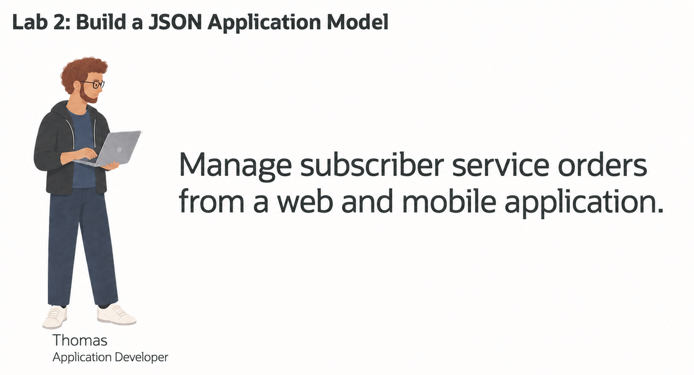
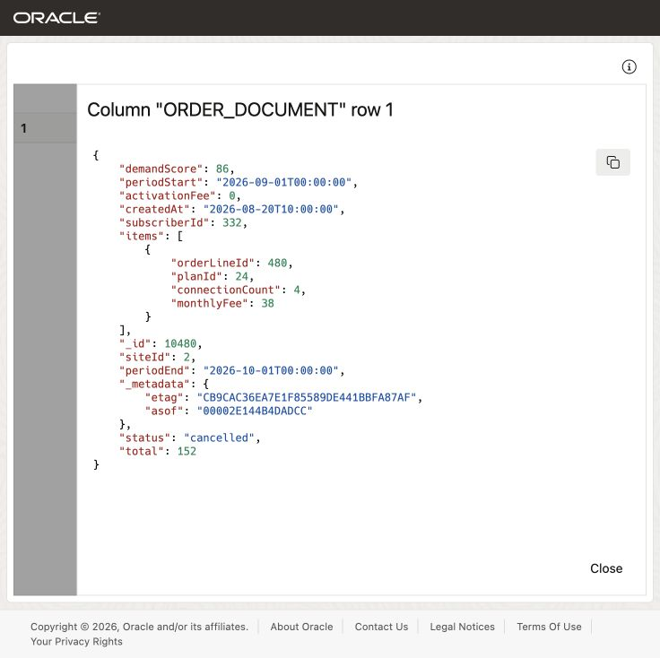
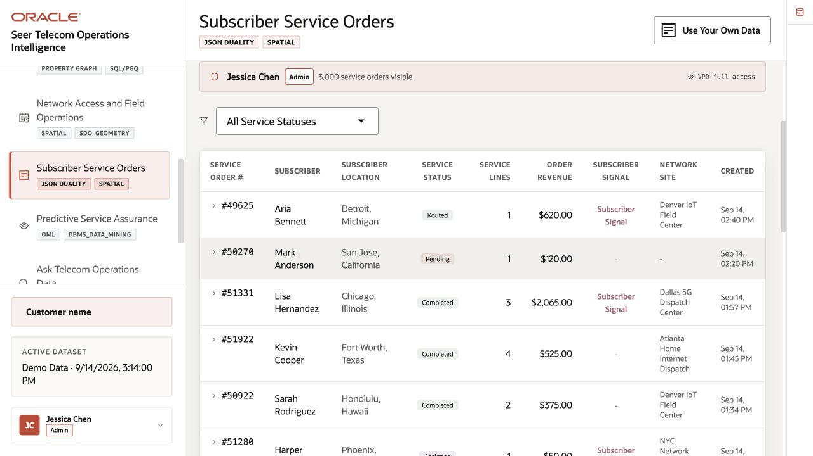
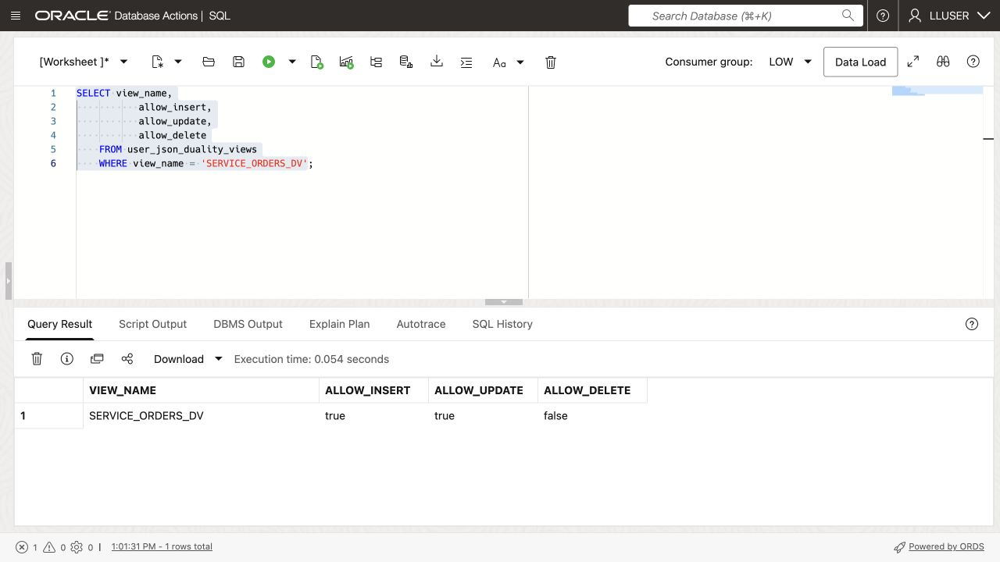
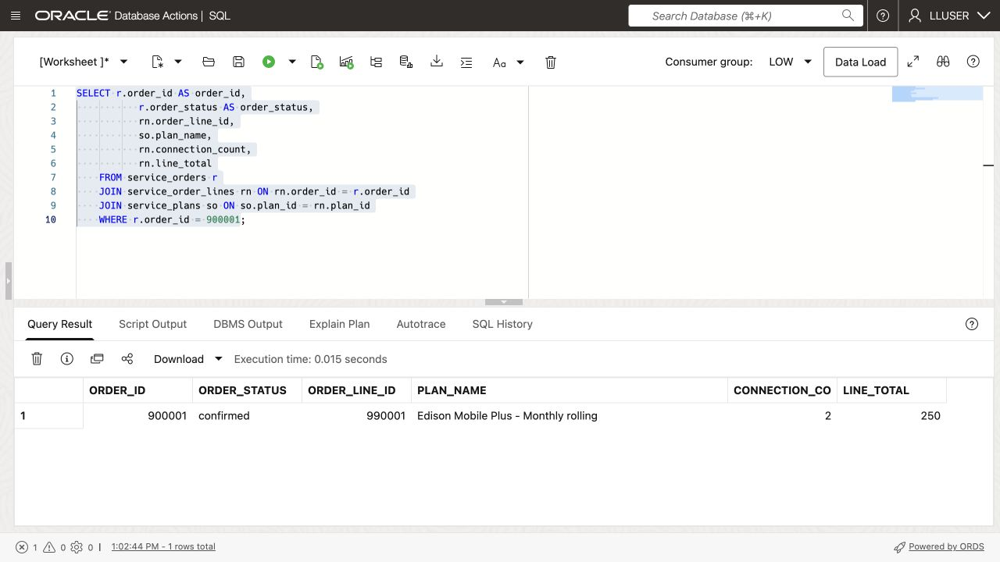
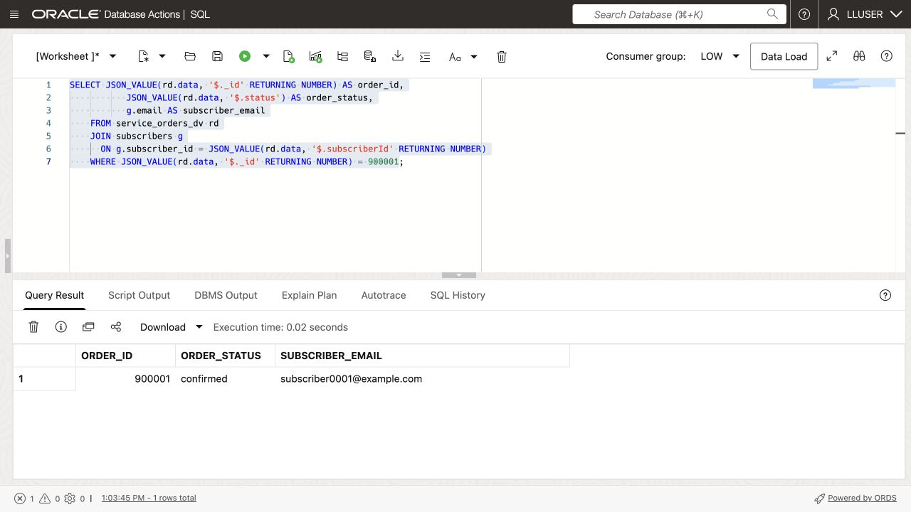
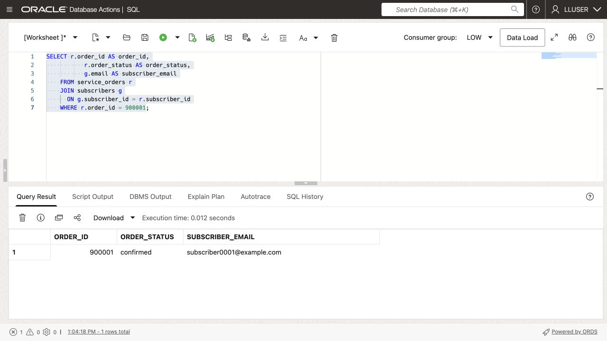

# Build a JSON Application Model

## Introduction

Thomas Brune develops subscriber applications at SEER Telecomms. His team needs service order documents that match its web and mobile screens and reduce calls to the database.

Thomas wants each JSON document to group subscriber and site IDs, service periods, status, monthly service charges, and optional app fields. He needs to change the document as the application grows while keeping relational keys, SQL access, transactions, and database controls.

Thomas asks Jessica, the DBA, to walk through three ways to work with JSON in Oracle AI Database. They start with a JSON value in a relational table, then a collection of JSON documents, and finally a JSON Relational Duality View over existing relational rows. The goal is to choose the right approach for each application feature without creating a second copy of subscriber data.



<details>
<summary><strong>Key terms: JSON columns, JSON collections, and JSON Relational Duality</strong></summary>

> - A **JSON column** stores a JSON value in a relational table alongside normal typed columns, keys, and constraints. Thomas can use it for optional or changing application attributes without turning every new attribute into a schema change.
>
> - A **JSON collection** is a special table or view that provides a set of JSON documents through one `JSON`-typed `DATA` column. Each document can have a top-level `_id` used to identify it.
>
> - **JSON Relational Duality** lets Oracle Database expose relational data as JSON documents without copying it into a separate document database. The application gets the document shape Thomas wants for its API. The database keeps the relational rows and controls.
>

</details>

Thomas's application needs a document with the service order and its monthly service-charge lines together, such as this:

```json
{
  "_id": 513063,
  "subscriberId": 1,
  "siteId": 1,
  "periodStart": "2026-09-01",
  "periodEnd": "2026-10-01",
  "status": "confirmed",
  "items": [
    { "planId": 1, "connectionCount": 2, "monthlyFee": 125.00 }
  ]
}
```

The application uses this document shape, while the database keeps the service order and monthly service-charge lines in relational form. In this lab, you build and read this type of document in three ways.

### Objectives

- Store flexible application attributes as JSON in a relational table.
- Create and query a JSON Collection Table of service order documents.
- Read and update relational service order data through `SERVICE_ORDERS_DV`.
- Compare the three JSON approaches and choose the right one for an application feature.

Estimated Time: **10 minutes**

### Hands-on Scenario

| Step | Telecommunications focus |
| --- | --- |
| Problem | Thomas's team needs flexible JSON documents for a new subscriber web and mobile application. |
| Database task | The team needs documents that match the application’s screens while the database keeps relational keys, joins, and controls. |
| Your role | Thomas tests JSON storage, collections, and duality with Jessica's database guidance. |
| What You Will See | One Oracle AI Database supports several JSON access patterns over the telecommunications data. |
| Oracle features | Native JSON, SQL/JSON functions, and JSON Relational Duality work together. |
| Result | Thomas can choose a document structure without creating a second subscriber-data store. |

Persona focus: You are Thomas, working with Jessica to decide how the new application should store, assemble, and read subscriber service order data.

### Thomas's three JSON choices

Thomas does not need one JSON pattern for every feature. A JSON column holds optional application attributes in a relational table. A JSON Collection Table holds documents owned by the application. A duality view assembles a document from existing relational tables. Thomas uses the document shape in the application, while Jessica works with the underlying rows using SQL.

Thomas gets the JSON document his application needs. Jessica keeps SQL access, relational rows, and database controls in the same database.

> **SQL Worksheet reminder:** See [Getting Started Task 2: Open SQL Worksheet](?lab=getting-started#Task2:OpenSQLWorksheet) for the steps to paste and run SQL.

## Task 1: Store flexible application data as JSON

Thomas starts with data that belongs to the application but does not need its own relational columns. The workshop database already contains the service order rows. He adds a small application-data table with a native `JSON` column for optional screen and subscriber-experience settings.

1. Create the application-data table and add one sample document.

    ```sql
    <copy>
    CREATE TABLE thomas_app_data (
        order_id  NUMBER PRIMARY KEY,
        app_data  JSON NOT NULL
    );

    INSERT INTO thomas_app_data (order_id, app_data)
    SELECT order_id,
           JSON_OBJECT(
               'screen'    VALUE 'service-order-detail',
               'showTotal' VALUE 'true' FORMAT JSON,
               'features'  VALUE JSON_ARRAY('live-status', 'activation-preferences')
               RETURNING JSON
           )
    FROM (
        SELECT order_id
        FROM service_orders
        ORDER BY order_id
        FETCH FIRST 1 ROW ONLY
    );

    COMMIT;
    </copy>
    ```

2. Read values from the JSON column.

    ```sql
    <copy>
    SELECT order_id,
           JSON_VALUE(app_data, '$.screen') AS screen_name,
           JSON_VALUE(app_data, '$.showTotal' RETURNING BOOLEAN) AS show_total,
           JSON_QUERY(app_data, '$.features') AS app_features
    FROM thomas_app_data;
    </copy>
    ```

    `ORDER_ID` remains a relational key. `APP_DATA` can change as the application changes. Thomas can query both with SQL in one table.

## Task 2: Create a JSON Collection Table

Thomas now needs a collection of application documents. Unlike the JSON column in Task 1, this object is a JSON Collection Table: each row is a document, the document is stored in `DATA`, and `_id` identifies the document.

1. Create the collection and add the sample service order document.

    ```sql
    <copy>
    CREATE JSON COLLECTION TABLE thomas_order_docs
    WITH ETAG;

    INSERT INTO thomas_order_docs (data)
    SELECT JSON_OBJECT(
               '_id'        VALUE r.order_id,
               'subscriberId' VALUE r.subscriber_id,
               'siteId' VALUE r.site_id,
               'periodStart' VALUE TO_CHAR(r.period_start, 'YYYY-MM-DD'),
               'periodEnd' VALUE TO_CHAR(r.period_end, 'YYYY-MM-DD'),
               'status'     VALUE r.order_status,
               'items'      VALUE (
                   SELECT JSON_ARRAYAGG(
                              JSON_OBJECT(
                                  'orderLineId'    VALUE rn.order_line_id,
                                  'planId' VALUE rn.plan_id,
                                  'connectionCount'  VALUE rn.connection_count,
                                  'monthlyFee' VALUE rn.monthly_fee
                                  RETURNING JSON
                              ) ORDER BY rn.order_line_id RETURNING JSON
                          )
                   FROM service_order_lines rn
                   WHERE rn.order_id = r.order_id
               ) FORMAT JSON
               RETURNING JSON
           )
    FROM service_orders r
    JOIN thomas_app_data t ON t.order_id = r.order_id;

    COMMIT;
    </copy>
    ```

    `WITH ETAG` adds an `_metadata.etag` value to each document. Oracle changes the tag whenever the document changes. Thomas's application can send the tag it last read when it updates a document. If the tag no longer matches, the application knows that someone else changed the document first and can avoid overwriting the newer version. This protects subscriber data when web and mobile requests try updating the same document at the same time.

2. Query the collection as documents.

    ```sql
    <copy>
    SELECT JSON_SERIALIZE(data PRETTY) AS order_document
    FROM thomas_order_docs
    WHERE JSON_VALUE(data, '$._id' RETURNING NUMBER) =
          (SELECT order_id FROM thomas_app_data);
    </copy>
    ```

    Thomas now has a document collection that a document API can access, and SQL can query the same `DATA` column. The collection stores the documents; it is separate from the relational `SERVICE_ORDERS` and `SERVICE_ORDER_LINES` tables.

## Task 3: Read a subscriber document from relational data

Thomas now tests the document shape his application can consume directly.

1. Run this query:

    This query selects the JSON `DATA` column from `SERVICE_ORDERS_DV` so Thomas can inspect the document shape in SQL Worksheet.

    <details>
    <summary><strong>Why this matters to Thomas</strong></summary>

    > Thomas can use a JSON Collection Table when the application owns the document. But the service order already has relational tables that Jessica and other teams rely on.
    > The duality view gives Thomas a document over those existing rows. He can choose the document structure without copying the service order into another store.

    </details>

    ```sql
    <copy>
    SELECT data AS order_document
    FROM service_orders_dv
    FETCH FIRST 1 ROW ONLY;
    </copy>
    ```

    

    **Expected output:**

2. Expand the document in SQL Worksheet.
    Oracle builds this document from the existing service order and line rows. Check `_id`, `subscriberId`, `status`, totals, timestamps, and `items` in the returned JSON.

    > **Note:** Look for `_metadata.etag` in the document. The ETAG changes when the document changes, so Thomas's application can detect a newer version before updating the service order and avoid overwriting another request.

In the running demo, open **Subscriber Service Orders** to see an application list of subscriber commitments. This is an order-list example. The demo document structure differs from `SERVICE_ORDERS_DV`, so use the SQL and JSON keys above for this lab.



## Task 4: Enable document inserts and updates

The existing `SERVICE_ORDERS_DV` lets an application update service order documents. Here, you also allow inserts. Oracle still enforces the table keys and constraints. An application granted access only to the view can use only the fields and write operations that the view allows.

1. Check the current document-write capabilities.

    ```sql
    <copy>
    SELECT view_name,
           allow_insert,
           allow_update,
           allow_delete
    FROM user_json_duality_views
    WHERE view_name = 'SERVICE_ORDERS_DV';
    </copy>
    ```

    **Expected output: Current Document Capabilities**

    `SERVICE_ORDERS_DV` should report update enabled and insert disabled in the initial loader definition.

    The view currently allows updates but not new top-level documents. The root `SERVICE_ORDERS` table controls document insertion. The nested `SERVICE_ORDER_LINES` rows must also allow inserts so the document can include monthly service-charge lines.

2. Enable insert and update for the document and its monthly service-charge lines.

    You are changing the duality-view definition, not creating a second API store. The two `WITH INSERT UPDATE` clauses allow developers to create and update the JSON document. Oracle still enforces the relational keys and data types.

    ```sql
    <copy>
    CREATE OR REPLACE JSON RELATIONAL DUALITY VIEW service_orders_dv AS
    SELECT JSON {
        '_id'         : r.order_id,
        'subscriberId'  : r.subscriber_id,
        'siteId' : r.site_id,
        'periodStart'     : r.period_start,
        'periodEnd'    : r.period_end,
        'status'      : r.order_status,
        'total'       : r.order_total,
        'activationFee': r.activation_fee,
        'demandScore' : r.demand_score,
        'createdAt'   : r.created_at,
        'items' : [
            SELECT JSON {
                'orderLineId'    : rn.order_line_id,
                'planId' : rn.plan_id,
                'connectionCount'  : rn.connection_count,
                'monthlyFee' : rn.monthly_fee
            }
            FROM service_order_lines rn WITH INSERT UPDATE
            WHERE rn.order_id = r.order_id
        ]
    }
    FROM service_orders r WITH INSERT UPDATE;
    </copy>
    ```

    This duality view uses two relational tables. `SERVICE_ORDERS` provides the document root. Related `SERVICE_ORDER_LINES` rows become the nested `items` collection. The `WITH INSERT UPDATE` clauses let Thomas write the complete JSON document while Oracle maintains the rows and relationships.

    **Expected output: View Definition Updated**

    Oracle created or replaced the duality view. Verify the new capabilities in the next step.

3. Run the capability query again.

    ```sql
    <copy>
    SELECT view_name,
           allow_insert,
           allow_update,
           allow_delete
    FROM user_json_duality_views
    WHERE view_name = 'SERVICE_ORDERS_DV';
    </copy>
    ```

    

    **Expected output: Document Capabilities Enabled**

    `SERVICE_ORDERS_DV` should report insert and update enabled; delete remains disabled.

    The view can now receive a new JSON service order document and apply a document update. Thomas has a document API over the existing relational service order data. He can use it for a subscriber feature such as submitting a new service order. The application sends one document, and the database writes the service order and its monthly service-charge lines to the relational tables.

## Task 5: Create and update a JSON service order

Thomas now tests a complete subscriber service order. He creates it as one nested JSON document, then confirms that Jessica can immediately see the same data as structured relational rows.

1. Insert the supplied workshop service order document.

    The `INSERT` writes through `SERVICE_ORDERS_DV`; Oracle uses the view definition to update the relational tables. The sample uses service order `900001`, subscriber `1`, site `1`, plan `1`, and order-line `990001`. Its two-connection service order costs 125.00 per connection per month, for a total of 250.00 in the workshop currency.

    The loader must supply subscriber 1 and plan 1 at site 1. The service order and order-line IDs are reserved for this exercise. The fixed dates cover September 2026, with an exclusive end date of 1 October. The quantity is two connections, independent of the number of days. This example does not calculate proration or taxes. On the first run, the service order has status `pending`. Running the insert again adds no rows and preserves the existing record.

    ```sql
    <copy>
    INSERT INTO service_orders_dv (data)
    SELECT JSON(
      '{
        "_id": 900001,
        "subscriberId": 1,
        "siteId": 1,
        "periodStart": "2026-09-01",
        "periodEnd": "2026-10-01",
        "status": "pending",
        "total": 250.00,
        "activationFee": 0,
        "items": [
          {
            "orderLineId": 990001,
            "planId": 1,
            "connectionCount": 2,
            "monthlyFee": 125.00
          }
        ]
      }'
    )
    WHERE NOT EXISTS (
      SELECT 1
      FROM service_orders
      WHERE order_id = 900001
    );

    COMMIT;
    </copy>
    ```

    **Expected output: Service Order Document Created**

    On the first run, you insert one document. On later runs, the `NOT EXISTS` check returns zero rows because the workshop service order is already present.

2. Confirm the JSON document became relational rows.

    >**Note**: This query reads the relational tables `SERVICE_ORDERS` and `SERVICE_ORDER_LINES`.

    ```sql
    <copy>
    SELECT r.order_id AS order_id,
           r.order_status AS order_status,
           g.email AS subscriber_email,
           rn.order_line_id,
           so.plan_name,
           rn.connection_count,
           rn.monthly_fee,
           rn.line_total
    FROM service_orders r
    JOIN subscribers g ON g.subscriber_id = r.subscriber_id
    JOIN service_order_lines rn ON rn.order_id = r.order_id
    JOIN service_plans so ON so.plan_id = rn.plan_id
    WHERE r.order_id = 900001;
    </copy>
    ```

    **Expected output: Created Service Order Rows**

    The sample row should contain service order 900001, order-line 990001, two connections at 125.00, line total 250.00, and status `pending` on the first run. Read the subscriber email and plan name from the loaded rows.

3. Update the document status through the duality view.

    This statement updates only `status` through `SERVICE_ORDERS_DV`. Oracle maps it to `SERVICE_ORDERS.ORDER_STATUS`. The view also allows updates to other exposed fields; restricting writes to status alone would require a more limited view definition. Thomas does not need to parse the document in the application. This partial SQL update does not compare an ETAG. Applications that need to detect changes made by another user should read and submit the document with its ETAG using the documented full-document update flow.

    ```sql
    <copy>
    UPDATE service_orders_dv
    SET data = JSON_TRANSFORM(data, SET '$.status' = 'confirmed')
    WHERE JSON_VALUE(data, '$._id' RETURNING NUMBER) = 900001;

    COMMIT;
    </copy>
    ```

    **Expected output: Service Order Status Updated**

    Oracle updates one document. The following query confirms that the relational service order row now has status `confirmed`.

4. Verify the updated relational status.

    ```sql
    <copy>
    SELECT r.order_id AS order_id,
           r.order_status AS order_status,
           rn.order_line_id,
           so.plan_name,
           rn.connection_count,
           rn.line_total
    FROM service_orders r
    JOIN service_order_lines rn ON rn.order_id = r.order_id
    JOIN service_plans so ON so.plan_id = rn.plan_id
    WHERE r.order_id = 900001;
    </copy>
    ```

    

    **Expected output: Updated Service Order Rows**

    Service Order 900001 should now have status `confirmed`, with the same order-line values.

## Task 6: Project JSON fields with SQL

Thomas has checked that the application can display and update a document. Jessica now queries `SERVICE_ORDERS_DV` to check the fields the application receives. She extracts selected JSON values as SQL columns, a step called **projection**. She can use those columns for subscriber-support searches and status filters.

1. Run this SQL/JSON projection query:

    Thomas's document is still available for SQL analysis. The same service order shape can be queried, filtered, and joined to relational subscriber data.

    The SQL uses `JSON_VALUE` to extract service order fields from the duality document. That is the projection step. It returns the service order ID and status, reads the embedded subscriber identifier, joins that identifier to `SUBSCRIBERS`, and orders the result for review.


    ```sql
    <copy>
    SELECT JSON_VALUE(rd.data, '$._id' RETURNING NUMBER) AS order_id,
           JSON_VALUE(rd.data, '$.status') AS order_status,
           g.email AS subscriber_email
    FROM service_orders_dv rd
    JOIN subscribers g
      ON g.subscriber_id = JSON_VALUE(rd.data, '$.subscriberId' RETURNING NUMBER)
    WHERE JSON_VALUE(rd.data, '$._id' RETURNING NUMBER) = 900001;
    </copy>
    ```

    

    **Expected output: JSON Field Projection**

    Compare service order ID 900001, status `confirmed`, and the loaded subscriber email with the following relational query. Compare these values after executing both queries.

2. Run the equivalent query against the relational tables.

    ```sql
    <copy>
    SELECT r.order_id AS order_id,
           r.order_status AS order_status,
           g.email AS subscriber_email
    FROM service_orders r
    JOIN subscribers g
      ON g.subscriber_id = r.subscriber_id
    WHERE r.order_id = 900001;
    </copy>
    ```

    

    Compare the result with the previous query. The service order ID, status, and subscriber email should match. Thomas's application is reading the JSON document, while Jessica's relational query reads the underlying rows.

## Conclusion: Choose the right JSON approach

Thomas does not have to choose one JSON model for the whole application. He can choose based on who owns the data and whether the application needs a document over existing relational rows.

| Approach                          | Use it when                                                                                 | Example in Thomas's application                                                                            | Where the data lives                                                                                           |
| -----------------------------------| ---------------------------------------------------------------------------------------------| ------------------------------------------------------------------------------------------------------------| ----------------------------------------------------------------------------------------------------------------|
| JSON column in a relational table | A relational record needs optional or changing attributes.                                  | Store screen settings or subscriber experience options alongside a service order key.                          | A normal relational table with a native `JSON` column.                                                         |
| JSON Collection Table             | The application owns a set of JSON documents and needs document-style access.               | Store activation drafts while subscribers choose plans, connection counts, and eSIM preferences.                              | A JSON Collection Table with one document in each `DATA` row.                                                  |
| JSON Relational Duality View      | The data already belongs in relational tables, but the application needs one JSON document. | Return a subscriber service order with its status and monthly service-charge lines, or accept a new service order document from the app. | Relational tables such as `SERVICE_ORDERS` and `SERVICE_ORDER_LINES`; the duality view defines the JSON shape for Thomas' app. |

For Thomas, `SERVICE_ORDERS_DV` is the right choice for the service order feature because `SERVICE_ORDERS` and `SERVICE_ORDER_LINES` already hold shared telecommunications data. The application gets the JSON document it needs, while Jessica keeps SQL, relational constraints, and controlled access to the same data.

## Acknowledgements

* **Author** - Matt Kowalik
* **Contributor** - Kevin Lazarz
* **Last Updated By/Date** - Matt Kowalik, September 2026
