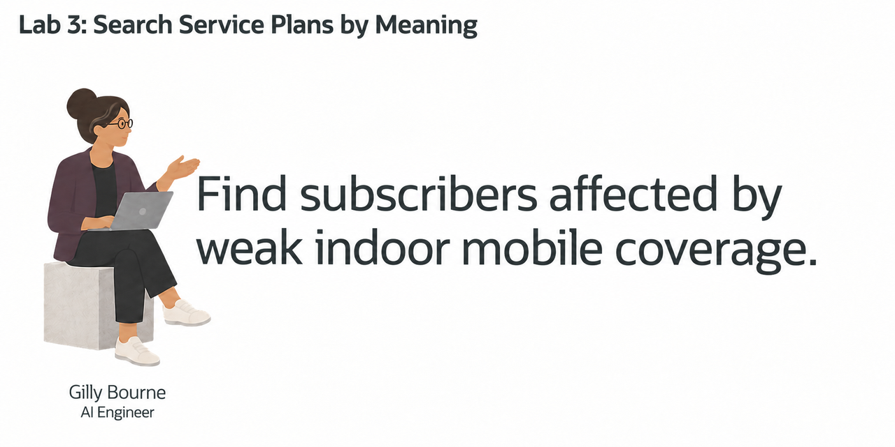
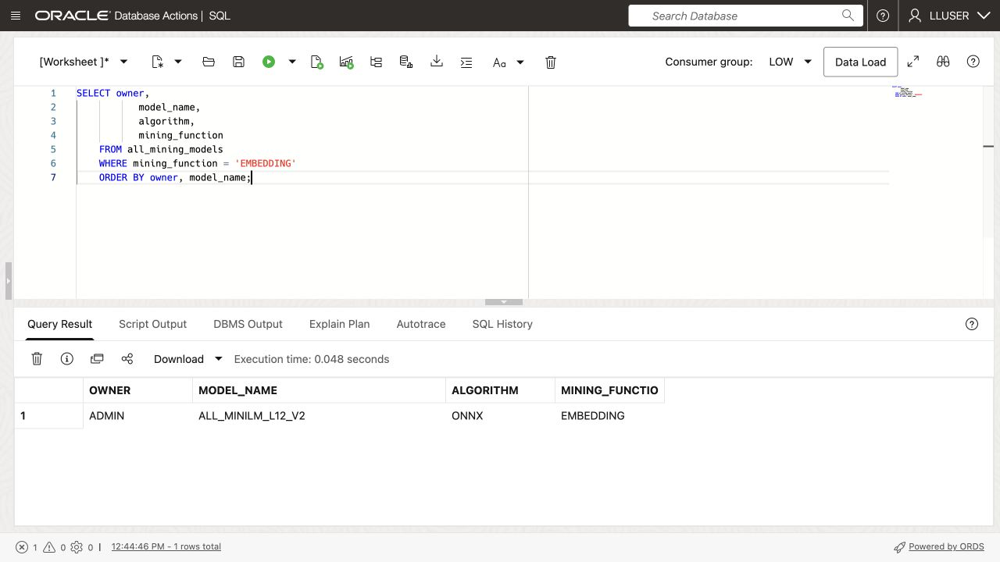
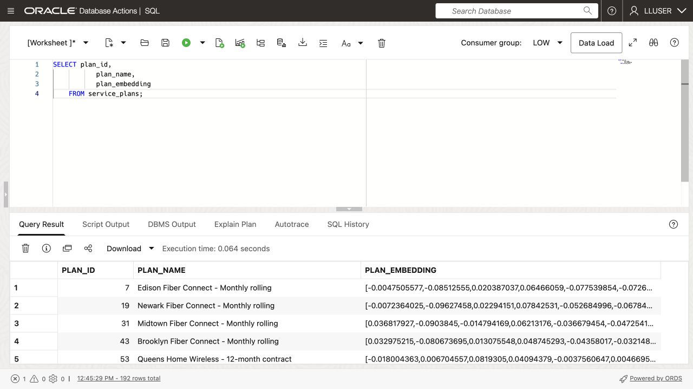
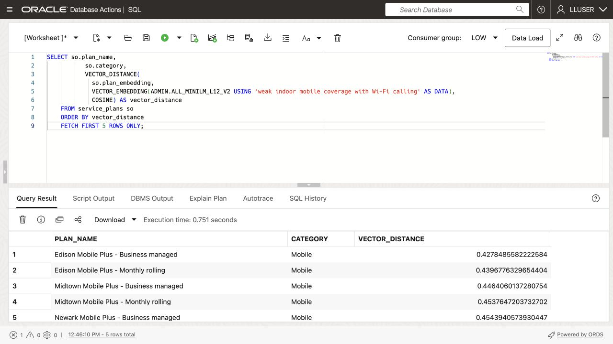
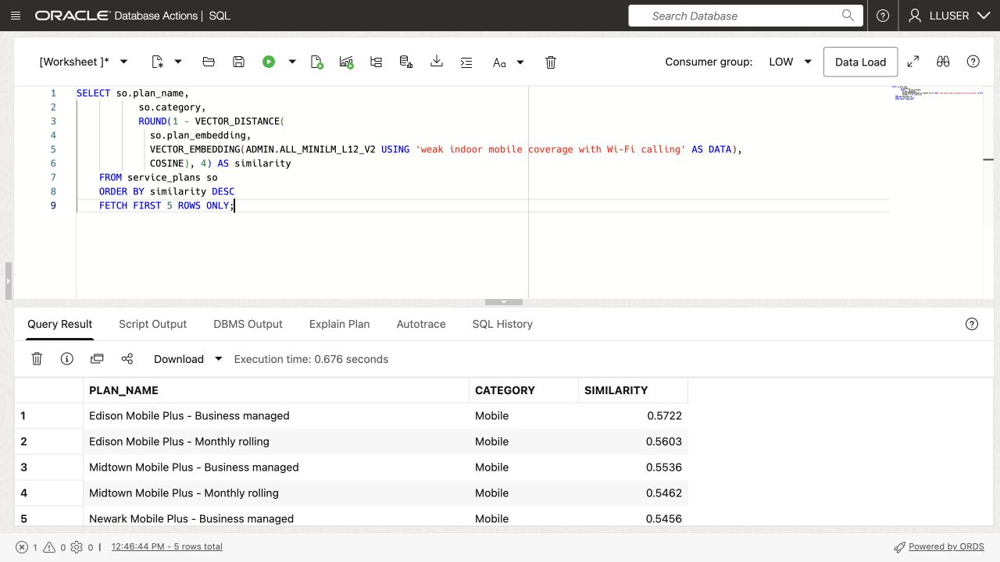
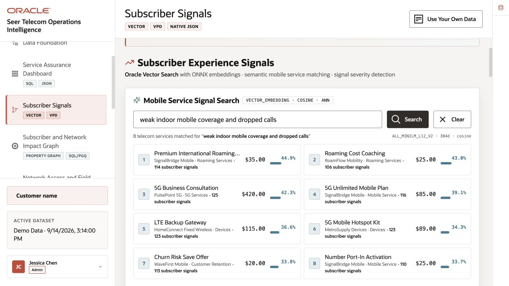
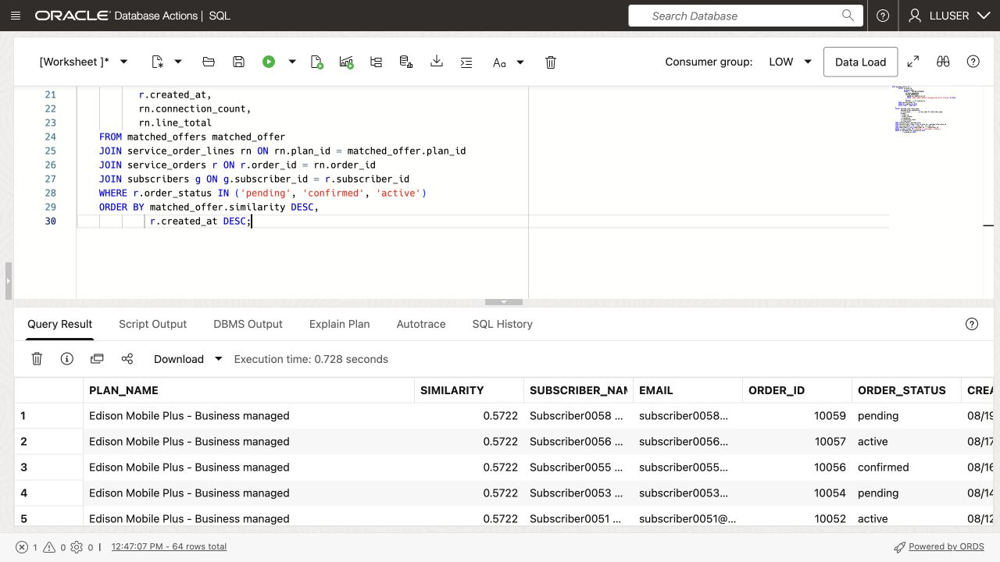

# Search Service Plans by Meaning



## Introduction

> **Validation status:** Tested as LLUSER in a manually provisioned database on 23 September 2026. Screenshots show that run. Load a fresh workshop schema before starting these exercises.

Gilly Bourne is an AI engineer at SEER Telecomms. Her team has built a search feature for the subscriber-support application. A support analyst can enter a question such as **which subscribers may be affected by an indoor mobile coverage complaint?** The application should find the relevant service plans first, then show the subscribers who ordered them.

Gilly has the service plan, service order, and subscriber data in Oracle AI Database. She needs to match a plain-language question to service plans, then find the subscribers who ordered them. The result must give the service team names and service orders to follow up.

Gilly runs the search in the database. One SQL statement compares the question with service plan vectors, joins the matches to service orders and subscribers, and returns the follow-up list. This avoids copying text and vectors to a separate search service.

In this lab, you check the embedding model, create service plan vectors, and use a search result to find matching service orders and subscribers.


<details>
<summary><strong>Key terms: embedding, vector, vector distance, and semantic search</strong></summary>

> - An **embedding** is a numerical profile of what text means. In this lab, service plan data is embedded so similar telecommunications ideas sit near each other mathematically, even when the wording is different.
>
> - An **ONNX embedding model** is a portable machine-learning model saved in the Open Neural Network Exchange (ONNX) format. It turns text into a vector of numbers that captures meaning. Oracle AI Database can load and run this model inside the database, close to the service plan rows.
>
> - A **vector** is the stored numerical form of an embedding. Oracle Database can store vectors beside the telecommunications rows they describe, so the search stays connected to service plan names, service types, billing models, and monthly fees.
>
> - **Vector distance** measures how close two vectors are. A smaller distance means the meanings are more similar; a larger distance means they are farther apart. In this lab, distance helps rank which service plans best match a support analyst's question.
>
> - **Semantic search** means searching by meaning instead of exact words. A search for "weak indoor mobile coverage with Wi-Fi calling" can find mobile plans with Wi-Fi calling even when the service plan names use different wording.

</details>

The Subscriber Concern Search page lets a user enter a concern and receive service plans ranked by meaning. The following tasks explain the SQL behind that search.

### Objectives

- Check the embedding model Gilly needs for semantic search.
- Create a vector from service plan data inside the database.
- Review a semantic service plan search for a business question.
- Turn service plan matches into a subscriber follow-up list.
- Explain why vector search belongs beside telecommunications data and access controls.

Estimated Time: **10 minutes**

### Hands-on Scenario

| Step                | Telecommunications focus                                                                                                                               |
| ---------------------| ---------------------------------------------------------------------------------------------------------------------------------------------|
| Problem    | Support analysts need to find relevant service plans without knowing the exact terms used in the service plan data.                                     |
| Database task | Gilly must search by meaning while keeping service plan data, vectors, service orders, subscribers, and access controls together.                          |
| Your role       | You review Gilly's implementation as she explains how the search connects a business question to service plans, service orders, and subscribers.           |
| What You Will See   | Vector search ranks service plans by meaning, then SQL adds service order and subscriber details.                                                          |
| Oracle features | `VECTOR_EMBEDDING`, vector columns, and `VECTOR_DISTANCE` run beside relational telecommunications data.                                               |
| Result             | The application can turn a plain-language concern into a subscriber follow-up list without a separate vector database or copied telecommunications text. |

Persona focus: You are reviewing the search tool Gilly built for subscriber support operations.


> **SQL Worksheet reminder:** See [Getting Started Task 2: Open SQL Worksheet](?lab=getting-started#Task2:OpenSQLWorksheet) for the steps to paste and run SQL.


## Task 1: Check the embedding model

Start with Gilly's first design question: **what does similarity search need?** It needs vectors for the text being searched and an embedding model that converts a question into a vector.

Gilly asks Jessica to load an ONNX embedding model into Oracle AI Database. Oracle AI Database can store and run the ONNX model inside the database, so it creates the question embedding where the service plan data already live. The application does not have to send telecommunications text to a separate service and bring the vector back.

1. Run the following query to see which embedding models are available:

    ```sql
    <copy>
    SELECT owner,
           model_name,
           algorithm,
           mining_function
    FROM all_mining_models
    WHERE mining_function = 'EMBEDDING'
    ORDER BY owner, model_name;
    </copy>
    ```

    **Expected output: Available Embedding Models**

    <!-- capture:CAP-01 -->
    

    *Live LLUSER capture, 23 September 2026.*

    The result should include an embedding model owned by `ADMIN`, such as `ALL_MINILM_L12_V2`. This compact model turns text into 384-number vectors. The `EMBEDDING` value confirms that the model can turn text into vectors for similarity search.

2. Review what this means for Gilly's application.

    Gilly can call the model from SQL with `VECTOR_EMBEDDING(...)`. Jessica manages the model inside the database, while Gilly uses it in her search query. The service plan data, vectors, and access controls stay in the same database.

    > **Note:** The embedding model runs inside Oracle AI Database. Gilly can create vectors without sending telecommunications text to another service.

## Task 2: Create a service plan vector

Gilly decides that one vector per service plan is enough. Each service plan record is short and describes one service plan, so she combines its name, category, and subcategory into one text value before creating the vector.

1. Review the text Gilly will embed:

    ```sql
    <copy>
    SELECT plan_id,
           plan_name,
           category,
           subcategory,
           plan_name || '. Category: ' || category ||
             '. Subcategory: ' || subcategory AS embedding_text
    FROM service_plans
    FETCH FIRST 5 ROWS ONLY;
    </copy>
    ```

    The combined text gives the model the service plan name and its category. Gilly does not need to embed price, dates, or other values that do not describe what the service plan is.

2. Add a vector column to `SERVICE_PLANS`:

    ```sql
    <copy>
    ALTER TABLE service_plans ADD (plan_embedding VECTOR(384));
    </copy>
    ```

    The column has 384 dimensions because `ALL_MINILM_L12_V2` produces 384-dimensional vectors.

3. Create the service plan vectors inside Oracle Database:

    ```sql
    <copy>
    UPDATE service_plans
    SET plan_embedding = VECTOR_EMBEDDING(
      ADMIN.ALL_MINILM_L12_V2 USING
        plan_name || '. Category: ' || category ||
        '. Subcategory: ' || subcategory AS DATA)
    WHERE plan_embedding IS NULL;

    COMMIT;
    </copy>
    ```

    The model reads the text in each row and writes the vector back to that same row. No service plan text leaves the database.

4. Verify the new column and its data:

    ```sql
    <copy>
    SELECT plan_id,
           plan_name,
           plan_embedding
    FROM service_plans;
    </copy>
    ```

    <!-- capture:CAP-02 -->
    

    *Live LLUSER capture, 23 September 2026.*


    

    Each service plan now has its own 384-dimensional vector. Gilly can use this column directly when the application searches for service plans by meaning.

    > **Note:** Chunking is not relevant for this data. Each row describes one short service plan, so splitting it would create several vectors for one service plan without adding useful detail. Chunking becomes useful for long documents, such as policies or network service notices, where each section may answer a different question.

## Task 3: Test the service plan vector

Now Gilly tests the new column with a simple vector query. She asks for service plans related to weak indoor mobile coverage with Wi-Fi calling and lets the database rank them by meaning.

1. Run the following query:

    The SQL creates an embedding for the phrase `weak indoor mobile coverage with Wi-Fi calling`, compares it with the vectors in `SERVICE_PLANS.PLAN_EMBEDDING`, and returns the cosine distance. A smaller distance means the two vectors are closer in meaning, so the query orders the smallest distance first.

    <details>
    <summary><strong>Why this matters to Gilly</strong></summary>

    > Gilly could export the text to a separate service that creates embeddings or searches text. That would create extra copies of sensitive telecommunications text and make it harder to show which data the application searched.
    >
    > Oracle AI Vector Search keeps the service plan data, vectors, SQL query, and vector distance with the telecommunications data. Gilly can check the search and use the result in the application without adding another data store.

    </details>

    ```sql
    <copy>
    SELECT so.plan_name,
           so.category,
           VECTOR_DISTANCE(
             so.plan_embedding,
             VECTOR_EMBEDDING(ADMIN.ALL_MINILM_L12_V2 USING 'weak indoor mobile coverage with Wi-Fi calling' AS DATA),
             COSINE) AS vector_distance
    FROM service_plans so
    ORDER BY vector_distance
    FETCH FIRST 5 ROWS ONLY;
    </copy>
    ```

    <!-- capture:CAP-03 -->
    

    *Live LLUSER capture, 23 September 2026.*


    **Expected output: Mobile Coverage Plan Matches**

    Compare the returned columns with the capture above.

2. Review the ranked service plans.
    The query creates an embedding for the analyst’s phrase when the query runs and compares it to the `SERVICE_PLANS.PLAN_EMBEDDING` column. `VECTOR_DISTANCE` calculates the distance between the two vectors using the `COSINE` metric. A lower value means a closer match.

    Use the ranked plans to focus the dashboard review on the subscriber concern.

3. Show the result as a similarity score:

    Vector distance is useful for checking the search, but support analysts may not know what a cosine distance means. Gilly changes the display to a similarity score. She subtracts the distance from `1`, so a higher score means a closer match, and rounds the result to four decimal places.

    ```sql
    <copy>
    SELECT so.plan_name,
           so.category,
           ROUND(1 - VECTOR_DISTANCE(
             so.plan_embedding,
             VECTOR_EMBEDDING(ADMIN.ALL_MINILM_L12_V2 USING 'weak indoor mobile coverage with Wi-Fi calling' AS DATA),
             COSINE), 4) AS similarity
    FROM service_plans so
    ORDER BY similarity DESC
    FETCH FIRST 5 ROWS ONLY;
    </copy>
    ```

    <!-- capture:CAP-04 -->
    

    *Live LLUSER capture, 23 September 2026.*


    The query uses the same vectors and the same cosine calculation. It only changes how the result is shown to the person using the application.

    

<!-- application-capture:APP-04 -->

In **Subscriber Signals**, enter `weak indoor mobile coverage and dropped calls` in **Mobile Service Signal Search**, then select **Search**. The captured demo returned eight services. Compare the ranked matches with their similarity scores; the rankings belong to the demo dataset, not the lab sample data.



*Application capture, 23 September 2026. Separate demo dataset.*

## Task 4: Find subscribers affected by a service plan concern

Gilly now has the business requirement for the application. A support analyst should be able to enter a concern and find subscribers who ordered related service plans. The status filter limits the follow-up to pending, confirmed, and active service orders. The result gives the subscriber-support team a short list for follow-up, with the service plan match, service order status, order date, and subscriber contact details.

1. Run the following query for the concern `weak indoor mobile coverage with Wi-Fi calling`:

    ```sql
    <copy>
    WITH matched_offers AS (
        SELECT so.plan_id,
               so.plan_name,
               ROUND(1 - VECTOR_DISTANCE(
                 so.plan_embedding,
                 VECTOR_EMBEDDING(
                   ADMIN.ALL_MINILM_L12_V2
                   USING 'weak indoor mobile coverage with Wi-Fi calling' AS DATA
                 ),
                 COSINE), 4) AS similarity
        FROM service_plans so
        ORDER BY similarity DESC
        FETCH FIRST 5 ROWS ONLY
    )
    SELECT matched_offer.plan_name,
           matched_offer.similarity,
           g.first_name || ' ' || g.last_name AS subscriber_name,
           g.email,
           r.order_id,
           r.order_status,
           r.created_at,
           rn.connection_count,
           rn.line_total
    FROM matched_offers matched_offer
    JOIN service_order_lines rn ON rn.plan_id = matched_offer.plan_id
    JOIN service_orders r ON r.order_id = rn.order_id
    JOIN subscribers g ON g.subscriber_id = r.subscriber_id
    WHERE r.order_status IN ('pending', 'confirmed', 'active')
    ORDER BY matched_offer.similarity DESC,
             r.created_at DESC;
    </copy>
    ```

    <!-- capture:CAP-05 -->
    

    *Live LLUSER capture, 23 September 2026.*


    The first part ranks service plans by meaning. The remaining joins use ordinary relational keys to find the matching monthly service charges, service orders, and subscribers.

    **Expected output: Subscriber Follow-up List**

    The result shows subscribers who ordered service plans related to the concern. The similarity score explains why the service plan was included, while the service order and subscriber columns give the service team enough information to decide what to do next.


    

2. Review the business result.

    Gilly creates vectors for service plans, then uses SQL joins to find service order and contact details. She does not need a vector for each service order or subscriber.

## Conclusion

Gilly has built a search that helps the support team decide which subscribers to contact. A plain-language concern can produce ranked service plans and a subscriber follow-up list using vectors, relational joins, and SQL in Oracle AI Database. 

## Acknowledgements

* **Author** - Matt Kowalik
* **Contributor** - Kevin Lazarz
* **Last Updated By/Date** - Matt Kowalik, September 2026
