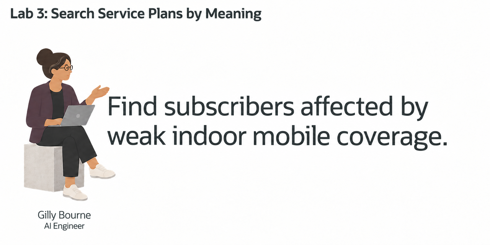
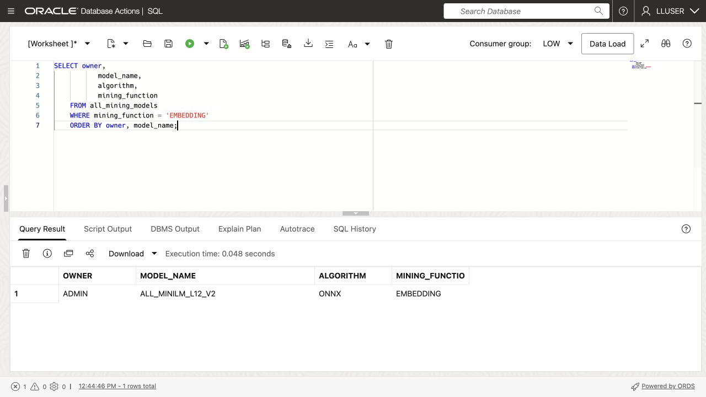
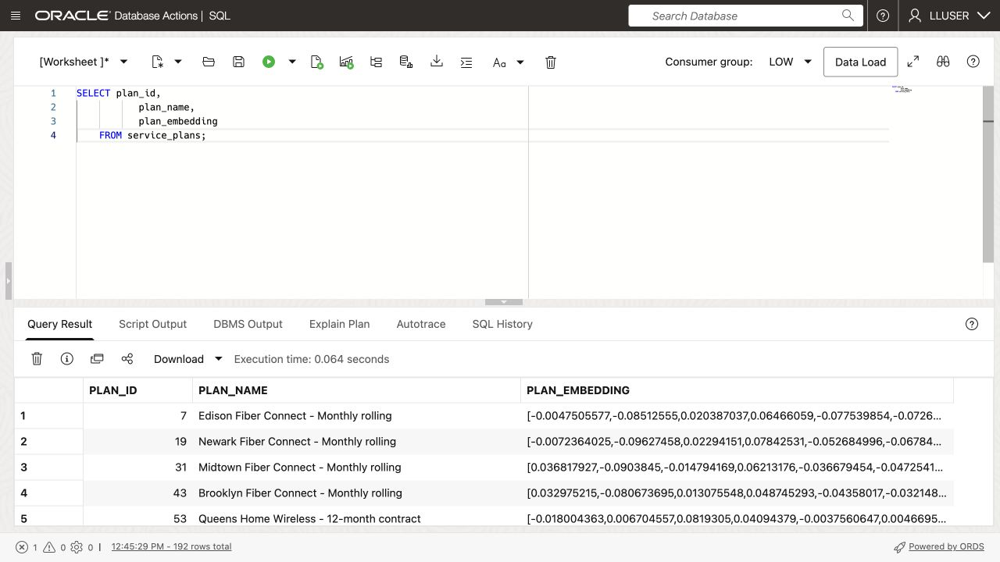
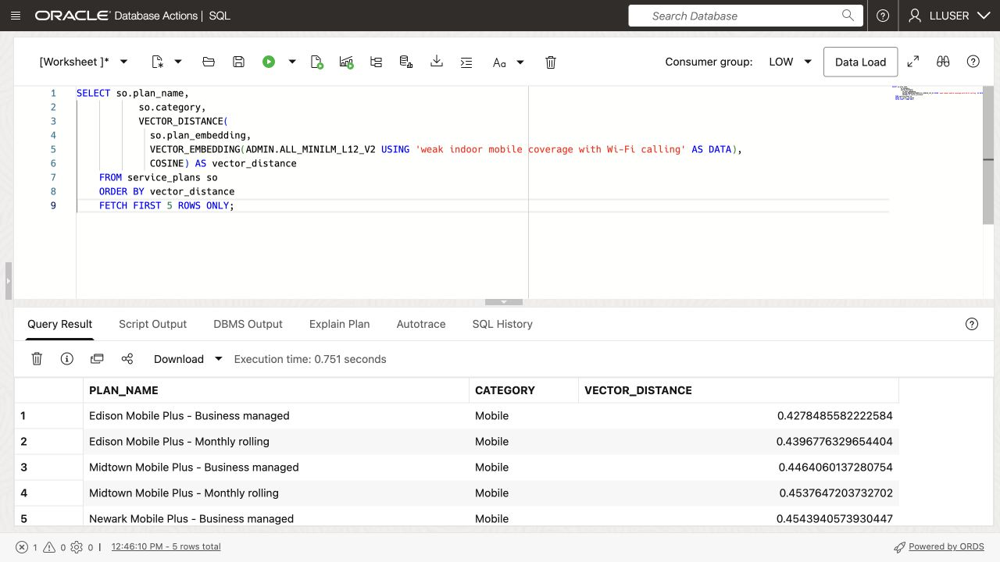
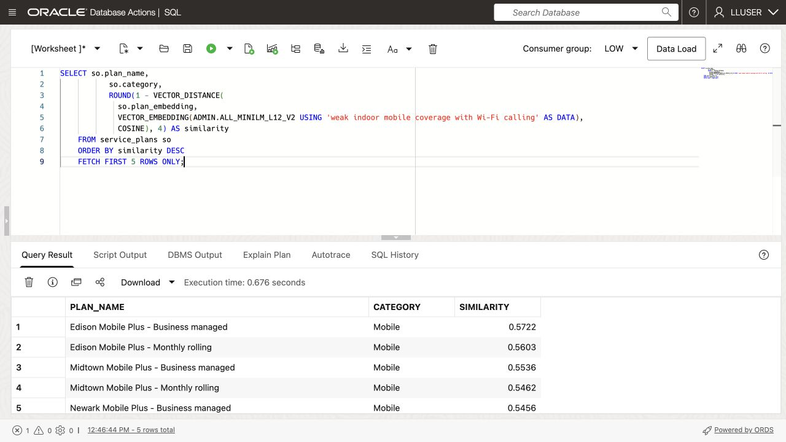
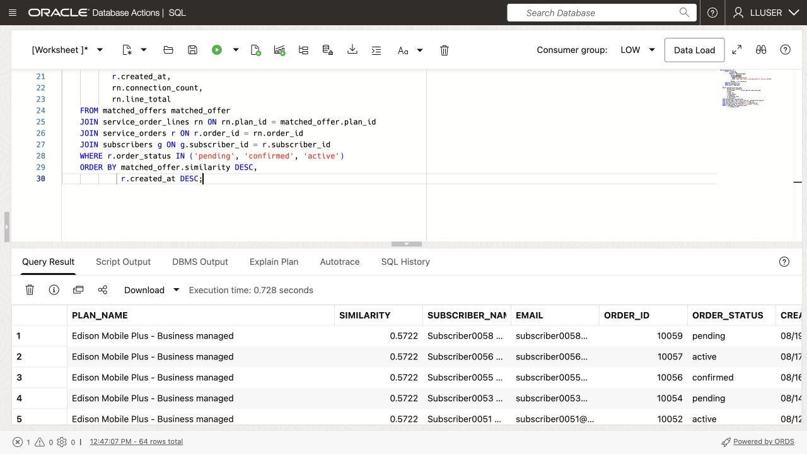
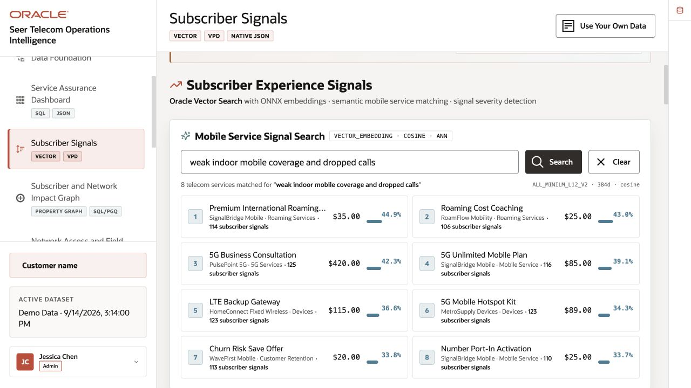

# Search Service Plans by Meaning

## Introduction

Gilly Bourne, an AI engineer at SEER Telecomms, wants support analysts to find plans even when callers use different words. An indoor-coverage complaint should lead to relevant plans and the subscribers who ordered them.

Create plan embeddings in Oracle AI Database, rank matches by meaning, then join the results to service orders and subscriber contact details.



<details>
<summary><strong>Key terms: embedding, vector, vector distance, and semantic search</strong></summary>

> - An **embedding** represents text as a list of numbers. This lab embeds each service plan’s name, category and subcategory so the query can rank descriptions with similar meanings.
>
> - An **ONNX embedding model** is a portable machine-learning model saved in the Open Neural Network Exchange (ONNX) format. It turns text into a vector of numbers that captures meaning. Oracle AI Database can load and run this model inside the database, close to the service plan rows.
>
> - A **vector** is the stored numerical form of an embedding. Oracle Database can store vectors beside the telecommunications rows they describe, so the search stays connected to service plan names, service types, billing models, and monthly fees.
>
> - **Vector distance** measures how close two vectors are. A smaller distance means the meanings are more similar; a larger distance means they are farther apart. In this lab, distance helps rank which service plans best match a support analyst's question.
>
> - **Semantic search** means searching by meaning instead of exact words. A search for "weak indoor mobile coverage with Wi-Fi calling" can find mobile plans with Wi-Fi calling even when the service plan names use different wording.

</details>

### Objectives

- Check the embedding model Gilly needs for semantic search.
- Create a vector from service plan data inside the database.
- Review a semantic service plan search for a business question.
- Turn service plan matches into a subscriber follow-up list.
- Explain why vector search belongs beside telecommunications data and access controls.

Estimated Time: **10 minutes**

### Hands-on Scenario

Help Gilly turn an indoor-coverage complaint into a ranked plan search and a subscriber follow-up list.

> **SQL Worksheet reminder:** See [Getting Started Task 2: Open SQL Worksheet](?lab=getting-started#Task2:OpenSQLWorksheet) for the steps to paste and run SQL.

## Task 1: Check the embedding model

Similarity search needs stored plan vectors and an embedding model to turn the search phrase into a comparable vector.

Jessica has loaded an ONNX embedding model into Oracle AI Database. Check that Gilly can call it from SQL.

1. Run the following query to see which embedding models are available:

    ```sql
    <copy>
    SELECT owner,
           model_name,
           algorithm,
           mining_function
    FROM all_mining_models
    WHERE mining_function = 'EMBEDDING'
    ORDER BY owner, model_name;
    </copy>
    ```

    **Expected output: Available Embedding Models**

    

    The result should include an embedding model owned by `ADMIN`, such as `ALL_MINILM_L12_V2`. This compact model turns text into 384-number vectors. The `EMBEDDING` value confirms that the model can turn text into vectors for similarity search.

2. Review what this means for Gilly's application.

    Gilly can call the model from SQL with `VECTOR_EMBEDDING(...)`. Jessica manages the model inside the database, while Gilly uses it in her search query. The service plan data, vectors, and access controls stay in the same database.

## Task 2: Create a service plan vector

Each service plan has a short description, so Gilly creates one vector from its name, category and subcategory.

1. Review the text Gilly will embed:

    ```sql
    <copy>
    SELECT plan_id,
           plan_name,
           category,
           subcategory,
           plan_name || '. Category: ' || category ||
             '. Subcategory: ' || subcategory AS embedding_text
    FROM service_plans
    FETCH FIRST 5 ROWS ONLY;
    </copy>
    ```

    The combined text gives the model the service plan name and its category. Gilly does not need to embed price, dates, or other values that do not describe what the service plan is.

2. Add a vector column to `SERVICE_PLANS`:

    ```sql
    <copy>
    ALTER TABLE service_plans ADD (plan_embedding VECTOR(384));
    </copy>
    ```

    The column has 384 dimensions because `ALL_MINILM_L12_V2` produces 384-dimensional vectors.

3. Create the service plan vectors inside Oracle Database:

    ```sql
    <copy>
    UPDATE service_plans
    SET plan_embedding = VECTOR_EMBEDDING(
      ADMIN.ALL_MINILM_L12_V2 USING
        plan_name || '. Category: ' || category ||
        '. Subcategory: ' || subcategory AS DATA)
    WHERE plan_embedding IS NULL;

    COMMIT;
    </copy>
    ```

    The model reads the text in each row and writes the vector back to that same row. No service plan text leaves the database.

4. Verify the new column and its data:

    ```sql
    <copy>
    SELECT plan_id,
           plan_name,
           plan_embedding
    FROM service_plans;
    </copy>
    ```

    

    > **Note:** Each description is short enough for one vector. Longer documents, such as policies or network service notices, may need separate vectors for sections that answer different questions.

## Task 3: Test the service plan vector

Search for `weak indoor mobile coverage with Wi-Fi calling` and review how the database ranks the plans by meaning.

1. Run the following query:

    The SQL creates an embedding for the phrase `weak indoor mobile coverage with Wi-Fi calling`, compares it with the vectors in `SERVICE_PLANS.PLAN_EMBEDDING`, and returns the cosine distance. A smaller distance means the two vectors are closer in meaning, so the query orders the smallest distance first.

    ```sql
    <copy>
    SELECT so.plan_name,
           so.category,
           VECTOR_DISTANCE(
             so.plan_embedding,
             VECTOR_EMBEDDING(ADMIN.ALL_MINILM_L12_V2 USING 'weak indoor mobile coverage with Wi-Fi calling' AS DATA),
             COSINE) AS vector_distance
    FROM service_plans so
    ORDER BY vector_distance
    FETCH FIRST 5 ROWS ONLY;
    </copy>
    ```

    

    **Expected output: Mobile Coverage Plan Matches**

    Compare the returned columns with the capture above.

2. Review the ranked service plans.
    Compare the top-ranked plans. A lower cosine distance indicates a closer match to the concern.

    Use the ranked plans to focus the dashboard review on the subscriber concern.

3. Show the result as a similarity score:

    Display `1 - distance`, rounded to four decimal places, as a similarity score. Higher scores indicate closer matches; the ranking stays the same.

    ```sql
    <copy>
    SELECT so.plan_name,
           so.category,
           ROUND(1 - VECTOR_DISTANCE(
             so.plan_embedding,
             VECTOR_EMBEDDING(ADMIN.ALL_MINILM_L12_V2 USING 'weak indoor mobile coverage with Wi-Fi calling' AS DATA),
             COSINE), 4) AS similarity
    FROM service_plans so
    ORDER BY similarity DESC
    FETCH FIRST 5 ROWS ONLY;
    </copy>
    ```

    

## Task 4: Find subscribers affected by a service plan concern

Help the support analyst find subscribers who ordered matching plans. Keep pending, confirmed, and active orders, and return the plan match, order status, order date, and contact details.

1. Run the following query for the concern `weak indoor mobile coverage with Wi-Fi calling`:

    ```sql
    <copy>
    WITH matched_offers AS (
        SELECT so.plan_id,
               so.plan_name,
               ROUND(1 - VECTOR_DISTANCE(
                 so.plan_embedding,
                 VECTOR_EMBEDDING(
                   ADMIN.ALL_MINILM_L12_V2
                   USING 'weak indoor mobile coverage with Wi-Fi calling' AS DATA
                 ),
                 COSINE), 4) AS similarity
        FROM service_plans so
        ORDER BY similarity DESC
        FETCH FIRST 5 ROWS ONLY
    )
    SELECT matched_offer.plan_name,
           matched_offer.similarity,
           g.first_name || ' ' || g.last_name AS subscriber_name,
           g.email,
           r.order_id,
           r.order_status,
           r.created_at,
           rn.connection_count,
           rn.line_total
    FROM matched_offers matched_offer
    JOIN service_order_lines rn ON rn.plan_id = matched_offer.plan_id
    JOIN service_orders r ON r.order_id = rn.order_id
    JOIN subscribers g ON g.subscriber_id = r.subscriber_id
    WHERE r.order_status IN ('pending', 'confirmed', 'active')
    ORDER BY matched_offer.similarity DESC,
             r.created_at DESC;
    </copy>
    ```

    

    The first part ranks service plans by meaning. The remaining joins use ordinary relational keys to find the matching monthly service charges, service orders, and subscribers.

    **Expected output: Subscriber Follow-up List**

    The similarity score indicates how closely each plan description matches the search phrase. The joined subscribers are candidates for follow-up, not confirmed cases of poor coverage. Check complaint details, service addresses and measured conditions before recommending a change.

2. Review the business result.

    Gilly creates vectors for service plans, then uses SQL joins to find service order and contact details. She does not need a vector for each service order or subscriber.

## Conclusion

Gilly has built a search that helps the support team decide which subscribers to contact. A plain-language concern can produce ranked service plans and a subscriber follow-up list using vectors, relational joins, and SQL in Oracle AI Database. 

## Application Demo

In **Subscriber Signals**, enter `weak indoor mobile coverage and dropped calls` in **Mobile Service Signal Search**, then select **Search**. Compare the ranked matches and their similarity scores.



*LiveStack Telecomm Demo: Subscriber Signals*

## Acknowledgements

* **Author** - Matt Kowalik
* **Contributor** - Kevin Lazarz
* **Last Updated By/Date** - Matt Kowalik, September 2026
