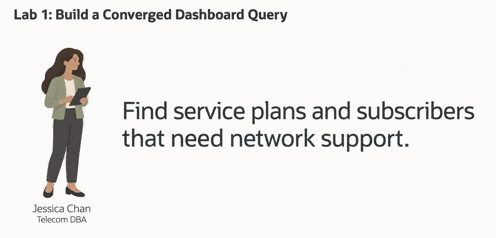
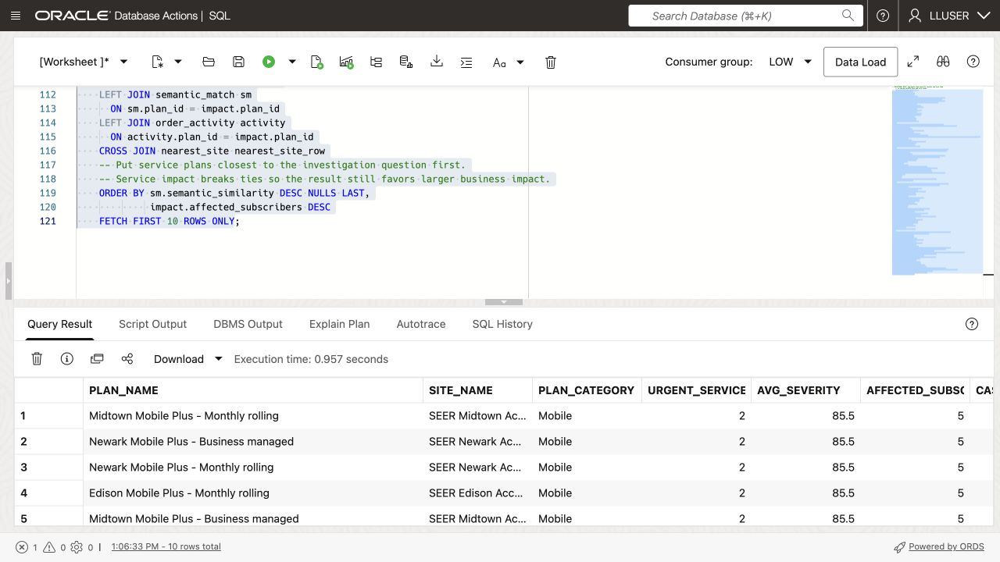
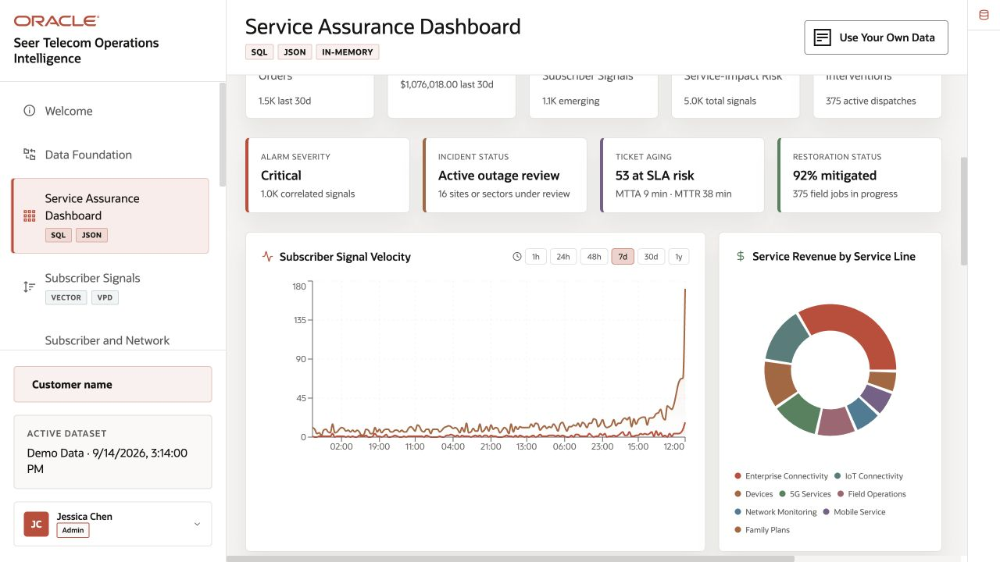
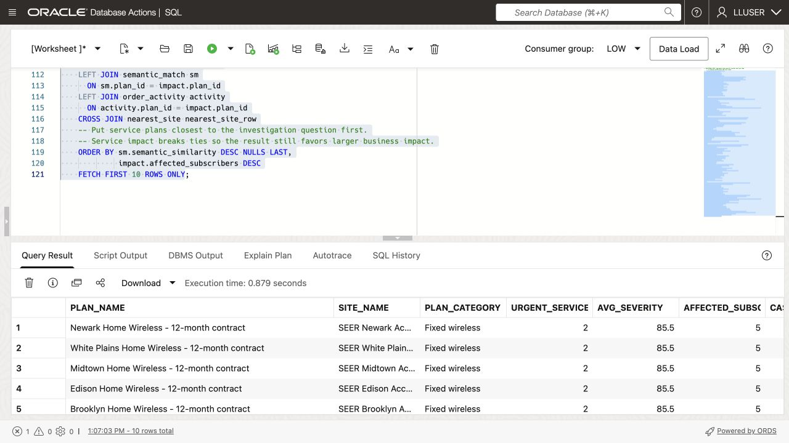

# Build a Converged Dashboard Query

## Introduction

> **Validation status:** Tested as LLUSER in a manually provisioned database on 23 September 2026. Screenshots show that run. Load a fresh workshop schema before starting these exercises.

Jessica Chan is the database administrator responsible for keeping SEER Telecomms’ telecommunications data reliable and useful. Every morning, the subscriber support operations team asks her a familiar question: **which service plan needs attention first, and which subscribers may need assistance or service review?**

Jessica needs four kinds of data for the Subscriber Support and Operations Dashboard. Tables hold service alerts and their impact. JSON documents hold service order activity. Vectors represent service plan descriptions for searches by meaning. Spatial data records network site and demand-region locations. Her query must combine all four.

Keeping these data types in separate systems would require Jessica to combine exports and keep them current. Instead, she wants a dashboard answer that the subscriber support team can check against the source records.

Oracle AI Database can query these data types together. Jessica can join relational rows, JSON documents, vectors, and location data in one SQL statement.

In this lab, you build Jessica’s dashboard query. It combines service alerts, vector search, JSON service order data, and network site locations in one result.



### Objectives

- Explain how one database combines the information needed for a subscriber-support decision.
- Run one query that combines relational, vector, JSON, and spatial database capabilities.
- Modify the query to investigate a different subscriber-support question and explain the change in results.

Estimated Time: **10 minutes**

### Hands-on Scenario

| Step                | Telecommunications focus                                                                                                  |
| ---------------------| ----------------------------------------------------------------------------------------------------------------|
| Problem    | Support staff need to identify affected plans, assess reported problems, and check recent orders and nearby network sites. |
| Database task | The query combines service alerts, plan descriptions, order documents, and network-site locations.                         |
| Your role       | Jessica Chan, the DBA, builds the query that gives support analysts this dashboard view.                         |
| What You Will Do    | Use a single SQL statement that combines several data types.                                                   |
| Oracle features | Relational SQL, AI Vector Search, JSON Relational Duality, and Oracle Spatial work together.                   |
| Result             | The learner can explain convergence through a useful business result rather than a feature list.               |

Persona focus: You are Jessica Chan, the DBA. Your job is to build one shared query that gives support analysts a connected view of reported service problems and order activity.

> **SQL Worksheet reminder:** See [Getting Started Task 2: Open SQL Worksheet](?lab=getting-started#Task2:OpenSQLWorksheet) for the steps to paste and run SQL.

## Task 1: Run a converged service investigation

Run the query below to list service plans with severe service alerts. Use the result to decide which plans need review.

The query combines four data types:

- **Relational:** `SERVICE_ALERTS_V`, service plan mentions, and telecommunications views summarize reported service problems and their impact.
- **Vector:** `PLAN_EMBEDDINGS` and `VECTOR_DISTANCE` find service plans related by meaning to the investigation phrase.
- **JSON:** `SERVICE_ORDERS_DV` is read as a document, and `JSON_TABLE` projects its nested line items into rows so service order activity can be counted.
- **Spatial:** `SDO_GEOM.SDO_DISTANCE` finds the closest network site to the high-demand New York Network Region using latitude and longitude information stored as spatial geometries that can be converted to GeoJSON.

    These are four operations in one investigation. Every row combines reported service problems with service order activity, semantic relevance, and network-site context.

1. Open SQL Worksheet as `LLUSER`. 

2. Run the query (note the comments that help to locate the specific use of different data types):

    ```sql
    <copy>
    -- RELATIONAL DATA: aggregate high-severity records and join them
    -- to shared service plan and site views.
    WITH offer_service_impact AS (
        SELECT sov.plan_id,
               sov.plan_name,
               hpv.site_name,
               sov.plan_category,
               COUNT(DISTINCT sa.alert_id) AS urgent_service_alerts,
               ROUND(AVG(sa.severity_score), 1) AS avg_severity,
               SUM(sa.affected_subscribers) AS affected_subscribers,
               SUM(sa.service_cases_opened) AS cases_opened
        FROM service_alerts_v sa
        JOIN report_plan_mentions pom
          ON pom.report_id = sa.alert_id
        JOIN service_plans_v sov
          ON sov.plan_id = pom.plan_id
        JOIN network_sites_v hpv
          ON hpv.site_id = sov.site_id
        WHERE sa.severity_score >= 80
        GROUP BY sov.plan_id,
                 sov.plan_name,
                 hpv.site_name,
                 sov.plan_category
    ),
    -- VECTOR DATA: compare the investigation question with stored
    -- service plan embeddings to rank service plans by meaning, not exact wording.
    semantic_match AS (
        SELECT so.plan_id,
               ROUND(1 - VECTOR_DISTANCE(
               oe.embedding,
                   VECTOR_EMBEDDING(
                       ADMIN.ALL_MINILM_L12_V2
                       USING 'weak indoor mobile coverage and dropped calls requiring subscriber support' AS DATA
                   ),
                   COSINE
               ), 4) AS semantic_similarity
        FROM plan_embeddings oe
        JOIN service_plans so
          ON so.plan_id = oe.plan_id
    ),
    -- JSON DATA: read service order documents from the duality view and
    -- project nested line items into relational rows with JSON_TABLE.
    order_activity AS (
        SELECT jt.plan_id,
               COUNT(DISTINCT jt.order_id) AS active_service_orders,
               SUM(jt.connection_count) AS active_connections
        FROM service_orders_dv rd
        CROSS APPLY JSON_TABLE(
            rd.data,
            '$'
            COLUMNS (
                order_id NUMBER PATH '$._id',
                order_status VARCHAR2(30) PATH '$.status',
                NESTED PATH '$.items[*]' COLUMNS (
                    plan_id NUMBER PATH '$.planId',
                    connection_count NUMBER PATH '$.connectionCount'
                )
            )
        ) jt
        WHERE jt.order_status IN ('pending', 'confirmed')
        GROUP BY jt.plan_id
    ),
    -- SPATIAL DATA: calculate the distance from each network-site point
    -- to the New York Network Region demand-region boundary.
    nearest_site AS (
        SELECT routing_site.site_name,
               routing_site.city,
               routing_site.state_province,
               dr.region_name,
               dr.demand_index,
               ROUND(
                   SDO_GEOM.SDO_DISTANCE(
                       hp.location,
                       dr.boundary,
                       0.005,
                       'unit=KM'
                   ),
                   2
               ) AS distance_to_demand_region_km
        FROM network_sites_v routing_site
        JOIN network_sites hp
          ON hp.site_id = routing_site.site_id
        CROSS JOIN network_regions dr
        WHERE dr.region_name = 'New York Network Region'
          AND hp.is_active = 1
        ORDER BY SDO_GEOM.SDO_DISTANCE(
                     hp.location,
                     dr.boundary,
                     0.005,
                     'unit=KM'
                 )
        FETCH FIRST 1 ROW ONLY
    )
    -- CONVERGED RESULT: join the outputs of the four data-model operations
    -- into one dashboard investigation result.
    SELECT impact.plan_name,
           impact.site_name,
           impact.plan_category,
           impact.urgent_service_alerts,
           impact.avg_severity,
           impact.affected_subscribers,
           impact.cases_opened,
           sm.semantic_similarity,
           NVL(activity.active_service_orders, 0) AS active_service_orders,
           NVL(activity.active_connections, 0) AS active_connections,
           nearest_site_row.site_name AS nearest_site,
           nearest_site_row.city || ', ' || nearest_site_row.state_province AS site_location,
           nearest_site_row.region_name AS demand_region,
           nearest_site_row.demand_index,
           nearest_site_row.distance_to_demand_region_km
    FROM offer_service_impact impact
    LEFT JOIN semantic_match sm
      ON sm.plan_id = impact.plan_id
    LEFT JOIN order_activity activity
      ON activity.plan_id = impact.plan_id
    CROSS JOIN nearest_site nearest_site_row
    -- Put service plans closest to the investigation question first.
    -- Service impact breaks ties so the result still favors larger business impact.
    ORDER BY sm.semantic_similarity DESC NULLS LAST,
             impact.affected_subscribers DESC
    FETCH FIRST 10 ROWS ONLY;
    </copy>
    ```

    <!-- capture:CAP-30 -->
    

    *Live LLUSER capture, 23 September 2026.*


3. Review the result as the service plan-level data behind Jessica's dashboard. Each row combines service-alert severity, semantic match, service order activity, and network site location. This gives the dashboard a ranked service plan table and the details a support analyst needs when deciding what to review.

    

    Each row should include alert impact, semantic similarity, order activity, and regional site context. The query returns up to ten plans. Inspect the actual ranking after the embeddings are created; a missing embedding or an empty regional site set can make the result incomplete.

Use the first row to explain why a plan needs attention. Check its alert severity, service order counts, match to the search phrase, and nearby network site. These values help the service team decide where to start.

Jessica can use this SQL result for the dashboard table and detail view. Other dashboard components, such as summary cards, can query the same database.

> **Interpretation:** The nearest-site result is regional context shared by every plan row. It does not identify a subscriber's serving cell or verify radio coverage. Affected-subscriber counts are per-report totals and can overlap. Order activity counts pending and confirmed activation orders; it is not the installed subscriber base.

<!-- application-capture:APP-02 -->

To see how combined data can be presented, open **Service Assurance Dashboard** in the running demo and compare the incident indicators with the signal-velocity and service-line charts. These application metrics use the demo dataset; they are not expected values from the query above.



*Application capture, 23 September 2026. Separate demo dataset.*

## Task 2: Change the investigation question

Jessica meets with a subscriber experience analyst to review the results at the data level before she builds the dashboard. They start with service plans related to **weak indoor mobile coverage and dropped calls requiring subscriber support**. Change the embedded investigation phrase to:


```text
fixed wireless activation backlog and network capacity
```


Run the query again and compare the top rows.

<!-- capture:CAP-31 -->


*Live LLUSER capture, 23 September 2026.*

1. Which service plans moved into or out of the top ten?
2. Which service plans still have high service-alert severity but a lower similarity to the new question?
3. Does the service order activity make you more or less concerned about the operational impact?

The query sorts by similarity first, so changing the question changes the review order. Service impact breaks ties. Jessica can ask a different question using the same query and service plan data.


## Next Steps

Next, use JSON Relational Duality to expose the same service order data as JSON for an application while keeping SQL access for the database team.

## Acknowledgements

* **Author** - Matt Kowalik
* **Contributor** - Kevin Lazarz
* **Last Updated By/Date** - Matt Kowalik, September 2026

