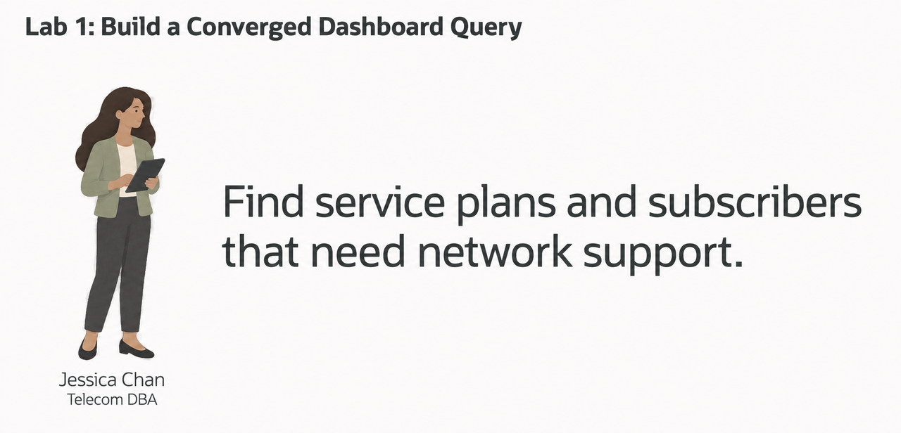
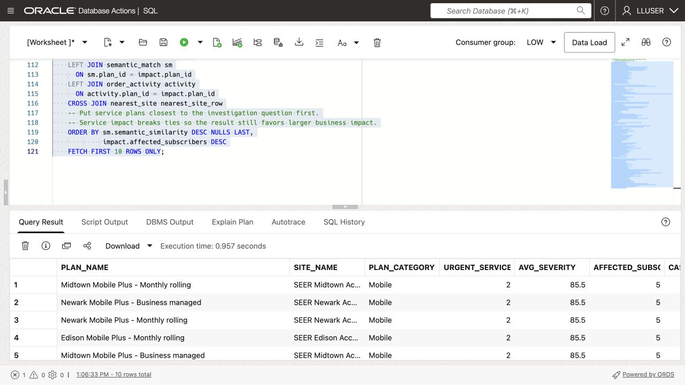
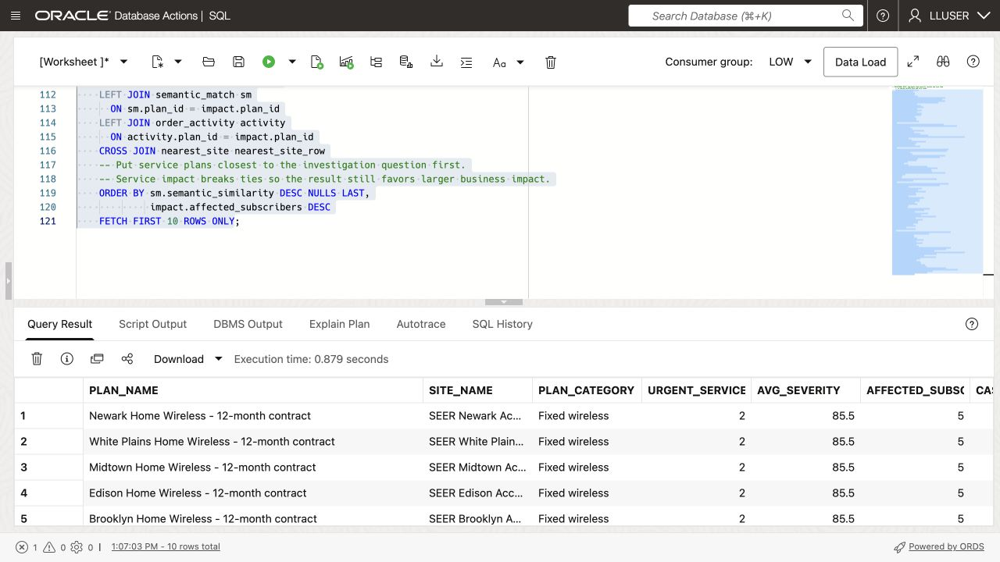
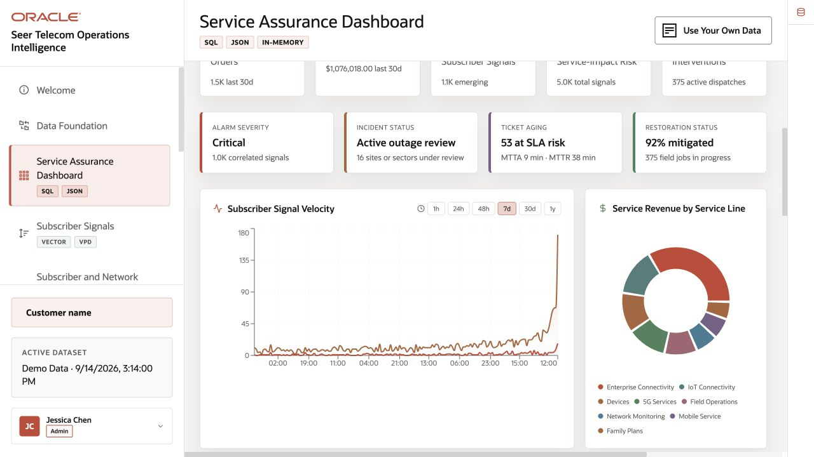

# Build a Converged Dashboard Query

## Introduction

Jessica Chan, SEER Telecomms’ DBA, needs to answer the support team's morning question: **which plans need attention first, and which subscribers may need help?**

Build her dashboard query by combining service alerts, plan-description vectors, JSON order activity, and network-site locations. Then change the search phrase and compare which plans move to the top.



### Objectives

- Explain how one database combines the information needed for a subscriber-support decision.
- Run one query that combines relational, vector, JSON, and spatial database capabilities.
- Modify the query to investigate a different subscriber-support question and explain the change in results.

Estimated Time: **10 minutes**

### Hands-on Scenario

You are Jessica. Use the first dashboard row to explain which plan the support team should review first.

> **SQL Worksheet reminder:** See [Getting Started Task 2: Open SQL Worksheet](?lab=getting-started#Task2:OpenSQLWorksheet) for the steps to paste and run SQL.

## Task 1: Run a converged service investigation

Run the query below to list service plans with severe service alerts. Use the result to decide which plans need review.

The query combines four data types:

- **Relational:** `SERVICE_ALERTS_V`, service plan mentions, and telecommunications views summarize reported service problems and their impact.
- **Vector:** `PLAN_EMBEDDINGS` and `VECTOR_DISTANCE` find service plans related by meaning to the investigation phrase.
- **JSON:** `JSON_TABLE` reads nested line items from `SERVICE_ORDERS_DV` as rows so the query can count service-order activity.
- **Spatial:** `SDO_GEOM.SDO_DISTANCE` finds the closest network site to New York Network Region. The stored location can also be converted to GeoJSON for a map.

1. Open SQL Worksheet as `LLUSER`. 

2. Run the query (note the comments that help to locate the specific use of different data types):

    ```sql
    <copy>
    -- RELATIONAL DATA: aggregate high-severity records and join them
    -- to shared service plan and site views.
    WITH offer_service_impact AS (
        SELECT sov.plan_id,
               sov.plan_name,
               hpv.site_name,
               sov.plan_category,
               COUNT(DISTINCT sa.alert_id) AS urgent_service_alerts,
               ROUND(AVG(sa.severity_score), 1) AS avg_severity,
               SUM(sa.affected_subscribers) AS affected_subscribers,
               SUM(sa.service_cases_opened) AS cases_opened
        FROM service_alerts_v sa
        JOIN report_plan_mentions pom
          ON pom.report_id = sa.alert_id
        JOIN service_plans_v sov
          ON sov.plan_id = pom.plan_id
        JOIN network_sites_v hpv
          ON hpv.site_id = sov.site_id
        WHERE sa.severity_score >= 80
        GROUP BY sov.plan_id,
                 sov.plan_name,
                 hpv.site_name,
                 sov.plan_category
    ),
    -- VECTOR DATA: compare the investigation question with stored
    -- service plan embeddings to rank service plans by meaning, not exact wording.
    semantic_match AS (
        SELECT so.plan_id,
               ROUND(1 - VECTOR_DISTANCE(
               oe.embedding,
                   VECTOR_EMBEDDING(
                       ADMIN.ALL_MINILM_L12_V2
                       USING 'weak indoor mobile coverage and dropped calls requiring subscriber support' AS DATA
                   ),
                   COSINE
               ), 4) AS semantic_similarity
        FROM plan_embeddings oe
        JOIN service_plans so
          ON so.plan_id = oe.plan_id
    ),
    -- JSON DATA: read service order documents from the duality view and
    -- project nested line items into relational rows with JSON_TABLE.
    order_activity AS (
        SELECT jt.plan_id,
               COUNT(DISTINCT jt.order_id) AS active_service_orders,
               SUM(jt.connection_count) AS active_connections
        FROM service_orders_dv rd
        CROSS APPLY JSON_TABLE(
            rd.data,
            '$'
            COLUMNS (
                order_id NUMBER PATH '$._id',
                order_status VARCHAR2(30) PATH '$.status',
                NESTED PATH '$.items[*]' COLUMNS (
                    plan_id NUMBER PATH '$.planId',
                    connection_count NUMBER PATH '$.connectionCount'
                )
            )
        ) jt
        WHERE jt.order_status IN ('pending', 'confirmed')
        GROUP BY jt.plan_id
    ),
    -- SPATIAL DATA: calculate the distance from each network-site point
    -- to the New York Network Region demand-region boundary.
    nearest_site AS (
        SELECT routing_site.site_name,
               routing_site.city,
               routing_site.state_province,
               dr.region_name,
               dr.demand_index,
               ROUND(
                   SDO_GEOM.SDO_DISTANCE(
                       hp.location,
                       dr.boundary,
                       0.005,
                       'unit=KM'
                   ),
                   2
               ) AS distance_to_demand_region_km
        FROM network_sites_v routing_site
        JOIN network_sites hp
          ON hp.site_id = routing_site.site_id
        CROSS JOIN network_regions dr
        WHERE dr.region_name = 'New York Network Region'
          AND hp.is_active = 1
        ORDER BY SDO_GEOM.SDO_DISTANCE(
                     hp.location,
                     dr.boundary,
                     0.005,
                     'unit=KM'
                 )
        FETCH FIRST 1 ROW ONLY
    )
    -- CONVERGED RESULT: join the outputs of the four data-model operations
    -- into one dashboard investigation result.
    SELECT impact.plan_name,
           impact.site_name,
           impact.plan_category,
           impact.urgent_service_alerts,
           impact.avg_severity,
           impact.affected_subscribers,
           impact.cases_opened,
           sm.semantic_similarity,
           NVL(activity.active_service_orders, 0) AS active_service_orders,
           NVL(activity.active_connections, 0) AS active_connections,
           nearest_site_row.site_name AS nearest_site,
           nearest_site_row.city || ', ' || nearest_site_row.state_province AS site_location,
           nearest_site_row.region_name AS demand_region,
           nearest_site_row.demand_index,
           nearest_site_row.distance_to_demand_region_km
    FROM offer_service_impact impact
    LEFT JOIN semantic_match sm
      ON sm.plan_id = impact.plan_id
    LEFT JOIN order_activity activity
      ON activity.plan_id = impact.plan_id
    CROSS JOIN nearest_site nearest_site_row
    -- Put service plans closest to the investigation question first.
    -- Service impact breaks ties so the result still favors larger business impact.
    ORDER BY sm.semantic_similarity DESC NULLS LAST,
             impact.affected_subscribers DESC
    FETCH FIRST 10 ROWS ONLY;
    </copy>
    ```

    

3. Review the ranked plans. Compare each plan’s alert severity, match to the search phrase, order activity and regional network-site information.

    Each row should include alert impact, semantic similarity, order activity, and regional site context. The query returns up to ten plans. Inspect the actual ranking after the embeddings are created; a missing embedding or an empty regional site set can make the result incomplete.

Use the first row to explain why a plan needs attention. Check its alert severity, service order counts, match to the search phrase, and nearby network site. These values help the service team decide where to start.

> **Interpretation:** The nearest-site result is regional context shared by every plan row. It does not identify a subscriber's serving cell or verify radio coverage. Affected-subscriber counts are per-report totals and can overlap. Order activity counts pending and confirmed activation orders; it is not the installed subscriber base.

## Task 2: Change the investigation question

Jessica meets with a subscriber experience analyst to review the results at the data level before she builds the dashboard. They start with service plans related to **weak indoor mobile coverage and dropped calls requiring subscriber support**. Change the embedded investigation phrase to:

```text
fixed wireless activation backlog and network capacity
```

Run the query again and compare the top rows.



1. Which service plans moved into or out of the top ten?
2. Which service plans still have high service-alert severity but a lower similarity to the new question?
3. Which plans have the most pending or confirmed activation orders that may need review?

The query sorts by similarity first, so changing the question changes the review order. Service impact breaks ties. Jessica can ask a different question using the same query and service plan data.

## Next Steps

Next, use JSON Relational Duality to expose the same service order data as JSON for an application while keeping SQL access for the database team.

## Application Demo

Open **Service Assurance Dashboard** and compare the incident indicators with the signal-velocity and service-line charts.



*LiveStack Telecomm Demo: Service Assurance Dashboard*

## Acknowledgements

* **Author** - Matt Kowalik
* **Contributor** - Kevin Lazarz
* **Last Updated By/Date** - Matt Kowalik, September 2026

