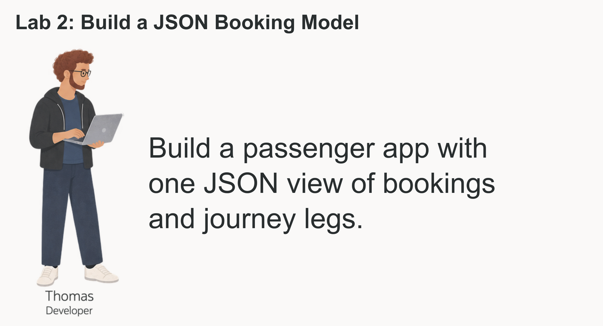
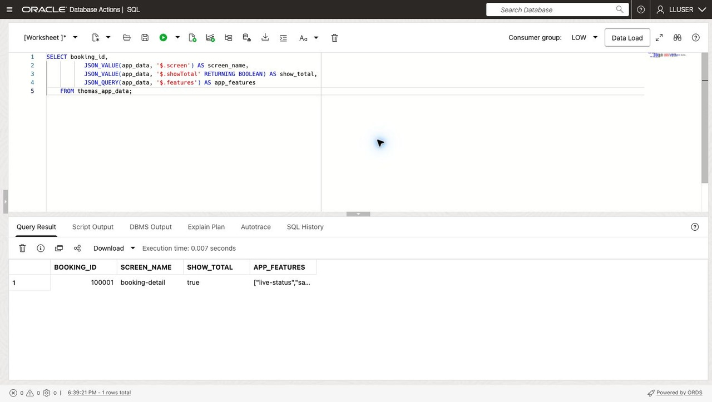
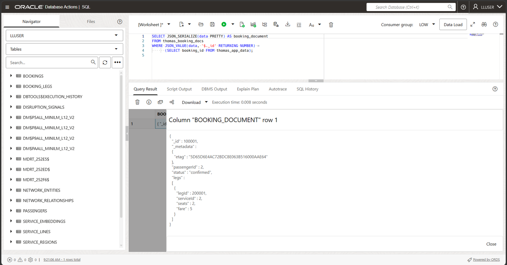
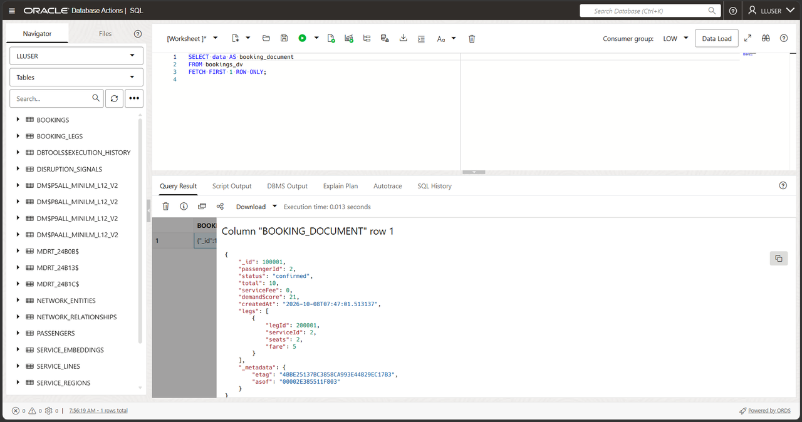
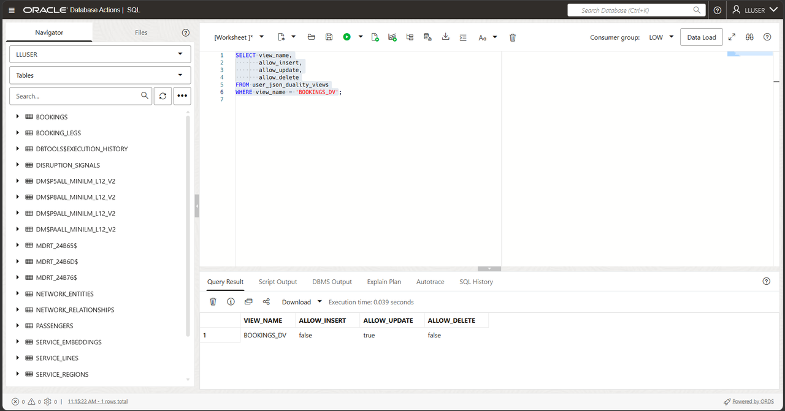
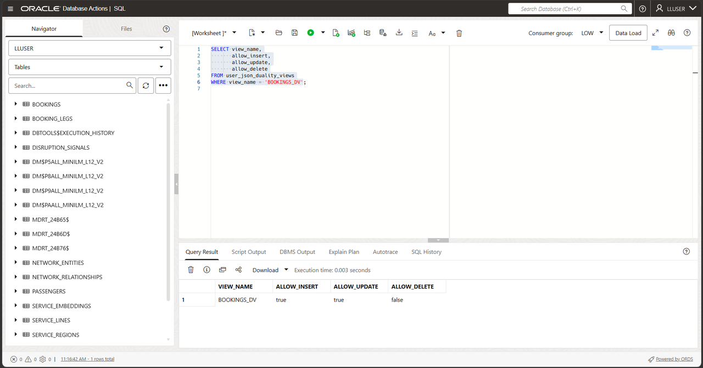
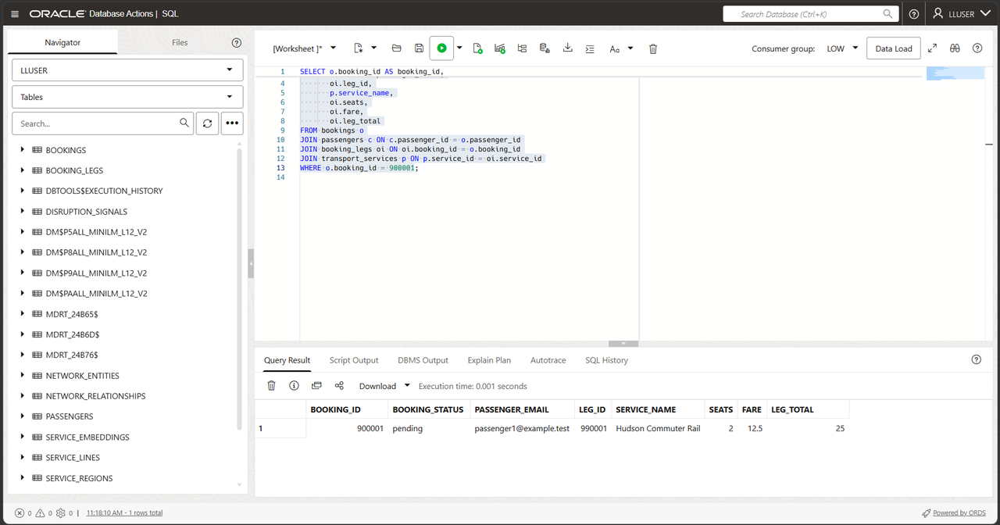
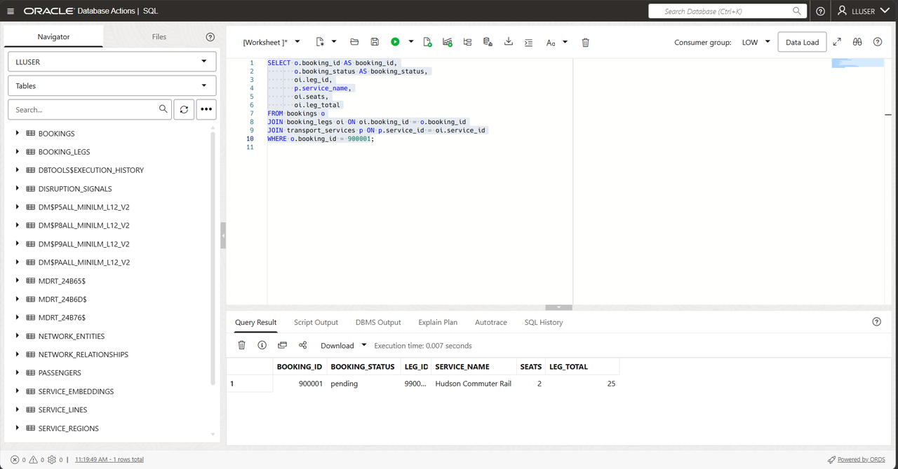
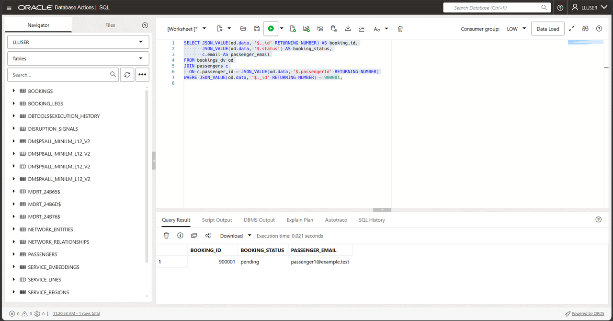
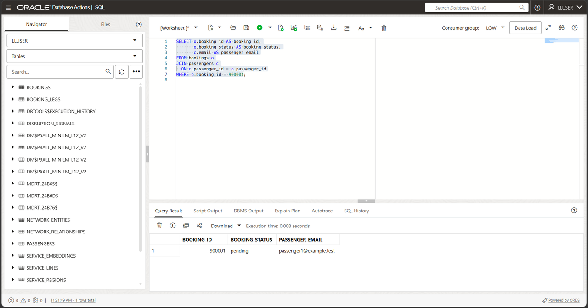

# Build a JSON Booking Model

## Introduction

Thomas Brune is an application developer at Seer Transport. His team is building a web and mobile passenger application that needs booking details and journey legs in one JSON response.



Thomas needs booking data as a JSON payload that a web or mobile application can consume directly. One payload can group the passenger identifier, booking status, journey legs, and optional app settings. JSON lets him evolve that payload as the application changes. The data already lives in Oracle AI Database, so his question is how to use JSON without giving up relational keys, SQL, and database controls.

Thomas asks Jessica, the DBA, to compare three JSON patterns: a JSON column for application settings, a JSON Collection Table for separately stored documents, and a JSON Relational Duality View over existing booking rows. The collection stores a sample document independently; the duality view exposes relational data without copying it.


<details>
<summary><strong>Key terms: JSON columns, JSON collections, and JSON Relational Duality</strong></summary>

> - A **JSON column** stores a JSON value in a relational table alongside normal typed columns, keys, and constraints. Thomas can use it for optional or changing application attributes without turning every new attribute into a schema change.
>
> - A **JSON collection** is a special table or view that provides a set of JSON documents through one `JSON`-typed `DATA` column. Each document can have a top-level `_id` used to identify it.
>
> - **JSON Relational Duality** lets Oracle Database expose relational data as JSON documents without copying it into a separate document database. The application gets the document shape Thomas wants for its API. The database keeps the relational rows and controls.
>

</details>

Thomas's application needs a payload with the booking and its booking legs together, such as this:

```json
{
  "_id": 513063,
  "passengerId": 687,
  "status": "confirmed",
  "legs": [
    { "serviceId": 1, "seats": 2, "fare": 12.50 }
  ]
}
```

The application needs booking details and journey legs in one document. The following tasks compare separately stored JSON with a duality view that constructs this document from relational rows.

### Objectives

- Store flexible application attributes as JSON in a relational table.
- Create and query a JSON Collection Table of booking documents.
- Read and update relational booking data through `BOOKINGS_DV`.
- Compare the three JSON approaches and choose the right one for an application feature.

Estimated Time: **10 minutes**
### Hands-on Scenario

| Step | Transportation focus |
| --- | --- |
| Business Problem | Thomas's team needs flexible JSON payloads for a new passenger web and mobile application. |
| Technical Challenge | The team needs application-friendly documents while the database keeps relational keys, joins, and controls. |
| Persona Focus | Thomas tests JSON storage, collections, and duality with Jessica's database guidance. |
| What You Will See | One Oracle AI Database supports several JSON access patterns over the transportation data. |
| Database Capability | Native JSON, SQL/JSON functions, and JSON Relational Duality work together. |
| Outcome | Thomas can serve a booking document to the passenger application while Jessica verifies its underlying rows with SQL. |

Persona focus: You are Thomas, working with Jessica to decide how the new application should store, assemble, and read passenger booking data.

### Thomas's three JSON choices

Thomas chooses the JSON form according to the feature. A JSON column holds optional attributes beside a relational record, a JSON Collection Table holds documents owned by the application, and a duality view assembles a booking document from existing rows. The final option gives his passenger application a single booking payload while Jessica continues to manage the underlying records with SQL.

> **SQL Worksheet reminder:** For the difference between **Run Statement** and **Run Script**, return to [Getting Started Task 2: Open SQL Worksheet](?lab=getting-started#Task2:OpenSQLWorksheet).

## Task 1: Store flexible application data as JSON

Thomas starts with data that belongs to the application but does not need its own relational columns. The workshop database already contains the booking rows. He adds a small application-data table with a native `JSON` column for optional screen and passenger-experience settings.

1. Create the application-data table and add one sample payload. This code box contains several SQL statements; choose **Run Script** to run the full block.

    ```sql
    <copy>
    CREATE TABLE thomas_app_data (
        booking_id  NUMBER PRIMARY KEY,
        app_data  JSON NOT NULL
    );

    INSERT INTO thomas_app_data (booking_id, app_data)
    SELECT booking_id,
           JSON_OBJECT(
               'screen'    VALUE 'booking-detail',
               'showTotal' VALUE 'true' FORMAT JSON,
               'features'  VALUE JSON_ARRAY('live-status', 'saved-journey')
               RETURNING JSON
           )
    FROM (
        SELECT booking_id
        FROM bookings
        ORDER BY booking_id
        FETCH FIRST 1 ROW ONLY
    );

    COMMIT;
    </copy>
    ```

2. Read values from the JSON column with **Run Statement**.

    ```sql
    <copy>
    SELECT booking_id,
           JSON_VALUE(app_data, '$.screen') AS screen_name,
           JSON_VALUE(app_data, '$.showTotal' RETURNING BOOLEAN) AS show_total,
           JSON_QUERY(app_data, '$.features') AS app_features
    FROM thomas_app_data;
    </copy>
    ```

    

    *Figure 1: The query reads the sample booking's JSON settings from a relational row.*

    `BOOKING_ID` remains a relational key. `APP_DATA` can change as the application changes. Thomas can query both with SQL in one table.

## Task 2: Create a JSON Collection Table

Thomas now needs a collection of application documents. Unlike the JSON column in Task 1, this object is a JSON Collection Table: each row is a document, the document is stored in `DATA`, and `_id` identifies the document.

1. Create the collection with **Run Script**. Check **Script Output** for the collection-creation confirmation before continuing.

    ```sql
    <copy>
    CREATE JSON COLLECTION TABLE thomas_booking_docs
    WITH ETAG;
    </copy>
    ```

2. Add the sample booking document. This code box contains an `INSERT` and a `COMMIT`; choose **Run Script** and check **Script Output** for one inserted row and a successful commit.

    ```sql
    <copy>
    INSERT INTO thomas_booking_docs (data)
    SELECT JSON_OBJECT(
               '_id'        VALUE o.booking_id,
               'passengerId' VALUE o.passenger_id,
               'status'     VALUE o.booking_status,
               'legs'      VALUE (
                   SELECT JSON_ARRAYAGG(
                              JSON_OBJECT(
                                  'legId'    VALUE oi.leg_id,
                                  'serviceId' VALUE oi.service_id,
                                  'seats'  VALUE oi.seats,
                                  'fare' VALUE oi.fare
                                  RETURNING JSON
                              ) ORDER BY oi.leg_id RETURNING JSON
                          )
                   FROM booking_legs oi
                   WHERE oi.booking_id = o.booking_id
               ) FORMAT JSON
               RETURNING JSON
           )
    FROM bookings o
    JOIN thomas_app_data t ON t.booking_id = o.booking_id;

    COMMIT;
    </copy>
    ```

    `WITH ETAG` adds an `_metadata.etag` value to each document. Oracle changes the tag whenever the document changes. Thomas's application can send the tag it last read when it updates a document. If the tag no longer matches, the application knows that someone else changed the document first and can avoid overwriting the newer version. The application must check the ETAG during its update to detect a conflicting change. This exercise does not test concurrent requests.

3. Query the collection as documents with **Run Statement**.

    ```sql
    <copy>
    SELECT JSON_SERIALIZE(data PRETTY) AS booking_document
    FROM thomas_booking_docs
    WHERE JSON_VALUE(data, '$._id' RETURNING NUMBER) =
          (SELECT booking_id FROM thomas_app_data);
    </copy>
    ```
    

    Thomas now has a document collection that a document API can access, and SQL can query the same `DATA` column. The collection stores the documents; it is separate from the relational `BOOKINGS` and `BOOKING_LEGS` tables.

## Task 3: Read a booking document from relational data

Thomas now tests the document shape his application can consume directly.

1. Run this query with **Run Statement**:

    This query selects the JSON `DATA` column from `BOOKINGS_DV` so Thomas can inspect the document shape in SQL Worksheet.

    <details>
    <summary><strong>Why this matters to Thomas</strong></summary>

    > Thomas can use a JSON Collection Table when the application owns the document. But the booking already has relational tables that Jessica and other teams rely on.
    > The duality view gives Thomas a document over those existing rows. He can choose the application shape without copying the booking into another store.

    </details>

    ```sql
    <copy>
    SELECT data AS booking_document
    FROM bookings_dv
    FETCH FIRST 1 ROW ONLY;
    </copy>
    ```
    

    **Expected output:** A booking document containing `_id`, `passengerId`, `status`, and a nested `legs` array. The query does not specify a row order, so the booking identifier can vary.

2. Expand the document in SQL Worksheet.
    The query reads the duality view as a document source. Oracle constructs the JSON shape from relational data, so the application gets a booking payload without a second copy of the booking record.

    The \_id value appears in the JSON document while the source data remains relational. The payload includes `passengerId`, `status`, totals, timestamps, and booking legs. The application gets these fields without a second booking store.

    The same booking now has two useful forms: API-ready JSON for the application and relational rows for analysis.

    > **Note:** Look for `_metadata.etag` in the document. The ETAG changes when the document changes, so Thomas's application can detect a newer version before updating the booking and avoid overwriting another request.

## Task 4: Enable document inserts and updates

The existing `BOOKINGS_DV` allows updates to booking documents. You will extend its definition to allow inserts into both `BOOKINGS` and the nested `BOOKING_LEGS` rows. The view defines the document fields and permitted write operations, while relational keys and constraints still apply. This exercise runs as `LLUSER`, which owns the tables; it does not configure a separate application account with view-only access.

1. Check the current document-write capabilities with **Run Statement**.

    ```sql
    <copy>
    SELECT view_name,
           allow_insert,
           allow_update,
           allow_delete
    FROM user_json_duality_views
    WHERE view_name = 'BOOKINGS_DV';
    </copy>
    ```
    

    **Expected output: Current Document Capabilities**

    The view currently allows updates but not new top-level documents. The root `BOOKINGS` table controls document insertion. The nested `BOOKING_LEGS` rows must also allow inserts so the document can include booking legs.

2. Enable insert and update for the document and its booking legs with **Run Statement**.

    You are changing the duality-view definition, not creating a second API store. The two `WITH INSERT UPDATE` clauses allow developers to create and update the JSON document. Oracle still enforces the relational keys and data types.

    ```sql
    <copy>
    CREATE OR REPLACE JSON RELATIONAL DUALITY VIEW bookings_dv AS
    SELECT JSON {
        '_id'         : o.booking_id,
        'passengerId'  : o.passenger_id,
        'status'      : o.booking_status,
        'total'       : o.booking_total,
        'serviceFee': o.service_fee,
        'demandScore' : o.demand_score,
        'createdAt'   : o.created_at,
        'legs' : [
            SELECT JSON {
                'legId'    : oi.leg_id,
                'serviceId' : oi.service_id,
                'seats'  : oi.seats,
                'fare' : oi.fare
            }
            FROM booking_legs oi WITH INSERT UPDATE
            WHERE oi.booking_id = o.booking_id
        ]
    }
    FROM bookings o WITH INSERT UPDATE;
    </copy>
    ```

    This duality view uses two relational tables. `BOOKINGS` provides the document root. Related `BOOKING_LEGS` rows become the nested `legs` collection. The `WITH INSERT UPDATE` clauses let Thomas write the complete JSON document while Oracle maintains the rows and relationships.

    **Expected output: View Definition Updated**

    Oracle created or replaced the duality view. Verify the new capabilities in the next step.

3. Run the capability query again with **Run Statement**.

    ```sql
    <copy>
    SELECT view_name,
           allow_insert,
           allow_update,
           allow_delete
    FROM user_json_duality_views
    WHERE view_name = 'BOOKINGS_DV';
    </copy>
    ```
    

    **Expected output: Document Capabilities Enabled**

    The view can now receive a new JSON booking document and apply a document update. Thomas has a document API over the existing relational booking data. He can use it for a passenger feature such as submitting a new booking. The application sends one document, and the database writes the booking and its booking legs to the relational tables.

## Task 5: Create and update a JSON booking

Thomas now tests a complete passenger booking. He creates it as one nested JSON document, then confirms that Jessica can immediately see the same data as structured relational rows.

1. Insert the supplied workshop booking document and commit the change with **Run Script**.

    The `INSERT` targets `BOOKINGS_DV`, the JSON Relational Duality View, rather than the underlying `BOOKINGS` or `BOOKING_LEGS` tables. The database uses the view definition to write the document to those relational tables. The document uses booking ID `900001`, passenger `1`, and transport service `1`. It includes one nested booking leg. The statement is safe to run again: after the booking exists, it inserts zero rows and preserves the existing record. On the first run, the new booking has status `pending`.

    ```sql
    <copy>
    INSERT INTO bookings_dv (data)
    SELECT JSON(
      '{
        "_id": 900001,
        "passengerId": 1,
        "status": "pending",
        "total": 25.00,
        "serviceFee": 0,
        "legs": [
          {
            "legId": 990001,
            "serviceId": 1,
            "seats": 2,
            "fare": 12.50
          }
        ]
      }'
    )
    WHERE NOT EXISTS (
      SELECT 1
      FROM bookings
      WHERE booking_id = 900001
    );

    COMMIT;
    </copy>
    ```

    **Expected output: Booking Document Created**

    On the first run, you insert one document. On later runs, the `NOT EXISTS` check returns zero rows because the workshop booking is already present.

2. Confirm the JSON document became relational rows with **Run Statement**.

    >**Note**: This query reads `BOOKINGS` and `BOOKING_LEGS` directly.

    ```sql
    <copy>
    SELECT o.booking_id AS booking_id,
           o.booking_status AS booking_status,
           c.email AS passenger_email,
           oi.leg_id,
           p.service_name,
           oi.seats,
           oi.fare,
           oi.leg_total
    FROM bookings o
    JOIN passengers c ON c.passenger_id = o.passenger_id
    JOIN booking_legs oi ON oi.booking_id = o.booking_id
    JOIN transport_services p ON p.service_id = oi.service_id
    WHERE o.booking_id = 900001;
    </copy>
    ```
    

    **Expected output: Created Booking Rows**

3. Update the document status through the duality view. Choose **Run Script** to run the update and `COMMIT` together.

    This statement changes the document’s `status` through `BOOKINGS_DV`. Oracle maps the change to `BOOKINGS.BOOKING_STATUS`. The statement updates only that field; it does not establish a separate application privilege boundary.

    ```sql
    <copy>
    UPDATE bookings_dv
    SET data = JSON_TRANSFORM(data, SET '$.status' = 'confirmed')
    WHERE JSON_VALUE(data, '$._id' RETURNING NUMBER) = 900001;

    COMMIT;
    </copy>
    ```

    **Expected output: Booking Status Updated**

    Oracle updates one document. The following query confirms that the relational booking row now has status `confirmed`.

4. Verify the updated relational status with **Run Statement**.

    ```sql
    <copy>
    SELECT o.booking_id AS booking_id,
           o.booking_status AS booking_status,
           oi.leg_id,
           p.service_name,
           oi.seats,
           oi.leg_total
    FROM bookings o
    JOIN booking_legs oi ON oi.booking_id = o.booking_id
    JOIN transport_services p ON p.service_id = oi.service_id
    WHERE o.booking_id = 900001;
    </copy>
    ```
    

    **Expected output: Updated Booking Rows**

## Task 6: Project JSON fields with SQL

Thomas has tested the booking document’s insert and update operations. Jessica now reads selected JSON fields as SQL result columns to check the document returned to the application. This is called projection. She can use the same technique to filter bookings by passenger or status.

1. Run this SQL/JSON projection query with **Run Statement**:

    Thomas's document is still available for SQL analysis. The same booking shape can be queried, filtered, and joined to relational passenger data.

    The SQL uses `JSON_VALUE` to extract booking fields from the duality document. That is the projection step. It returns the booking ID and status, reads the embedded passenger identifier, and joins it to `PASSENGERS` for review.

    Thomas does not need to hand-build this document in the application or copy the booking to a separate document store. The application gets JSON, while Jessica still has SQL access to the same booking rows.

    ```sql
    <copy>
    SELECT JSON_VALUE(od.data, '$._id' RETURNING NUMBER) AS booking_id,
           JSON_VALUE(od.data, '$.status') AS booking_status,
           c.email AS passenger_email
    FROM bookings_dv od
    JOIN passengers c
      ON c.passenger_id = JSON_VALUE(od.data, '$.passengerId' RETURNING NUMBER)
    WHERE JSON_VALUE(od.data, '$._id' RETURNING NUMBER) = 900001;
    </copy>
    ```
    

    **Expected output: JSON Field Projection**

2. Run the equivalent query against the relational tables with **Run Statement**.

    ```sql
    <copy>
    SELECT o.booking_id AS booking_id,
           o.booking_status AS booking_status,
           c.email AS passenger_email
    FROM bookings o
    JOIN passengers c
      ON c.passenger_id = o.passenger_id
    WHERE o.booking_id = 900001;
    </copy>
    ```
    

    Compare the result with the previous query. The booking ID, status, and passenger email should match. Thomas's application is reading the JSON document, while Jessica's relational query reads the underlying rows.

## Conclusion: Choose the right JSON approach

Thomas does not have to choose one JSON model for the whole application. He can choose based on who owns the data and whether the application needs a document over existing relational rows.

| Approach                          | Use it when                                                                                 | Example in Thomas's application                                                                            | Where the data lives                                                                                           |
| -----------------------------------| ---------------------------------------------------------------------------------------------| ------------------------------------------------------------------------------------------------------------| ----------------------------------------------------------------------------------------------------------------|
| JSON column in a relational table | A relational record needs optional or changing attributes.                                  | Store screen settings or passenger experience options alongside a booking key.                          | A normal relational table with a native `JSON` column.                                                         |
| JSON Collection Table             | The application owns a set of JSON documents and needs document-style access.               | Store saved journey drafts that may change as passengers adjust trip legs.                              | A JSON Collection Table with one document in each `DATA` row.                                                  |
| JSON Relational Duality View      | The data already belongs in relational tables, but the application needs one JSON document. | Return a passenger booking with its status and booking legs, or accept a new booking document from the app. | Relational tables such as `BOOKINGS` and `BOOKING_LEGS`; the duality view defines the JSON shape for Thomas' app. |

For Thomas, `BOOKINGS_DV` is the right choice for the booking feature because `BOOKINGS` and `BOOKING_LEGS` already hold governed transportation data. The application gets the JSON payload it needs, while Jessica keeps SQL, relational constraints, and controlled access to the same data.

## Acknowledgements

* **Author** - Linda Foinding, Principal Database Product Manager
* **Contributor** - Teodor Constantin Nechita
* **Last Updated By/Date** - Teodor Constantin Nechita, October 2026
