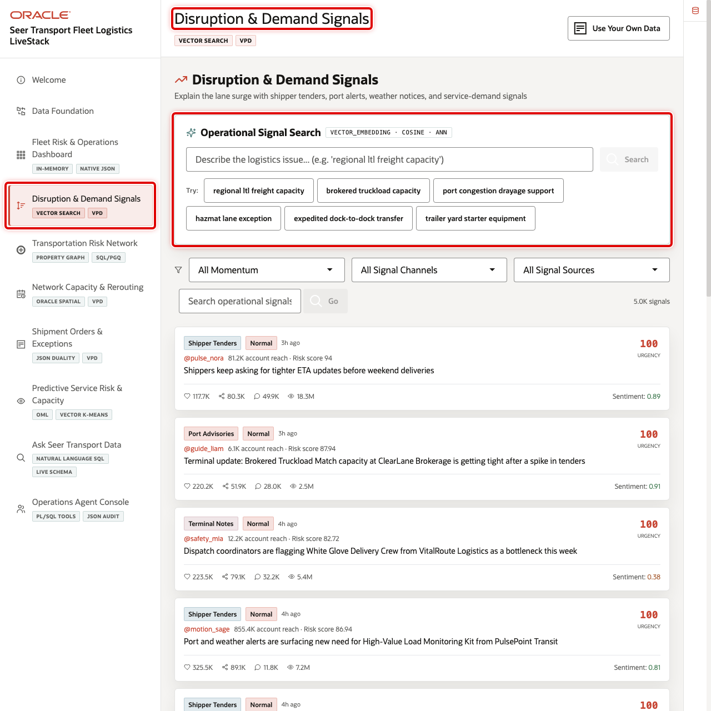
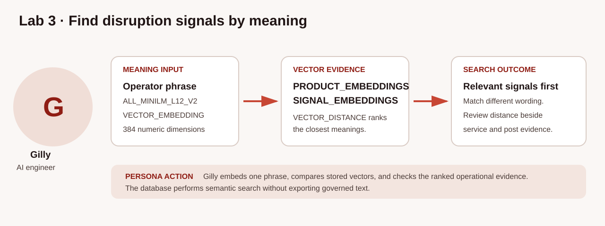
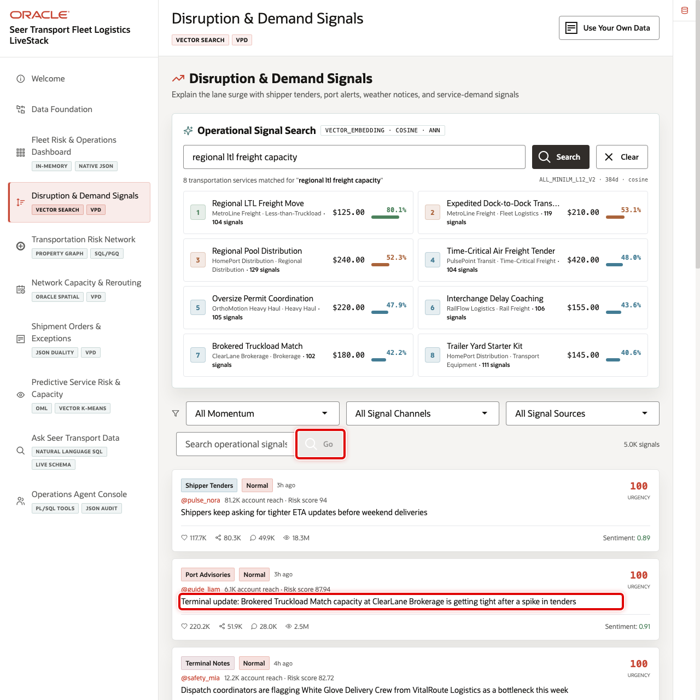

# Review a Semantic Disruption Search

## Introduction

Gilly is the AI engineer helping network operators find disruption and demand signals even when the source text does not repeat their search words. A keyword search for *capacity risk* can miss a shipper update about missed pickups, terminal congestion, or urgent rerouting. That makes it harder for the control tower to see related evidence early enough to respond.

Oracle AI Vector Search represents meaning as embeddings and compares those vectors where the governed service and signal data already lives. The source text, business identifiers, urgency, severity, and reach remain attached to every semantic match; Seer Transport does not need to export operational text to a separate vector service and reconcile the result later.

The image below shows the Disruption & Demand Signals page used by transportation planners and network operators. Notice the semantic service search beside the operational signal feed. The SQL in this lab recreates that ranking from governed service and signal rows so you can see why an item appears in the review queue.





### Objectives

- Inspect the stored vector sources used by the in-database embedding model.
- Rank transportation services and signals by meaning.
- Interpret similarity as review evidence rather than certainty.

Estimated Time: **10 minutes**

### Hands-on Scenario

| Step | Transportation focus |
| --- | --- |
| Business Problem | Exact words do not capture every disruption or demand signal |
| Technical Challenge | Search meaning without moving signal text to a separate vector service |
| Persona Focus | Gilly, the AI engineer, creates a reviewable semantic ranking |
| What You Will Do | Embed a question and compare it with stored vectors |
| Database Capability | AI Vector Search, `VECTOR_EMBEDDING`, and `VECTOR_DISTANCE` |
| Outcome | Operators discover relevant signals with their source rows intact |

<details>
<summary><strong>Key terms: embedding, vector distance, and similarity</strong></summary>

> - An **embedding** is a numeric representation of meaning. Services and signal text with similar meanings have vectors that are close together. `VECTOR_EMBEDDING` turns the phrase from the operator into a vector using the approved in-database model.
>
> - `VECTOR_DISTANCE` compares two vectors. With cosine distance, a smaller value means the text meanings are closer.
>
> - The workshop uses `1 - VECTOR_DISTANCE(...)` as a **similarity score**, where a higher value means a closer semantic match. It is a ranking transformation, not a probability, percentage, or calibrated confidence. The score prioritizes evidence for human review; it does not prove that a disruption exists or prescribe an operational action.

</details>

> **SQL Worksheet reminder:** Return to [Getting Started Task 2](?lab=getting-started#Task2:OpenSQLWorksheet) if you need the SQL Worksheet steps.

## Task 1: Verify the vector-search path

Seer Transport stores one vector row for each prepared service description and operational signal. Before you run a semantic comparison, verify the approved embedding model, the vector dimensions and storage format, and the vector-index status. The deterministic baseline contains 31 service vectors and 5,000 signal vectors; the vectors remain connected to the business records that later queries join by identifier.

1. Run the verification query.

    ```sql
    <copy>
    SELECT 'EMBEDDING MODEL' AS asset_type,
           model_name AS asset_name,
           mining_function || ' / ' || algorithm AS detail
    FROM all_mining_models
    WHERE owner = 'ADMIN'
      AND model_name = 'ALL_MINILM_L12_V2'
    UNION ALL
    SELECT 'VECTOR SOURCE',
           'PRODUCT_EMBEDDINGS',
           TO_CHAR(COUNT(*)) || ' rows / ' ||
             TO_CHAR(MIN(VECTOR_DIMENSION_COUNT(embedding))) || ' dimensions / ' ||
             MIN(VECTOR_DIMENSION_FORMAT(embedding))
    FROM product_embeddings
    UNION ALL
    SELECT 'VECTOR SOURCE',
           'SIGNAL_EMBEDDINGS',
           TO_CHAR(COUNT(*)) || ' rows / ' ||
             TO_CHAR(MIN(VECTOR_DIMENSION_COUNT(embedding))) || ' dimensions / ' ||
             MIN(VECTOR_DIMENSION_FORMAT(embedding))
    FROM signal_embeddings
    UNION ALL
    SELECT 'VECTOR INDEX',
           index_name,
           table_name || ' / ' || status
    FROM user_indexes
    WHERE index_name IN ('IDX_PRODUCT_VEC', 'IDX_POST_VEC')
    ORDER BY asset_type, asset_name;
    </copy>
    ```

    **Expected output: Vector Search Readiness**

    | Asset Type | Asset Name | Detail |
    | --- | --- | --- |
    | Embedding model | ALL_MINILM_L12_V2 | EMBEDDING / ONNX |
    | Vector source | PRODUCT_EMBEDDINGS | 31 rows / 384 dimensions / FLOAT32 |
    | Vector source | SIGNAL_EMBEDDINGS | 5000 rows / 384 dimensions / FLOAT32 |
    | Vector index | IDX_PRODUCT_VEC | PRODUCT_EMBEDDINGS / VALID |
    | Vector index | IDX_POST_VEC | POST_EMBEDDINGS / VALID |

The model row confirms that Oracle Autonomous AI Database can generate embeddings with the approved ONNX model. The source rows confirm that the stored vectors have the required 384-dimensional `FLOAT32` format. The two valid indexes support approximate cosine search: `IDX_POST_VEC` indexes the physical `POST_EMBEDDINGS` table exposed to the lab as `SIGNAL_EMBEDDINGS`.

## Task 2: Rank services for an operational question

This query embeds one operational question once in the `query_vector` common table expression (CTE), then compares that vector with stored service-description embeddings. `ADMIN.ALL_MINILM_L12_V2` is the in-database embedding model used to turn the phrase into a vector. `VECTOR_DISTANCE(..., COSINE)` compares that question vector with each service vector, and `1 - distance` converts the result into a higher-is-closer score. The join to `TRANSPORT_SERVICES_V`, a saved business-ready view, keeps every score attached to a recognizable service and category. `FETCH APPROX` requests an approximate nearest-neighbor search using the cosine vector index when the optimizer selects an eligible path.

1. Run the semantic service search.

    ```sql
    <copy>
    WITH query_vector AS (
      SELECT VECTOR_EMBEDDING(
               ADMIN.ALL_MINILM_L12_V2
               USING 'urgent white glove capacity and missed pickup recovery' AS DATA
             ) AS embedding
      FROM dual
    )
    SELECT ts.transport_service_name,
           ts.service_category,
           ROUND(1 - VECTOR_DISTANCE(
             pe.embedding,
             qv.embedding,
             COSINE
           ), 4) AS similarity_score
    FROM product_embeddings pe
    JOIN transport_services_v ts
      ON ts.transport_service_id = pe.product_id
    CROSS JOIN query_vector qv
    ORDER BY VECTOR_DISTANCE(
      pe.embedding,
      qv.embedding,
      COSINE
    ),
             ts.transport_service_id
    FETCH APPROX FIRST 5 ROWS ONLY;
    </copy>
    ```

    **Expected output: Semantic Service Ranking**

    | Transport Service Name | Service Category | Similarity Score |
    | --- | --- | ---: |
    | White Glove Delivery Crew or a closely related recovery service | Transportation category | Dynamic; higher ranks first |

Read the first rows as a review queue. A high score means the service description is semantically close to the question; it does not by itself show current disruption. Because this is an approximate nearest-neighbor search, very close neighbors can move in or out of the top five as the index or query conditions change. Gilly uses the service name and category to decide which operational signal evidence to inspect next.

## Task 3: Review the matching signal text

The second search ranks source signal text instead of service descriptions. `SIGNAL_EMBEDDINGS` stores the vectors, while `SHIPPER_SIGNAL_POSTS_V` is a saved SQL view that supplies the original text and business measures. The `query_vector` CTE creates the query embedding once. The `current_window` CTE anchors the review period to the maximum loaded `SIGNAL_TIME`, so the demonstration stays reproducible. The `WHERE` clause retains signals from the most recent 30 loaded days that are urgent or have viral momentum. Look for current high-priority rows whose wording relates to congestion or rerouting, including semantically related language.

1. Run the signal search.

    ```sql
    <copy>
    WITH query_vector AS (
      SELECT VECTOR_EMBEDDING(
               ADMIN.ALL_MINILM_L12_V2
               USING 'terminal congestion causing urgent rerouting' AS DATA
             ) AS embedding
      FROM dual
    ),
    current_window AS (
      SELECT MAX(signal_time) AS latest_signal_time
      FROM shipper_signal_posts_v
    )
    SELECT ss.signal_id,
           ss.signal_channel,
           ss.signal_time,
           ss.severity_band,
           ss.urgency_score,
           ss.reach_count,
           SUBSTR(ss.signal_text, 1, 120) AS signal_excerpt,
           ROUND(1 - VECTOR_DISTANCE(
             se.embedding,
             qv.embedding,
             COSINE
           ), 4) AS similarity_score
    FROM signal_embeddings se
    JOIN shipper_signal_posts_v ss
      ON ss.signal_id = se.post_id
    CROSS JOIN query_vector qv
    CROSS JOIN current_window cw
    WHERE ss.signal_time >= cw.latest_signal_time - INTERVAL '30' DAY
      AND (ss.urgency_score >= 70 OR ss.severity_band IN ('viral', 'mega_viral'))
    ORDER BY VECTOR_DISTANCE(
      se.embedding,
      qv.embedding,
      COSINE
    ),
             ss.signal_id
    FETCH APPROX FIRST 10 ROWS ONLY;
    </copy>
    ```

    **Expected output: Ranked Disruption Evidence**

    | Signal ID | Signal Time | Severity Band | Signal Excerpt | Similarity Score |
    | ---: | --- | --- | --- | ---: |
    | A loaded signal ID | Within the last 30 loaded days | viral or mega\_viral, or urgency at least 70 | Current high-priority signal about congestion, capacity, pickup, or rerouting | Dynamic |

    The image below shows the ranked result in the application. Network operators use the excerpts and business measures to understand why a signal is relevant; the SQL result exposes the same evidence instead of returning an unexplained AI answer.

    

The similarity score orders the evidence, while urgency, severity, reach, and source text provide the operational context. `SIGNAL_ID` is the stable secondary ordering key when distances tie. Multiple source posts can share an excerpt when the same operational update appears on different channels; `SIGNAL_ID` identifies the distinct source row. `FETCH APPROX` trades exactness for performance when an eligible vector-index plan is selected, so a dispatcher should review the returned operational evidence before escalating or rerouting work.

🎯 **Interactive challenge: Change the recovery question.**

Replace the phrase with `weather delay affecting time-critical freight`. Which services or signals move into the top results, and what evidence would you send to a human dispatcher for review?

**Expected output: Weather and Time-Critical Evidence Ranking**

| Signal ID | Signal Channel | Severity Band | Signal Excerpt | Similarity Score |
| ---: | --- | --- | --- | ---: |
| A loaded signal ID | Current loaded channel | viral or mega\_viral, or urgency at least 70 | Current signal semantically related to weather, delay, or time-critical freight | Dynamic |

<details>
<summary><strong>Challenge answer: Rank evidence before deciding</strong></summary>

Run this query with the revised recovery question:

    ```sql
    <copy>
    WITH query_vector AS (
      SELECT VECTOR_EMBEDDING(
               ADMIN.ALL_MINILM_L12_V2
               USING 'weather delay affecting time-critical freight' AS DATA
             ) AS embedding
      FROM dual
    ),
    current_window AS (
      SELECT MAX(signal_time) AS latest_signal_time
      FROM shipper_signal_posts_v
    )
    SELECT ss.signal_id,
           ss.signal_channel,
           ss.signal_time,
           ss.severity_band,
           ss.urgency_score,
           ss.reach_count,
           SUBSTR(ss.signal_text, 1, 120) AS signal_excerpt,
           ROUND(1 - VECTOR_DISTANCE(
             se.embedding,
             qv.embedding,
             COSINE
           ), 4) AS similarity_score
    FROM signal_embeddings se
    JOIN shipper_signal_posts_v ss
      ON ss.signal_id = se.post_id
    CROSS JOIN query_vector qv
    CROSS JOIN current_window cw
    WHERE ss.signal_time >= cw.latest_signal_time - INTERVAL '30' DAY
      AND (ss.urgency_score >= 70 OR ss.severity_band IN ('viral', 'mega_viral'))
    ORDER BY VECTOR_DISTANCE(
      se.embedding,
      qv.embedding,
      COSINE
    ),
             ss.signal_id
    FETCH APPROX FIRST 10 ROWS ONLY;
    </copy>
    ```

The top rows should shift toward time-critical, airport, weather, or recovery language among the current high-priority signals. The CTE calculates the query vector once, and `SIGNAL_ID` resolves equal-distance ties. Approximate nearest-neighbor search trades exactness for performance; urgency and the source text still provide the operational evidence needed for judgment.

</details>

## Conclusion

Gilly used in-database embeddings to search meaning while keeping vectors attached to governed service and signal rows. Operators can change the question without exporting sensitive operational text to a disconnected search index. The result is faster discovery with fewer data copies, consistent database security, and source evidence that a human reviewer can inspect.

## Next Steps

Continue with Property Graph to investigate how a disruption can propagate through the transportation network. For deeper practice with embeddings and semantic search, open the [AI Vector Search LiveLabs workshop](https://livelabs.oracle.com/ords/r/dbpm/livelabs/view-workshop?clear=RR,180&wid=4166).

## Acknowledgements

* **Author** - Oracle Database Product Management
* **Last Updated By/Date** - Oracle Database Product Management, September 2026
