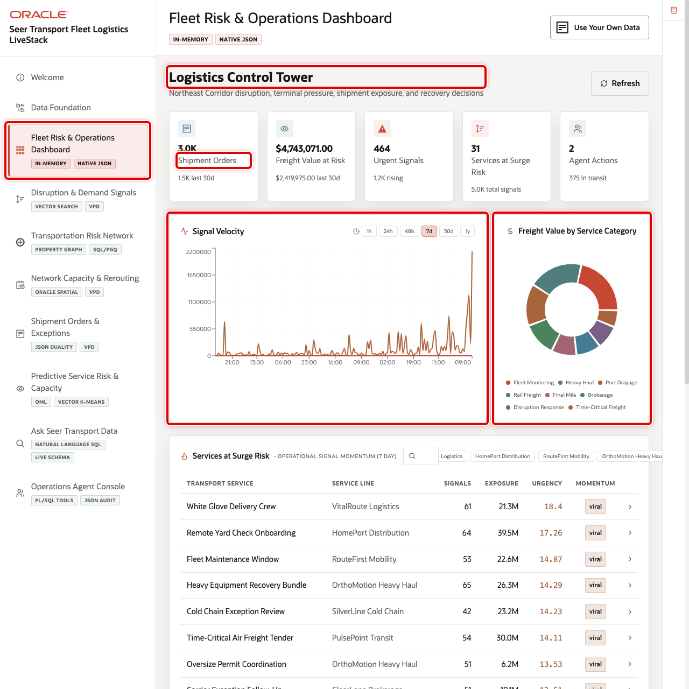
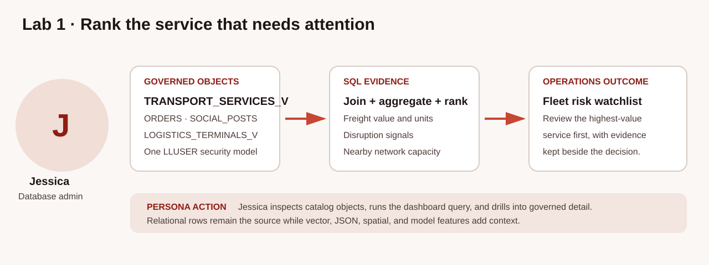
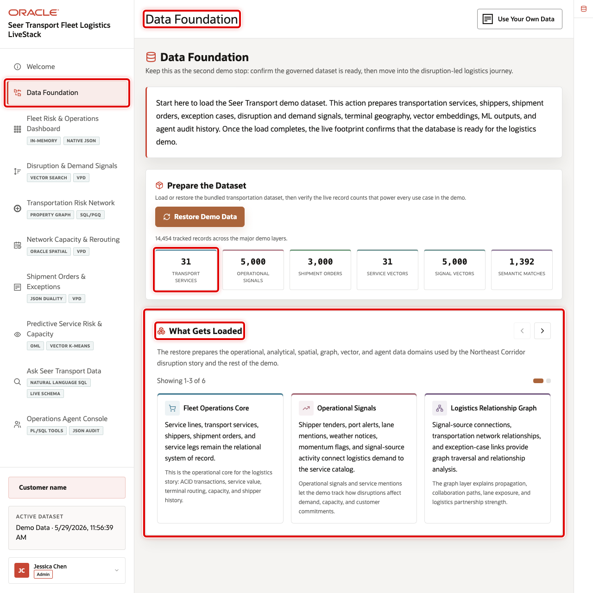
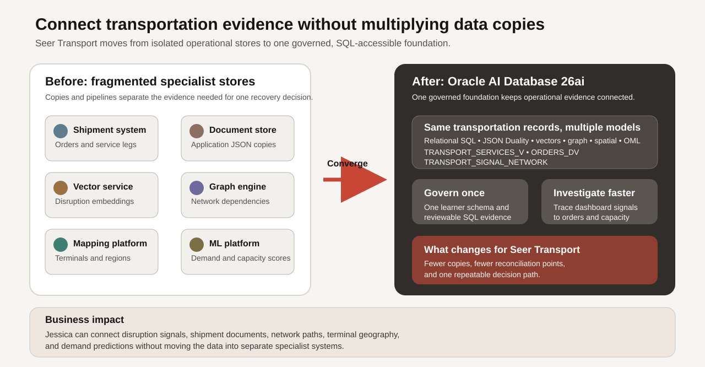

# Build a Converged Fleet Operations Query

## Introduction

Jessica Chan is the database administrator responsible for keeping operational data at Seer Transport reliable and useful. Every morning, the control-tower team asks her a practical question: **which service needs attention first, and where can the network respond?**

The answer crosses several forms of evidence. Service records and signal measures are relational rows. Shipment activity is available as JSON documents. Semantic similarity ranks services by meaning, and spatial geometry describes the terminal network. If those data types lived in separate products, Jessica would have to reconcile extracts, search indexes, document copies, and mapping systems before she could explain one dashboard row.

Oracle Autonomous AI Database provides a converged foundation for the investigation. Relational, vector, JSON-Relational Duality View, and spatial operations can run together over the governed transportation data. In this lab, you take the role of Jessica and build the SQL behind the Fleet Risk & Operations Dashboard, then drill from a ranked service to the signals and capacity that operations teams can review.

The image below shows the Fleet Risk & Operations Dashboard used by transportation leaders, dispatch planners, and service operations managers. Notice the **White Glove Delivery Crew** row, the signal-velocity measures, and the path from summary cards to service detail. The SQL in this lab recreates the governed evidence behind that review queue.





### Objectives

- Explain the transportation data foundation behind the dashboard.
- Combine relational, vector, JSON, and spatial evidence in one query.
- Drill from a service-level summary to signal and capacity rows.

Estimated Time: **10 minutes**

### Hands-on Scenario

| Step | Transportation focus |
| --- | --- |
| Business Problem | Operations teams need to identify a pressured service and a practical network response |
| Technical Challenge | The evidence crosses services, signals, shipment documents, and terminal geography |
| Persona Focus | Jessica, the DBA, builds the traceable query behind the dashboard |
| What You Will Do | Run a converged service investigation and drill into its evidence |
| Database Capability | Relational SQL, AI Vector Search, JSON-Relational Duality View, and Oracle Spatial |
| Outcome | A ranked service queue that stays connected to operational detail |

Persona focus: You are Jessica. Your job is to give operations leaders one answer they can inspect and repeat.

Before Jessica builds the query, the Data Foundation page confirms the live transportation footprint that supports the journey: services, signals, shipment orders, terminals, demand forecasts, embeddings, models, and agent history. The first task inventories the matching database objects rather than relying only on the application counts.



<details>
<summary><strong>Key terms: business-ready view and converged query</strong></summary>

> - A **business-ready view** is a saved SQL query that presents inherited physical tables with transportation-ready names. `TRANSPORT_SERVICES_V`, `SHIPPER_SIGNAL_POSTS_V`, and `LOGISTICS_TERMINALS_V` make the business meaning explicit while hiding lower-level naming and joins.
>
> - A **converged query** combines multiple data models in one governed SQL path. It reduces data copies and lets the learner trace a summary to the same source records.

</details>

The before-and-after graphic shows the architectural choice behind the workshop. Separate specialist stores add copies, integration pipelines, and security boundaries. A converged Oracle Autonomous AI Database keeps different data models connected so the dashboard can trace a summary back to the same governed records.



> **SQL Worksheet reminder:** Need a reminder on how to open and use SQL Worksheet? Return to [Getting Started Task 2: Open SQL Worksheet](?lab=getting-started#Task2:OpenSQLWorksheet).

## Task 1: Inventory the connected transportation foundation

This query inventories the objects used in this Lab 1 investigation and representative objects used later in the connected journey. The Oracle `USER_*` catalog views list the views, tables, property graphs, duality views, and mining models owned by `LLUSER`; `ALL_MINING_MODELS` confirms the approved embedding-model prerequisite that `LLUSER` uses through its granted model access. The result should include the service, signal, terminal-capacity, order, and embedding views; the demand-region table; both vector indexes; the shipment duality view; and the embedding model.

1. Run the object inventory.

    ```sql
    <copy>
    SELECT 'VIEW' AS object_type, view_name AS object_name
    FROM user_views
    WHERE view_name IN (
      'TRANSPORT_SERVICES_V', 'SHIPPER_SIGNAL_POSTS_V',
      'LOGISTICS_TERMINALS_V', 'TERMINAL_CAPACITY_V',
      'TRANSPORT_ORDERS_V',
      'SIGNAL_EMBEDDINGS', 'OML_DEMAND_SURGE_TRAINING_V'
    )
    UNION ALL
    SELECT 'JSON RELATIONAL DUALITY VIEW', view_name
    FROM user_json_duality_views
    WHERE view_name = 'ORDERS_DV'
    UNION ALL
    SELECT 'PROPERTY GRAPH', graph_name
    FROM user_property_graphs
    WHERE graph_name = 'TRANSPORT_SIGNAL_NETWORK'
    UNION ALL
    SELECT 'TABLE', table_name
    FROM user_tables
    WHERE table_name IN ('PRODUCT_EMBEDDINGS', 'DEMAND_REGIONS')
    UNION ALL
    SELECT 'VECTOR INDEX', index_name
    FROM user_indexes
    WHERE index_name IN ('IDX_PRODUCT_VEC', 'IDX_POST_VEC')
    UNION ALL
    SELECT 'EMBEDDING MODEL', model_name
    FROM all_mining_models
    WHERE owner = 'ADMIN'
      AND model_name = 'ALL_MINILM_L12_V2'
    UNION ALL
    SELECT 'MINING MODEL', model_name
    FROM user_mining_models
    WHERE model_name = 'DEMAND_SURGE_MODEL'
    ORDER BY object_type, object_name;
    </copy>
    ```

    **Expected output: Workshop Object Inventory**

    | Object Type | Representative Object |
    | --- | --- |
    | VIEW | TRANSPORT\_SERVICES\_V |
    | VIEW | TERMINAL\_CAPACITY\_V |
    | TABLE | DEMAND\_REGIONS |
    | JSON RELATIONAL DUALITY VIEW | ORDERS\_DV |
    | Embedding model | ALL\_MINILM\_L12\_V2 |
    | Vector index | IDX\_PRODUCT\_VEC and IDX\_POST\_VEC |
    | PROPERTY GRAPH | TRANSPORT\_SIGNAL\_NETWORK |
    | MINING MODEL | DEMAND\_SURGE\_MODEL |

The exact catalog label for a specialized object can vary by database release. `ALL_MINILM_L12_V2` must exist in `ADMIN` and be granted to `LLUSER`; the platform loader treats that model as an explicit prerequisite. Focus on the object names: each one supplies evidence used by this lab or a later persona.

## Task 2: Run the converged fleet investigation

This query creates the ranked service view behind the dashboard used by Jessica. Read it in five parts:

- `service_pressure` joins business-ready transportation views with the signal-to-service bridge table, then aggregates urgent signals, average urgency, and reach. A bridge table connects a signal to the business service it mentions.
- `query_vector` creates the investigation embedding once. `semantic_match` then uses `VECTOR_DISTANCE` to compare that one query vector with stored service embeddings, where a higher similarity score means a closer semantic match.
- `shipment_activity` reads `ORDERS_DV` as JSON and uses `JSON_TABLE` to project nested shipment items into SQL rows.
- `service_terminal_capacity` joins each service to its own active terminal capacity, retains terminals with positive unreserved capacity, and calculates each terminal's distance to the Northeast Corridor boundary.
- `ranked_terminal` ranks those capacity-eligible terminals independently for each service. The closest terminal is selected first; unreserved capacity and terminal ID make ties deterministic.

The final `SELECT` joins the independently aggregated or ranked results. A candidate terminal is therefore relevant to the selected service operationally (it has positive unreserved capacity for that service) and geographically (it is the closest eligible terminal to the region). It does not treat a multiplied signal-by-capacity row set as one causal record.

1. Run the query.

    ```sql
    <copy>
    WITH query_vector AS (
      SELECT VECTOR_EMBEDDING(
               ADMIN.ALL_MINILM_L12_V2
               USING 'capacity pressure missed pickup and urgent rerouting' AS DATA
             ) AS embedding
      FROM dual
    ),
    service_pressure AS (
      SELECT ts.transport_service_id,
             ts.transport_service_name,
             ts.service_category,
             COUNT(DISTINCT ss.signal_id) AS urgent_signals,
             ROUND(AVG(ss.urgency_score), 1) AS avg_urgency,
             SUM(ss.reach_count) AS signal_reach
      FROM transport_services_v ts
      JOIN post_product_mentions ppm
        ON ppm.product_id = ts.transport_service_id
      JOIN shipper_signal_posts_v ss
        ON ss.signal_id = ppm.post_id
      WHERE ss.urgency_score >= 70
      GROUP BY ts.transport_service_id,
               ts.transport_service_name,
               ts.service_category
    ),
    semantic_match AS (
      SELECT pe.product_id AS transport_service_id,
             ROUND(1 - VECTOR_DISTANCE(
               pe.embedding,
               qv.embedding,
               COSINE
             ), 4) AS semantic_similarity
      FROM product_embeddings pe
      CROSS JOIN query_vector qv
    ),
    shipment_activity AS (
      SELECT jt.product_id AS transport_service_id,
             COUNT(DISTINCT jt.order_id) AS active_orders,
             SUM(jt.quantity) AS requested_units
      FROM orders_dv od
      CROSS APPLY JSON_TABLE(
        od.data, '$'
        COLUMNS (
          order_id NUMBER PATH '$._id',
          order_status VARCHAR2(30) PATH '$.status',
          NESTED PATH '$.items[*]' COLUMNS (
            product_id NUMBER PATH '$.productId',
            quantity NUMBER PATH '$.quantity'
          )
        )
      ) jt
      WHERE jt.order_status IN ('pending', 'confirmed', 'processing')
      GROUP BY jt.product_id
    ),
    service_terminal_capacity AS (
      SELECT tc.transport_service_id,
             lt.terminal_id,
             lt.terminal_name,
             lt.city,
             lt.state_province,
             tc.available_capacity,
             tc.reserved_capacity,
             tc.available_capacity - tc.reserved_capacity AS unreserved_capacity,
             ROUND(SDO_GEOM.SDO_DISTANCE(
               lt.location, dr.boundary, 0.005, 'unit=KM'
             ), 2) AS distance_km
      FROM terminal_capacity_v tc
      JOIN logistics_terminals_v lt
        ON lt.terminal_id = tc.terminal_id
      CROSS JOIN demand_regions dr
      WHERE dr.region_name = 'Northeast Corridor'
        AND lt.is_active = 1
        AND tc.available_capacity > tc.reserved_capacity
    ),
    ranked_terminal AS (
      SELECT stc.*,
             ROW_NUMBER() OVER (
               PARTITION BY stc.transport_service_id
               ORDER BY stc.distance_km ASC,
                        stc.unreserved_capacity DESC,
                        stc.terminal_id ASC
             ) AS terminal_rank
      FROM service_terminal_capacity stc
    )
    SELECT sp.transport_service_name,
           sp.service_category,
           sp.urgent_signals,
           sp.avg_urgency,
           sp.signal_reach,
           sm.semantic_similarity,
           NVL(sa.active_orders, 0) AS active_orders,
           NVL(sa.requested_units, 0) AS requested_units,
           rt.terminal_name AS selected_terminal,
           rt.city || ', ' || rt.state_province AS terminal_location,
           rt.distance_km AS terminal_distance_km,
           rt.unreserved_capacity
    FROM service_pressure sp
    JOIN semantic_match sm
      ON sm.transport_service_id = sp.transport_service_id
    LEFT JOIN shipment_activity sa
      ON sa.transport_service_id = sp.transport_service_id
    JOIN ranked_terminal rt
      ON rt.transport_service_id = sp.transport_service_id
     AND rt.terminal_rank = 1
    ORDER BY sm.semantic_similarity DESC,
             sp.signal_reach DESC,
             sp.urgent_signals DESC,
             sp.transport_service_id ASC
    FETCH FIRST 10 ROWS ONLY;
    </copy>
    ```

    **Expected output: Ranked Fleet Review**

    | Transport Service Name | Urgent Signals | Semantic Similarity | Selected Terminal |
    | --- | ---: | ---: | --- |
    | White Glove Delivery Crew | At least one | Dynamic score; higher is more relevant | Closest capacity-eligible terminal for that service |

Vector similarity can vary within a small range with the installed embedding model. The stable interpretation is the ordering: the services whose descriptions are closest to the investigation phrase rise to the top, with signal reach, urgent-signal count, and service ID resolving ties. The relational counts explain current pressure, shipment activity shows possible operational exposure, and the selected terminal is both capacity-eligible for that service and geographically closest to the Northeast Corridor among those eligible terminals.

## Task 3: Drill into a service

The dashboard total is useful only when an operator can review the evidence. The following two queries return signal evidence and terminal-capacity evidence separately for **White Glove Delivery Crew**. This avoids multiplying a service's signal rows by its capacity rows and avoids implying that a particular signal caused a particular terminal-capacity condition.

1. Run the signal-evidence query.

    ```sql
    <copy>
    SELECT ts.transport_service_name,
           ss.severity_band,
           ss.urgency_score,
           ss.reach_count,
           SUBSTR(ss.signal_text, 1, 100) AS signal_excerpt
    FROM transport_services_v ts
    JOIN post_product_mentions ppm
      ON ppm.product_id = ts.transport_service_id
    JOIN shipper_signal_posts_v ss
      ON ss.signal_id = ppm.post_id
    WHERE ts.transport_service_name = 'White Glove Delivery Crew'
    ORDER BY ss.urgency_score DESC,
             ss.reach_count DESC,
             ss.signal_id ASC
    FETCH FIRST 10 ROWS ONLY;
    </copy>
    ```

    **Expected output: White Glove Signal Evidence**

    | Transport Service Name | Severity Band | Signal Excerpt |
    | --- | --- | --- |
    | White Glove Delivery Crew | rising, viral, or mega\_viral | Transportation-specific pressure evidence |

2. Run the terminal-capacity query. It ranks active terminals that have positive unreserved capacity for the selected service, then displays the top capacity-eligible terminal closest to the Northeast Corridor.

    ```sql
    <copy>
    WITH capacity_candidates AS (
      SELECT lt.terminal_id,
             lt.terminal_name,
             lt.city,
             lt.state_province,
             tc.available_capacity,
             tc.reserved_capacity,
             tc.available_capacity - tc.reserved_capacity AS unreserved_capacity,
             ROUND(SDO_GEOM.SDO_DISTANCE(
               lt.location, dr.boundary, 0.005, 'unit=KM'
             ), 2) AS distance_km
      FROM transport_services_v ts
      JOIN terminal_capacity_v tc
        ON tc.transport_service_id = ts.transport_service_id
      JOIN logistics_terminals_v lt
        ON lt.terminal_id = tc.terminal_id
      CROSS JOIN demand_regions dr
      WHERE ts.transport_service_name = 'White Glove Delivery Crew'
        AND dr.region_name = 'Northeast Corridor'
        AND lt.is_active = 1
        AND tc.available_capacity > tc.reserved_capacity
    )
    SELECT terminal_name,
           city,
           state_province,
           available_capacity,
           reserved_capacity,
           unreserved_capacity,
           distance_km
    FROM capacity_candidates
    ORDER BY distance_km ASC,
             unreserved_capacity DESC,
             terminal_id ASC
    FETCH FIRST 1 ROW ONLY;
    </copy>
    ```

    **Expected output: White Glove Capacity Evidence**

    | Terminal Name | Unreserved Capacity | Distance to Northeast Corridor |
    | --- | ---: | ---: |
    | A current logistics terminal | Positive value | Closest capacity-eligible result |

For production dashboard speed, Jessica would index common join and filter columns. A materialized view could refresh a stable summary repeatedly. This lab uses direct SQL so every measure remains transparent.

Read the two result sets together, not as matched causal pairs. Signals explain why the service merits review. Capacity rows show where that specific service may have operationally usable terminal capacity near the region. An operator still confirms routing rules, actual availability, and dispatch constraints before taking action.

## Conclusion

Jessica connected service pressure, semantic relevance, shipment activity, and terminal geography without copying the data into four separate systems. The dashboard is now a traceable starting point for investigation rather than an isolated scorecard: an operations leader can move from a ranked service to the signal and capacity rows behind it while the data remains under one security and governance model.

## Next Steps

Continue with the JSON-Relational Duality View to serve the same shipment records as application documents.

## Acknowledgements

* **Author** - Oracle Database Product Management
* **Last Updated By/Date** - Oracle Database Product Management, September 2026
