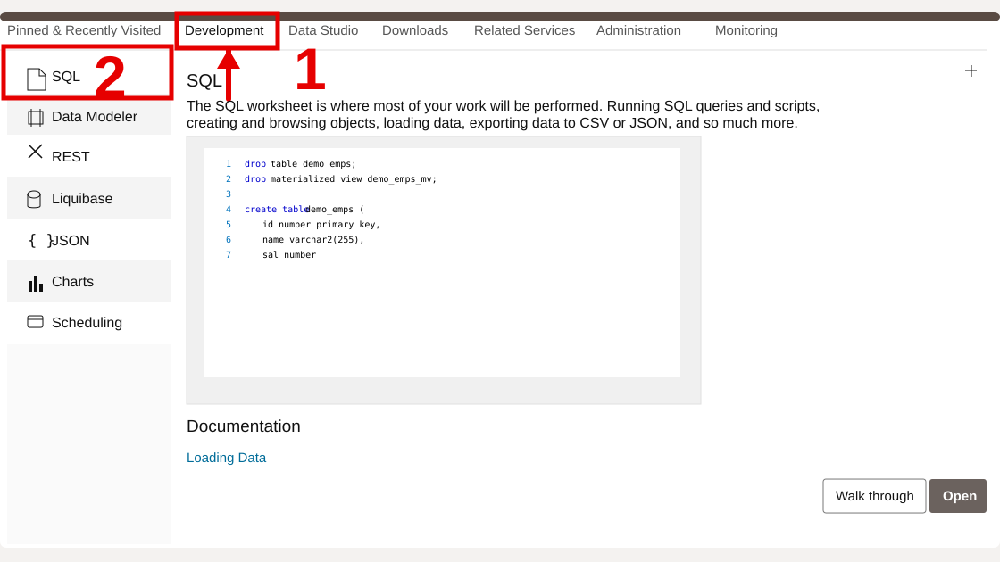
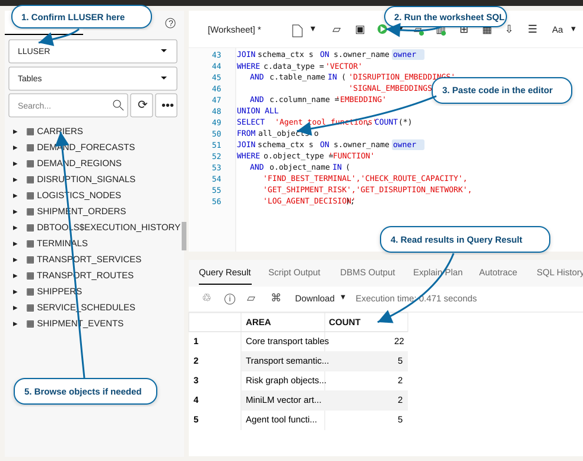

# Getting Started

## Introduction

Use this lab to open the LiveLabs reservation, access the provisioned **Oracle Autonomous AI Database 26ai** instance, and prepare SQL Worksheet for the transportation exercises. Think of this as getting the correct control-tower workspace and credentials before an operations review: every query in the workshop runs as the workshop user against the prepared transportation schema.

<details>
<summary><strong>Key terms: Database Actions, SQL Worksheet, and LLUSER</strong></summary>

> - **Database Actions** is the browser-based Oracle Database workspace used in this workshop. It provides SQL Worksheet, object browsing, data loading, and development tools without requiring a desktop database client.
>
> - **SQL Worksheet** is where you paste SQL, run it, and review query results, script output, and errors. It is the main place where you connect the transportation application screens to database evidence.
>
> - `LLUSER` is the workshop database user and schema owner. The correct user matters because the transportation tables, views, vectors, graph, spatial objects, and machine-learning models resolve in this schema.

</details>

Estimated Time: **5 minutes**

### Objectives

In this lab, you will:

- Launch the LiveLabs workshop environment.
- Use the reservation information to open Database Actions as `LLUSER`.
- Open SQL Worksheet and confirm the active transportation schema.

## Task 1: Launch the LiveLabs environment

Start from the LiveLabs reservation so Database Actions opens with the correct workshop resources. The reservation contains the database sign-in details you will use throughout the workshop.

1. Sign in to [LiveLabs](https://livelabs.oracle.com) with your Oracle account.

2. Open this workshop, select **Start**, and select **Run on LiveLabs Sandbox**.

3. In **My Reservations**, select **Launch Workshop** for this reservation.

4. Select **View Login Info** and keep the database credentials available for the next task.

    

    *Figure 1: Reservation Information shows the `LLUSER` login, password, and Login URL for Database Actions.*

## Task 2: Open SQL Worksheet

Open SQL Worksheet as the workshop user before running the transportation queries. SQL Worksheet is where you will ask the database each question and immediately review the evidence returned as a table.

1. Confirm that **1 - Login** shows `LLUSER`.

2. Select **Copy** for **2 - Password**.

    

    *Figure 2: Copy the `LLUSER` password from Reservation Information.*

3. Select **Open Link** for **3 - Login URL**.

    

    *Figure 3: Open the Database Actions Login URL from the reservation.*

4. Confirm `LLUSER`, paste the password, and select **Sign in**.

    

    *Figure 4: Sign in to Database Actions as `LLUSER` with the copied password.*

5. Select **Development**, then select **SQL**.

    

    *Figure 5: Open SQL from the Development tools menu.*

6. Review the SQL Worksheet orientation.

    

    *Figure 6: Use SQL Worksheet to confirm the active user, paste each workshop SQL block, run it, and review the result.*

    - Confirm the user dropdown shows `LLUSER`.
    - Paste each workshop SQL block into the editor.
    - Select **Run Statement** or press **Ctrl+Enter** to run the current statement.
    - Review the output in **Query Result** or **Script Output**, depending on the step.
    - Use **Navigator** when you want to inspect a table, view, model, or other database object.

7. Run the connection check below. `USER` shows who signed in, while `SYS_CONTEXT('USERENV', 'CURRENT_SCHEMA')` shows where an unqualified object name resolves. Both values should point to the `LLUSER` workshop schema before you continue.

    ```sql
    <copy>
    SELECT USER AS "User",
           SYS_CONTEXT('USERENV', 'CURRENT_SCHEMA') AS "Schema",
           SYSTIMESTAMP AS "Checked At";
    </copy>
    ```

    **Expected output: Connected Session**

    | User | Schema | Checked At |
    | --- | --- | --- |
    | LLUSER | LLUSER | Current SQL Worksheet timestamp |

The timestamp changes each time you run the query. The stable requirement is that both the user and schema are `LLUSER`. You can run the same check again at any point in the workshop if you need to confirm the active session.

You can now continue to the transportation labs.

## Acknowledgements

* **Author** - Oracle Database Product Management
* **Last Updated By/Date** - Oracle Database Product Management, September 2026
