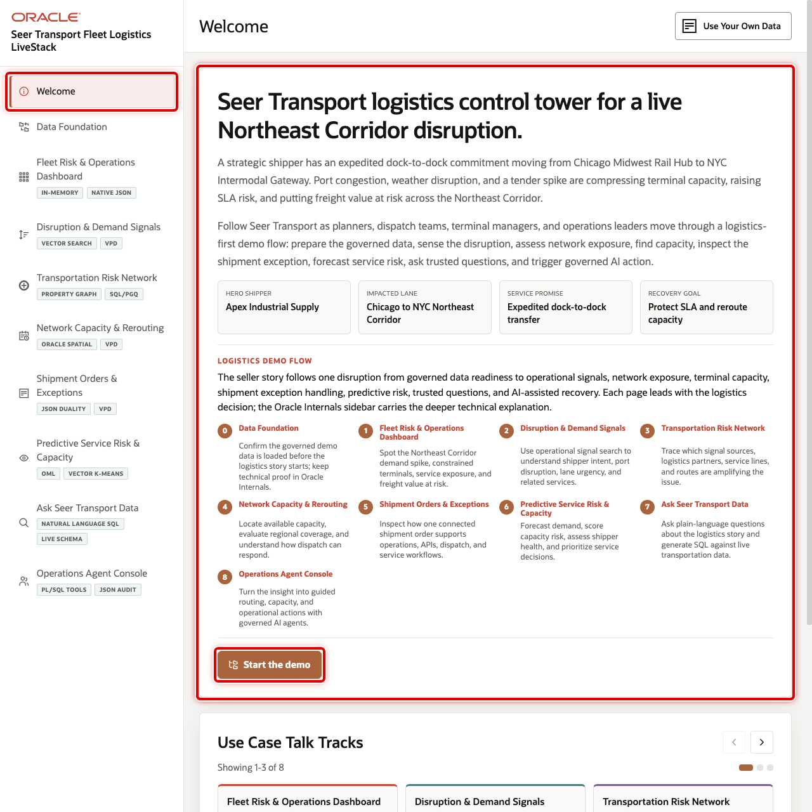

# Build Connected Transportation Solutions with Oracle Autonomous AI Database

## Introduction

Jessica Chan is the database administrator at Seer Transport. Each morning, her colleagues need to understand which services face pressure. They also need to find at-risk shipments and available network capacity. At the same time, application and analytics teams are adding document access, semantic search, relationship analysis, predictive scoring, and governed AI assistance.

The requests sound different, but they depend on the same transportation records:

- Thomas needs shipment orders as JSON for an operations application.
- Gilly needs to find disruption signals by meaning, not only exact wording.
- Bob needs to follow dependencies among carriers, terminals, ports, lanes, and exception cases.
- Moon needs to compare distance, service coverage, and terminal capacity.
- Otto needs to evaluate a demand-surge prototype on later, held-out service weeks.
- Nina needs to ask transportation questions and use a controlled operations agent.

Jessica must meet each requirement without creating a new data copy or a separate security model for every capability. She uses Oracle Autonomous AI Database as the shared foundation. Relational rows remain the source for services, signals, orders, and terminals. JSON-Relational Duality Views, vectors, graphs, spatial geometry, Oracle Machine Learning for SQL, Select AI, and Select AI Agent work with those same governed records.

This workshop follows Jessica and the same team journey used in the Seer Transport application. Each lab focuses on one business decision, and every result remains connected through Oracle Database. You will run the SQL behind the application screens, interpret the returned evidence, and complete short interactive exercises that let you change a question or review decision.

The image below shows the Seer Transport welcome page. Operations leaders use this application to move from network visibility to an informed response. Notice how the journey connects fleet operations, shipment documents, disruption signals, network relationships, terminal geography, predictive capacity, and governed AI. The SQL labs explain the database evidence behind that connected workflow.

### What the team builds

| Team member | Requirement | Workshop evidence |
| --- | --- | --- |
| Jessica, DBA | Build the evidence behind fleet risk operations | One SQL result combines service pressure, semantic relevance, shipment activity, and terminal geography |
| Thomas, application developer | Serve shipment orders as flexible documents | `ORDERS_DV` exposes relational `ORDERS` and `ORDER_ITEMS` as JSON |
| Gilly, AI engineer | Find operational signals by meaning | `SIGNAL_EMBEDDINGS`, `PRODUCT_EMBEDDINGS`, and `VECTOR_DISTANCE` rank relevant evidence |
| Bob, graph specialist | Trace a named exception case into connected entities | `TRANSPORT_SIGNAL_NETWORK` starts at `CASE-PORT-2026-041`, follows `contains_entity`, then traces bounded network hops |
| Moon, spatial expert | Rank candidate terminals for review | Oracle Spatial combines straight-line proximity with terminal capacity evidence; it does not calculate a route |
| Otto, data scientist | Evaluate a demand-surge prototype before operational use | `DEMAND_SURGE_MODEL` trains on earlier service weeks; Otto evaluates it on held-out labeled cases |
| Nina, operations analyst | Ask and act through governed AI patterns | Select AI exposes generated SQL; Select AI Agent limits work to an approved SQL tool and records the activity |

The point is not to use every capability in every query. The point is that Jessica does not need to move transportation data into a different specialist system each time the business question changes. The same governed records can support an application document, a semantic search, a graph investigation, a spatial calculation, a model score, and a natural-language question.

<strong>Learn more: What does "converged database" mean?</strong>

> A **converged database** supports multiple data types and workloads on one governed database foundation. In this workshop, relational rows, JSON documents, vectors, graph relationships, geographic data, machine-learning models, and AI-assisted SQL stay connected to the same transportation records.
>
> The value is practical. Seer Transport can keep JSON synchronized with relational shipment rows, keep vectors attached to source signals and privileges, traverse graph relationships, calculate distance, and score models without reconciling disconnected specialist stores. That means fewer sensitive copies, fewer integration points, and one SQL-backed path from a summary to its operational evidence.

Expandable **Key terms** and **Learn more** sections throughout the workshop contain optional context. Select the arrow beside a section to open it when you want more detail.

Each technical lab also ends with **Next Steps**. Depending on the topic, it links to a deeper LiveLabs workshop, relevant product documentation, or the next part of this transportation journey.

### Objectives

- Follow Jessica and her colleagues through one connected transportation decision flow, from operational visibility to governed action.
- Use relational SQL, JSON-Relational Duality Views, vectors, property graphs, spatial data, Oracle Machine Learning for SQL, Select AI, and Select AI Agent.
- Interpret application screenshots through repeatable database evidence.
- Explain how a converged database reduces sensitive data copies and reconciliation points.
- Complete focused interactive exercises that vary a business question or review decision while keeping the source evidence visible.

Estimated Workshop Time: **90 minutes**

## Acknowledgements

* **Author** - Oracle Database Product Management
* **Contributors** - Seer Transport and Oracle LiveStack workshop teams
* **Last Updated By/Date** - Oracle Database Product Management, September 2026
