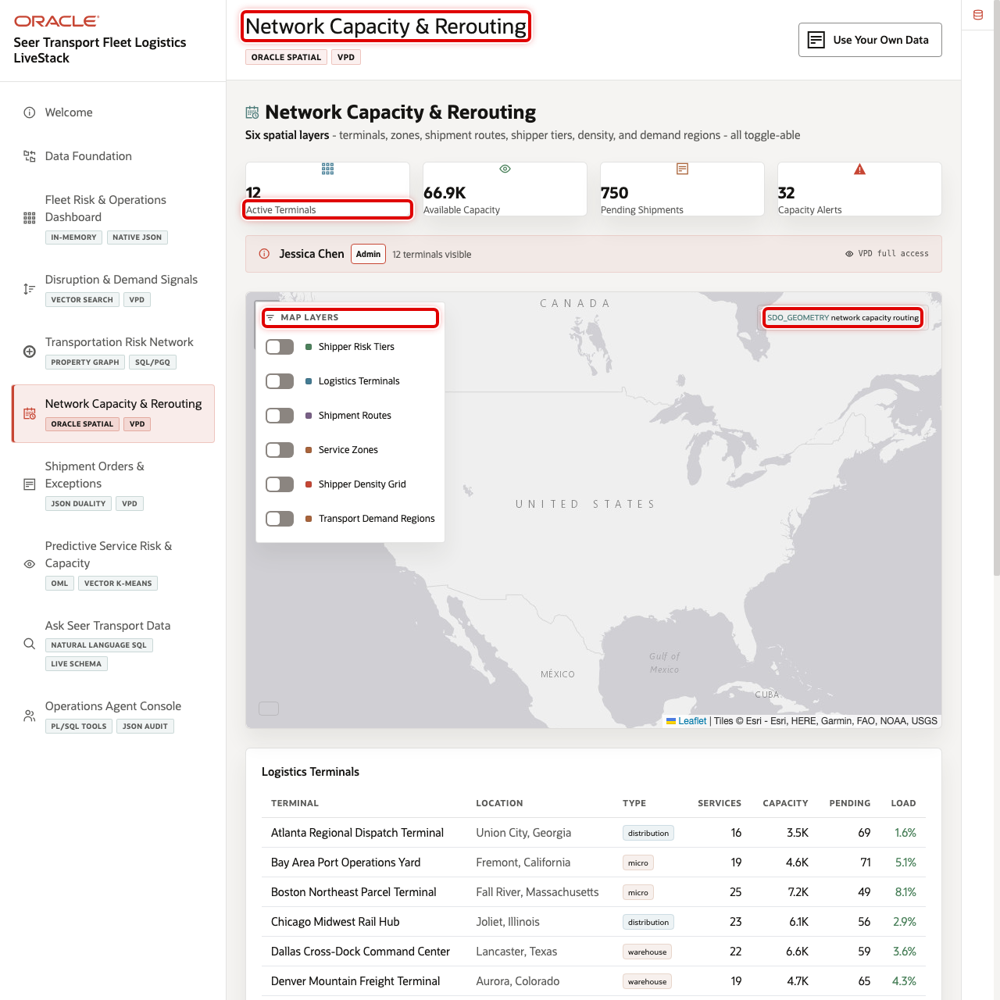
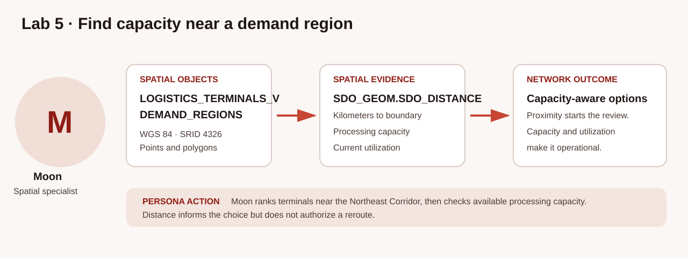
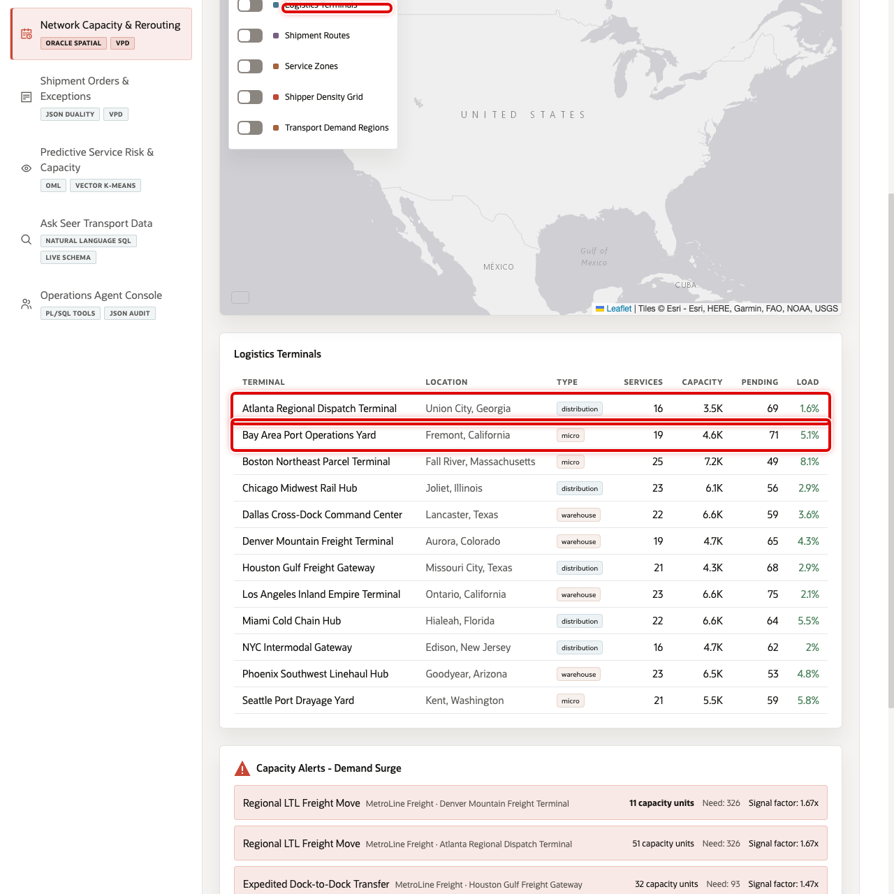

# Rank Candidate Terminals for Review

## Introduction

Moon is the spatial expert supporting dispatch planners during an active shipment exception. The closest terminal is not automatically the best candidate: it must be active, support the affected service, have allocation slots left after reservations, and operate at a reviewable utilization level. When maps and capacity records live in separate systems, planners lose time reconciling locations with current operational availability.

Oracle Spatial keeps terminal points beside the service and capacity rows in Oracle Autonomous AI Database. Moon can use the spatial index to find the nearest terminals to an affected shipper site, calculate straight-line distance, and return candidate-terminal evidence under the same governance model.

The image below shows the Network Capacity & Rerouting workspace used by dispatch planners, terminal managers, and network-operations teams. Notice the demand-region layer, terminal markers, routes, and capacity measures. The SQL in this lab recreates the location-and-capacity evidence behind the map so a planner can explain why a terminal appears as a candidate.





### Objectives

- Inspect terminal points, daily operating utilization, and the spatial reference.
- Use indexed nearest-neighbor search from an affected shipment's shipper site.
- Combine straight-line distance with service allocation slots for candidate review.

Estimated Time: **10 minutes**

### Hands-on Scenario

| Step | Transportation focus |
| --- | --- |
| Business Problem | A dispatcher needs nearby terminals to review for an affected shipment |
| Technical Challenge | Maps, capacity, and service inventory must stay synchronized |
| Persona Focus | Moon, the spatial expert, turns location into reviewable candidate evidence |
| What You Will Do | Find nearby terminals and compare distance, utilization, and service slots |
| Database Capability | Oracle Spatial `SDO_GEOMETRY`, `SDO_NN`, and `SDO_DISTANCE` |
| Outcome | Dispatchers rank candidate terminals for human review |

<details>
<summary><strong>Key terms: point, GeoJSON, SRID, nearest neighbor, and distance</strong></summary>

> - A **point** stores one longitude and latitude, such as a terminal location.
>
> - **GeoJSON** is a JSON format for geographic shapes. The application can display this location data on a map while Oracle Spatial uses governed geometry for calculations.
>
> - A **spatial reference identifier (SRID)** identifies the coordinate system. The workshop uses World Geodetic System 1984 (WGS 84), represented by SRID `4326`, so Oracle interprets terminal and shipper-site coordinates consistently.
>
> - `SDO_NN` is the indexed nearest-neighbor operator. It finds nearby terminal points from the affected shipper-site point through `IDX_FC_SPATIAL`.
>
> - `SDO_GEOM.SDO_DISTANCE` calculates the minimum distance between compatible geometries. In this lab both geometries are points, so it reports straight-line distance in kilometers. It is not driving distance, travel time, or a route recommendation.

</details>

> **SQL Worksheet reminder:** Return to [Getting Started Task 2](?lab=getting-started#Task2:OpenSQLWorksheet) if you need the SQL Worksheet steps.

## Task 1: Inspect the spatial objects

`LOGISTICS_TERMINALS_V` is a saved SQL view that presents the terminal table with transportation-ready names, coordinates, activity status, daily processing capacity, and daily utilization. This query returns active terminal points and confirms that their geometry uses SRID 4326. `PROCESSING_CAPACITY_UNITS_PER_OPERATING_DAY` is facility throughput for one operating day; it is not added to or subtracted from the service-allocation slots used later. Look for recognizable terminal names, nonzero utilization, and consistent spatial-reference values before comparing locations.

1. Run the point inventory.

    ```sql
    <copy>
    SELECT lt.terminal_name,
           lt.city,
           lt.state_province,
           lt.latitude,
           lt.longitude,
           lt.location.sdo_srid AS srid,
           lt.processing_capacity AS processing_capacity_units_per_operating_day,
           lt.utilization_pct AS planned_operating_day_utilization_pct
    FROM logistics_terminals_v lt
    WHERE lt.is_active = 1
    ORDER BY lt.terminal_name;
    </copy>
    ```

    **Expected output: Active Terminal Points**

    | Terminal Name | City | SRID | Planned Operating-Day Utilization |
    | --- | --- | ---: | ---: |
    | NYC Intermodal Gateway | Edison | 4326 | 82.5% |
    | Additional active terminals | Current city | 4326 | Seeded percentage greater than 0 |

Each row combines a map-ready point with operational context. Because the geometry and terminal measures remain in Oracle Autonomous AI Database, the next query can use the terminal spatial index without exporting coordinates to a separate mapping service.

## Task 2: Find indexed nearest terminals to the affected shipment

Shipment `649` is a confirmed shipment for Ashley Murphy in New York with a high loaded urgency score. This query uses that shipper site's point as the incident reference geometry. `SDO_NN` uses the `IDX_FC_SPATIAL` index to return five active terminal candidates. `SDO_NN_DISTANCE(1)` reports the indexed nearest-neighbor distance, while `SDO_GEOM.SDO_DISTANCE` independently reports the same straight-line point-to-point distance in kilometers. `TERMINAL_ID` makes tied distances deterministic. Look for the smallest straight-line distance, then use the next task to review utilization and service-specific slots.

1. Run the indexed nearest-neighbor query.

    ```sql
    <copy>
    WITH affected_shipment AS (
      SELECT o.transport_order_id,
             o.transport_order_status,
             s.shipper_name,
             s.city AS shipper_city,
             s.state_province AS shipper_state,
             s.location AS incident_location
      FROM transport_orders_v o
      JOIN shippers_v s
        ON s.shipper_id = o.shipper_id
      WHERE o.transport_order_id = 649
    )
    SELECT a.transport_order_id,
           a.transport_order_status,
           a.shipper_name,
           a.shipper_city,
           a.shipper_state,
           lt.terminal_name,
           lt.city,
           lt.state_province,
           ROUND(SDO_NN_DISTANCE(1), 2) AS indexed_nearest_neighbor_distance_km,
           ROUND(SDO_GEOM.SDO_DISTANCE(
             lt.location, a.incident_location, 0.005, 'unit=KM'
           ), 2) AS straight_line_distance_km,
           lt.utilization_pct AS planned_operating_day_utilization_pct
    FROM logistics_terminals_v lt
    CROSS JOIN affected_shipment a
    WHERE lt.is_active = 1
      AND SDO_NN(
            lt.location,
            a.incident_location,
            'sdo_num_res=5 unit=KM',
            1
          ) = 'TRUE'
    ORDER BY straight_line_distance_km, lt.terminal_id;
    </copy>
    ```

    **Expected output: Indexed Nearest-Terminal Candidates**

    | Shipment | Shipper Site | Terminal Name | Straight-Line Distance KM |
    | ---: | --- | --- | ---: |
    | 649 | New York, New York | NYC Intermodal Gateway | 41.51 |

The distance values reflect the loaded point geometries and the spatial tolerance; the business interpretation is nearest-to-farthest by straight line. The candidate set does not describe a road route or travel time. Proximity narrows the review list, but utilization and service allocation determine whether a planner should investigate a candidate further.

## Task 3: Add capacity evidence to the candidate review

The nearest location may not have usable capacity. Shipment `649` includes two **Refrigerated Truckload Slot** service-allocation units. `TERMINAL_CAPACITY_V` provides service-specific allocation slots for the next 24-hour dispatch horizon: `AVAILABLE` is the total allocatable service slots, `RESERVED` is the committed portion, and `UNRESERVED` is the remaining allocatable slots. Those slots are a different measure from facility processing capacity per operating day, so the query displays rather than combines the two measures. It filters out a terminal that cannot cover the two requested units and ranks remaining candidates by straight-line distance, lower planned utilization, then remaining slots. Look for a nearby terminal with enough unreserved slots and a utilization level worth a planner's review.

1. Run the capacity-aware ranking.

    ```sql
    <copy>
    WITH affected_shipment AS (
      SELECT o.transport_order_id,
             o.transport_order_status,
             s.shipper_name,
             s.location AS incident_location
      FROM transport_orders_v o
      JOIN shippers_v s
        ON s.shipper_id = o.shipper_id
      WHERE o.transport_order_id = 649
    ),
    service_requirement AS (
      SELECT oi.order_id AS transport_order_id,
             ts.transport_service_id,
             ts.transport_service_name,
             SUM(oi.quantity) AS requested_service_allocation_slots_24h
      FROM order_items oi
      JOIN transport_services_v ts
        ON ts.transport_service_id = oi.product_id
      WHERE oi.order_id = 649
        AND ts.transport_service_name = 'Refrigerated Truckload Slot'
      GROUP BY oi.order_id,
               ts.transport_service_id,
               ts.transport_service_name
    )
    SELECT a.transport_order_id,
           a.transport_order_status,
           a.shipper_name,
           sr.transport_service_name,
           sr.requested_service_allocation_slots_24h,
           lt.terminal_name,
           lt.city,
           ROUND(SDO_GEOM.SDO_DISTANCE(
             lt.location, a.incident_location, 0.005, 'unit=KM'
           ), 2) AS straight_line_distance_km,
           lt.processing_capacity AS processing_capacity_units_per_operating_day,
           lt.utilization_pct AS planned_operating_day_utilization_pct,
           tc.available_capacity AS available_service_allocation_slots_24h,
           tc.reserved_capacity AS reserved_service_allocation_slots_24h,
           tc.available_capacity - tc.reserved_capacity
             AS unreserved_service_allocation_slots_24h
    FROM affected_shipment a
    CROSS JOIN service_requirement sr
    JOIN terminal_capacity_v tc
      ON tc.transport_service_id = sr.transport_service_id
    JOIN logistics_terminals_v lt
      ON lt.terminal_id = tc.terminal_id
    WHERE lt.is_active = 1
      AND tc.available_capacity - tc.reserved_capacity
            >= sr.requested_service_allocation_slots_24h
    ORDER BY straight_line_distance_km,
             planned_operating_day_utilization_pct,
             unreserved_service_allocation_slots_24h DESC,
             lt.terminal_id
    FETCH FIRST 5 ROWS ONLY;
    </copy>
    ```

    **Expected output: Capacity-Aware Terminal Candidates**

    | Shipment | Transport Service Name | Terminal Name | Straight-Line Distance KM | Unreserved 24-Hour Service Slots |
    | ---: | --- | --- | ---: | ---: |
    | 649 | Refrigerated Truckload Slot | Chicago Midwest Rail Hub | 1186.18 | 161 |

    The image below shows the terminal-capacity rows used beside the application map. Dispatch planners use the table to compare the spatial candidate with available and reserved capacity; the SQL makes the same calculation explicit.

    

The first row is a candidate for human review, not an automatic routing command. Moon can explain the evidence: the terminal is straight-line close to the affected shipper site, has enough 24-hour service slots after reservations, and shows its planned operating-day utilization. A dispatcher must still account for road routing, travel time, equipment compatibility, operating constraints, and live conditions.

## Conclusion

Moon combined indexed nearest-neighbor search with operational capacity evidence in one query path. The map and terminal table no longer need separate reconciliation before a dispatcher can rank terminals for review. Location remains connected to service allocation data, so the team gets faster decisions, fewer geographic data copies, and a repeatable SQL explanation for each candidate.

## Next Steps

Continue with Oracle Machine Learning for SQL to evaluate which services may need capacity attention next. For deeper practice with points, polygons, and spatial analysis, open the [Oracle Spatial LiveLabs workshop](https://livelabs.oracle.com/ords/r/dbpm/livelabs/view-workshop?clear=RR,180&wid=800).

## Acknowledgements

* **Author** - Oracle Database Product Management
* **Last Updated By/Date** - Oracle Database Product Management, September 2026
