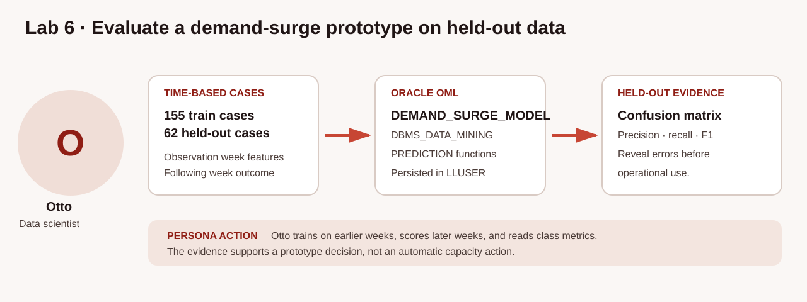

# Evaluate a Service Demand-Surge Prototype with Oracle Machine Learning for SQL

## Introduction

Otto is the data scientist helping capacity planners test whether recent transportation activity can predict a near-term demand surge. A useful evaluation must keep the timeline straight: features come from one observation week, while the known outcome comes from the following week. It must also test the model on cases that were not used for training.

Oracle Machine Learning for SQL builds, scores, and evaluates the prototype inside Oracle Autonomous AI Database, where the governed service and order data already lives. In this lab, Otto uses earlier service-week cases for training and later cases for held-out evaluation. The exercise demonstrates an Oracle-standard evaluation workflow; the small synthetic history is not evidence that the model is ready for operational capacity decisions.

The concept graphic below follows the complete evaluation path. Notice the separate training and test periods. SQL scores held-out rows, and Otto judges the result with a confusion matrix and class-specific metrics before anyone considers using it.



### Objectives

- Inspect deterministic service-week cases and the time-based training/test split.
- Confirm the persisted Oracle Machine Learning for SQL classification model.
- Score held-out rows with `PREDICTION` and `PREDICTION_PROBABILITY`.
- Evaluate held-out results with a confusion matrix, precision, recall, and F1 score.

Estimated Time: **10 minutes**

### Hands-on Scenario

| Step | Transportation focus |
| --- | --- |
| Business Problem | Planners need evidence that a demand-surge prototype works on later data before using its output |
| Technical Challenge | Observation features must precede the target, and test cases must remain outside model training |
| Persona Focus | Otto, the data scientist, evaluates the prototype and explains its limitations |
| What You Will Do | Inspect the time split, score held-out rows, and read class-specific evaluation metrics |
| Database Capability | Oracle Machine Learning for SQL; `DBMS_DATA_MINING` for PL/SQL model creation, batch scoring, and evaluation; SQL scoring functions for row-level predictions |
| Outcome | A traceable decision about whether the prototype is ready for an operational watchlist |

<details>
<summary><strong>Key terms: observation window, outcome window, held-out data, and class probability</strong></summary>

> - An **observation window** supplies the model features. Here it covers the seven days before the `OBSERVATION_END` date for each case.
>
> - An **outcome window** is the later period used to define the target. Here `SURGE` means that service units in the following seven days increased by more than 15 percent.
>
> - **Held-out data** contains labeled cases excluded from model training. Otto uses the final two service weeks to check behavior on data the model did not learn from.
>
> - `PREDICTION_PROBABILITY(..., 'SURGE')` returns an estimated class probability for `SURGE` for one row. It does not express certainty or an automatically calibrated business-risk measure.

</details>

> **SQL Worksheet reminder:** Return to [Getting Started Task 2](?lab=getting-started#Task2:OpenSQLWorksheet) if you need the SQL Worksheet steps.

## Task 1: Inspect the service-week split

`OML_DEMAND_PERIOD_CASES_V` is a saved SQL query that creates seven cases for each active transportation service. Every case uses order count, units, and freight value from one observation week. The loader derives its label only from units in the following week, so the target does not leak into the model inputs. The first five periods are training data and the final two remain outside training for testing.

1. Summarize the split and confirm that training excludes the later test periods.

    ```sql
    <copy>
    SELECT data_split,
           COUNT(*) AS case_count,
           SUM(CASE WHEN demand_class = 'SURGE' THEN 1 ELSE 0 END) AS surge_cases,
           TO_CHAR(MIN(observation_start), 'YYYY-MM-DD') AS first_observation,
           TO_CHAR(MAX(observation_end), 'YYYY-MM-DD') AS last_observation
    FROM oml_demand_period_cases_v
    GROUP BY data_split
    ORDER BY data_split;
    </copy>
    ```

    **Expected output: Time-Based Evaluation Split**

    | Data Split | Case Count | Surge Cases | First Observation | Last Observation |
    | --- | ---: | ---: | --- | --- |
    | TEST | 62 | 24 | 2026-04-20 | 2026-05-04 |
    | TRAIN | 155 | 55 | 2026-03-16 | 2026-04-20 |

The 217 service-week cases are more informative than one lifetime aggregate per service. The training view exposes only the case identifier, predictors, and label; product identifiers, dates, future units, and the split flag are not model predictors.

## Task 2: Confirm the persisted model

The workshop loader uses the `DBMS_DATA_MINING.CREATE_MODEL` PL/SQL procedure to build `DEMAND_SURGE_MODEL` from `OML_DEMAND_SURGE_TRAINING_V`. `USER_MINING_MODELS` is the learner-facing catalog for models owned by `LLUSER`.

1. Check the model name, mining function, and algorithm.

    ```sql
    <copy>
    SELECT model_name,
           mining_function,
           algorithm
    FROM user_mining_models
    WHERE model_name = 'DEMAND_SURGE_MODEL';
    </copy>
    ```

    **Expected output: Oracle Machine Learning for SQL Model Inventory**

    | Model Name | Mining Function | Algorithm |
    | --- | --- | --- |
    | DEMAND\_SURGE\_MODEL | CLASSIFICATION | Random Forest algorithm label for the installed database release |

`CLASSIFICATION` means the model selects one of the known labels. The seeded Random Forest settings make this workshop build repeatable.

## Task 3: Score held-out service weeks

This query applies the model only to cases marked `TEST`. Read it in three parts:

1. `PREDICTION` returns the selected class for each held-out service-week case.
2. `PREDICTION_PROBABILITY(..., 'SURGE')` returns the estimated class probability for `SURGE`, whether or not `SURGE` is the selected prediction.
3. The query orders by that probability so Otto can inspect the strongest prototype signals together with the observed and following-week units.

1. Score the held-out cases.

    ```sql
    <copy>
    SELECT ts.transport_service_name,
           TO_CHAR(c.observation_end, 'YYYY-MM-DD') AS as_of_date,
           c.demand_class AS actual_label,
           PREDICTION(DEMAND_SURGE_MODEL USING
             c.category AS category,
             c.unit_price AS unit_price,
             c.observed_order_count AS observed_order_count,
             c.observed_units AS observed_units,
             c.observed_revenue AS observed_revenue
           ) AS predicted_label,
           ROUND(PREDICTION_PROBABILITY(
             DEMAND_SURGE_MODEL, 'SURGE' USING
             c.category AS category,
             c.unit_price AS unit_price,
             c.observed_order_count AS observed_order_count,
             c.observed_units AS observed_units,
             c.observed_revenue AS observed_revenue
           ), 4) AS surge_probability,
           c.observed_units,
           c.outcome_units
    FROM oml_demand_period_cases_v c
    JOIN transport_services_v ts
      ON ts.transport_service_id = c.product_id
    WHERE c.data_split = 'TEST'
    ORDER BY surge_probability DESC, c.case_id
    FETCH FIRST 8 ROWS ONLY;
    </copy>
    ```

    **Expected output: Held-Out Prototype Scores**

    | Transport Service Name | As Of Date | Actual Label | Predicted Label | Surge Probability | Observed Units | Outcome Units |
    | --- | --- | --- | --- | ---: | ---: | ---: |
    | Trailer Yard Starter Kit | 2026-04-27 | STABLE | SURGE | 0.8405 | 45 | 45 |
    | School Route Capacity Review | 2026-04-27 | SURGE | SURGE | 0.8247 | 40 | 63 |
    | Expedited Dock-to-Dock Transfer | 2026-04-27 | SURGE | SURGE | 0.8197 | 27 | 72 |
    | Rail ETA Visibility Kit | 2026-05-04 | STABLE | SURGE | 0.8085 | 43 | 39 |
    | Intermodal Ramp Transfer | 2026-04-27 | SURGE | SURGE | 0.8074 | 49 | 67 |
    | Contract Lane Rebid | 2026-04-27 | SURGE | SURGE | 0.8050 | 37 | 76 |
    | Carrier Exception Follow-Up | 2026-04-27 | SURGE | SURGE | 0.8028 | 44 | 51 |
    | Hazmat Documentation Review | 2026-04-27 | STABLE | SURGE | 0.8020 | 43 | 49 |

The ranking includes both correct and incorrect `SURGE` predictions. Do not present a probability-ordered list as an accepted operational watchlist without held-out evaluation and business review.

## Task 4: Evaluate the held-out predictions

The loader uses `DBMS_DATA_MINING.APPLY` to score all 62 held-out cases and `DBMS_DATA_MINING.COMPUTE_CONFUSION_MATRIX` to compare predictions with known labels. This is evaluation evidence from later data, not agreement on the rows used to train the model.

1. Read the confusion matrix. Diagonal rows are correct classifications; off-diagonal rows are errors.

    ```sql
    <copy>
    SELECT actual_target_value AS actual_label,
           predicted_target_value AS predicted_label,
           value AS case_count
    FROM oml_demand_surge_confusion
    ORDER BY actual_target_value, predicted_target_value;
    </copy>
    ```

    **Expected output: Held-Out Confusion Matrix**

    | Actual Label | Predicted Label | Case Count |
    | --- | --- | ---: |
    | STABLE | STABLE | 29 |
    | STABLE | SURGE | 9 |
    | SURGE | STABLE | 11 |
    | SURGE | SURGE | 13 |

2. Inspect precision, recall, and F1 for each class. The query also derives overall held-out accuracy from the same confusion matrix.

    ```sql
    <copy>
    SELECT m.class_label,
           m.true_positive,
           m.false_positive,
           m.false_negative,
           m.precision,
           m.recall,
           m.f1_score,
           ROUND(
             (SELECT SUM(CASE WHEN actual_target_value = predicted_target_value
                              THEN value ELSE 0 END)
              FROM oml_demand_surge_confusion) /
             (SELECT SUM(value) FROM oml_demand_surge_confusion),
             4
           ) AS overall_accuracy
    FROM oml_demand_surge_metrics_v m
    ORDER BY m.class_label;
    </copy>
    ```

    **Expected output: Held-Out Class Metrics**

    | Class Label | True Positive | False Positive | False Negative | Precision | Recall | F1 Score | Overall Accuracy |
    | --- | ---: | ---: | ---: | ---: | ---: | ---: | ---: |
    | STABLE | 29 | 11 | 9 | 0.7250 | 0.7632 | 0.7436 | 0.6774 |
    | SURGE | 13 | 9 | 11 | 0.5909 | 0.5417 | 0.5652 | 0.6774 |

For the `SURGE` class, the prototype correctly identifies 13 of 24 held-out surge cases and misses 11. Its overall accuracy of 0.6774 is only modestly above the 0.6129 majority-class baseline. The correct workshop decision is to keep this as an Oracle Machine Learning for SQL mechanics and evaluation prototype, add more historical periods and useful pre-outcome predictors, and reevaluate before creating an operational capacity watchlist.

## Conclusion

Otto separated observation features from later outcomes, trained on earlier service weeks, and evaluated the model on 62 held-out cases. SQL `PREDICTION` and `PREDICTION_PROBABILITY` produced row-level scores, while the `DBMS_DATA_MINING` PL/SQL package created, batch-scored, and evaluated the model. The held-out result makes the limitation visible: this prototype teaches a sound Oracle Machine Learning for SQL workflow, but its `SURGE` recall and short history do not support operational deployment.

## Next Steps

Continue with Select AI to turn a transportation question into SQL that Nina can inspect and run. For deeper practice with in-database model training and scoring, open the [Oracle Machine Learning LiveLabs workshop](https://livelabs.oracle.com/ords/r/dbpm/livelabs/view-workshop?clear=RR,180&wid=922).

## Acknowledgements

* **Author** - Oracle Database Product Management
* **Last Updated By/Date** - Oracle Database Product Management, September 2026
