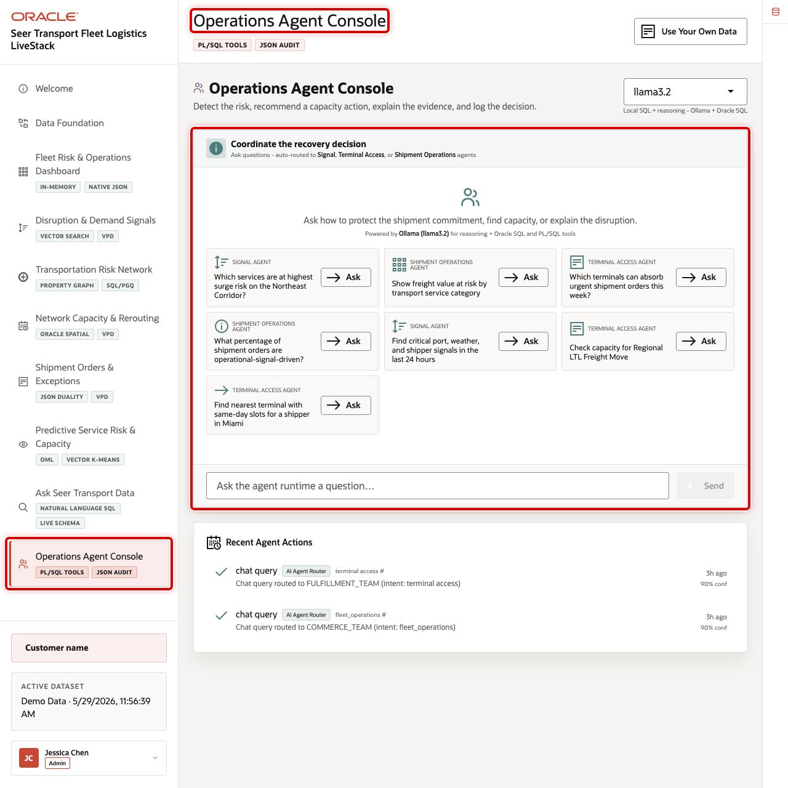
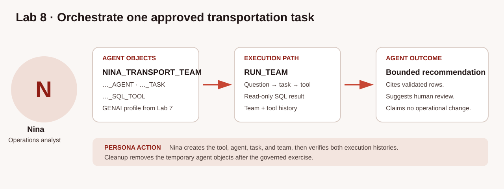
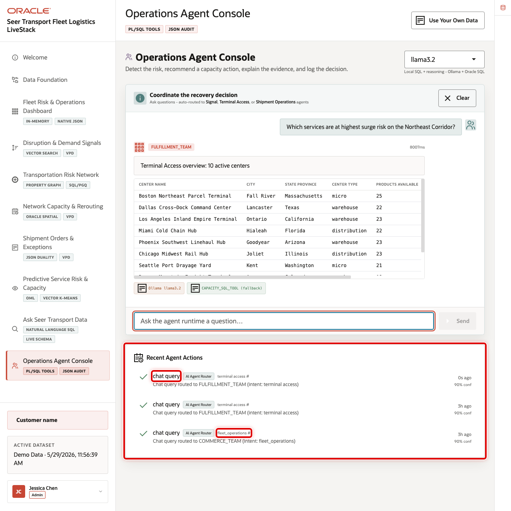

# Build a Transportation Operations Agent with Select AI Agent

## Introduction

Nina can inspect Select AI SQL for one transportation question at a time. Her operations workspace also needs a repeatable assistant that answers a freight-value review through a defined database capability and leaves execution evidence for Nina and Jessica to inspect.

Jessica creates four database objects: a SQL tool, an agent, a task, and a team. The agent's role is an attribute of the agent; it is not a fifth object. The SQL tool uses the `GENAI` profile configured in Lab 7, where `SELECTAI_SERVICE_FREIGHT_V` is the business-friendly transportation view in the generation metadata. That metadata guides NL2SQL. Current-user privileges, VPD, and other database controls still govern generated SQL execution.

The team receives task guidance to use the SQL tool once when one call is enough. That is an instruction for the model, not a hard enforcement control. Nina verifies actual tool use from the history views after each run. No custom data-changing, notification, or external tool is registered in this lab.

The image below shows the Operations Agent Console used by operations analysts and database administrators. This SQL-first lab creates the same governed pattern in the Green Button sandbox so you can inspect the database objects, execution history, and conversation trace.





### Objectives

- Confirm the Lab 7 `GENAI` transportation metadata configuration.
- Inventory and safely reset the four named workshop objects before a rerun.
- Register one SQL tool, then create its agent, task, and team.
- Correlate the team, task, tool, prompt, and response records for one run.

Estimated Time: **15 minutes**

### Hands-on Scenario

| Step | Transportation focus |
| --- | --- |
| Business Problem | Nina needs a repeatable assistant for freight-value reviews |
| Technical Challenge | The agent must use a defined SQL capability and leave execution evidence |
| Persona Focus | Nina and Jessica define a bounded operations assistant |
| What You Will See | An agent receives a request, calls a SQL tool, and returns database-backed evidence |
| Database Capability | Select AI Agent and `DBMS_CLOUD_AI_AGENT` |
| Outcome | Operations assistance remains reviewable, with its run and conversation trace connected |

<details>
<summary><strong>Key terms: agent, tool, task, and team</strong></summary>

> - An **agent** is a database object with attributes such as a role and AI profile.
>
> - A **tool** is a capability the agent may call. This lab registers one built-in SQL tool backed by `GENAI`.
>
> - A **task** supplies instructions and the permitted tools for the agent.
>
> - A **team** connects agent-task pairs into a runnable workflow.

</details>

> **Prerequisite:** Complete [Lab 7: Ask Transportation Questions with Select AI](?lab=selectai). This lab relies on its `GENAI` metadata configuration and the `SELECTAI_SERVICE_FREIGHT_V` view loaded by the workshop loader.

> **SQL Worksheet reminder:** Return to [Getting Started Task 2: Open SQL Worksheet](?lab=getting-started#Task2:OpenSQLWorksheet) if you need the SQL Worksheet steps.

## Task 1: Check the profile and inventory the workshop objects

The SQL tool uses the `GENAI` profile from Lab 7. Its metadata scope should contain the freight-value view, but that setting is not itself an access-control boundary. First, confirm the profile and inspect all four workshop object types. The inventory makes partial reruns visible before any object is created or dropped.

1. Check the profile and its relevant metadata attributes.

    ```sql
    <copy>
    SELECT profile_name, status
    FROM user_cloud_ai_profiles
    WHERE profile_name = 'GENAI';

    SELECT attribute_name, attribute_value
    FROM user_cloud_ai_profile_attributes
    WHERE profile_name = 'GENAI'
      AND attribute_name IN ('comments', 'constraints', 'object_list')
    ORDER BY attribute_name;
    </copy>
    ```

    **Expected output: Transportation Agent Profile**

    | Attribute | Expected Value |
    | --- | --- |
    | Profile status | `ENABLED` |
    | comments | `true` |
    | constraints | `true` |
    | object_list | `SELECTAI_SERVICE_FREIGHT_V` |

2. Inventory the four named workshop objects. An empty result is expected on a first run. Any returned row means the named object exists; a partial set is possible after an interrupted run.

    ```sql
    <copy>
    SELECT 'TOOL' AS object_type, tool_name AS object_name, status
    FROM user_ai_agent_tools
    WHERE tool_name = 'NINA_TRANSPORT_SQL_TOOL'
    UNION ALL
    SELECT 'AGENT', agent_name, status
    FROM user_ai_agents
    WHERE agent_name = 'NINA_TRANSPORT_AGENT'
    UNION ALL
    SELECT 'TASK', task_name, status
    FROM user_ai_agent_tasks
    WHERE task_name = 'NINA_TRANSPORT_TASK'
    UNION ALL
    SELECT 'TEAM', agent_team_name, status
    FROM user_ai_agent_teams
    WHERE agent_team_name = 'NINA_TRANSPORT_TEAM'
    ORDER BY object_type;
    </copy>
    ```

    **Expected output: Workshop Object Inventory**

    | First run | Rerun |
    | --- | --- |
    | No rows selected | One or more named objects and their statuses |

If the inventory returns any row, use the reset block in Task 2 before creating objects. It checks each catalog view and removes only the four exact workshop names in reverse dependency order.

## Task 2: Reset safely, then register the SQL tool

The reset is safe to run before every setup attempt. It first checks whether each object exists, then removes team, task, agent, and tool in reverse dependency order. This handles a first run, a complete previous run, and partial object sets without attempting to drop a missing object.

1. Reset any existing workshop objects.

    ```sql
    <copy>
    DECLARE
      l_exists PLS_INTEGER;

      PROCEDURE object_exists(p_sql VARCHAR2) IS
      BEGIN
        EXECUTE IMMEDIATE p_sql INTO l_exists;
      END;
    BEGIN
      object_exists(q'[SELECT COUNT(*) FROM user_ai_agent_teams
                       WHERE agent_team_name = 'NINA_TRANSPORT_TEAM']');
      IF l_exists > 0 THEN
        DBMS_CLOUD_AI_AGENT.DROP_TEAM('NINA_TRANSPORT_TEAM', TRUE);
      END IF;

      object_exists(q'[SELECT COUNT(*) FROM user_ai_agent_tasks
                       WHERE task_name = 'NINA_TRANSPORT_TASK']');
      IF l_exists > 0 THEN
        DBMS_CLOUD_AI_AGENT.DROP_TASK('NINA_TRANSPORT_TASK', TRUE);
      END IF;

      object_exists(q'[SELECT COUNT(*) FROM user_ai_agents
                       WHERE agent_name = 'NINA_TRANSPORT_AGENT']');
      IF l_exists > 0 THEN
        DBMS_CLOUD_AI_AGENT.DROP_AGENT('NINA_TRANSPORT_AGENT', TRUE);
      END IF;

      object_exists(q'[SELECT COUNT(*) FROM user_ai_agent_tools
                       WHERE tool_name = 'NINA_TRANSPORT_SQL_TOOL']');
      IF l_exists > 0 THEN
        DBMS_CLOUD_AI_AGENT.DROP_TOOL('NINA_TRANSPORT_SQL_TOOL', TRUE);
      END IF;
    END;
    /
    </copy>
    ```

    **Expected output: Reset Workshop Objects**

    | Script Output |
    | --- |
    | PL/SQL procedure successfully completed |

2. Register the tool. `CREATE_TOOL` registers a built-in SQL tool that points to `GENAI`. It adds no data-changing tool and grants no new database privilege.

    ```sql
    <copy>
    BEGIN
      DBMS_CLOUD_AI_AGENT.CREATE_TOOL(
        tool_name   => 'NINA_TRANSPORT_SQL_TOOL',
        attributes  => '{"tool_type": "SQL", "tool_params": {"profile_name": "genai"}}',
        description => 'SQL access to the Lab 7 transportation freight-value view'
      );
    END;
    /
    </copy>
    ```

3. Confirm the tool.

    ```sql
    <copy>
    SELECT tool_name, status, description
    FROM user_ai_agent_tools
    WHERE tool_name = 'NINA_TRANSPORT_SQL_TOOL';
    </copy>
    ```

    **Expected output: Transportation SQL Tool**

    | Tool Name | Status |
    | --- | --- |
    | NINA_TRANSPORT_SQL_TOOL | ENABLED |

## Task 3: Create the agent, task, and team

The agent has a role attribute that tells it whose questions it serves. The task provides read-only guidance and names the one permitted tool. The team connects that agent-task pair into a sequential workflow.

1. Create Nina's agent.

    ```sql
    <copy>
    BEGIN
      DBMS_CLOUD_AI_AGENT.CREATE_AGENT(
        agent_name  => 'NINA_TRANSPORT_AGENT',
        attributes  => '{"profile_name": "genai", "role": "You are Nina Patel''s transportation data assistant. Answer freight-value questions using the configured SQL tool and database results. Use transportation service and category terms. Do not invent values or claim to change orders, capacity, or routing."}',
        description => 'Transportation freight-value assistant for Nina Patel'
      );
    END;
    /
    </copy>
    ```

2. Create the task. “Use once” is task guidance: it requests one SQL-tool call when sufficient to answer, but it is not an enforced call limit. You will verify the actual count from tool history.

    ```sql
    <copy>
    BEGIN
      DBMS_CLOUD_AI_AGENT.CREATE_TASK(
        task_name  => 'NINA_TRANSPORT_TASK',
        attributes => '{"instruction": "Answer Nina''s transportation question: {query}. Use NINA_TRANSPORT_SQL_TOOL once when one call is sufficient to retrieve the required data. Return a concise answer based on database results. Do not make changes to database records.", "tools": ["NINA_TRANSPORT_SQL_TOOL"], "enable_human_tool": "false"}',
        description => 'Answer read-only transportation freight-value questions'
      );
    END;
    /
    </copy>
    ```

3. Create the team.

    ```sql
    <copy>
    BEGIN
      DBMS_CLOUD_AI_AGENT.CREATE_TEAM(
        team_name  => 'NINA_TRANSPORT_TEAM',
        attributes => '{"agents": [{"name": "NINA_TRANSPORT_AGENT", "task": "NINA_TRANSPORT_TASK"}], "process": "sequential"}',
        description => 'Transportation freight-value review team'
      );
    END;
    /
    </copy>
    ```

    **Expected output: Created Agent Objects**

    | Object | Expected Status |
    | --- | --- |
    | NINA_TRANSPORT_AGENT | ENABLED |
    | NINA_TRANSPORT_TASK | ENABLED |
    | NINA_TRANSPORT_TEAM | ENABLED |

## Task 4: Run a transportation request

`DBMS_CLOUD_AI.CREATE_CONVERSATION()` creates a conversation identifier for this run. `RUN_TEAM` passes it to the team in `params`. The history queries in the next task use the team execution ID and task conversation parameters to connect the team run, task result, tool call, prompt, and response.

1. Run the team.

    ```sql
    <copy>
    SELECT DBMS_CLOUD_AI_AGENT.RUN_TEAM(
             team_name   => 'NINA_TRANSPORT_TEAM',
             user_prompt => 'Show the five transportation services with the highest freight value. Include the transportation service, service category, total freight value, and service units. Order the result by total freight value from highest to lowest. Do not infer demand or operational cause.',
             params      => '{"conversation_id": "' || DBMS_CLOUD_AI.CREATE_CONVERSATION() || '"}'
           ) AS agent_answer;
    </copy>
    ```

    **Expected output: Transportation Agent Answer**

    | Transportation Service | Category | Total Freight Value | Service Units |
    | --- | --- | ---: | ---: |
    | Heavy Equipment Recovery Bundle | Heavy Haul | 410,280.00 | 526 |
    | High-Value Load Monitoring Kit | Fleet Monitoring | 354,280.00 | 521 |
    | Empty Container Return Slot | Port Drayage | 316,160.00 | 494 |
    | Priority Recovery Dispatch | Disruption Response | 253,240.00 | 487 |
    | Railcar Spotting Request | Rail Freight | 226,200.00 | 435 |

The prose can vary. Compare named services, categories, freight values, and units with Lab 7's deterministic view baseline. The single configured tool and task guidance do not authorize operational changes.

## Task 5: Inspect the correlated execution trace

The history views use `TEAM_EXEC_ID` to identify one team run. Do not query globally recent rows and infer a match. The queries below first select the newest run for the exact workshop team, then join its tool and task records on the exact execution ID.

The documented states are `RUNNING`, `WAITING_FOR_HUMAN`, `RESUMING`, `SUCCEEDED`, and `FAILED`. A completed successful run should show `SUCCEEDED`; inspect a `FAILED` state and its task or tool records rather than treating it as an answer.

1. Inspect the exact team run and correlated SQL-tool count.

    ```sql
    <copy>
    WITH latest_team AS (
      SELECT team_exec_id, team_name, state, start_date, end_date
      FROM user_ai_agent_team_history
      WHERE team_name = 'NINA_TRANSPORT_TEAM'
      ORDER BY start_date DESC
      FETCH FIRST 1 ROW ONLY
    )
    SELECT t.team_exec_id,
           t.team_name,
           t.state,
           t.start_date,
           t.end_date,
           COUNT(h.invocation_id) AS sql_tool_call_count,
           MIN(h.start_date) AS first_tool_start,
           MAX(h.end_date) AS last_tool_end
    FROM latest_team t
    LEFT JOIN user_ai_agent_tool_history h
      ON h.team_exec_id = t.team_exec_id
     AND h.tool_name = 'NINA_TRANSPORT_SQL_TOOL'
     AND h.agent_name = 'NINA_TRANSPORT_AGENT'
     AND h.task_name = 'NINA_TRANSPORT_TASK'
    GROUP BY t.team_exec_id, t.team_name, t.state, t.start_date, t.end_date;
    </copy>
    ```

    **Expected output: Correlated Team and Tool Evidence**

    | Team Name | State | SQL Tool Call Count |
    | --- | --- | ---: |
    | NINA_TRANSPORT_TEAM | SUCCEEDED | 1 |

    `sql_tool_call_count = 1` verifies that this observed run followed the task guidance. A different count indicates observed behavior, not a failed database enforcement rule.

2. Inspect the task result, prompt, and response for the same team execution. The task history supplies the conversation identifier; the left join preserves the task row if conversation prompt retention or timing leaves no prompt row visible.

    ```sql
    <copy>
    WITH latest_team AS (
      SELECT team_exec_id, team_name
      FROM user_ai_agent_team_history
      WHERE team_name = 'NINA_TRANSPORT_TEAM'
      ORDER BY start_date DESC
      FETCH FIRST 1 ROW ONLY
    ),
    team_tasks AS (
      SELECT h.team_exec_id,
             h.team_name,
             h.task_name,
             h.agent_name,
             h.task_order,
             h.state,
             h.conversation_params,
             h.result,
             h.start_date,
             ROW_NUMBER() OVER (
               PARTITION BY h.team_exec_id, h.task_name, h.agent_name
               ORDER BY h.start_date DESC
             ) AS run_order
      FROM user_ai_agent_task_history h
      JOIN latest_team t ON t.team_exec_id = h.team_exec_id
      WHERE h.task_name = 'NINA_TRANSPORT_TASK'
        AND h.agent_name = 'NINA_TRANSPORT_AGENT'
    )
    SELECT tt.team_exec_id,
           tt.team_name,
           tt.task_name,
           tt.agent_name,
           tt.task_order,
           tt.state AS task_state,
           p.prompt,
           p.prompt_response,
           tt.result AS task_result
    FROM team_tasks tt
    LEFT JOIN user_cloud_ai_conversation_prompts p
      ON p.conversation_id = JSON_VALUE(tt.conversation_params, '$.conversation_id')
    WHERE tt.run_order = 1
    ORDER BY p.created DESC NULLS LAST;
    </copy>
    ```

    **Expected output: Prompt and Response Trace**

    | Evidence | Expected Pattern |
    | --- | --- |
    | Team/task | `NINA_TRANSPORT_TEAM` and `NINA_TRANSPORT_TASK` |
    | Task state | `SUCCEEDED` for the completed run |
    | Prompt and response | Request and generated response associated with the task conversation |

    The image below is an application illustration. The SQL results above are the authoritative database evidence for the exact workshop run.

    

3. 🎯 **Interactive challenge: Request a bounded freight-value review.**

    Change only `user_prompt` in Task 4. Ask for the three transportation services with the highest freight value. For each row, require the transportation-service name, category, exact freight value, and exact service units; ask for the first-ranked service by name to be identified for human review, without claiming a change to an order, capacity, or routing. Then rerun both trace queries. Which evidence connects the response to the defined SQL tool?

    **Expected output: Review recommendation with execution evidence**

    The response should cite the three validated database rows and make a bounded review recommendation. For the new execution ID, team history should show `SUCCEEDED`, the correlated tool count should be one if the task guidance was followed, and task/conversation history should show the prompt and response.

    | Transportation Service | Category | Total Freight Value | Service Units |
    | --- | --- | ---: | ---: |
    | Heavy Equipment Recovery Bundle | Heavy Haul | 410,280.00 | 526 |
    | High-Value Load Monitoring Kit | Fleet Monitoring | 354,280.00 | 521 |
    | Empty Container Return Slot | Port Drayage | 316,160.00 | 494 |

    <details>
    <summary><strong>Challenge answer: Confirm the exact run, tool call, and conversation trace</strong></summary>

    > First, compare the returned rows with the Lab 7 baseline. Then use the exact `TEAM_EXEC_ID` to connect the team history record to its `NINA_TRANSPORT_SQL_TOOL` call. Finally, join task history to conversation prompts to review the request and response. These records support human review without implying an operational change.

    ```sql
    <copy>
    SELECT DBMS_CLOUD_AI_AGENT.RUN_TEAM(
             team_name   => 'NINA_TRANSPORT_TEAM',
             user_prompt => 'Show the three transportation services with the highest freight value. For each row, state the transportation service name, service category, exact total freight value, and exact service units. Identify the first-ranked transportation service by name for human review only; do not claim a change to an order, capacity, or routing.',
             params      => '{"conversation_id": "' || DBMS_CLOUD_AI.CREATE_CONVERSATION() || '"}'
           ) AS agent_answer;
    </copy>
    ```

    </details>

## Conclusion

Nina created four inspectable Select AI Agent objects: a SQL tool, agent, task, and team. She then connected one run to its task, SQL-tool activity, prompt, and response using `TEAM_EXEC_ID` and the task conversation identifier. Task guidance shaped the model's intended behavior; the database history recorded what actually happened.

## Appendix: Reset the workshop objects

Use the Task 2 reset block before any rerun. It is idempotent for the four exact workshop names and removes them in team, task, agent, and tool order. It does not remove histories or conversations; those remain as audit records subject to database retention policy.

## Next Steps

Read the [Oracle Autonomous AI Database Select AI Agent documentation](https://docs.oracle.com/en/database/oracle/oracle-database/26/selai/).

## Acknowledgements

* **Author** - Oracle Database Product Management
* **Last Updated By/Date** - Oracle Database Product Management, September 2026
