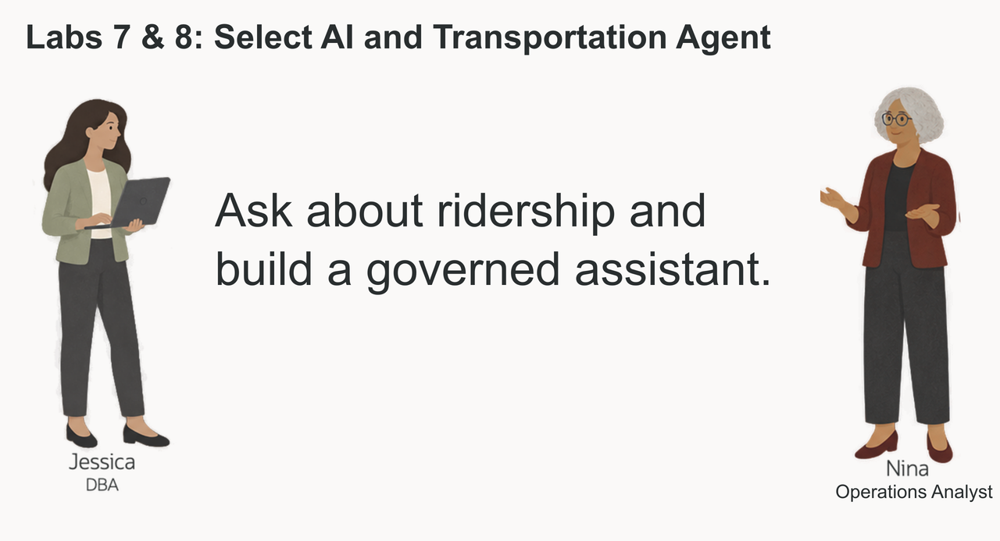
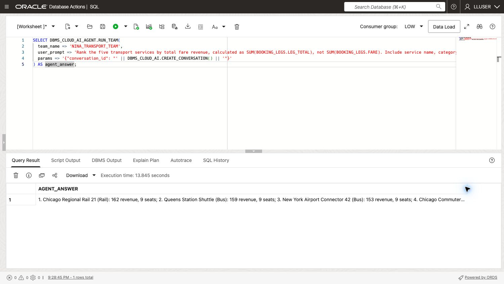
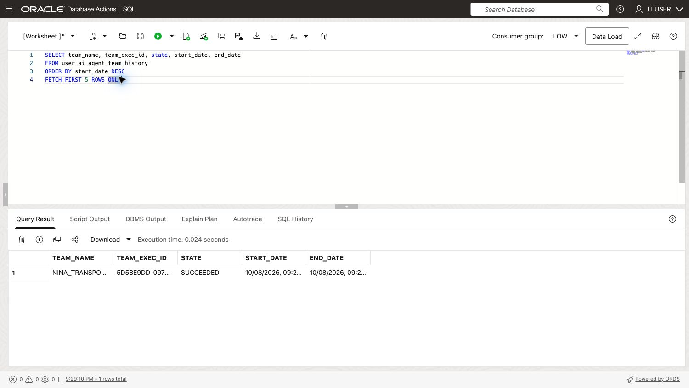
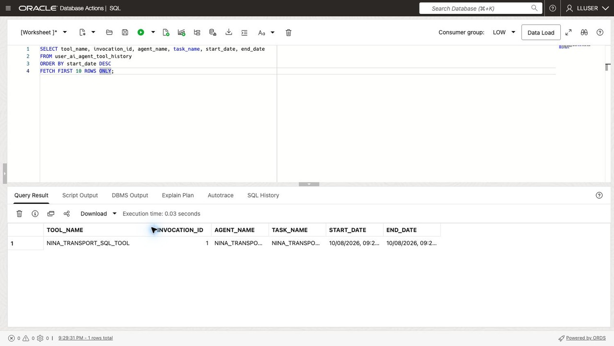

# Build a Transportation Agent with Select AI Agent

## Introduction

Nina Patel has used Select AI to inspect SQL for individual transportation questions. For her service performance review, she wants a repeatable way to request a fare ranking, check the seats booked behind it, and trace how the answer was produced.



Jessica, the DBA, approves one SQL tool for Nina's agent. The tool uses the `GENAI` profile and the transportation tables configured in the previous lab, so Nina can review the result without giving the agent broader database capabilities.

In this lab, you create the agent objects, connect the agent to the SQL tool, and run a question through the team. The agent uses the approved tool and returns an answer. The tool remains read-only, and the SQL still runs with the database user's privileges.

<details>
<summary><strong>Key terms: agent, tool, task, and team</strong></summary>

> - An **agent** is a configured role that follows instructions when it handles a request.
>
> - A **tool** is a capability the agent is allowed to call. In this lab, the tool runs SQL through the `GENAI` profile.
>
> - A **task** tells the agent what to do and which tools it may use.
>
> - A **team** connects the agent and task so an application or SQL session can run them together.

</details>

### Objectives

- Confirm that the `GENAI` profile from the previous lab is available.
- Verify which transportation tables the SQL tool may use.
- Register a read-only SQL tool for the transportation schema.
- Create an agent, task, and team with `DBMS_CLOUD_AI_AGENT`.
- Run a transportation question through the team.
- Review the agent's tool history and explain why the tool boundary matters.

Estimated Time: **15 minutes**
### Hands-on Scenario

| Step                | Transportation focus                                                                                  |
| ------------------- | ---------------------------------------------------------------------------------------------- |
| Business Problem    | Nina needs a repeatable fare and seats-booked ranking for a service performance review.                            |
| Technical Challenge | The agent must use database data through an approved capability, not unrestricted access.      |
| Persona Focus       | You follow Nina as she turns a Select AI question into a small transportation assistant.              |
| What You Will See   | An agent receives a request, calls its SQL tool, and returns a transportation answer.                 |
| Database Capability | Select AI Agent, `DBMS_CLOUD_AI_AGENT`, AI profiles, and a built-in SQL tool.                   |
| Outcome             | Nina can review the ranked services and trace the approved SQL tool used to answer her question.                |

> **Prerequisite:** Complete [Lab 7: Ask Transportation Questions with Select AI](?lab=selectai). This lab uses the `GENAI` profile and its `object_list`.

> **SQL Worksheet reminder:** For the difference between **Run Statement** and **Run Script**, return to [Getting Started Task 2: Open SQL Worksheet](?lab=getting-started#Task2:OpenSQLWorksheet).

## Task 1: Check the profile and table access

The agent's SQL tool uses the existing `GENAI` profile. The profile's `object_list` limits the tables Select AI may use when it generates SQL. Database privileges provide the second control: the SQL still runs as the current database user and cannot read tables that user cannot access.

1. Check the profile with **Run Statement**:

    ```sql
    <copy>
    SELECT profile_name,
           status
    FROM user_cloud_ai_profiles
    WHERE profile_name = 'GENAI';
    </copy>
    ```

    The `GENAI` profile should be enabled. If it is unavailable after Lab 7, ask the workshop administrator for help before continuing.

2. Check the tables listed in the profile with **Run Statement**:

    ```sql
    <copy>
    SELECT profile_name,
           attribute_name,
           attribute_value
    FROM user_cloud_ai_profile_attributes
    WHERE profile_name = 'GENAI'
      AND attribute_name = 'object_list';
    </copy>
    ```

    The list should contain only the workshop tables needed for this lab: `TRANSPORT_SERVICES`, `BOOKINGS`, `BOOKING_LEGS`, and `PASSENGERS`. The `object_list` guides SQL generation; it is not a replacement for database grants.

3. Check the agent objects already in your schema with **Run Statement**:

    ```sql
    <copy>
    SELECT agent_name,
           status
    FROM user_ai_agents
    ORDER BY agent_name;
    </copy>
    ```

  The workshop objects use names beginning with `NINA_TRANSPORT_`. If you already ran this lab, you can reuse the existing objects or run the reset block in the appendix before starting again.

## Task 2: Register the SQL tool

The SQL tool is the agent's only database capability in this lab. It uses the `GENAI` profile, so the profile's object list limits the schema metadata available for generated SQL.

1. Register the tool. This is a PL/SQL block; choose **Run Script** and run the entire block, including the `/` line:

    ```sql
    <copy>
    BEGIN
      DBMS_CLOUD_AI.SET_ATTRIBUTE(
        profile_name    => 'GENAI',
        attribute_name  => 'model',
        attribute_value => 'xai.grok-4.3'
      );

      DBMS_CLOUD_AI_AGENT.CREATE_TOOL(
        tool_name   => 'NINA_TRANSPORT_SQL_TOOL',
        attributes  => '{"tool_type": "SQL", "tool_params": {"profile_name": "genai"}}',
        description => 'Read-only SQL access to the workshop transportation tables'
      );
    END;
    /
    </copy>
    ```

    The tool does not create a second data store. It gives the agent a named, controlled way to ask Select AI to generate and run SQL against the existing transportation tables. The tool uses the profile's table list, and the database user's privileges still apply when the SQL runs.
  
2. Confirm the tool definition with **Run Statement**:

    ```sql
    <copy>
    SELECT tool_name,
           status,
           description
    FROM user_ai_agent_tools
    WHERE tool_name = 'NINA_TRANSPORT_SQL_TOOL';
    </copy>
    ```
  
## Task 3: Create Nina's agent, task, and team

The tool by itself does nothing. Nina's agent needs a role, a task needs instructions, and a team connects the two.

1. Create the agent with **Run Script**, including the `/` line at the end of the PL/SQL block:

    ```sql
    <copy>
    BEGIN
      DBMS_CLOUD_AI_AGENT.CREATE_AGENT(
        agent_name  => 'NINA_TRANSPORT_AGENT',
        attributes  => '{"profile_name": "genai", "role": "You are Nina Patel''s transportation data assistant. Answer questions using the approved SQL tool. Use database results for transport service, booking, booking leg, and passenger facts. Do not invent values."}',
        description => 'Transportation assistant for Nina Patel'
      );
    END;
    /
    </copy>
    ```

2. Create the task with **Run Script**, including the `/` line at the end of the PL/SQL block:

    ```sql
    <copy>
    BEGIN
      DBMS_CLOUD_AI_AGENT.CREATE_TASK(
        task_name  => 'NINA_TRANSPORT_TASK',
        attributes => '{"instruction": "Answer Nina''s transportation question: {query}. Use NINA_TRANSPORT_SQL_TOOL once to retrieve the required data. Return a concise answer based on the database result. Do not repeat the same tool call and do not make changes to database records.", "tools": ["NINA_TRANSPORT_SQL_TOOL"], "enable_human_tool": "false"}',
        description => 'Answer read-only service and passenger questions'
      );
    END;
    /
    </copy>
    ```
  
3. Create the team with **Run Script**, including the `/` line at the end of the PL/SQL block:

    ```sql
    <copy>
    BEGIN
      DBMS_CLOUD_AI_AGENT.CREATE_TEAM(
        team_name  => 'NINA_TRANSPORT_TEAM',
        attributes => '{"agents": [{"name": "NINA_TRANSPORT_AGENT", "task": "NINA_TRANSPORT_TASK"}], "process": "sequential"}',
        description => 'Read-only transportation question team'
      );
    END;
    /
    </copy>
    ```

    The team is the runnable unit. It connects Nina's role, the task instructions, and the SQL tool.
  
## Task 4: Run a transportation question

Database Actions does not support the `SELECT AI AGENT` command directly. Use `DBMS_CLOUD_AI_AGENT.RUN_TEAM` in SQL Worksheet and provide the team name in the function call.

1. Ask the agent with **Run Statement**:

    ```sql
    <copy>
    SELECT DBMS_CLOUD_AI_AGENT.RUN_TEAM(
             team_name   => 'NINA_TRANSPORT_TEAM',
             user_prompt => 'Rank the five transport services by total fare revenue, calculated as SUM(BOOKING_LEGS.LEG_TOTAL), not SUM(BOOKING_LEGS.FARE). Include service name, category, SUM(BOOKING_LEGS.LEG_TOTAL) as total fare revenue, and SUM(BOOKING_LEGS.SEATS) as seats booked.',
             params      => '{"conversation_id": "' || DBMS_CLOUD_AI.CREATE_CONVERSATION() || '"}'
           ) AS agent_answer;
    </copy>
    ```

    

    *Figure 1: The agent returns a five-service fare ranking from the approved SQL tool. Generated wording can vary.*
  
    Database Actions does not keep an agent conversation ID for this call, so the query creates one and passes it to `RUN_TEAM`. The ID lets Oracle record the prompt and response in the agent conversation history.

2. Review the answer.

    Look for the transport service ranking, category, fare revenue, and seats booked. The exact wording may vary because an AI provider generates the response, but the answer should be based on the transportation tables available through `GENAI`.
  
    > **Note:** This team has a read-only SQL tool. It can query the data, but the task instructions do not give it a tool for inserting, updating, or deleting records.

3. Optional challenge: ask a follow-up question that connects the highest-revenue transport service to its passengers and bookings. A more detailed request may take longer because the agent has to interpret more steps.

## Task 5: Inspect what the agent did

Before using the ranking in her performance review, Nina checks whether the agent completed the request and called Jessica's approved SQL tool.

1. Review the latest team runs with **Run Statement**:

    ```sql
    <copy>
    SELECT team_name,
         team_exec_id,
         state,
         start_date,
         end_date
    FROM user_ai_agent_team_history
    ORDER BY start_date DESC
    FETCH FIRST 5 ROWS ONLY;
    </copy>
    ```

    

    *Figure 2: Confirm that the most recent `NINA_TRANSPORT_TEAM` run has state `SUCCEEDED`.*

2. Review the latest tool calls with **Run Statement**:

    ```sql
    <copy>
    SELECT tool_name,
         invocation_id,
         agent_name,
         task_name,
         start_date,
         end_date
    FROM user_ai_agent_tool_history
    ORDER BY start_date DESC
    FETCH FIRST 10 ROWS ONLY;
    </copy>
    ```

    

    *Figure 3: The tool history records one invocation of `NINA_TRANSPORT_SQL_TOOL` for the agent run.*

  The history should show `NINA_TRANSPORT_SQL_TOOL`. This gives Nina and Jessica a database record of the agent activity instead of treating the answer as an unexplained chat response.

## Conclusion: Give the agent a controlled way to work

Nina now has a fare and seats-booked ranking that she can compare with service activity, along with a record of the tool call behind the answer. Jessica can inspect the same history and manage which tool the agent may use when Nina asks a follow-up question.

The table boundary has two parts. The profile's `object_list` tells the SQL tool which tables to consider, while database grants decide which rows the session can actually read. Both should be kept narrow when an agent is used by an application.

The example remains read-only on purpose. Before an agent is allowed to change data, the team should add a narrowly defined function tool, clear instructions, and a confirmation step for the user.

## Appendix: Reset the workshop objects

Run this block only if you want to recreate the objects used in this lab. It removes only the four names created here. Choose **Run Script** to execute the full PL/SQL block, including the `/` line.

```sql
<copy>
BEGIN
  DBMS_CLOUD_AI_AGENT.DROP_TEAM('NINA_TRANSPORT_TEAM', TRUE);
  DBMS_CLOUD_AI_AGENT.DROP_TASK('NINA_TRANSPORT_TASK', TRUE);
  DBMS_CLOUD_AI_AGENT.DROP_AGENT('NINA_TRANSPORT_AGENT', TRUE);
  DBMS_CLOUD_AI_AGENT.DROP_TOOL('NINA_TRANSPORT_SQL_TOOL', TRUE);
END;
/
</copy>
```

## Next Steps

Read the [Oracle AI Database Select AI Agent documentation](https://docs.oracle.com/en/database/oracle/oracle-database/26/selai/).

## Acknowledgements

* **Author** - Linda Foinding, Principal Database Product Manager
* **Last Updated By/Date** - Oracle Database Product Management, October 2026
