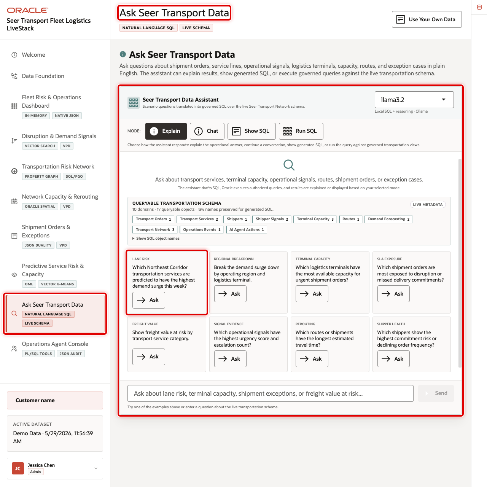
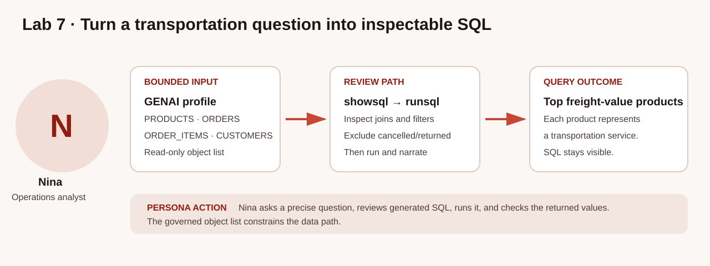

# Ask Transportation Questions with Select AI

## Introduction

Nina Patel is an operations analyst at Seer Transport. During a freight-value review, she needs a quick answer without first finding every table, column, join, and filter. Jessica, the database administrator, has configured a Select AI profile for the workshop schema. Nina can ask a transportation question in ordinary language, inspect generated SQL, and then decide how to execute it.

The production pattern is to expose a narrow, business-friendly view with useful comments rather than ask an AI service to infer meaning from a broad collection of inherited tables. This lab uses `SELECTAI_SERVICE_FREIGHT_V`: a read-only freight-value fact view whose rows already exclude cancelled and returned shipment orders. The profile's `object_list`, comments, and constraints guide NL2SQL generation. They are metadata inputs, not an access-control boundary; the current user's database privileges, VPD policies, and other database controls still govern execution.

The useful pattern is ask, inspect, run, and refine. `showsql` and `runsql` are separate generation requests. If a particular generated statement requires approval before execution, copy the SQL returned by `showsql` into the worksheet and execute that statement yourself. Do not assume a later `runsql` call executes identical SQL.

The image below shows the Ask Seer Transport Data workspace used by transportation analysts. In the Green Button environment, you will reproduce that governed rhythm with `DBMS_CLOUD_AI.GENERATE` in SQL Worksheet.





### Objectives

- Check the Select AI profile available to `LLUSER` without exposing configuration secrets.
- Configure and verify a narrow transportation metadata scope with comments and constraints enabled.
- Generate, inspect, run, and narrate a transportation question.
- Explain why generated SQL still requires human review and database authorization.

Estimated Time: **10 minutes**

### Hands-on Scenario

| Step | Transportation focus |
| --- | --- |
| Business Problem | Nina needs a fast, reviewable freight-value ranking |
| Technical Challenge | Natural language must become SQL against understandable transportation metadata |
| Persona Focus | Nina asks, inspects, and refines the question |
| What You Will See | A transportation question becomes visible SQL and database rows |
| Database Capability | Select AI, `DBMS_CLOUD_AI`, AI profiles, comments, and constraints |
| Outcome | Natural-language access stays tied to inspectable SQL and normal database enforcement |

<details>
<summary><strong>Key terms: Select AI, AI profile, and generated SQL</strong></summary>

> - **Select AI** lets a user ask a natural-language question over database metadata and data.
>
> - An **AI profile** identifies provider configuration and generation metadata. `object_list` guides NL2SQL; it does not grant, revoke, or enforce data access.
>
> - **Generated SQL** is a proposed statement. Check its objects, filters, aggregations, ordering, and row limit before relying on it.

</details>

> **SQL Worksheet reminder:** Return to [Getting Started Task 2](?lab=getting-started#Task2:OpenSQLWorksheet) if you need the SQL Worksheet steps.

## Task 1: Check the Select AI profile safely

Select AI uses an AI profile to identify a configured provider and generation settings. The Green Button schema provides the workshop-reserved `GENAI` profile. First, confirm that it is enabled.

1. List the available profiles.

    ```sql
    <copy>
    SELECT profile_name, status, description
    FROM user_cloud_ai_profiles
    ORDER BY profile_name;
    </copy>
    ```

    **Expected output: Select AI Profiles**

    | Profile Name | Status |
    | --- | --- |
    | GENAI | ENABLED |

2. Review only the learner-relevant attributes. This intentionally omits credential, compartment, endpoint, region, and other provider configuration values.

    ```sql
    <copy>
    SELECT attribute_name, attribute_value
    FROM user_cloud_ai_profile_attributes
    WHERE profile_name = 'GENAI'
      AND attribute_name IN ('provider', 'comments', 'constraints', 'object_list')
    ORDER BY attribute_name;
    </copy>
    ```

    **Expected output: Safe Profile Settings**

    | Attribute Name | Expected Pattern |
    | --- | --- |
    | comments | `true` after Task 2 |
    | constraints | `true` after Task 2 |
    | object_list | Transportation workshop view after Task 2 |
    | provider | Green Button configured provider |

The profile properties shown here are generation settings. They do not disclose credentials and do not replace database authorization.

## Task 2: Configure the transportation metadata scope

The workshop loader provides `SELECTAI_SERVICE_FREIGHT_V`, a narrow read-only view for this freight-value question. It exposes only transportation service, category, freight value, and service units, and excludes cancelled and returned orders at the view definition. Its comment describes the grain and aggregation rule. Enable comments and constraints so Select AI can use the semantic guidance available in the data dictionary, then point its generation metadata at this one view.

> **Workshop environment assumption:** `GENAI` is reserved to the single Green Button workshop schema and to Labs 7 and 8. This lab changes its `object_list`, `comments`, and `constraints` attributes and leaves that transportation configuration in place for the next lab. Do not use this procedure for a shared production profile; create a dedicated profile or save and restore its previous attributes.

1. Set the generation metadata attributes.

    ```sql
    <copy>
    BEGIN
      DBMS_CLOUD_AI.SET_ATTRIBUTE(
        profile_name    => 'genai',
        attribute_name  => 'comments',
        attribute_value => 'true'
      );

      DBMS_CLOUD_AI.SET_ATTRIBUTE(
        profile_name    => 'genai',
        attribute_name  => 'constraints',
        attribute_value => 'true'
      );

      DBMS_CLOUD_AI.SET_ATTRIBUTE(
        profile_name    => 'genai',
        attribute_name  => 'object_list',
        attribute_value => '[{"owner": "' || USER || '", "name": "SELECTAI_SERVICE_FREIGHT_V"}]'
      );
    END;
    /
    </copy>
    ```

    **Expected output: Updated Profile Attributes**

    | Script Output |
    | --- |
    | PL/SQL procedure successfully completed |

2. Confirm the three attributes used by this lab.

    ```sql
    <copy>
    SELECT attribute_name, attribute_value
    FROM user_cloud_ai_profile_attributes
    WHERE profile_name = 'GENAI'
      AND attribute_name IN ('comments', 'constraints', 'object_list')
    ORDER BY attribute_name;
    </copy>
    ```

    **Expected output: Transportation Generation Metadata**

    | Attribute | Expected Value |
    | --- | --- |
    | comments | `true` |
    | constraints | `true` |
    | object_list | `SELECTAI_SERVICE_FREIGHT_V` |

`object_list` tells the model which metadata it may use when generating SQL. It is not an "approved objects" access boundary: grants, roles, VPD, Database Vault, and other database controls remain responsible for enforcement.

## Task 3: Ask a question and inspect the SQL

Use `showsql` to generate a proposed statement without executing it. The business-friendly view means the prompt can use transportation terms directly; Nina does not have to translate a transportation service into an inherited product-table name. Look for `SELECTAI_SERVICE_FREIGHT_V`, aggregation of freight value and service units, descending freight-value order, and a five-row limit.

1. Generate the SQL.

    ```sql
    <copy>
    SELECT DBMS_CLOUD_AI.GENERATE(
             prompt       => 'Show the five transportation services with the highest freight value. Include transportation service, service category, total freight value, and service units. Order the result by total freight value from highest to lowest.',
             profile_name => 'genai',
             action       => 'showsql'
           ) AS generated_sql;
    </copy>
    ```

    **Expected output: Generated Transportation SQL**

    | Review Point | Expected Pattern |
    | --- | --- |
    | Object | `SELECTAI_SERVICE_FREIGHT_V` |
    | Measures | Transportation service, category, freight value, and service units |
    | Aggregation | Sums freight value and service units by service and category |
    | Order and limit | Freight value descending; five rows |

Read the statement. The view's definition applies the cancelled/returned exclusion; the generated query should not need to reconstruct that inherited-table logic. If the SQL is the exact statement you must approve before execution, copy it into the worksheet and run it manually.

## Task 4: Run a separately generated answer

`runsql` asks the provider to generate and execute SQL as a new request. It can return a statement that is semantically equivalent to, formatted differently from, or materially different from the earlier `showsql` result. This task demonstrates that distinction; it does not claim that `runsql` executes the exact SQL inspected in Task 3.

1. Run the question.

    ```sql
    <copy>
    SELECT DBMS_CLOUD_AI.GENERATE(
             prompt       => 'Show the five transportation services with the highest freight value. Include transportation service, service category, total freight value, and service units. Order the result by total freight value from highest to lowest.',
             profile_name => 'genai',
             action       => 'runsql'
           ) AS answer;
    </copy>
    ```

    **Expected output: Freight-Value Ranking**

    | Review Point | Expected Pattern |
    | --- | --- |
    | Result size | Five transportation services |
    | Order | Highest total freight value first |
    | Source | Only the configured freight-value view |

    The generated SQL executes as `LLUSER`; ordinary database privileges and policies apply. When exact pre-execution review is required, run the reviewed `showsql` text yourself rather than calling `runsql`.

2. Compare the generated answer with the deterministic view baseline.

    ```sql
    <copy>
    SELECT transportation_service,
           service_category,
           SUM(freight_value) AS total_freight_value,
           SUM(service_units) AS service_units
    FROM selectai_service_freight_v
    GROUP BY transportation_service, service_category
    ORDER BY total_freight_value DESC, transportation_service
    FETCH FIRST 5 ROWS ONLY;
    </copy>
    ```

    **Expected output: Validated Freight-Value Baseline**

    | Transportation Service | Category | Total Freight Value | Service Units |
    | --- | --- | ---: | ---: |
    | Heavy Equipment Recovery Bundle | Heavy Haul | 410,280.00 | 526 |
    | High-Value Load Monitoring Kit | Fleet Monitoring | 354,280.00 | 521 |
    | Empty Container Return Slot | Port Drayage | 316,160.00 | 494 |
    | Priority Recovery Dispatch | Disruption Response | 253,240.00 | 487 |
    | Railcar Spotting Request | Rail Freight | 226,200.00 | 435 |

Use this ordinary SQL result as the evidence baseline. If the answer from `runsql` differs, inspect a fresh `showsql` result and correct the prompt or execute reviewed SQL manually.

## Task 5: Refine the business question

Nina now wants a smaller review. Use transportation language, inspect the new SQL, and make the same checks: view, aggregation, order, and row limit.

1. Show the SQL for the top-three question.

    ```sql
    <copy>
    SELECT DBMS_CLOUD_AI.GENERATE(
             prompt       => 'Show the three transportation services with the highest freight value. Include transportation service, service category, total freight value, and service units. Order the result by total freight value from highest to lowest.',
             profile_name => 'genai',
             action       => 'showsql'
           ) AS generated_sql;
    </copy>
    ```

    **Expected output: Detailed Freight-Value SQL**

    | Review Point | Expected Pattern |
    | --- | --- |
    | Object | `SELECTAI_SERVICE_FREIGHT_V` |
    | Measures | Transportation service, category, freight value, and units |
    | Order and limit | Freight value descending; three rows |

2. Run the new question only if separately generated execution is acceptable for your review process.

    ```sql
    <copy>
    SELECT DBMS_CLOUD_AI.GENERATE(
             prompt       => 'Show the three transportation services with the highest freight value. Include transportation service, service category, total freight value, and service units. Order the result by total freight value from highest to lowest.',
             profile_name => 'genai',
             action       => 'runsql'
           ) AS answer;
    </copy>
    ```

    **Expected output: Top-Three Freight-Value Review**

    | Transportation Service | Category | Total Freight Value | Service Units |
    | --- | --- | ---: | ---: |
    | Heavy Equipment Recovery Bundle | Heavy Haul | 410,280.00 | 526 |
    | High-Value Load Monitoring Kit | Fleet Monitoring | 354,280.00 | 521 |
    | Empty Container Return Slot | Port Drayage | 316,160.00 | 494 |

## Task 6: Explain the result

Ask for a narrative only after checking database rows. The `narrate` action runs the question and sends its result data to the provider configured by the profile. Use it only for data approved for that provider. The database rows, not the narrative, remain Nina's evidence.

1. Narrate the top-three question.

    ```sql
    <copy>
    SELECT DBMS_CLOUD_AI.GENERATE(
             prompt       => 'For the three transportation services with the highest freight value, write exactly three bullets. Each bullet must state the service name, service category, exact numeric total freight value, and exact numeric service units returned by the query. Do not omit a number. Do not infer demand, operational cause, or an action.',
             profile_name => 'genai',
             action       => 'narrate'
           ) AS explanation;
    </copy>
    ```

    **Expected output: Provider-Generated Explanation**

    | Review Point | Expected Pattern |
    | --- | --- |
    | Explanation | Describes the same three services and reported values without unsupported demand, cause, or action claims |

2. 🎯 **Interactive challenge: Keep the review governed.**

    Ask for the top two transportation services by freight value, including category and service units. Inspect the generated SQL. Does it use `SELECTAI_SERVICE_FREIGHT_V`, aggregate the two measures, sort freight value descending, and limit the result to two rows? If exact review matters, run the inspected SQL manually.

    <details>
    <summary><strong>Challenge answer: Inspect the proposed SQL before execution</strong></summary>

    > The generated SQL should use `SELECTAI_SERVICE_FREIGHT_V`, aggregate freight value and service units by transportation service and category, order by freight value from highest to lowest, and limit the result to two rows. The result supports a review; it does not authorize a shipment, capacity, or routing change.

    ```sql
    <copy>
    SELECT DBMS_CLOUD_AI.GENERATE(
             prompt       => 'Show the two transportation services with the highest freight value. Include transportation service, service category, total freight value, and service units. Order the result by total freight value from highest to lowest.',
             profile_name => 'genai',
             action       => 'showsql'
           ) AS generated_sql;
    </copy>
    ```

    </details>

## Conclusion

Nina used a narrow transportation view, enabled semantic guidance, inspected generated SQL, and checked database rows before relying on an answer or narrative. `object_list`, comments, and constraints help generation; they do not replace privileges or other Oracle Autonomous AI Database security controls. `showsql` supports review, while `runsql` is a new generation-and-execution request.

## Next Steps

Continue with Select AI Agent to give Nina a defined role, task, and SQL tool. This workshop's `GENAI` profile retains the transportation metadata configuration for that next lab. For profile attributes and supported actions, see the [Oracle Autonomous AI Database 26ai Select AI documentation](https://docs.oracle.com/en/database/oracle/oracle-database/26/selai/).

## Acknowledgements

* **Author** - Oracle Database Product Management
* **Last Updated By/Date** - Oracle Database Product Management, September 2026
