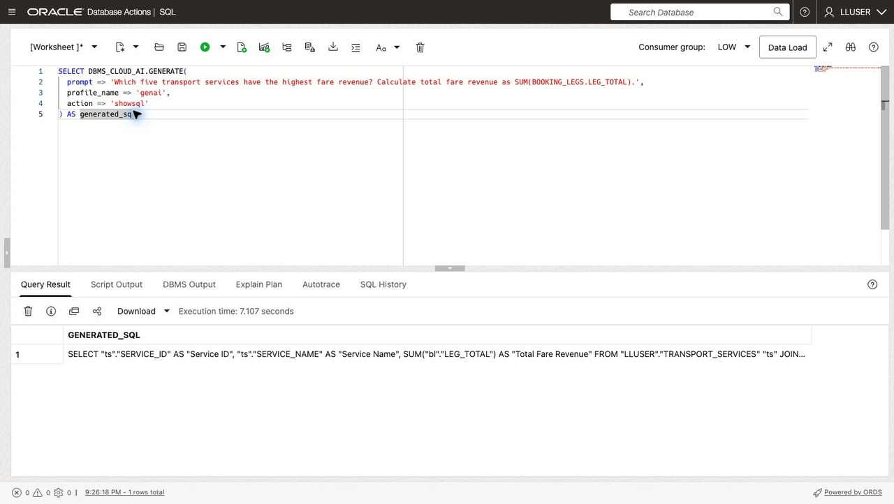
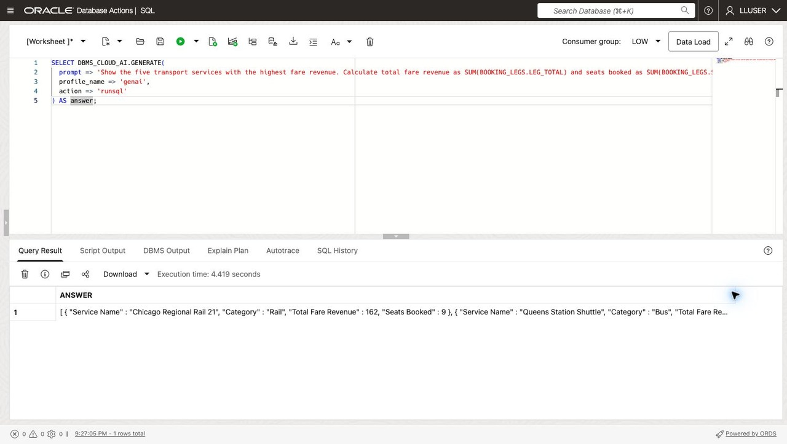

# Ask Transportation Questions with Select AI

## Introduction

Nina Patel is a service operations analyst at Seer Transport. She wants to compare fare revenue and seats booked across services before a performance review, and she needs to see how each answer was calculated.


Jessica, the DBA, has already configured a Select AI profile for the transportation schema. Nina can ask a question in ordinary language. Select AI uses the profile and the database metadata to generate SQL, run it, or explain the result.

Nina reviews the generated SQL because a plausible answer can still use the wrong fare column or leave out seats booked. She checks the joins and calculation before running the query, then refines her question until the result supports the service review.

In this lab, you check the available Select AI profile, ask a transportation question, inspect the SQL behind the answer, and improve the question for a more useful business result.


<details>
<summary><strong>Key terms: Select AI, AI profile, generated SQL, and natural-language prompt</strong></summary>

> - **Select AI** lets a user work with database information through a natural-language question.
>
> - An **AI profile** connects Select AI to an AI provider and identifies the database objects that may be used for the question.
>
> - **Generated SQL** is the SQL statement created from the question. Nina should inspect it before relying on the result.
>
> - A **natural-language prompt** is the question sent to Select AI, such as `Which five transport services have the highest fare revenue?`

</details>

### Objectives

- Check which Select AI profile is available in the schema.
- Add the transportation tables that Select AI may use to the profile.
- Generate SQL from a transportation question and inspect it.
- Run a natural-language question through `DBMS_CLOUD_AI.GENERATE`.
- Improve a question so the result contains the business details Nina needs.
- Explain why generated SQL still requires review.

Estimated Time: **10 minutes**
### Hands-on Scenario

| Step                | Transportation focus                                                                                |
| ---------------------| ----------------------------------------------------------------------------------------------|
| Business Problem    | Nina needs a fare and seats-booked ranking she can check before a service performance review.               |
| Technical Challenge | The question must be translated into SQL against the governed transportation schema.                |
| Persona Focus       | You follow Nina as she checks, reviews, and improves a Select AI question.                   |
| What You Will See   | A natural-language question becomes SQL that can be inspected and run in the database.       |
| Database Capability | Select AI, `DBMS_CLOUD_AI`, AI profiles, and natural-language-to-SQL generation.             |
| Outcome             | Nina can review the SQL behind a service ranking before using its fare and seats-booked figures. |

> **SQL Worksheet reminder:** For the difference between **Run Statement** and **Run Script**, return to [Getting Started Task 2: Open SQL Worksheet](?lab=getting-started#Task2:OpenSQLWorksheet).

## Task 1: Check the Select AI profile

Select AI uses an AI profile to identify the AI provider and the database objects available for natural-language questions. The workshop database should already contain a profile for the `LLUSER` schema.

1. Run this query with **Run Statement**:

    ```sql
    <copy>
    SELECT profile_name,
           status,
           description
    FROM user_cloud_ai_profiles
    ORDER BY profile_name;
    </copy>
    ```

    Confirm that `GENAI` is present and enabled. If it is unavailable, ask the workshop administrator for help before continuing.

2. Set the profile's AI model with **Run Script**:

    Run the entire PL/SQL block, including the `/` line, before asking transportation questions:

    ```sql
    <copy>
    BEGIN
      DBMS_CLOUD_AI.SET_ATTRIBUTE(
        profile_name    => 'GENAI',
        attribute_name  => 'model',
        attribute_value => 'xai.grok-4.3'
      );
    END;
    /
    </copy>
    ```
  
    Confirm the profile attributes with **Run Statement**:

    ```sql
    <copy>
    SELECT profile_name,
           attribute_name,
           attribute_value
    FROM user_cloud_ai_profile_attributes
    ORDER BY profile_name, attribute_name;
    </copy>
    ```

    The attributes show how the profile is configured and which database objects are available to Select AI. Do not copy credentials. In Task 2, you will change only the profile's `object_list`.

## Task 2: Add the transportation tables to the profile

The profile needs a list of tables that Select AI may use. Nina's questions require transport service, booking, booking-line, and passenger data, so Jessica adds those four tables to the `GENAI` profile.

1. Add the transportation tables to the profile. This is a PL/SQL block; choose **Run Script** and run the entire block, including the `/` line:

    ```sql
    <copy>
    BEGIN
      DBMS_CLOUD_AI.SET_ATTRIBUTE(
        profile_name    => 'genai',
        attribute_name  => 'object_list',
        attribute_value => '[{"owner": "' || USER || '", "name": "TRANSPORT_SERVICES"}, {"owner": "' || USER || '", "name": "BOOKINGS"}, {"owner": "' || USER || '", "name": "BOOKING_LEGS"}, {"owner": "' || USER || '", "name": "PASSENGERS"}]'
      );
    END;
    /
    </copy>
    ```

2. Confirm the object list with **Run Statement**:

    ```sql
    <copy>
    SELECT profile_name,
           attribute_name,
           attribute_value
    FROM user_cloud_ai_profile_attributes
    WHERE profile_name = 'GENAI'
      AND attribute_name = 'object_list';
    </copy>
    ```

    The result should list `TRANSPORT_SERVICES`, `BOOKINGS`, `BOOKING_LEGS`, and `PASSENGERS`. Select AI can now use these tables when it translates Nina's questions into SQL.
  

## Task 3: Ask a question and inspect the SQL

Nina starts with a simple question: which transport services have the highest revenue? She first asks Select AI to show the SQL without running it.

Database Actions does not support the `SELECT AI` keyword. In SQL Worksheet, use `DBMS_CLOUD_AI.GENERATE` and provide the profile name directly.

1. Run the question with the `GENAI` profile using **Run Statement**:

    ```sql
    <copy>
    SELECT DBMS_CLOUD_AI.GENERATE(
             prompt       => 'Which five transport services have the highest fare revenue? Calculate total fare revenue as SUM(BOOKING_LEGS.LEG_TOTAL).',
             profile_name => 'genai',
             action       => 'showsql'
    ) AS generated_sql;
    </copy>
    ```

    

    *Figure 1: Inspect the generated SQL before using its result. The statement should join transport services to booking legs and sum `LEG_TOTAL`.*
  

2. Read the generated SQL before running it.

    Check whether the statement uses the expected transport service and fare activity data, returns five rows, and calculates revenue in a sensible way. Select AI can generate a valid-looking statement that does not answer the question precisely, so the generated SQL is part of the result Nina reviews.

## Task 4: Run the question in the database

Nina has reviewed the SQL. She now asks Select AI to run the question and return the database result.

1. Run the same question with the `runsql` action using **Run Statement**:

    ```sql
    <copy>
    SELECT DBMS_CLOUD_AI.GENERATE(
             prompt       => 'Which five transport services have the highest fare revenue? Calculate total fare revenue as SUM(BOOKING_LEGS.LEG_TOTAL).',
             profile_name => 'genai',
             action       => 'runsql'
    ) AS answer;
    </copy>
    ```

2. Compare the answer with the SQL you inspected in Task 3.

    Select AI has generated and run SQL against the transportation schema. The query still runs under Nina's database privileges, and the result comes from the database tables rather than from a separate copy of the transportation data.

    > **Note:** Select AI can generate incorrect SQL or misunderstand a question. Use `showsql` when the exact query matters, and treat the generated answer as a starting point for review.

## Task 5: Improve the business question

Nina's first question gives her a transport service ranking, but she also needs enough detail to decide what to review. She changes the question to request the transport service category, total fare revenue, and seats booked.

1. Use `showsql` to inspect this revised prompt with **Run Statement**:

    ```sql
    <copy>
    SELECT DBMS_CLOUD_AI.GENERATE(
             prompt       => 'Show the five transport services with the highest fare revenue. Calculate total fare revenue as SUM(BOOKING_LEGS.LEG_TOTAL) and seats booked as SUM(BOOKING_LEGS.SEATS). Include service name and category.',
             profile_name => 'genai',
             action       => 'showsql'
           ) AS generated_sql;
    </copy>
    ```
  

2. Review the generated SQL, then run the revised question with `runsql` using **Run Statement**:

    ```sql
    <copy>
    SELECT DBMS_CLOUD_AI.GENERATE(
             prompt       => 'Show the five transport services with the highest fare revenue. Calculate total fare revenue as SUM(BOOKING_LEGS.LEG_TOTAL) and seats booked as SUM(BOOKING_LEGS.SEATS). Include service name and category.',
             profile_name => 'genai',
             action       => 'runsql'
           ) AS answer;
    </copy>
    ```

    

    *Figure 2: The refined question returns service names, categories, total fare revenue, and seats booked. Generated wording and row order can vary.*
  

3. Compare the first and second questions.

    The second prompt gives Nina a result she can take into a review meeting. The business user did not need to know the table names or write the joins, but Nina still checked the SQL and made the requested columns explicit.

## Task 6: Explain the result

Nina wants a short explanation of the revised result. Select AI can run the SQL and ask the AI provider to describe the returned rows.

1. Run the revised question with the `narrate` action using **Run Statement**:

    ```sql
    <copy>
    SELECT DBMS_CLOUD_AI.GENERATE(
             prompt       => 'Show the five transport services with the highest fare revenue. Calculate total fare revenue as SUM(BOOKING_LEGS.LEG_TOTAL) and seats booked as SUM(BOOKING_LEGS.SEATS). Include service name and category.',
             profile_name => 'genai',
             action       => 'narrate'
           ) AS explanation;
    </copy>
    ```
  

2. Review the explanation against the SQL result.

    The explanation is a convenience for a business user. The SQL result remains the record Nina can inspect, repeat, and use to check whether the explanation is accurate.

    > **Note:** The `narrate` action sends the query result to the AI provider configured in the profile. Use it only for data approved for that provider.

## Conclusion: Ask, Inspect, and Refine

Nina used Select AI to turn a transportation question into SQL, reviewed the generated statement, ran it in Oracle AI Database, and refined the question when the first result lacked the details she needed. Select AI reduces the amount of SQL a business user has to write, while SQL review keeps the database operation visible.

For Nina's service review, the refined question returns a fare ranking with category and seats booked rather than a bare list of names. She can inspect the generated SQL, check the tables and totals, and compare the result with the question before using it in an operations discussion.

## Next Steps

For the full list of Select AI actions, profile attributes, and supported providers, see the [Oracle AI Database 26ai Select AI documentation](https://docs.oracle.com/en/database/oracle/oracle-database/26/selai/).

## Acknowledgements

* **Author** - Linda Foinding, Principal Database Product Manager
* **Last Updated By/Date** - Oracle Database Product Management, October 2026
