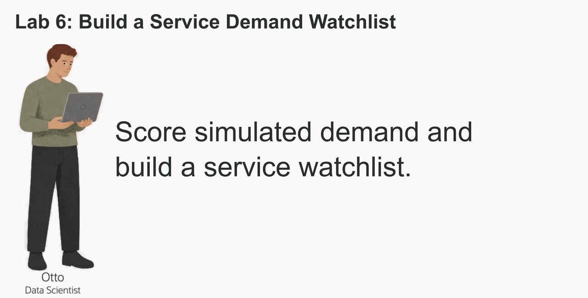
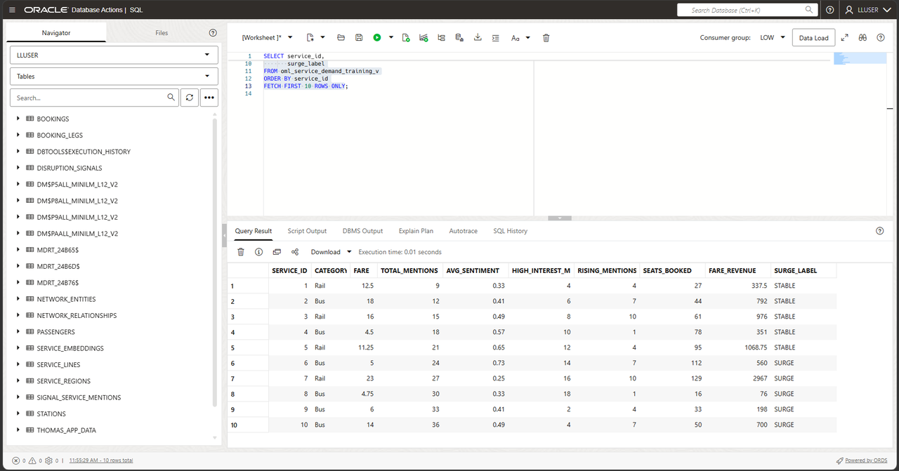
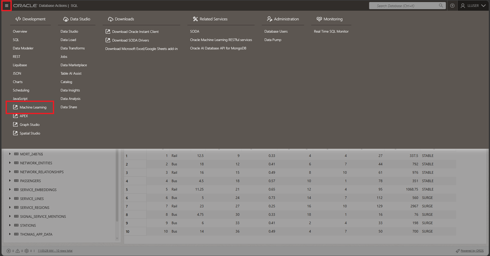
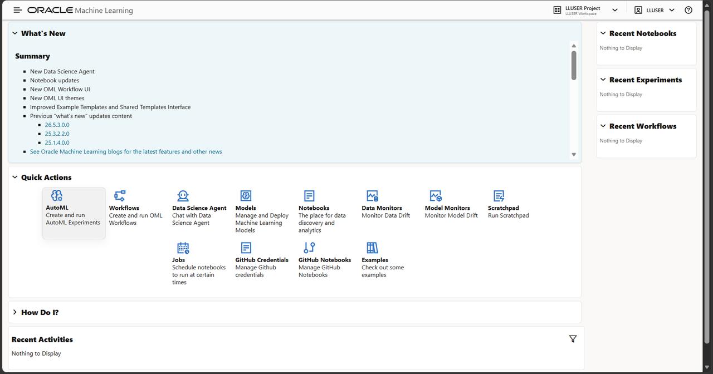
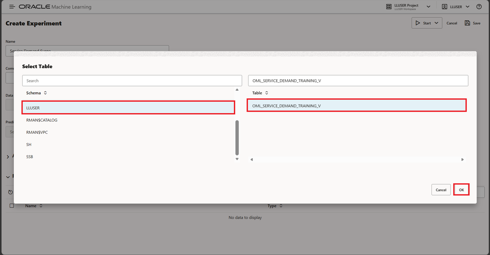
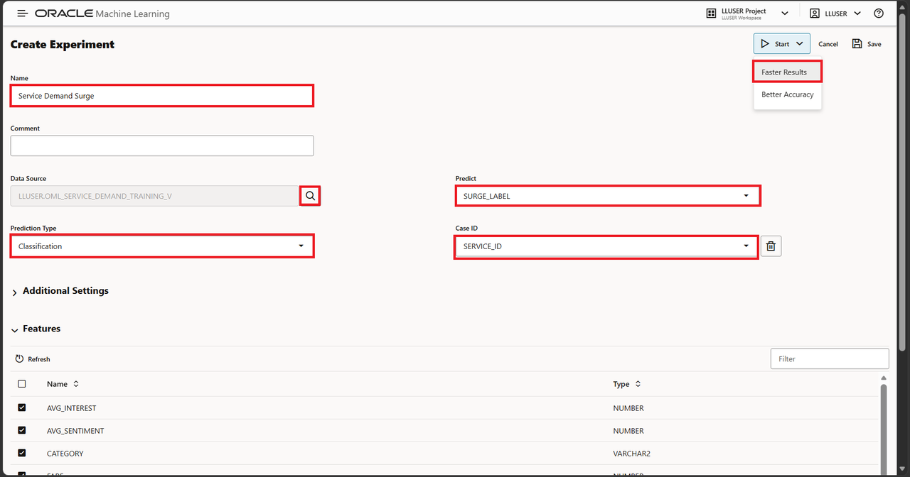
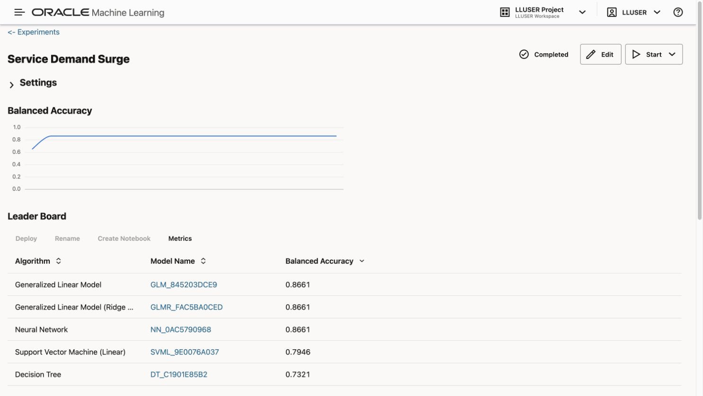
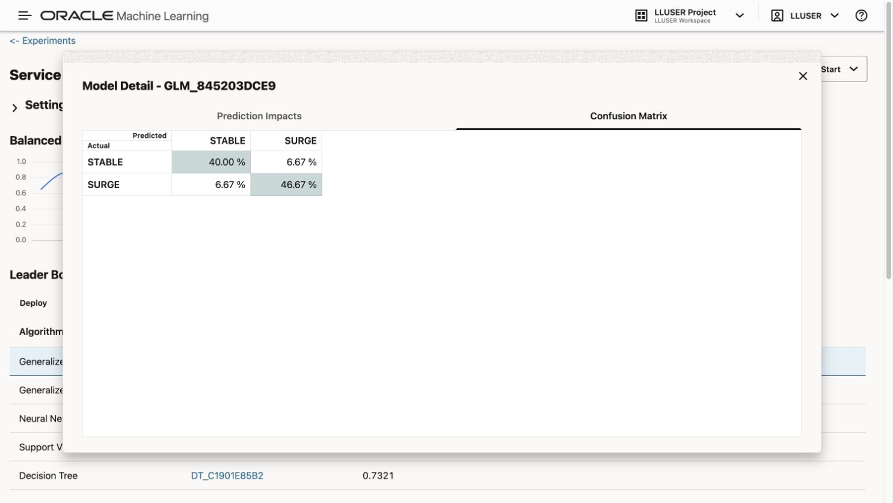
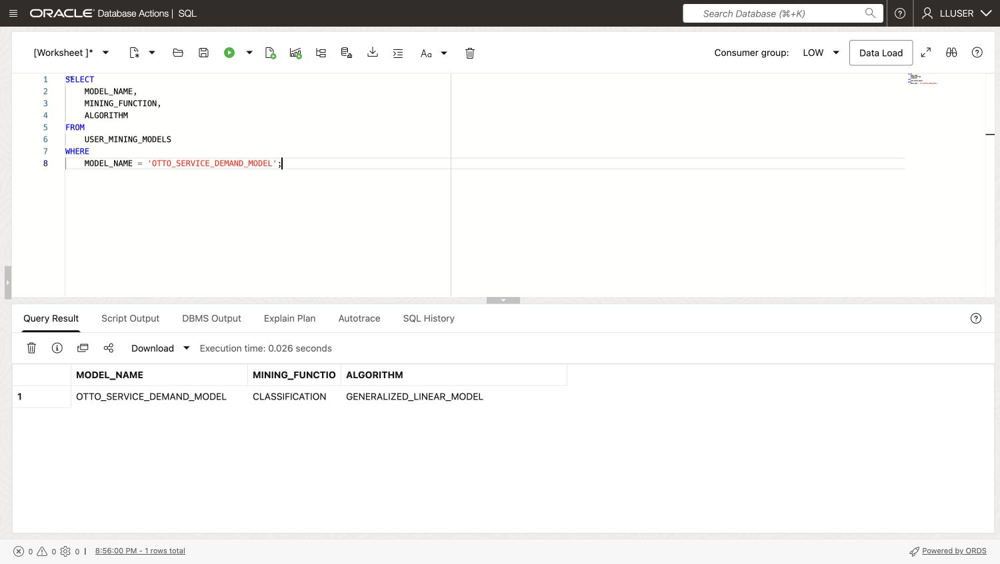
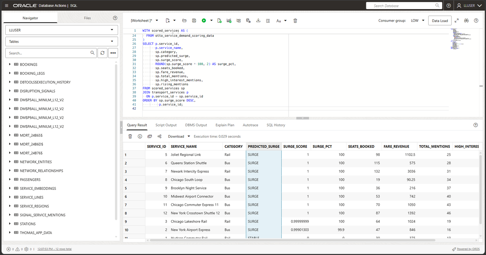

# Build a Service Demand Watchlist with Oracle Machine Learning

## Introduction

Otto Spencer is Seer Transport's data scientist. His team supplies the predictions used in analytics charts and dashboards.



The transport service team needs a demand watchlist before changing staffing or capacity plans. Otto wants reviewers to see which services the model flags, how strong each score is, and whether fare and passenger activity support a closer look.

Otto has the transport service, fare activity, and social activity data in Oracle AI Database. He could copy the data to a separate machine learning platform, train a model there, and copy the scores back. That would create another copy of transportation data and another process for keeping scores current.

Instead, Otto builds and scores the model in the database. The model uses transport service activity to classify transport services as `SURGE` or `STABLE`. SQL then joins the prediction to the transport service name, fare activity, and engagement values that a dashboard needs.

In this lab, you build Otto's demand-surge model and turn its output into a review list for a business user.


<details>
<summary><strong>Key terms: model, feature, classification, probability, and in-database machine learning</strong></summary>

> - A **model** is a set of learned rules that turns input data into a prediction.
>
> - A **feature** is an input value used by the model. In this lab, features include service category, fare, social activity, and booking activity.
>
> - **Classification** predicts a label. Otto's model predicts either `SURGE` or `STABLE`.
>
> - A **probability** is the model's value for a class. In this lab, the value is displayed as a `SURGE_SCORE` to rank transport services for review. It is not a guarantee.
>
> - **In-database machine learning** means the model is trained or scored where the source data already lives. The SQL result can include the prediction and the data used to explain it.

</details>

### Objectives

- Read the prepared training data and identify the model target.
- Optionally use AutoML to compare classification models and inspect their predictions.
- Create a Generalized Linear Model inside Oracle AI Database.
- Score transport services with `PREDICTION` and `PREDICTION_PROBABILITY`.
- Combine model output with transport service, fare activity, and engagement data for a dashboard result.

Estimated Time: **10 minutes**
### Hands-on Scenario

| Step                | Transportation focus                                                                                                        |
| ---------------------| ----------------------------------------------------------------------------------------------------------------------|
| Business Problem    | Operations needs to review likely demand surges before adjusting staffing or capacity.                                           |
| Technical Challenge | Otto needs to train and score a model without copying transport service activity to another machine learning system.           |
| Persona Focus       | You follow Otto as he builds the model and checks the result before it reaches a dashboard.                          |
| What You Will See   | Optionally compare models with AutoML, then create and score a separate Generalized Linear Model in SQL Worksheet.                  |
| Database Capability | AutoML, `DBMS_DATA_MINING`, `PREDICTION`, and `PREDICTION_PROBABILITY` support machine learning inside the database. |
| Outcome             | A watchlist for a dashboard combines the model result with the transport service and activity data behind it.                  |

> **SQL Worksheet reminder:** For the difference between **Run Statement** and **Run Script**, return to [Getting Started Task 2: Open SQL Worksheet](?lab=getting-started#Task2:OpenSQLWorksheet).

## Task 1: Read the training data

Before training, inspect `OML_SERVICE_DEMAND_TRAINING_V`. It generates one synthetic example per service, including social activity, seats booked, fare revenue, and a `SURGE_LABEL`. These values demonstrate the training process; they are not measured historical demand.

The view also contains `SURGE_LABEL`. This is the known label used during training. The demo data assigns each transport service `SURGE` or `STABLE` from its activity values so the SQL pattern can be tested without waiting for new business outcomes.

1. Run the training-data query with **Run Statement**:

    ```sql
    <copy>
    SELECT service_id,
           category,
           fare,
           total_mentions,
           avg_sentiment,
           high_interest_mentions,
           rising_mentions,
           seats_booked,
           fare_revenue,
           surge_label
    FROM oml_service_demand_training_v
    ORDER BY service_id
    FETCH FIRST 10 ROWS ONLY;
    </copy>
    ```

    

2. Identify the parts of each row.

    The numeric and categorical columns are model inputs. `SERVICE_ID` identifies each example. The loader assigns `SURGE_LABEL` as `SURGE` when total mentions are at least 30 or high-interest mentions are at least 14; otherwise, it assigns `STABLE`. The model learns this synthetic labeling rule rather than a validated pattern of future demand.

    Otto is checking that the training data already brings together the values he needs. He does not have to export social activity, fare activity, and transport service data into separate files before training.

## Task 2: Compare models with AutoML (optional)

Otto first uses the Oracle Machine Learning AutoML interface to compare candidate models. AutoML can select algorithms, tune them, and show how well each model identifies the two labels.

This shows how a data scientist chooses a model: the leaderboard is a starting point, but Otto also checks whether the model identifies the business outcome he cares about.

This task is optional. AutoML can take several minutes to complete, so you can continue with Task 3 if you want to focus on creating and using the model in SQL Worksheet.

1. In Database Actions, open the main navigation menu and select **Machine Learning** under Development.

    

    **Note:** If a sign-in page appears, use the workshop `LLUSER` login and password shown on the reservation's **View Login Info** screen.

2. On the Oracle Machine Learning home page, select **AutoML** under **Quick Actions**.

    

    *Figure 2: Select AutoML to open the experiment list.*

3. On the **AutoML Experiments** page, select **Create**. Set up the experiment with these values:

    | Setting         | Value                   |
    | -----------------| -------------------------|
    | Experiment name | `Service Demand Surge`  |
    | Data source     | `LLUSER.OML_SERVICE_DEMAND_TRAINING_V` |
    | Predict         | `SURGE_LABEL`           |
    | Prediction type | `Classification`        |
    | Case ID         | `SERVICE_ID`            |

    **Note:** To choose the data source, select the search icon beside **Data Source**. In the **Select Table** dialog, select schema `LLUSER`; wait for its table list to load, select `OML_SERVICE_DEMAND_TRAINING_V`, and select **OK**.

    

    Select `SURGE_LABEL` in **Predict**; the interface fills **Prediction Type** as **Classification**. Select `SERVICE_ID` in **Case ID**. Confirm all values match the form below, select **Start**, then choose **Faster Results**. Allow several minutes and wait until the experiment status is **Completed**.
  
    

    *Figure 3: Choose the training view, prediction target, and case ID before starting AutoML.*

4. In **Leader Board**, review the algorithms and their metrics. Select the blue model name in the **Generalized Linear Model** row to open **Model Detail**, then select **Confusion Matrix**.

    

    *Figure 4: Compare candidate models after the experiment reaches Completed.*

    

    *Figure 5: Inspect both classes in the confusion matrix before using the model.*

  
    Scores can vary between runs. Otto does not choose from balanced accuracy alone. Open model details and inspect the confusion matrix.

    Check the confusion matrix for both `SURGE` and `STABLE`. A model that predicts only one class cannot help Otto prioritize a demand watchlist. Review prediction impact to see which inputs influenced the result; impact does not prove that one input causes demand.

    Select the Generalized Linear Model for the SQL exercise in Task 3. Compare its behavior with the AutoML candidates before using any model for an operational decision.

5. Return to the SQL Worksheet tab to continue. The AutoML experiment is an optional comparison; Task 3 trains a separate Generalized Linear Model in SQL; it does not import the AutoML model.

## Task 3: Create a model in SQL Worksheet

The optional AutoML task compares candidate models. Now create `OTTO_SERVICE_DEMAND_MODEL` in SQL Worksheet so later queries can call it by name.

The settings table selects the **Generalized Linear Model** algorithm for this SQL exercise. `PREP_AUTO` enables automatic data preparation. These settings do not reproduce all settings from an AutoML candidate.

You can complete this task without running the optional AutoML experiment.

1. Create the settings table and train the model. This code box contains multiple SQL and PL/SQL statements; choose **Run Script** to run the full block, including the `/` lines:

    ```sql
    <copy>
    
    DROP TABLE IF EXISTS otto_service_demand_settings;
    
    CREATE TABLE otto_service_demand_settings (
          setting_name  VARCHAR2(30),
          setting_value VARCHAR2(4000)
        );

    INSERT INTO otto_service_demand_settings (setting_name, setting_value)
    VALUES ('ALGO_NAME', 'ALGO_GENERALIZED_LINEAR_MODEL');

    INSERT INTO otto_service_demand_settings (setting_name, setting_value)
    VALUES ('PREP_AUTO', 'ON');

    INSERT INTO otto_service_demand_settings (setting_name, setting_value)
    VALUES ('ODMS_RANDOM_SEED', '20260604');

    COMMIT;

    DECLARE
      l_model_count NUMBER;
    BEGIN
      SELECT COUNT(*)
      INTO l_model_count
      FROM user_mining_models
      WHERE model_name = 'OTTO_SERVICE_DEMAND_MODEL';

      IF l_model_count > 0 THEN
        DBMS_DATA_MINING.DROP_MODEL('OTTO_SERVICE_DEMAND_MODEL');
      END IF;
    END;
    /

    BEGIN
      DBMS_DATA_MINING.CREATE_MODEL(
        model_name           => 'OTTO_SERVICE_DEMAND_MODEL',
        mining_function      => DBMS_DATA_MINING.CLASSIFICATION,
        data_table_name      => 'OML_SERVICE_DEMAND_TRAINING_V',
        case_id_column_name  => 'SERVICE_ID',
        target_column_name   => 'SURGE_LABEL',
        settings_table_name  => 'OTTO_SERVICE_DEMAND_SETTINGS'
      );
    END;
    /
    </copy>
    ```

    The model reads the training view, learns the relationship between the features and `SURGE_LABEL`, and stores the trained model in the database. No transport service or social data leaves Oracle Database during training.

2. Confirm that Oracle created the model with **Run Statement**:

    ```sql
    <copy>
    SELECT model_name,
           mining_function,
           algorithm
    FROM user_mining_models
    WHERE model_name = 'OTTO_SERVICE_DEMAND_MODEL';
    </copy>
    ```

    

    *Figure 6: The named model is a Generalized Linear Model available to SQL.*

    The result should show `CLASSIFICATION` and `GENERALIZED_LINEAR_MODEL`. Otto now has a database model that SQL can call.

## Task 4: Score new transport service activity in SQL

Create an illustrative next-period snapshot by modifying the first 12 training examples and storing them in a separate scoring table. The inputs differ from the original rows, but they are derived from the training data. This demonstrates scoring; it is not a test on independently collected future observations.

1. Create the scoring table and add the simulated activity snapshot. This code box contains several SQL statements; choose **Run Script** to run the full block.

    ```sql
    <copy>
    
    DROP TABLE IF EXISTS otto_service_demand_scoring_data;

    CREATE TABLE otto_service_demand_scoring_data (
      service_id    NUMBER,
      category      VARCHAR2(100),
      fare    NUMBER,
      total_mentions   NUMBER,
      avg_sentiment NUMBER,
      total_reactions   NUMBER,
      total_reshares  NUMBER,
      total_views   NUMBER,
      avg_interest  NUMBER,
      high_interest_mentions   NUMBER,
      rising_mentions  NUMBER,
      seats_booked    NUMBER,
      fare_revenue       NUMBER
    );

    INSERT INTO otto_service_demand_scoring_data (
      service_id,
      category,
      fare,
      total_mentions,
      avg_sentiment,
      total_reactions,
      total_reshares,
      total_views,
      avg_interest,
      high_interest_mentions,
      rising_mentions,
      seats_booked,
      fare_revenue
    )
    SELECT service_id,
           category,
           fare,
           total_mentions + 4,
           avg_sentiment,
           total_reactions + 25,
           total_reshares + 10,
           total_views + 500,
           avg_interest + 0.05,
           high_interest_mentions + 1,
           rising_mentions + 1,
           seats_booked + 3,
           fare_revenue + (fare * 3)
    FROM (
      SELECT service_id,
             category,
             fare,
             total_mentions,
             avg_sentiment,
             total_reactions,
             total_reshares,
             total_views,
             avg_interest,
             high_interest_mentions,
             rising_mentions,
             seats_booked,
             fare_revenue,
             ROW_NUMBER() OVER (ORDER BY service_id) AS row_num
      FROM oml_service_demand_training_v
    )
    WHERE row_num <= 12;

    COMMIT;
    </copy>
    ```

    This creates a small next-period snapshot from the workshop data. 
    >Note: The scoring table contains the model inputs without `SURGE_LABEL`, the target used during training.

2. Run the scoring query with **Run Statement**:

    ```sql
    <copy>
    WITH scored_services AS (
      SELECT service_id,
             category,
             seats_booked,
             fare_revenue,
             total_mentions,
             high_interest_mentions,
             rising_mentions,
             PREDICTION(
               OTTO_SERVICE_DEMAND_MODEL USING
               category, fare, total_mentions, avg_sentiment,
               total_reactions, total_reshares, total_views, avg_interest,
               high_interest_mentions, rising_mentions, seats_booked, fare_revenue
             ) AS predicted_surge,
             ROUND(
               PREDICTION_PROBABILITY(
                 OTTO_SERVICE_DEMAND_MODEL,
                 'SURGE' USING
                 category, fare, total_mentions, avg_sentiment,
                 total_reactions, total_reshares, total_views, avg_interest,
                 high_interest_mentions, rising_mentions, seats_booked, fare_revenue
               ), 8
             ) AS surge_score
      FROM otto_service_demand_scoring_data
    )
    SELECT p.service_id,
           p.service_name,
           sp.category,
           sp.predicted_surge,
           sp.surge_score,
           ROUND(sp.surge_score * 100, 2) AS surge_pct,
           sp.seats_booked,
           sp.fare_revenue,
           sp.total_mentions,
           sp.high_interest_mentions,
           sp.rising_mentions
    FROM scored_services sp
    JOIN transport_services p
      ON p.service_id = sp.service_id
    ORDER BY sp.surge_score DESC,
             p.service_id;
    </copy>
    ```

    

3. Read the result as a dashboard user.

    `PREDICTED_SURGE` is the predicted class. `SURGE_SCORE` is the probability assigned specifically to `SURGE`, even when the predicted class is `STABLE`. `SURGE_PCT` expresses that probability as a percentage. Review seats booked, fare revenue, and social activity alongside each score.

    Otto can give operations a review list that pairs each prediction with the service name, fare activity, and social activity used to assess it. The score helps prioritize attention; the supporting values help a person decide whether that priority makes sense.

## Conclusion: Put the Prediction Beside the Business Data

Otto trained a Generalized Linear Model in SQL and scored a simulated activity snapshot. If you completed the optional AutoML task, you also compared candidate models. The final query combines predictions with service and activity details for a watchlist.

Training and scoring run in Oracle AI Database, so SQL can return model scores beside the input data. Before using a demand model for staffing or capacity decisions, evaluate it on separate, representative observations.

## Acknowledgements

* **Author** - Linda Foinding, Principal Database Product Manager
* **Contributor** - Teodor Constantin Nechita
* **Last Updated By/Date** - Teodor Constantin Nechita, October 2026
