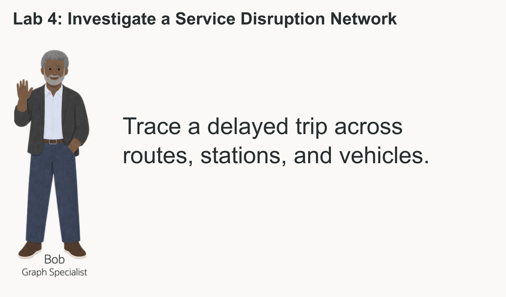
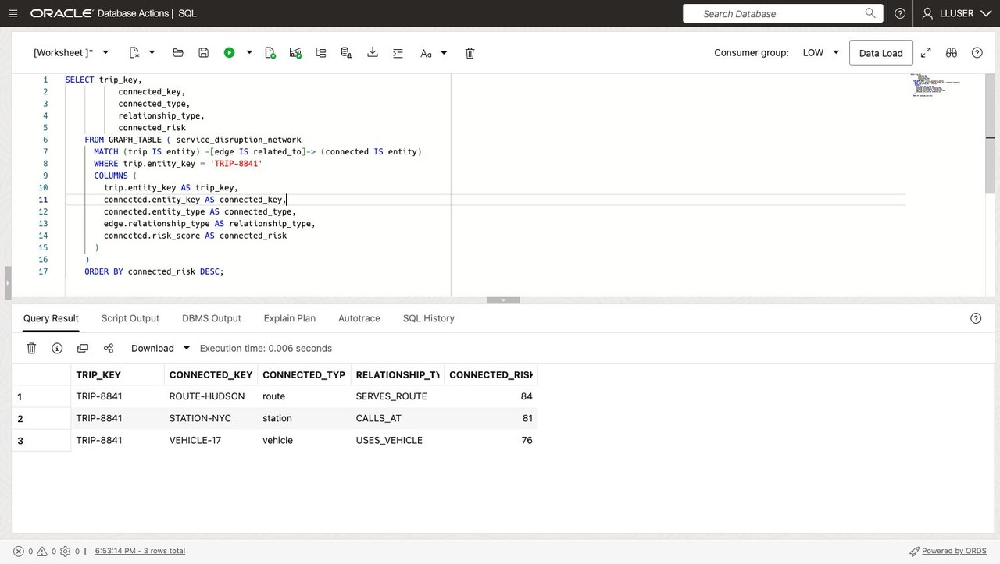
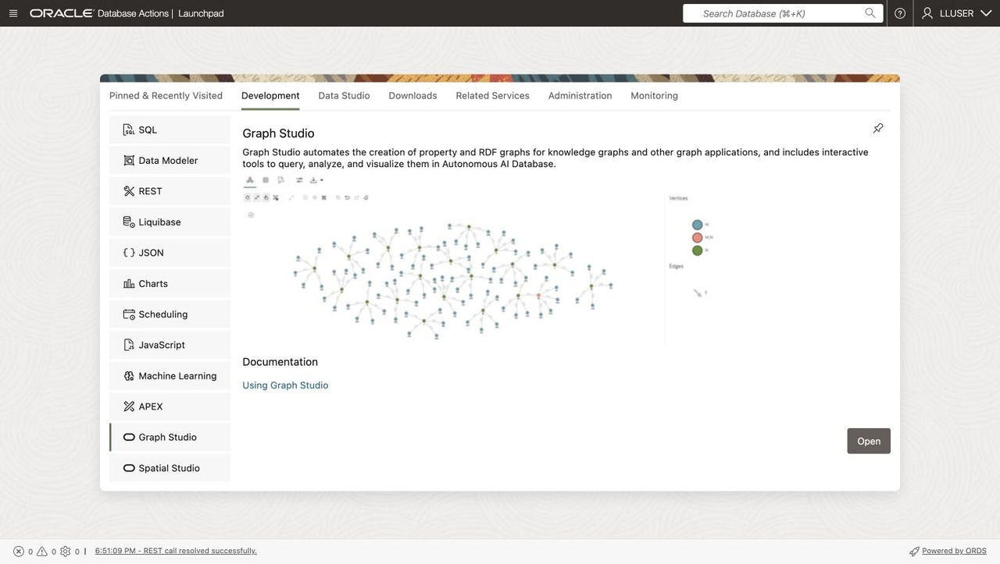
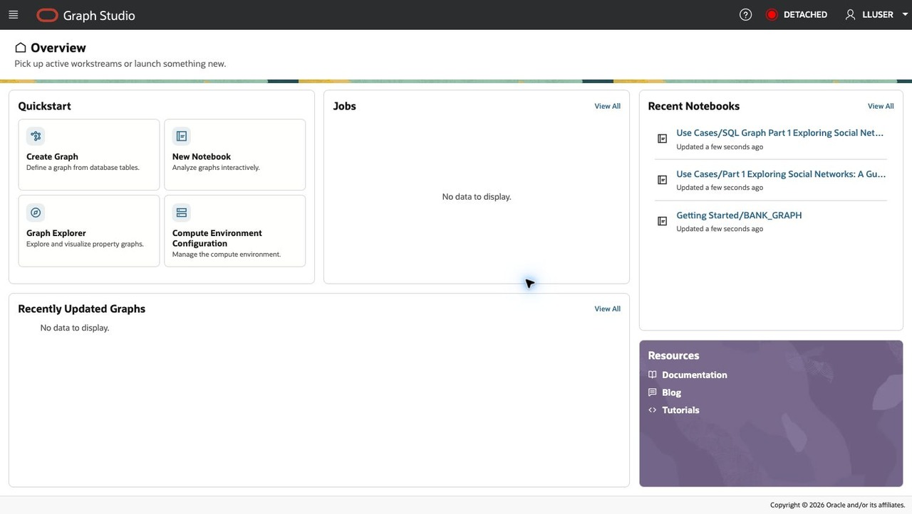
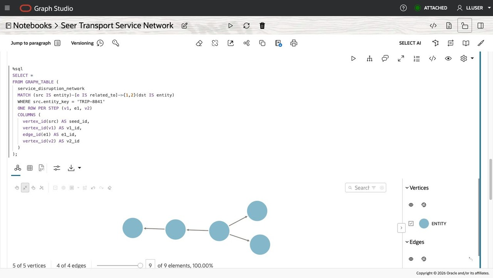

# Investigate a Service Disruption Network

## Introduction

Bob Green is Seer Transport's graph specialist. A delayed trip can affect more than its passengers: the vehicle may serve another trip, several trips may share a station, and a route may connect the disruption to a wider service region. Bob needs to show those relationships so dispatchers can decide what to protect first.



A property graph gives Bob a direct way to ask how a trip, route, station, vehicle, and disruption case are connected. The source records remain relational tables. SQL/PGQ expresses the path, while Graph Studio lets the team inspect the same network visually.

<details>
<summary><strong>Key terms: vertex, edge, and hop</strong></summary>

> - A **vertex** represents a trip, route, station, vehicle, or case in `NETWORK_ENTITIES`.
> - An **edge** is a relationship in `NETWORK_RELATIONSHIPS`, such as a trip serving a route or using a vehicle.
> - A **hop** is one edge. A trip to its vehicle is one hop; that trip through the vehicle to another trip is two hops.
> - **SQL/PGQ** describes graph patterns in SQL and returns ordinary query results.

</details>

### Objectives

- Compare relational joins with a graph pattern for connected service records.
- Follow one to four relationship hops from a disrupted trip.
- Find trip pairs that share a station or vehicle.
- Import and run a Graph Studio notebook over the same property graph.
- Explain the service decision supported by the graph result.

Estimated Time: **10 minutes**

### Hands-on Scenario

| Step | Transportation focus |
| --- | --- |
| Business Problem | Dispatchers need to see which trips and assets are connected to a disruption. |
| Technical Challenge | The number of joins grows with each relationship hop. |
| Persona Focus | Bob turns the relationship evidence into a repeatable SQL result and a visual network. |
| Database Capability | `SERVICE_DISRUPTION_NETWORK` and `GRAPH_TABLE` support SQL/PGQ traversal. |
| Outcome | Operations can review connected trips, shared assets, and risk scores before choosing a recovery action. |

> **SQL Worksheet reminder:** For the difference between **Run Statement** and **Run Script**, return to [Getting Started Task 2: Open SQL Worksheet](?lab=getting-started#Task2:OpenSQLWorksheet).

## Task 1: Follow a disrupted trip with SQL

Start with trip `TRIP-8841`. The relational query joins the entity table twice to find its direct neighbors.

1. Run the query with **Run Statement**:

    ```sql
    <copy>
    SELECT trip.entity_key AS trip_key,
           connected.entity_key AS connected_key,
           connected.entity_type AS connected_type,
           rel.relationship_type,
           connected.risk_score AS connected_risk
    FROM network_entities trip
    JOIN network_relationships rel
      ON rel.from_entity = trip.entity_id
    JOIN network_entities connected
      ON connected.entity_id = rel.to_entity
    WHERE trip.entity_key = 'TRIP-8841'
    ORDER BY connected_risk DESC;
    </copy>
    ```

2. Extend the relational query to follow one through four hops, then choose **Run Statement**:

    ```sql
    <copy>
    SELECT trip_key, connected_key, connected_type,
           relationship_path, connected_risk
    FROM (
      SELECT seed.entity_key AS trip_key,
             reached.entity_key AS connected_key,
             reached.entity_type AS connected_type,
             r1.relationship_type AS relationship_path,
             reached.risk_score AS connected_risk
      FROM network_entities seed
      JOIN network_relationships r1
        ON r1.from_entity = seed.entity_id
      JOIN network_entities reached
        ON reached.entity_id = r1.to_entity
      WHERE seed.entity_key = 'TRIP-8841'

      UNION

      SELECT seed.entity_key,
             reached.entity_key,
             reached.entity_type,
             r1.relationship_type || ' -> ' || r2.relationship_type,
             reached.risk_score
      FROM network_entities seed
      JOIN network_relationships r1
        ON r1.from_entity = seed.entity_id
      JOIN network_entities v1
        ON v1.entity_id = r1.to_entity
      JOIN network_relationships r2
        ON r2.from_entity = v1.entity_id
      JOIN network_entities reached
        ON reached.entity_id = r2.to_entity
      WHERE seed.entity_key = 'TRIP-8841'

      UNION

      SELECT seed.entity_key,
             reached.entity_key,
             reached.entity_type,
             r1.relationship_type || ' -> ' ||
               r2.relationship_type || ' -> ' ||
               r3.relationship_type,
             reached.risk_score
      FROM network_entities seed
      JOIN network_relationships r1
        ON r1.from_entity = seed.entity_id
      JOIN network_entities v1
        ON v1.entity_id = r1.to_entity
      JOIN network_relationships r2
        ON r2.from_entity = v1.entity_id
      JOIN network_entities v2
        ON v2.entity_id = r2.to_entity
      JOIN network_relationships r3
        ON r3.from_entity = v2.entity_id
      JOIN network_entities reached
        ON reached.entity_id = r3.to_entity
      WHERE seed.entity_key = 'TRIP-8841'

      UNION

      SELECT seed.entity_key,
             reached.entity_key,
             reached.entity_type,
             r1.relationship_type || ' -> ' ||
               r2.relationship_type || ' -> ' ||
               r3.relationship_type || ' -> ' ||
               r4.relationship_type,
             reached.risk_score
      FROM network_entities seed
      JOIN network_relationships r1
        ON r1.from_entity = seed.entity_id
      JOIN network_entities v1
        ON v1.entity_id = r1.to_entity
      JOIN network_relationships r2
        ON r2.from_entity = v1.entity_id
      JOIN network_entities v2
        ON v2.entity_id = r2.to_entity
      JOIN network_relationships r3
        ON r3.from_entity = v2.entity_id
      JOIN network_entities v3
        ON v3.entity_id = r3.to_entity
      JOIN network_relationships r4
        ON r4.from_entity = v3.entity_id
      JOIN network_entities reached
        ON reached.entity_id = r4.to_entity
      WHERE seed.entity_key = 'TRIP-8841'
    ) paths
    ORDER BY connected_risk DESC;
    </copy>
    ```

3. Compare the query branches. Each additional hop needs another relationship join and entity join. `UNION` combines the path lengths and removes duplicate rows. Bob will express the same range more directly with SQL/PGQ in Task 3.

## Task 2: Read the same connections as a graph

Bob has already defined `SERVICE_DISRUPTION_NETWORK` over the relational entity and relationship tables. The graph labels are `entity` for vertices and `related_to` for edges.

1. Run the equivalent SQL/PGQ query with **Run Statement**:

    ```sql
    <copy>
    SELECT trip_key,
           connected_key,
           connected_type,
           relationship_type,
           connected_risk
    FROM GRAPH_TABLE ( service_disruption_network
      MATCH (trip IS entity) -[edge IS related_to]-> (connected IS entity)
      WHERE trip.entity_key = 'TRIP-8841'
      COLUMNS (
        trip.entity_key AS trip_key,
        connected.entity_key AS connected_key,
        connected.entity_type AS connected_type,
        edge.relationship_type AS relationship_type,
        connected.risk_score AS connected_risk
      )
    )
    ORDER BY connected_risk DESC;
    </copy>
    ```

    

    *Figure 1: Run the graph pattern in SQL Worksheet and compare its rows with the relational query.*

2. Compare the direct connections with Task 1. The result has the same business meaning. The graph pattern states which edge to follow without repeating the table joins.

## Task 3: Trace four-hop service impact

A route or vehicle can connect the starting trip to other trips several steps away. Follow one to four directed edges from `TRIP-8841` and rank the reached entities by risk.

1. Run the traversal with **Run Statement**:

    ```sql
    <copy>
    SELECT DISTINCT entity_key,
           display_name,
           entity_type,
           relationship_hops,
           risk_score,
           risk_level,
           affected_capacity,
           channel
    FROM GRAPH_TABLE ( service_disruption_network
      MATCH (seed IS entity) -[e IS related_to]->{1,4} (reached IS entity)
      WHERE seed.entity_key = 'TRIP-8841'
      COLUMNS (
        reached.entity_key AS entity_key,
        reached.display_name AS display_name,
        reached.entity_type AS entity_type,
        COUNT(e.relationship_type) AS relationship_hops,
        reached.risk_score AS risk_score,
        reached.risk_level AS risk_level,
        reached.affected_capacity AS affected_capacity,
        reached.channel AS channel
      )
    )
    ORDER BY risk_score DESC
    FETCH FIRST 25 ROWS ONLY;
    </copy>
    ```

2. Use `RELATIONSHIP_HOPS` to distinguish a direct link from a wider network effect. A high risk score points to an entity worth checking; it does not, by itself, prove that another trip is delayed. Review the path and operational evidence before acting.

## Task 4: Find trips that share an asset

Two trips can be affected by the same station or vehicle even when neither directly links to the other. Bob looks for trip pairs that converge on one shared entity.

1. Run the shared-asset query with **Run Statement**:

    ```sql
    <copy>
    SELECT trip_a, shared_entity, shared_type, trip_b,
           a_risk, b_risk,
           ROUND((a_risk + b_risk) / 2, 1) AS combined_risk
    FROM GRAPH_TABLE ( service_disruption_network
      MATCH (a IS entity)
            -[e1 IS related_to]-> (shared IS entity)
            <-[e2 IS related_to]- (b IS entity)
      WHERE a.entity_type = 'trip'
        AND b.entity_type = 'trip'
        AND a.entity_id < b.entity_id
        AND shared.entity_type IN ('station', 'vehicle')
        AND (a.risk_score >= 70 OR b.risk_score >= 70)
      COLUMNS (
        a.entity_key AS trip_a,
        shared.entity_key AS shared_entity,
        shared.entity_type AS shared_type,
        b.entity_key AS trip_b,
        a.risk_score AS a_risk,
        b.risk_score AS b_risk
      )
    )
    ORDER BY combined_risk DESC, shared_entity
    FETCH FIRST 25 ROWS ONLY;
    </copy>
    ```

2. Review the asset linking each pair. Dispatchers can check whether the shared vehicle needs reassignment or whether station capacity is constraining both trips.

## Task 5: Open Graph Studio and import the notebook

1. In Database Actions, select **Development**, select **Graph Studio**, then select **Open**. Keep your SQL Worksheet tab available for comparison. If a separate sign-in page appears, sign in as `LLUSER` with the reservation password from **View Login Info**.

    

    *Figure 2: Select Graph Studio from the Database Actions Development launchpad.*

2. On the Graph Studio **Overview** page, open the top-left navigation menu and select **Notebooks** under **Graph Tools**. The **New Notebook** tile creates a blank notebook; use **Notebooks** to import the supplied file.

    

    *Figure 3: Open Notebooks from the Graph Studio Overview navigation menu.*

3. Download [Seer Transport service network notebook](files/seer-transport-service-network.dsnb) to your computer.

4. On the **Notebooks** page, select **Import** at the top right. In the **Import notebook(s)** dialog, select the drop area and choose the downloaded `.dsnb` file. Confirm that `seer-transport-service-network.dsnb` appears under **Selected files**, select **Import**, and wait for the notebook to appear in the list.

5. Select **Seer Transport Service Network** to open it. Confirm the notebook title in the breadcrumb at the top of the page.

## Task 6: Compare the visual network with SQL

1. Wait until the status at the top right changes from **DETACHED** or **ATTACHING** to **ATTACHED**. Then select **Run Paragraphs** (the triangle beside the notebook title) and **Confirm** to run the supplied paragraphs in order. You can instead select the triangle **Run Paragraph** control on each SQL paragraph and wait for its result before proceeding. The first SQL result is a table of four reached entities; the second shows five vertices and four edges; the third table lists four trip pairs that share an asset. These controls are separate from **Run Statement** and **Run Script** in SQL Worksheet.

    

    *Figure 4: The graph paragraph returns five vertices and four edges from `TRIP-8841`; the vertex layout may change.*

2. Select a connected vertex and inspect its type and risk score. Follow the edges back to the starting trip. Compare the keys and relationships with the SQL Worksheet results from Tasks 2 through 4.

    > **Generated result note:** Graph layout and node positions can change between runs. Use entity keys and relationship properties as the evidence.

## Conclusion: Turn Connections into a Recovery Decision

Bob can start with a disrupted trip, find directly connected assets, trace wider service impact, and identify trips that share a station or vehicle. SQL/PGQ keeps the investigation readable as the path grows. Graph Studio shows the same relationships so dispatchers can explain why a route, asset, or trip needs attention.

## Appendix: Property graph definition

The following definition shows how the relational tables become graph vertices and edges. The workshop environment provides the graph before this lab.

```sql
<copy>
CREATE PROPERTY GRAPH service_disruption_network
  VERTEX TABLES (
    network_entities KEY (entity_id)
      LABEL entity
      PROPERTIES (
        entity_id, entity_key, display_name, entity_type,
        risk_score, risk_level, affected_capacity, channel
      )
  )
  EDGE TABLES (
    network_relationships KEY (relationship_id)
      SOURCE KEY (from_entity) REFERENCES network_entities (entity_id)
      DESTINATION KEY (to_entity) REFERENCES network_entities (entity_id)
      LABEL related_to
      PROPERTIES (relationship_type)
  );
</copy>
```

## Acknowledgements

* **Author** - Linda Foinding, Principal Database Product Manager
* **Last Updated By/Date** - Oracle Database Product Management, October 2026
