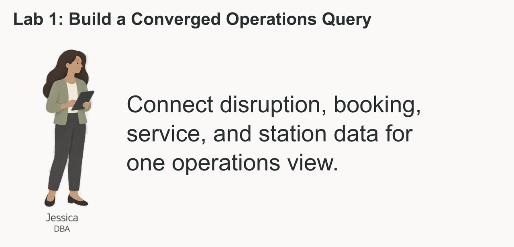
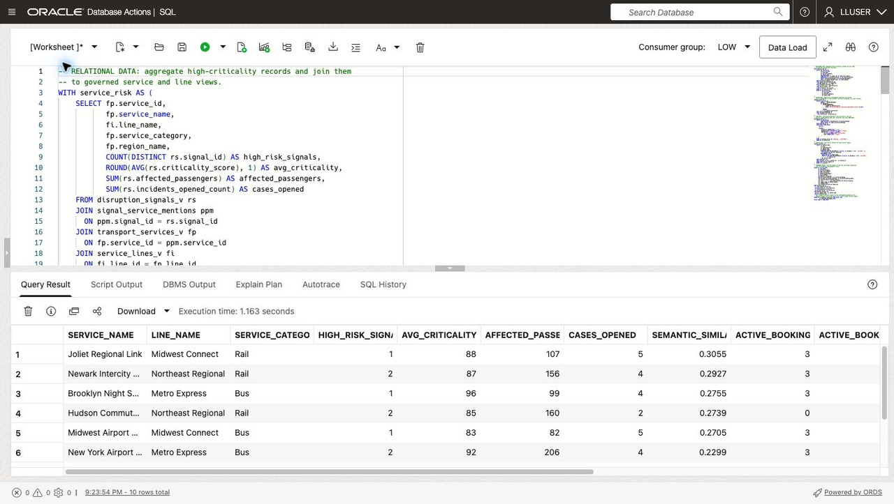

# Build a Converged Operations Query

## Introduction

Jessica Chan is the database administrator responsible for Seer Transport's service data. When disruption signals rise, the operations team asks her which services need attention first, how many booked passengers may be affected, and which stations could support a response.



Jessica can see the answer taking shape in the Service and Operations Dashboard, but its supporting records have different forms. Relational rows hold disruption signals and affected passenger counts, JSON documents describe booking activity, service vectors support semantic matching, and station and region geometry supplies location context.

Jessica needs a ranking that dispatchers can check against the underlying disruption, booking, and station records. If those records are copied into separate reporting and search systems, the ranking may lag behind the service conditions that dispatchers must act on.

Oracle AI Database lets Jessica query relational rows, JSON bookings, vectors, and station geometry together. She can give operations a ranked service list with the booking and location details needed to investigate each row.

In this lab, you take Jessica's role as the DBA. You will write the converged SQL query behind the Service and Operations Dashboard. It combines relational disruption data, vector search, JSON booking data, and spatial service data in one Oracle AI Database, without separate systems or data copies.


### Objectives

- Explain what Oracle AI Database convergence means in a transportation decision workflow.
- Run one query that combines relational, vector, JSON, and spatial database capabilities.
- Modify the query to investigate a different risk question and explain the change in results.

Estimated Time: **10 minutes**
### Hands-on Scenario

| Step                | Transportation focus                                                                                                  |
| ---------------------| ----------------------------------------------------------------------------------------------------------------|
| Business Problem    | Business users need a quick way to find transport service risk, exposure, booking activity, and service information. |
| Technical Challenge | The answer crosses risk records, transport service meaning, bookings, and service geography.                         |
| Persona Focus       | Jessica Chan, the DBA, builds the query that gives business users this dashboard view.                         |
| What You Will Do    | Use a single SQL statement that combines several data types.                                                   |
| Database Capability | Relational SQL, AI Vector Search, JSON Relational Duality, and Oracle Spatial work together.                   |
| Outcome             | Dispatchers can review a ranked service list with the booking and station evidence behind each priority.               |

Persona focus: You are Jessica Chan, the DBA. Your job is to build one governed query that gives business users a connected view of transport service risk and operations.

> **SQL Worksheet reminder:** For the difference between **Run Statement** and **Run Script**, return to [Getting Started Task 2: Open SQL Worksheet](?lab=getting-started#Task2:OpenSQLWorksheet).

## Task 1: Run a converged risk investigation

The dashboard is a starting point for the decision, not the decision itself. Run the query below to produce a compact investigation view for high-criticality transport services.

The query intentionally crosses four data models:

- **Relational:** `DISRUPTION_SIGNALS_V`, transport service mentions, and transportation views calculate transport service risk and exposure.
- **Vector:** `SERVICE_EMBEDDINGS` and `VECTOR_DISTANCE` find transport services related by meaning to the investigation phrase.
- **JSON:** `BOOKINGS_DV` is read as a document, and `JSON_TABLE` projects its nested booking legs into rows so booking activity can be counted.
- **Spatial:** `SDO_GEOM.SDO_DISTANCE` finds the closest station to each service region using latitude and longitude information stored as GeoJSON.

    These are four operations in one investigation. Every row combines transport service risk with booking activity, semantic relevance, and service-routing context.

1. Open SQL Worksheet as `LLUSER`.

2. Run the query with **Run Statement** (note the comments that help to locate the specific use of different data types):

    ```sql
    <copy>
    -- RELATIONAL DATA: aggregate high-criticality records and join them
    -- to governed service and line views.
    WITH service_risk AS (
        SELECT fp.service_id,
               fp.service_name,
               fi.line_name,
               fp.service_category,
               fp.region_name,
               COUNT(DISTINCT rs.signal_id) AS high_risk_signals,
               ROUND(AVG(rs.criticality_score), 1) AS avg_criticality,
               SUM(rs.affected_passengers) AS affected_passengers,
               SUM(rs.incidents_opened_count) AS cases_opened
        FROM disruption_signals_v rs
        JOIN signal_service_mentions ppm
          ON ppm.signal_id = rs.signal_id
        JOIN transport_services_v fp
          ON fp.service_id = ppm.service_id
        JOIN service_lines_v fi
          ON fi.line_id = fp.line_id
        WHERE rs.criticality_score >= 80
        GROUP BY fp.service_id,
                 fp.service_name,
                 fi.line_name,
                 fp.service_category,
                 fp.region_name
    ),
    -- VECTOR DATA: compare the investigation question with stored
    -- service embeddings to rank transport services by meaning, not exact wording.
    semantic_match AS (
        SELECT p.service_id,
               ROUND(1 - VECTOR_DISTANCE(
               pe.embedding,
                   VECTOR_EMBEDDING(
                       LLUSER.ALL_MINILM_L12_V2
                       USING 'service disruption affecting high-demand routes' AS DATA
                   ),
                   COSINE
               ), 4) AS semantic_similarity
        FROM service_embeddings pe
        JOIN transport_services p
          ON p.service_id = pe.service_id
    ),
    -- JSON DATA: read booking documents from the duality view and
    -- project nested booking legs into relational rows with JSON_TABLE.
    booking_activity AS (
        SELECT jt.service_id,
               COUNT(DISTINCT jt.booking_id) AS active_bookings,
               SUM(jt.seats) AS seats_in_active_bookings
        FROM bookings_dv od
        CROSS APPLY JSON_TABLE(
            od.data,
            '$'
            COLUMNS (
                booking_id NUMBER PATH '$._id',
                booking_status VARCHAR2(30) PATH '$.status',
                NESTED PATH '$.legs[*]' COLUMNS (
                    service_id NUMBER PATH '$.serviceId',
                    seats NUMBER PATH '$.seats'
                )
            )
        ) jt
        WHERE jt.booking_status IN ('pending', 'confirmed')
        GROUP BY jt.service_id
    ),
    -- SPATIAL DATA: rank active stations for each service region.
    nearest_station AS (
        SELECT sc.station_name,
               sc.city,
               sc.state_province,
               dr.region_name,
               dr.demand_index,
               ROUND(SDO_GEOM.SDO_DISTANCE(fc.location, dr.boundary, 0.005, 'unit=KM'), 2)
                 AS distance_to_service_region_km,
               ROW_NUMBER() OVER (
                 PARTITION BY dr.region_name
                 ORDER BY SDO_GEOM.SDO_DISTANCE(fc.location, dr.boundary, 0.005, 'unit=KM'),
                          fc.station_id
               ) AS station_rank
        FROM stations_v sc
        JOIN stations fc ON fc.station_id = sc.station_id
        CROSS JOIN service_regions dr
        WHERE fc.is_active = 1
    )
    -- CONVERGED RESULT: join the outputs of the four data-model operations
    -- into one dashboard investigation result.
    SELECT pr.service_name,
           pr.line_name,
           pr.service_category,
           pr.high_risk_signals,
           pr.avg_criticality,
           pr.affected_passengers,
           pr.cases_opened,
           sm.semantic_similarity,
           NVL(ta.active_bookings, 0) AS active_bookings,
           NVL(ta.seats_in_active_bookings, 0) AS active_booking_seats,
           nsc.station_name AS nearest_station,
           nsc.city || ', ' || nsc.state_province AS station_location,
           nsc.region_name AS demand_region,
           nsc.demand_index,
           nsc.distance_to_service_region_km
    FROM service_risk pr
    LEFT JOIN semantic_match sm
      ON sm.service_id = pr.service_id
    LEFT JOIN booking_activity ta
      ON ta.service_id = pr.service_id
    JOIN nearest_station nsc
      ON nsc.region_name = pr.region_name
     AND nsc.station_rank = 1
    -- Put transport services closest to the investigation question first.
    -- Exposure breaks ties so the result still favors larger business impact.
    ORDER BY sm.semantic_similarity DESC NULLS LAST,
             pr.affected_passengers DESC
    FETCH FIRST 10 ROWS ONLY;
    </copy>
    ```

    

    *Figure 1: The converged query returns ten ranked services with disruption, booking, and semantic-match values. Scroll right in the result grid to inspect the station columns.*

3. Review the ranked services as Jessica would with dispatch. Each row brings together disruption risk, semantic relevance, booking activity, and nearby station context so the team can decide which service needs investigation first.

    Your numbers may be different if the demo data has changed. Each row should include all four types of data.

    Use the first row to explain why it merits attention: disruption and booking values indicate potential impact, the semantic match ties it to the investigation question, and station context suggests where dispatch can begin its review. Jessica can use this result behind the dashboard's ranked service table and let the team inspect the records supporting each priority.

## Task 2: Change the investigation question

Jessica meets with a service operations analyst to review the results at the data level before she builds the dashboard. They start with transport services related to **service disruption affecting high-demand routes**. Change the embedded investigation phrase to:

```text
station crowding and trip capacity
```

Run the query again with **Run Statement** and compare the top rows. Change only the investigation phrase in the `VECTOR_EMBEDDING` call.

- Which transport services moved into or out of the top ten?
- Which transport services still have high relational exposure but a lower semantic similarity to the new question?
- Does the booking activity make you more or less concerned about the operational impact?

The result is ordered by semantic similarity first, so changing the question changes the review queue. Exposure breaks ties and keeps larger business impact near the top. The same governed query can answer a different business question without rebuilding a search index or moving the transport service data.

## Next Steps

Next, use JSON Relational Duality to expose the same booking data as JSON for an application while keeping SQL access for the database team.

## Acknowledgements

* **Author** - Linda Foinding, Principal Database Product Manager
* **Last Updated By/Date** - Oracle Database Product Management, October 2026
