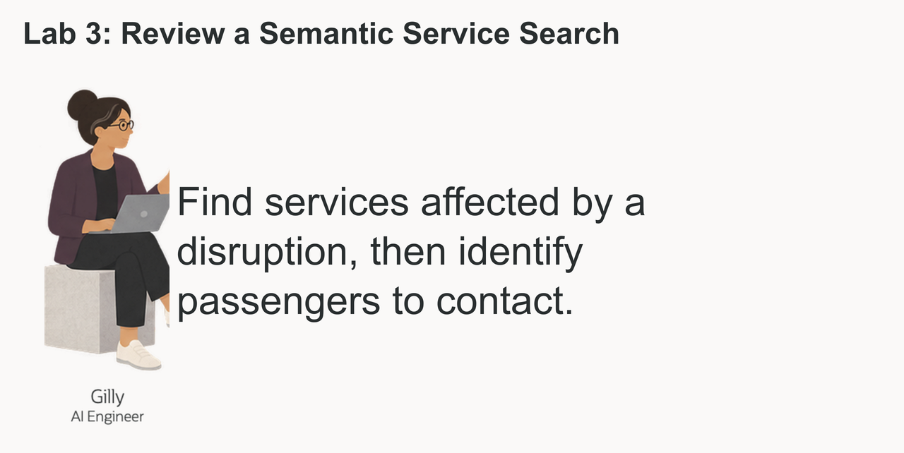

# Review a Semantic Service Search

## Introduction

Gilly Bourne is an AI engineer at Seer Transport. Her team has built a search feature for the service operations application. A business user can enter a question such as **which passengers may be affected by a route disruption affecting commuter service?** The application should find the relevant transport services first, then show the passengers who booked them.



Gilly already has the transport service, booking, and passenger data in the database. Her design problem is connecting a plain-language question to those existing rows. She needs to turn transport service data into vectors, rank the closest transport services, and join those matches to bookings and passengers. A useful result must show more than a similarity score. It must give the service team a passenger and booking list they can act on.

She could export the text and embeddings to a separate vector service. That would add a second copy of sensitive transportation language, another index to refresh, and another set of access rules to manage. Gilly wants the search to run where the underlying rows already live, so one SQL statement can compare meaning, join transport service data to bookings and passengers, and return a result for the application.

In this lab, you review Gilly's implementation from the embedding model to the final passenger list. You see why Oracle AI Database fits the job: vector search finds the relevant transport services, and SQL joins connect them to exact booking and passenger data in the same database.


<details>
<summary><strong>Key terms: embedding, vector, vector distance, and semantic search</strong></summary>

> - An **embedding** is a numerical profile of what text means. In this lab, transport service data is embedded so similar transportation ideas sit near each other mathematically, even when the wording is different.
>
> - An **ONNX embedding model** is a portable machine-learning model saved in the Open Neural Network Exchange (ONNX) format. It turns text into a vector of numbers that captures meaning. Oracle AI Database can load and run this model inside the database, close to the transport service rows.
>
> - A **vector** is the stored numerical form of an embedding. Oracle Database can store vectors beside the transportation rows they describe, so the search stays connected to transport service names, exposure values, notice counts, and other business columns.
>
> - **Vector distance** measures how close two vectors are. A smaller distance means the meanings are more similar; a larger distance means they are farther apart. In this lab, distance helps rank which transport services or disruption notices best match a business user's question.
>
> - **Semantic search** means searching by meaning instead of exact words. A search for "route disruption affecting commuter service" can find related affected transport services even when the transport service names use different wording.

</details>

Gilly has already built the Service Disruption Intelligence page. In this lab, you review how she built the transport service search. The search area lets a business user enter a concern in ordinary language and receive ranked transport services by meaning.

### Objectives

- Check the embedding model Gilly needs for semantic search.
- Create a vector from transport service data inside the database.
- Review a semantic transport service search for a business question.
- Turn transport service matches into a passenger follow-up list.
- Explain why vector search belongs beside transportation data and access controls.

Estimated Time: **10 minutes**
### Hands-on Scenario

| Step                | Transportation focus                                                                                                                               |
| ---------------------| ---------------------------------------------------------------------------------------------------------------------------------------------|
| Business Problem    | Business users need to find relevant transport services without knowing the exact terms used in the transport service data.                                     |
| Technical Challenge | Gilly must search by meaning while keeping transport service data, vectors, bookings, passengers, and access controls together.                          |
| Persona Focus       | You review Gilly's implementation as she explains how the search connects a business question to transport services, bookings, and passengers.           |
| What You Will See   | Vector search ranks transport services by meaning, then SQL adds booking and passenger details.                                                          |
| Database Capability | `VECTOR_EMBEDDING`, vector columns, and `VECTOR_DISTANCE` run beside relational transportation data.                                               |
| Outcome             | The application can turn a plain-language concern into a passenger follow-up list without a separate vector database or copied transportation text. |

Persona focus: You are reviewing the search tool Gilly built for service operations.

> **SQL Worksheet reminder:** Need a reminder on how to open and use the SQL Worksheet? Return to [Getting Started Task 2: Open SQL Worksheet](?lab=getting-started#Task2:OpenSQLWorksheet) for the step-by-step guide showing how to run SQL statements.

## Task 1: Check the embedding model

Start with Gilly's first design question: **what does similarity search need?** It needs vectors for the text being searched and an embedding model that converts a question into a vector.

Gilly asks Jessica to load an ONNX embedding model into Oracle AI Database. Oracle AI Database can store and run the ONNX model inside the database, so it creates the question embedding where the transport service data already live. The application does not have to send transportation text to a separate service and bring the vector back.

1. Run the following query to see which embedding models are available:

    ```sql
    <copy>
    SELECT owner,
           model_name,
           algorithm,
           mining_function
    FROM all_mining_models
    WHERE mining_function = 'EMBEDDING'
    ORDER BY owner, model_name;
    </copy>
    ```

    **Expected output: Available Embedding Models**

    The result should include an embedding model owned by `ADMIN`, such as `ALL_MINILM_L12_V2`. This compact model turns text into 384-number vectors. The `EMBEDDING` value confirms that the model can turn text into vectors for similarity search.

2. Review what this means for Gilly's application.

    Gilly can call the model from SQL with `VECTOR_EMBEDDING(...)`. Jessica manages the model inside the database, while Gilly uses it in her search query. The transport service data, vectors, and access controls stay in the same database.

    > **Note:** This is the key Oracle AI Database differentiator in this lab. The embedding model runs inside the database, so Gilly does not need a separate embedding service or a data pipeline to move transportation text between systems.

## Task 2: Create a transport service vector

Gilly decides that one vector per transport service is enough. Each transport service record is short and describes one transport service, so she combines its name, category, and subcategory into one text value before creating the vector.

1. Review the text Gilly will embed:

    ```sql
    <copy>
    SELECT service_id,
           service_name,
           category,
           subcategory,
           service_name || '. Category: ' || category ||
             '. Subcategory: ' || subcategory AS embedding_text
    FROM transport_services
    FETCH FIRST 5 ROWS ONLY;
    </copy>
    ```

    The combined text gives the model the transport service name and its business classification. Gilly does not need to embed price, dates, or other values that do not describe what the transport service is.

2. Run the embedding expression as `LLUSER` to confirm the model can read the transport service text:

    ```sql
    <copy>
    SELECT service_id,
           VECTOR_EMBEDDING(ADMIN.ALL_MINILM_L12_V2 USING
             service_name || '. Category: ' || category || '. Subcategory: ' || subcategory AS DATA)
    FROM transport_services;
    COMMIT;
    </copy>
    ```

    The query should return one vector for each transport service. The `COMMIT` does not change this read-only result.

3. Add a vector column to `TRANSPORT_SERVICES`:

    ```sql
    <copy>
    ALTER TABLE transport_services ADD (service_embedding VECTOR(384));
    </copy>
    ```

    The column has 384 dimensions because `ALL_MINILM_L12_V2` produces 384-dimensional vectors.

4. Create the transport service vectors inside Oracle Database:

    ```sql
    <copy>
    UPDATE transport_services
    SET service_embedding = VECTOR_EMBEDDING(
      ADMIN.ALL_MINILM_L12_V2 USING
        service_name || '. Category: ' || category ||
        '. Subcategory: ' || subcategory AS DATA)
    WHERE service_embedding IS NULL;

    COMMIT;
    </copy>
    ```

    The model reads the text in each row and writes the vector back to that same row. No transport service text leaves the database.

5. Verify the new column and its data:

    ```sql
    <copy>
    SELECT service_id,
           service_name,
           service_embedding
    FROM transport_services;
    </copy>
    ```

    Each transport service now has its own 384-dimensional vector. Gilly can use this column directly when the application searches for transport services by meaning.

    > **Note:** Chunking is not relevant for this data. Each row describes one short transport service, so splitting it would create several vectors for one transport service without adding useful detail. Chunking becomes useful for long documents, such as policies or regulatory bulletins, where each section may answer a different question.

## Task 3: Test the transport service vector

Now Gilly tests the new column with a simple vector query. She asks for transport services related to route disruption affecting commuter service and lets the database rank them by meaning.

1. Run the following query:

    The SQL creates an embedding for the phrase `route disruption affecting commuter service`, compares it with the vectors in `TRANSPORT_SERVICES.SERVICE_EMBEDDING`, and returns the cosine distance. A smaller distance means the two vectors are closer in meaning, so the query sorts the smallest distance first.

    <details>
    <summary><strong>Why this matters to Gilly</strong></summary>

    > Gilly could export the text to an external embedding pipeline or search service. That would create extra copies of sensitive transportation text and make it harder to show which data the application searched.
    >
    > Oracle AI Vector Search keeps the transport service data, vectors, SQL query, and vector distance with the transportation data. Gilly can check the search and use the result in the application without adding another data store.

    </details>

    ```sql
    <copy>
    SELECT p.service_name,
           p.category,
           VECTOR_DISTANCE(
             p.service_embedding,
             VECTOR_EMBEDDING(ADMIN.ALL_MINILM_L12_V2 USING 'route disruption affecting commuter service' AS DATA),
             COSINE) AS vector_distance
    FROM transport_services p
    ORDER BY vector_distance
    FETCH FIRST 5 ROWS ONLY;
    </copy>
    ```

    **Expected output: Service Disruption Matches**

2. Review the ranked transport services.
    The query embeds the analyst phrase at runtime and compares it to the `TRANSPORT_SERVICES.SERVICE_EMBEDDING` column. `VECTOR_DISTANCE` calculates the distance between the two vectors using the `COSINE` metric. A lower value means a closer match.

    In the broader workflow, these ranked transport services can become the next filter for dashboard review and transport service exposure analysis.

3. Show the result as a similarity score:

    Vector distance is useful for checking the search, but business users may not know what a cosine distance means. Gilly changes the display to a similarity score. She subtracts the distance from `1`, so a higher score means a closer match, and rounds the result to four decimal places.

    ```sql
    <copy>
    SELECT p.service_name,
           p.category,
           ROUND(1 - VECTOR_DISTANCE(
             p.service_embedding,
             VECTOR_EMBEDDING(ADMIN.ALL_MINILM_L12_V2 USING 'route disruption affecting commuter service' AS DATA),
             COSINE), 4) AS similarity
    FROM transport_services p
    ORDER BY similarity DESC
    FETCH FIRST 5 ROWS ONLY;
    </copy>
    ```

    The query uses the same vectors and the same cosine calculation. It only changes how the result is shown to the person using the application.

## Task 4: Find passengers affected by a transport service concern

Gilly now has the business requirement for the application. A business user should be able to enter a concern and find passengers who booked related transport services. The result gives the passenger-service team a short list for follow-up, with the transport service match, booking status, booking date, and passenger contact details.

1. Run the following query for the concern `route disruption affecting commuter service`:

    ```sql
    <copy>
    WITH matched_services AS (
        SELECT p.service_id,
               p.service_name,
               ROUND(1 - VECTOR_DISTANCE(
                 p.service_embedding,
                 VECTOR_EMBEDDING(
                   ADMIN.ALL_MINILM_L12_V2
                   USING 'route disruption affecting commuter service' AS DATA
                 ),
                 COSINE), 4) AS similarity
        FROM transport_services p
        ORDER BY similarity DESC
        FETCH FIRST 5 ROWS ONLY
    )
    SELECT mp.service_name,
           mp.similarity,
           c.first_name || ' ' || c.last_name AS passenger_name,
           c.email,
           o.booking_id,
           o.booking_status,
           o.created_at,
           oi.seats,
           oi.leg_total
    FROM matched_services mp
    JOIN booking_legs oi ON oi.service_id = mp.service_id
    JOIN bookings o ON o.booking_id = oi.booking_id
    JOIN passengers c ON c.passenger_id = o.passenger_id
    WHERE o.booking_status NOT IN ('cancelled', 'refunded')
    ORDER BY mp.similarity DESC,
             o.created_at DESC;
    </copy>
    ```

    The first part ranks transport services by meaning. The remaining joins use ordinary relational keys to find the matching booking legs, bookings, and passengers.

    **Expected output: Passenger Follow-up List**

    The result shows passengers who booked transport services related to the concern. The similarity score explains why the transport service was included, while the booking and passenger columns give the service team enough information to decide what to do next.

2. Review the business result.

    Gilly does not vectorize every booking or passenger. She vectorizes the transport service data once, then builds a converged query that combines vector search with SQL joins for exact booking and contact details. This keeps the search flexible while the final passenger list remains precise and easy to act on.

## Conclusion

Gilly has built the search behind the application and connected it to a business action. A plain-language concern can produce ranked transport services and a passenger follow-up list using vectors, relational joins, and SQL in Oracle AI Database. 

## Acknowledgements

* **Author** - Linda Foinding, Principal Database Product Manager
* **Last Updated By/Date** - Oracle Database Product Management, October 2026
