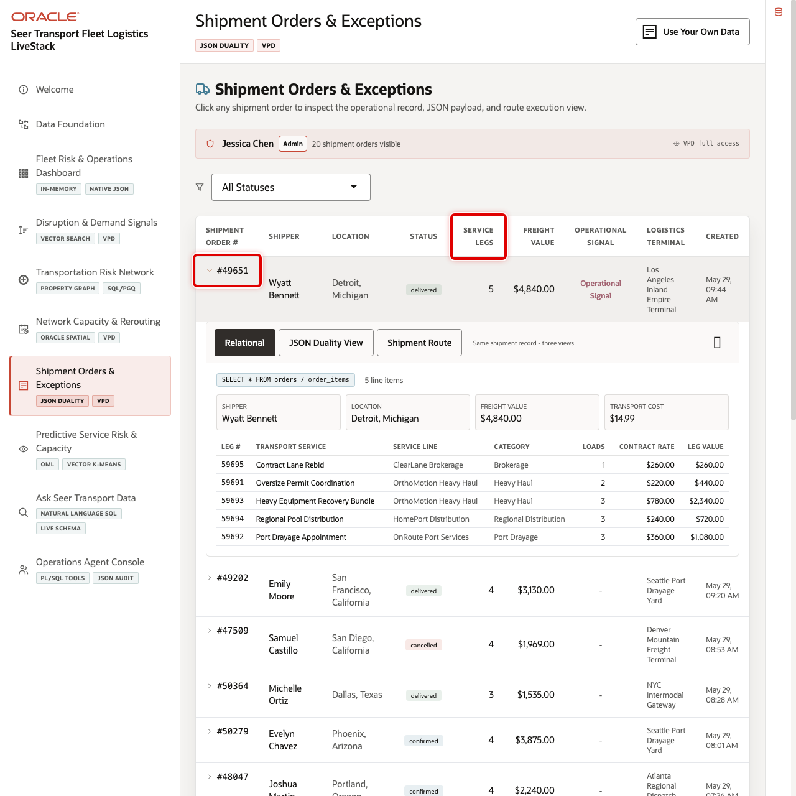
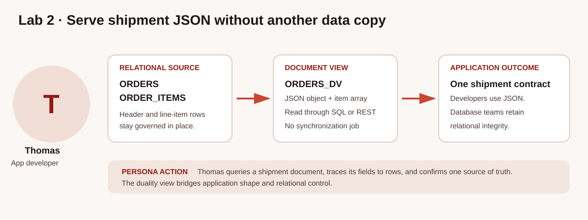
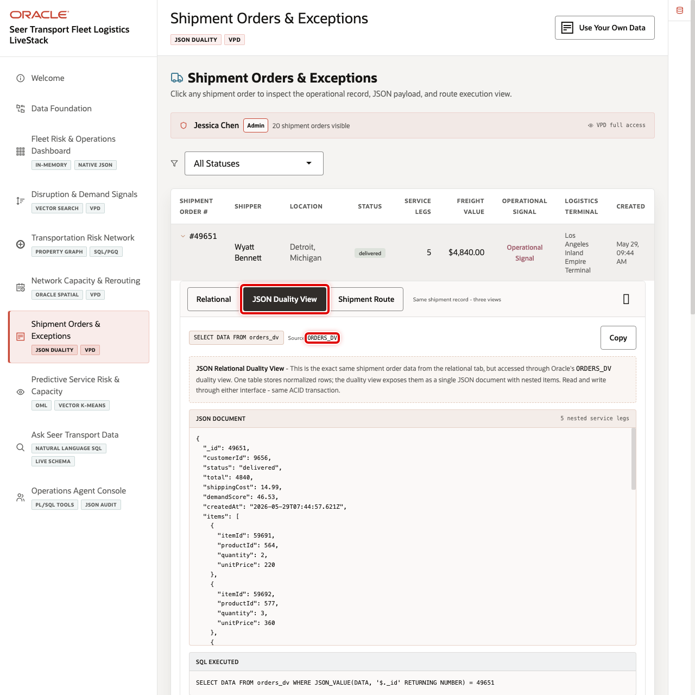

# Build a Shipment JSON Application Model

## Introduction

Thomas is the application developer building the shipment-detail experience used by Seer Transport operations teams. He needs flexible screen settings, a saved dispatch-review document, and an API-ready shipment payload. Those needs look similar in an application, but the business ownership is different: screen settings belong to the application, a saved review belongs to the application workflow, and the shipment itself remains governed operational data.

Oracle Autonomous AI Database supports all three JSON patterns without requiring a second shipment database. Thomas first reads optional application settings from a native `JSON` column. He then reviews one application-owned JSON Collection Table document. Finally, he reads the governed shipment through the JSON-Relational Duality View `ORDERS_DV`, where relational `ORDERS` and `ORDER_ITEMS` remain the source of truth.

The image below shows the Shipment Orders & Exceptions detail used by dispatch and service-operations teams. Notice order `49651`, its current status, order total, and line-item context. The SQL in this lab reads the same order as a JSON document, then projects selected document fields back into SQL columns for analysis.

Order `49651` and review document `DISPATCH-49651` are intentional, deterministic workshop fixtures. Reusable application SQL should accept identifiers through bind variables such as `:transport_order_id` rather than embedding literal values.





### Objectives

- Read flexible shipment-screen attributes from a native JSON column.
- Query an application-owned JSON Collection Table and explain its ETag.
- Inspect, read, and project a governed shipment through `ORDERS_DV`.
- Choose the appropriate JSON pattern based on data ownership.

Estimated Time: **15 minutes**

### Hands-on Scenario

| Step | Transportation focus |
| --- | --- |
| Business Problem | A shipment application needs flexible settings, review documents, and governed shipment data |
| Technical Challenge | Each need has a different owner; copying operational shipments would create synchronization risk |
| Persona Focus | Thomas, the application developer, chooses the JSON pattern that fits each feature |
| What You Will Do | Read native JSON, a document collection, and a JSON-Relational Duality View |
| Database Capability | Native JSON, JSON Collection Tables, SQL/JSON, and JSON-Relational Duality Views |
| Outcome | Thomas can serve application JSON without creating a disconnected copy of a shipment |

<details>
<summary><strong>Key terms: JSON columns, JSON collections, and JSON-Relational Duality Views</strong></summary>

> - A **native JSON column** stores a JSON value beside normal relational keys and constraints. Thomas uses `THOMAS_SHIPMENT_APP_DATA.APP_DATA` for optional screen settings that can evolve without adding a column for every setting.
>
> - A **JSON Collection Table** stores application-owned documents in its `DATA` column. `THOMAS_DISPATCH_REVIEW_DOCS` stores a saved dispatch-review draft, not a second copy of the governed shipment.
>
> - A **JSON-Relational Duality View** exposes relational rows as a JSON document and can support governed document writes when its definition allows them. `ORDERS_DV` maps `ORDERS` to the document root and `ORDER_ITEMS` to its nested `items` array while those tables remain the relational source.
>
> - **Projection** selects fields from JSON and returns them as SQL columns. `JSON_VALUE` projects one scalar field, while `JSON_TABLE` turns an array into rows. This lets analysts query the document shape without abandoning relational operations.
>
> - An **ETag** is an opaque database-generated version value. An application can send the ETag it read with an update; a changed ETag tells it that another request has already changed the document. This is optimistic concurrency, not a business shipment attribute.

</details>

> **SQL Worksheet reminder:** Return to [Getting Started Task 2](?lab=getting-started#Task2:OpenSQLWorksheet) if you need the SQL Worksheet steps.

## Task 1: Read flexible application settings from native JSON

Thomas starts with settings owned by the shipment-detail feature. The relational `ORDER_ID` identifies which shipment screen the setting applies to; the native JSON `APP_DATA` holds flexible fields such as the screen name, a display flag, and enabled features. These settings are not part of the shipment record itself.

1. Read the seeded application settings.

    ```sql
    <copy>
    SELECT order_id,
           JSON_VALUE(app_data, '$.screen' RETURNING VARCHAR2(30) ERROR ON ERROR) AS screen_name,
           JSON_VALUE(app_data, '$.showLiveStatus' RETURNING BOOLEAN ERROR ON ERROR) AS show_live_status,
           JSON_QUERY(app_data, '$.features' RETURNING VARCHAR2(200) ERROR ON ERROR) AS app_features
    FROM thomas_shipment_app_data
    WHERE order_id = 49651;
    </copy>
    ```

    **Expected output: Shipment Detail Settings**

    | Order ID | Screen Name | Show Live Status | App Features |
    | ---: | --- | --- | --- |
    | 49651 | shipment-detail | true | exception-alerts and terminal-capacity |

`ORDER_ID` remains a typed relational key, while `APP_DATA` can gain an optional application setting without altering the operational shipment model.

2. Optionally add Thomas as the last viewer. This isolated, rerunnable update affects only the workshop application-settings fixture. It does not change `ORDERS`, `ORDER_ITEMS`, or `ORDERS_DV`.

    ```sql
    <copy>
    UPDATE thomas_shipment_app_data
    SET app_data = JSON_TRANSFORM(app_data, SET '$.lastViewedBy' = 'Thomas')
    WHERE order_id = 49651
      AND JSON_VALUE(app_data, '$.lastViewedBy' RETURNING VARCHAR2(30) NULL ON EMPTY) IS NULL;

    COMMIT;

    SELECT order_id,
           JSON_VALUE(app_data, '$.lastViewedBy' RETURNING VARCHAR2(30) ERROR ON ERROR) AS last_viewed_by
    FROM thomas_shipment_app_data
    WHERE order_id = 49651;
    </copy>
    ```

    **Expected output: Application Setting Updated**

    | Order ID | Last Viewed By |
    | ---: | --- |
    | 49651 | Thomas |

The first run updates one row; later runs update zero rows and still return `Thomas`. This is application-owned JSON, so it is appropriate for a screen-setting change.

## Task 2: Review an application-owned JSON collection document

The dispatch-review draft is a separate, application-owned document. It records workflow context that Thomas's feature needs: its review state and requested actions. It references shipment order `49651`, but it is not a competing shipment system of record.

1. Query the deterministic dispatch-review document.

    ```sql
    <copy>
    SELECT JSON_VALUE(data, '$._id' RETURNING VARCHAR2(30) ERROR ON ERROR) AS document_id,
           JSON_VALUE(data, '$._metadata.etag' RETURNING VARCHAR2(64) ERROR ON ERROR) AS document_etag,
           JSON_VALUE(data, '$.reviewState' RETURNING VARCHAR2(20) ERROR ON ERROR) AS review_state,
           JSON_QUERY(data, '$.requestedActions' RETURNING VARCHAR2(200) ERROR ON ERROR) AS requested_actions
    FROM thomas_dispatch_review_docs
    WHERE JSON_VALUE(data, '$._id' RETURNING VARCHAR2(30) ERROR ON ERROR) = 'DISPATCH-49651';
    </copy>
    ```

    **Expected output: Dispatch Review Document**

    | Document ID | Review State | Requested Actions |
    | --- | --- | --- |
    | DISPATCH-49651 | open | review terminal capacity; monitor port drayage |

`THOMAS_DISPATCH_REVIEW_DOCS` was created `WITH ETAG`, so Oracle provides the generated document ETag in `_metadata`. Its exact hexadecimal value is intentionally dynamic. A service should retain the ETag it read and compare it before accepting an update, so a stale request does not silently overwrite a newer dispatch review.

2. Inspect the complete document if you want to see the database-managed metadata with the application fields.

    ```sql
    <copy>
    SELECT JSON_SERIALIZE(data PRETTY) AS dispatch_review_document
    FROM thomas_dispatch_review_docs
    WHERE JSON_VALUE(data, '$._id' RETURNING VARCHAR2(30) ERROR ON ERROR) = 'DISPATCH-49651';
    </copy>
    ```

    **Expected output: Dispatch Review JSON**

    | JSON contains |
    | --- |
    | `_id`, `_metadata.etag`, `transportOrderId`, `reviewState`, and `requestedActions` |

## Task 3: Confirm the governed shipment document contract

`USER_JSON_DUALITY_VIEWS` is the learner-facing catalog for JSON-Relational Duality Views owned by the current schema. Query it to find the `ORDERS_DV` application contract and confirm that Oracle Autonomous AI Database recognizes it as valid.

1. Inspect the actual document capabilities.

    ```sql
    <copy>
    SELECT view_name,
           status,
           allow_insert,
           allow_update,
           allow_delete
    FROM user_json_duality_views
    WHERE view_name = 'ORDERS_DV';
    </copy>
    ```

    **Expected output: Shipment Duality View Capabilities**

    | View Name | Status | Allow Insert | Allow Update | Allow Delete |
    | --- | --- | --- | --- | --- |
    | ORDERS\_DV | VALID | true | true | false |

`ORDERS_DV` permits document inserts and updates for this workshop's order and nested item rows. It does not permit document deletion. Those annotations are specific to this view; they are not a general grant of table privileges or an authorization boundary by themselves.

2. Inspect the view definition and its actual write annotations.

    ```sql
    <copy>
    SELECT text AS duality_view_definition
    FROM user_views
    WHERE view_name = 'ORDERS_DV';
    </copy>
    ```

    **Expected output: Duality View Definition**

    | Relational Source | Annotation in `ORDERS_DV` |
    | --- | --- |
    | `ORDERS` root | `WITH INSERT UPDATE` |
    | `ORDER_ITEMS` nested `items` array | `WITH INSERT UPDATE` |

Unlike the native JSON settings and collection document, the governed shipment already belongs in relational tables. The duality view assembles an application document from those rows; it does not create a second shipment copy.

## Task 4: Read the named shipment document

The JSON-Relational Duality View exposes each document through its `DATA` column. `JSON_VALUE` locates order `49651` by its `_id`, and `JSON_SERIALIZE(... PRETTY)` formats the full document for review. `ERROR ON ERROR` makes a missing or malformed required `_id` a query error instead of silently returning `NULL`. Look for the order header fields, the database-managed `_metadata` object, and the nested `items` array.

1. Read the JSON document.

    ```sql
    <copy>
    SELECT JSON_SERIALIZE(data PRETTY) AS shipment_document
    FROM orders_dv
    WHERE JSON_VALUE(data, '$._id' RETURNING NUMBER ERROR ON ERROR) = 49651;
    </copy>
    ```

    **Expected output: Shipment Document 49651**

    | Shipment Document |
    | --- |
    | JSON with `_id`, `_metadata`, `customerId`, `status`, `total`, `shippingCost`, `demandScore`, and nested `items` |

    The image below shows how the same order appears in the JSON-Relational Duality View panel for the application. Thomas uses this view to inspect the document contract; the SQL result lets you see that governed database rows directly supply the document.

    

`_metadata` is maintained by the duality view and includes document-version information such as an ETag and an as-of value; it is not a business shipment attribute. The ETag is an opaque, generated value used for optimistic concurrency: an application sends back the ETag it read when it updates a document, and Oracle rejects a stale update rather than overwriting a newer one. The document shape helps an application because the header and line items arrive together. It also helps database teams because the relational order model supplies each business field without a disconnected copy.

## Task 5: Project document fields into SQL

This query projects application-document fields into a business-readable result. Read it in three parts:

1. `JSON_VALUE` extracts the required order identifier, status, and order total from the document root. `ERROR ON ERROR` makes a malformed or missing required field visible during this contract check.
2. `JSON_TABLE` turns every member of the nested `items` array into a SQL row containing an item identifier, service identifier, and quantity. Its `ERROR ON ERROR` clauses apply the same fail-fast behavior to required item fields.
3. `TRANSPORT_SERVICES_V` is a saved SQL query that supplies the transportation-ready service name for each identifier.

Look for one row per service leg in order `49651`. Thomas and an operations analyst can now discuss the same shipment without exchanging or reconciling exports.

1. Project the shipment header and line items.

    ```sql
    <copy>
    SELECT JSON_VALUE(od.data, '$._id' RETURNING NUMBER ERROR ON ERROR) AS transport_order_id,
           JSON_VALUE(od.data, '$.status' RETURNING VARCHAR2(30) ERROR ON ERROR) AS order_status,
           JSON_VALUE(od.data, '$.total' RETURNING NUMBER ERROR ON ERROR) AS order_total,
           jt.item_id AS order_item_id,
           jt.product_id AS transport_service_id,
           ts.transport_service_name,
           jt.quantity
    FROM orders_dv od
    CROSS APPLY JSON_TABLE(
      od.data, '$.items[*]' ERROR ON ERROR
      COLUMNS (
        item_id NUMBER PATH '$.itemId' ERROR ON ERROR,
        product_id NUMBER PATH '$.productId' ERROR ON ERROR,
        quantity NUMBER PATH '$.quantity' ERROR ON ERROR
      )
    ) jt
    JOIN transport_services_v ts
      ON ts.transport_service_id = jt.product_id
    WHERE JSON_VALUE(od.data, '$._id' RETURNING NUMBER ERROR ON ERROR) = 49651
    ORDER BY jt.product_id, jt.item_id;
    </copy>
    ```

    **Expected output: Projected Shipment Items**

    | Transport Order ID | Order Status | Order Total | Transport Service Name | Quantity |
    | ---: | --- | ---: | --- | ---: |
    | 49651 | delivered | 4840 | Contract Lane Rebid, Oversize Permit Coordination, Heavy Equipment Recovery Bundle, Regional Pool Distribution, and Port Drayage Appointment | 1, 2, or 3 |

The repeated order identifier shows that each nested item became a relational result row. The service names make the document useful for an operations review rather than exposing only internal identifiers.

## Task 6: Compare the relational and document views

This comparison joins `TRANSPORT_ORDERS_V`, a saved business-ready view of the order rows, to `ORDERS_DV`. It compares status and order total in the relational and document shapes for the same order. Look for matching values in both pairs of columns. This is a read-time comparison of two access shapes, not a synchronization test between copied data: both sides resolve from the relational source managed by Oracle Autonomous AI Database.

1. Run the comparison.

    ```sql
    <copy>
    SELECT o.transport_order_id,
           o.transport_order_status AS relational_status,
           JSON_VALUE(d.data, '$.status' RETURNING VARCHAR2(30) ERROR ON ERROR) AS document_status,
           o.service_value AS relational_order_total,
           JSON_VALUE(d.data, '$.total' RETURNING NUMBER ERROR ON ERROR) AS document_order_total
    FROM transport_orders_v o
    JOIN orders_dv d
      ON JSON_VALUE(d.data, '$._id' RETURNING NUMBER ERROR ON ERROR) = o.transport_order_id
    WHERE o.transport_order_id = 49651;
    </copy>
    ```

    **Expected output: Shared Shipment Values**

    | Transport Order ID | Relational Status | Document Status | Relational Order Total | Document Order Total |
    | ---: | --- | --- | ---: | ---: |
    | 49651 | delivered | delivered | 4840 | 4840 |

Matching values show that the application and the analyst are reading two representations of the same governed shipment. A status change does not require a separate document-sync job before both users can see it.

## Conclusion: Choose the right JSON approach

Thomas does not need one JSON pattern for every application feature. He chooses based on who owns the data and whether the application needs an independent document or a document assembled from relational rows.

| Approach | Use it when | Transportation example | Where the data lives |
| --- | --- | --- | --- |
| Native JSON column | A relational record needs optional or changing application attributes | Shipment-detail screen settings and feature flags | `THOMAS_SHIPMENT_APP_DATA.APP_DATA` beside a relational `ORDER_ID` |
| JSON Collection Table | The application owns a set of documents and needs document-style access | Saved dispatch-review drafts with requested actions | One document per `DATA` row in `THOMAS_DISPATCH_REVIEW_DOCS` |
| JSON-Relational Duality View | Governed data already lives in relational tables but the application needs one JSON document | Shipment header and service legs for the order-detail API | `ORDERS` and `ORDER_ITEMS`; `ORDERS_DV` defines the JSON shape |

For the shipment-detail API, `ORDERS_DV` is the right choice because the order and its service legs already have relational keys, joins, and operational controls. The native JSON setting and collection document remain useful for application-owned data, but neither replaces the governed shipment record.

## Next Steps

Continue with AI Vector Search to rank disruption evidence by meaning. For deeper practice with application documents backed by relational rows, open the [JSON-Relational Duality View LiveLabs workshop](https://livelabs.oracle.com/ords/r/dbpm/livelabs/view-workshop?clear=RR,180&wid=3797).

## Acknowledgements

* **Author** - Oracle Database Product Management
* **Last Updated By/Date** - Oracle Database Product Management, September 2026
