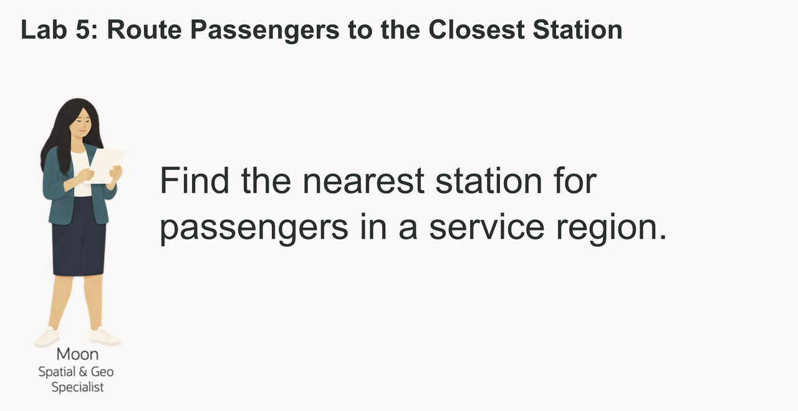
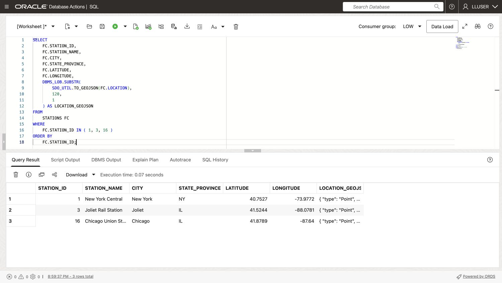

# Route Passengers to the Closest Station

## Introduction

Moon Kai is Seer Transport's spatial specialist. Operations teams ask Moon for help when location affects a service decision: which station is closest to a region with growing demand, and which passengers should it handle?



The operator already stores the required data in Oracle AI Database. Stations and passengers are stored as map points. Service regions are stored as map areas, and each region has a demand score.

Moon wants operations users to answer a simple question with SQL that can power a business-user dashboard and map:

> A region needs more service support. **Which passengers are in that region, and which station is closest to each one?**

In this lab, you follow Moon's approach. You start with a single point, measure distance to a region, find passengers inside that region, and finish with a passenger routing result that combines location and service data.


<details>
<summary><strong>Key terms: point, polygon, distance, spatial relationship, and GeoJSON</strong></summary>

> - A **point** is one location, represented by longitude and latitude. In this lab, a station is stored as an `SDO_GEOMETRY` point.
>
> - A **polygon** is an area made from connected points. Service regions are stored as polygons.
>
> - **Distance** measures how far two spatial objects are from each other. Here, it shows how far a station is from a service-region boundary. A distance of zero means the station is inside or touching the region.
>
> - A **spatial relationship** describes how two shapes relate to each other. `SDO_GEOM.RELATE` can test whether a passenger point is inside or touches a service region.
>
> - **GeoJSON** is a JSON format for map locations and shapes. `SDO_UTIL.TO_GEOJSON` lets an application display the same database location on a map.
>
</details>

The SQL in this lab shows how the database calculates station access for a service region.

### Objectives

- Identify spatial points and polygons in the transportation data.
- Convert a database point to GeoJSON for an application map.
- Measure which stations are closest to a service region.
- Find passengers inside a service region.
- Match each passenger to the closest active station.

Estimated Time: **10 minutes**
### Hands-on Scenario

| Step | Transportation focus |
| --- | --- |
| Business Problem | Operations needs to route service work to a station that can respond to regional demand. |
| Technical Challenge | Moon needs to compare passenger points with a region, then find the closest station for each passenger. |
| Persona Focus | You review Moon's spatial approach and interpret the result for an operations user. |
| What You Will See | Oracle Spatial turns location data into passenger routing results with SQL. |
| Database Capability | `SDO_GEOMETRY`, `SDO_GEOM.SDO_DISTANCE`, `SDO_GEOM.RELATE`, and GeoJSON conversion support the analysis. |
| Outcome | An operations user can see which passengers need service in a region and which station is closest to each one. |

> **SQL Worksheet reminder:** For the difference between **Run Statement** and **Run Script**, return to [Getting Started Task 2: Open SQL Worksheet](?lab=getting-started#Task2:OpenSQLWorksheet).

## Task 1: Look at the locations as points

Moon starts with the simplest spatial question: **where are the stations?** The database stores each station as an `SDO_GEOMETRY` point, while the application can use the same point as GeoJSON.

An `SDO_GEOMETRY` point is Oracle Spatial's structured representation of one location. For example, a station is stored with a point type, the WGS84 coordinate system, and its longitude and latitude. Because Oracle stores the location as geometry, Spatial functions can calculate distance and test spatial relationships instead of treating the coordinates as two unrelated numbers.

`SDO_UTIL.TO_GEOJSON` converts that geometry into a standard JSON map object such as `{ "type": "Point", "coordinates": [longitude, latitude] }`. The application can send this object to a map without maintaining a second location format or a separate conversion service. Oracle uses the same stored geometry for SQL analysis and application display.

Moon can calculate distances from the stored locations, join the results to station capacity, and send those same locations to the application map as GeoJSON.

1. Run this query with **Run Statement**:

    ```sql
    <copy>
    SELECT fc.station_id,
           fc.station_name,
           fc.city,
           fc.state_province,
           fc.latitude,
           fc.longitude,
           DBMS_LOB.SUBSTR(
             SDO_UTIL.TO_GEOJSON(fc.location), 120, 1
           ) AS location_geojson
    FROM stations fc
    WHERE fc.station_id IN (1, 3, 16)
    ORDER BY fc.station_id;
    </copy>
    ```

    

    *Figure 1: Station coordinates and GeoJSON come from the same stored geometry.*

    `LOCATION` is the database point. `LATITUDE` and `LONGITUDE` make the value easy to read, and `LOCATION_GEOJSON` gives an application a map-ready representation of the same point. GeoJSON lists longitude first and latitude second. `SDO_UTIL.TO_GEOJSON` returns a CLOB, so `DBMS_LOB.SUBSTR` limits the displayed text to 120 characters; it does not change the stored geometry.

    **Expected output: Station Points**

2. Review the point data.

    Moon has not created a second map database. The point used by the application and the point used by SQL are the same value. The database can calculate with it, and the application can display it.

    This is the converged-database advantage. Moon can keep the station's location beside its name, capacity, operating status, and current load. SQL can calculate distance and return those station details, while `SDO_UTIL.TO_GEOJSON` gives the application the same location for a map. The team does not have to copy coordinates into a separate mapping system and keep the copies synchronized.

## Task 2: Find the closest stations to a service region

New York Metro is the first region for this routing review. Moon now measures the distance from each station point to the region boundary.

1. Run the distance query with **Run Statement**:

    ```sql
    <copy>
    SELECT fc.station_name,
           fc.city,
           fc.state_province,
           ROUND(
             SDO_GEOM.SDO_DISTANCE(
               fc.location,
               dr.boundary,
               0.005,
               'unit=KM'
             ), 2
           ) AS boundary_distance_km,
           dr.region_name,
           dr.demand_index
    FROM stations fc
    CROSS JOIN service_regions dr
    WHERE dr.region_name = 'New York Metro'
    ORDER BY boundary_distance_km
    FETCH FIRST 10 ROWS ONLY;
    </copy>
    ```

    `SDO_GEOM.SDO_DISTANCE` compares the station point with the demand-region polygon. The function returns the shortest distance between the two shapes. A value of `0` means the point is inside or touching the region.

    The four arguments in this query have simple roles:

    - `fc.location` is the first geometry: the station point.
    - `dr.boundary` is the second geometry: the demand-region polygon.
    - `0.005` is the tolerance used when Oracle compares the geometries. It helps Oracle handle small differences in the stored coordinates.
    - `'unit=KM'` tells Oracle to return the distance in kilometers. Change it to `'unit=MILE'` when the application needs miles.

    The `ROUND(..., 2)` around the function result only formats the answer to two decimal places. It does not change the spatial calculation.

    The query also returns `DEMAND_INDEX`, so Moon can read location and demand together. The station with the smallest distance is the first station operations should check for available capacity.

    **Expected output: New York Service Coverage**

    The first row is the station nearest the New York Metro boundary; compare its distance and capacity with the following rows.

2. Try another region.

    Change the region name to `Chicago Metro`, add a miles calculation, and run the modified query with **Run Statement**:

    ```sql
    <copy>
    SELECT fc.station_name,
           fc.city,
           fc.state_province,
           ROUND(
             SDO_GEOM.SDO_DISTANCE(
               fc.location,
               dr.boundary,
               0.005,
               'unit=KM'
             ), 2
           ) AS boundary_distance_km,
           ROUND(
             SDO_GEOM.SDO_DISTANCE(
               fc.location,
               dr.boundary,
               0.005,
               'unit=MILE'
             ), 2
           ) AS boundary_distance_miles,
           dr.region_name,
           dr.demand_index
    FROM stations fc
    CROSS JOIN service_regions dr
    WHERE dr.region_name = 'Chicago Metro'
    ORDER BY boundary_distance_km
    FETCH FIRST 10 ROWS ONLY;
    </copy>
    ```

    The `unit` parameter controls the measurement unit. `Joliet Rail Station` should be the closest station, with a distance of `0` km and `0` miles because it falls inside the Chicago Metro boundary. Chicago has a demand index of `78`.

    This is a useful regional result, but distance to the region boundary does not identify the passengers who need service. Moon now uses the region polygon to find those passengers and then assigns each one to the closest active station.

## Task 3: Route passengers to the closest station

Moon now needs a result that an operations application can use: passengers inside New York Metro, their service region, and the closest active station. The query uses the passenger point (**`c.location`**) and demand-region polygon (**`dr.boundary`**) to find the passengers first. It then compares each passenger point with every active station and keeps the closest one.

1. Run the passenger routing query with **Run Statement**:

    ```sql
    <copy>
    WITH regional_passengers AS (
      SELECT dr.region_name,
             dr.demand_index,
             c.passenger_id,
             c.first_name || ' ' || c.last_name AS passenger_name,
             c.email,
             c.passenger_tier,
             c.location
      FROM passengers c
      CROSS JOIN service_regions dr
      WHERE dr.region_name = 'New York Metro'
        AND SDO_GEOM.RELATE(
              dr.boundary,
              'ANYINTERACT',
              c.location,
              0.005
            ) = 'TRUE'
    ), ranked_stations AS (
      SELECT rc.region_name,
             rc.demand_index,
             rc.passenger_id,
             rc.passenger_name,
             rc.email,
             rc.passenger_tier,
             fc.station_name,
             fc.city AS station_city,
             fc.daily_capacity,
             fc.occupancy_pct,
             ROUND(
               SDO_GEOM.SDO_DISTANCE(
                 rc.location,
                 fc.location,
                 0.005,
                 'unit=KM'
               ), 2
             ) AS passenger_station_distance_km,
             ROW_NUMBER() OVER (
               PARTITION BY rc.passenger_id
               ORDER BY SDO_GEOM.SDO_DISTANCE(
                          rc.location,
                          fc.location,
                          0.005,
                          'unit=KM'
                        )
             ) AS station_rank
      FROM regional_passengers rc
      CROSS JOIN stations fc
      WHERE fc.is_active = 1
    )
    SELECT region_name,
           demand_index,
           passenger_id,
           passenger_name,
           email,
           passenger_tier,
           station_name,
           station_city,
           daily_capacity,
           occupancy_pct,
           passenger_station_distance_km
    FROM ranked_stations
    WHERE station_rank = 1
    ORDER BY passenger_station_distance_km, passenger_id
    FETCH FIRST 25 ROWS ONLY;
    </copy>
    ```

    `SDO_GEOM.RELATE` keeps passengers whose point falls inside or touches the New York Metro polygon. `SDO_GEOM.SDO_DISTANCE` then measures the distance from each matching passenger to every active station. `ROW_NUMBER` keeps the nearest station for each passenger.

2. Review the result as an operations decision.

    Each row gives a business user a passenger to contact, the closest station, and the information needed to decide where the work should go. The result combines the region's demand score, passenger details, station capacity, current load, and spatial distance in one SQL result.

    A dispatcher can select a region and review the passengers inside it alongside each person's closest active station, its capacity, and the travel distance. Those details help the team decide where to direct follow-up, while station staff can check current load before accepting more work.

3. Change the query to `Chicago Metro`.

    Compare the passengers and assigned stations with the New York result. The spatial predicates stay the same; only the region changes. This is the kind of query an operations dashboard can run when a business user selects a different service region.

## Conclusion: Turn Location into a Service Decision

Moon's final query takes the team from a demand region to a passenger list with the nearest active station, capacity, current load, and distance for each person. Dispatchers can use that combined view to plan follow-up and review whether the closest station can support the work.

## Next Steps

You used Oracle Spatial to turn points and polygons into a routing decision. For a deeper hands-on workshop focused on Oracle Spatial, open the [Oracle Spatial LiveLabs workshop](https://livelabs.oracle.com/ords/r/dbpm/livelabs/view-workshop?clear=RR,180&wid=800).

## Acknowledgements

* **Author** - Linda Foinding, Principal Database Product Manager
* **Last Updated By/Date** - Oracle Database Product Management, October 2026
