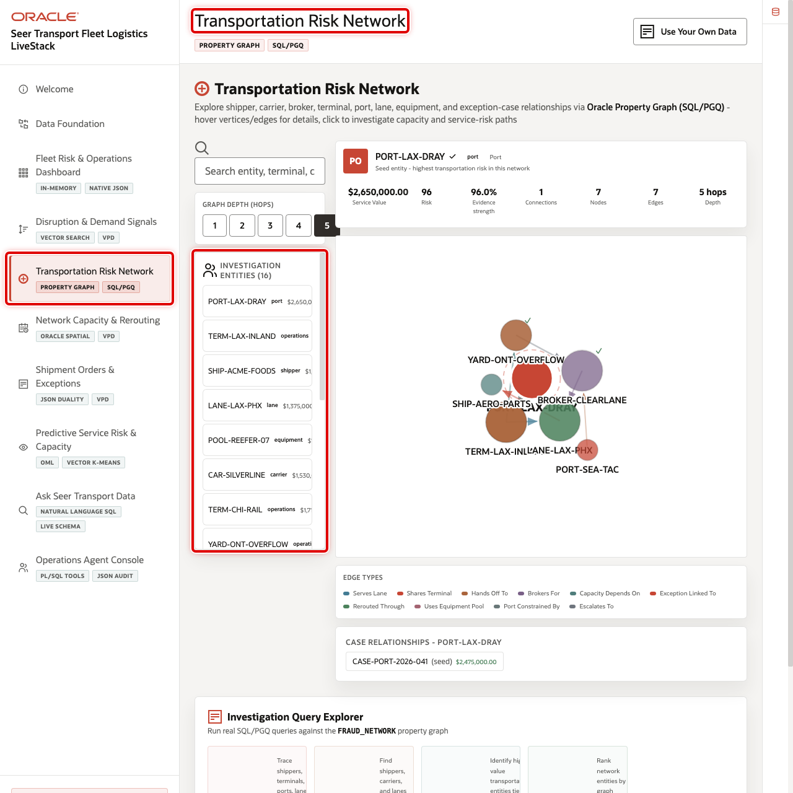
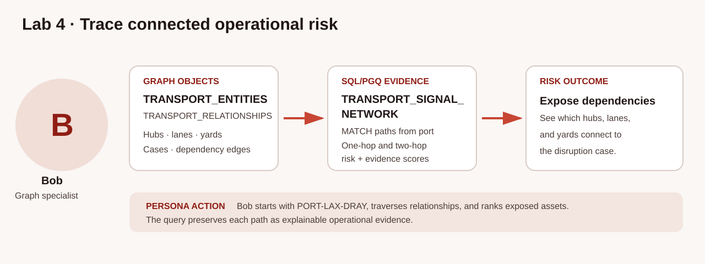
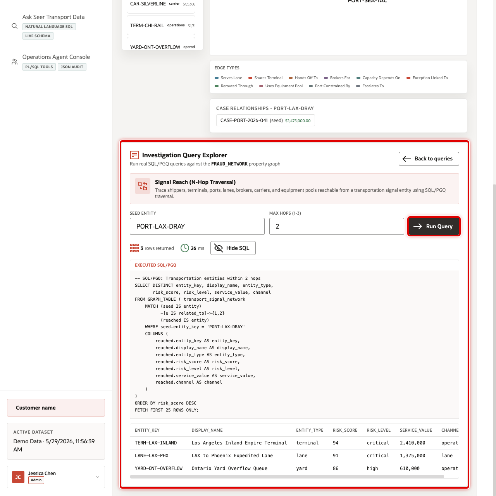

# Investigate a Transportation Risk Network

## Introduction

Bob is the graph specialist investigating how disruption risk can move through ports, terminals, lanes, carriers, brokers, and equipment pools. One exception can affect several services because they share the same hub or operating dependency. Repeated relational self-joins become difficult to read and maintain as the number of relationship hops grows.

Oracle Property Graph lets Bob describe the relationship pattern directly while the vertices and edges remain backed by governed relational tables. He can start with one named entity, control how far the investigation expands, and return a table of reached entities for review without copying sensitive network data into a separate graph store.

The image below shows the Transportation Risk Network workspace used by network investigators and operations leaders. It begins with a readable depth around a selected entity and allows the investigator to expand only when the business question requires it. The SQL/Property Graph Queries (SQL/PGQ) in this lab produce the table evidence behind that visualization.





### Objectives

- Inspect the transportation graph and its source tables.
- Start with one named exception case and trace its linked entities through two directed network hops.
- Find high-risk entities in that case that share a terminal, yard, or port.

Estimated Time: **10 minutes**

### Hands-on Scenario

| Step | Transportation focus |
| --- | --- |
| Business Problem | An exception can propagate across shared transportation dependencies |
| Technical Challenge | Multi-hop relationships are hard to review with repeated joins |
| Persona Focus | Bob, the graph specialist, exposes the connected evidence |
| What You Will Do | Start from `CASE-PORT-2026-041`, trace relationship evidence, and compare shared hubs |
| Database Capability | Oracle Property Graph and SQL/PGQ `GRAPH_TABLE` |
| Outcome | Investigators prioritize connected risk for human review |

<details>
<summary><strong>Key terms: seed entity, hop, vertex, and edge</strong></summary>

> - The **seed entity** is the port, terminal, carrier, or other node where an investigation starts. In Task 2, `CASE-PORT-2026-041` supplies the case context and `PORT-LAX-DRAY` is one linked seed entity.
>
> - A **hop** crosses one relationship. A one-hop result connects directly to the seed; a two-hop result crosses one intermediate dependency.
>
> - A **vertex** represents an entity or exception case. An **edge** records a relationship such as `contains_entity`, `shares_terminal`, or `rerouted_through`. These relationships matter because two services can share operational risk even when their tabular records are not adjacent.

</details>

> **SQL Worksheet reminder:** Return to [Getting Started Task 2](?lab=getting-started#Task2:OpenSQLWorksheet) if you need the SQL Worksheet steps.

## Task 1: Inspect the graph sources

`TRANSPORT_SIGNAL_NETWORK` is the property graph used in this lab. It is a query layer over relational entity, relationship, and exception-case views, not a disconnected graph copy. Count those source rows first so you know what business evidence is available to the traversal.

1. Run the source summary.

    ```sql
    <copy>
    SELECT 'ENTITIES' AS graph_component, COUNT(*) AS row_count
    FROM transport_network_entities_v
    UNION ALL
    SELECT 'RELATIONSHIPS', COUNT(*)
    FROM transport_network_relationships_v
    UNION ALL
    SELECT 'EXCEPTION_CASES', COUNT(*)
    FROM transport_exception_cases_v;
    </copy>
    ```

    **Expected output: Graph Source Summary**

    | Graph Component | Row Count |
    | --- | ---: |
    | ENTITIES | Greater than 0 |
    | RELATIONSHIPS | Greater than 0 |
    | EXCEPTION\_CASES | Greater than 0 |

The three counts represent the graph building blocks: the entities under review, their relationships, and the operational exceptions that give those connections business meaning.

## Task 2: Trace the named exception through the network

This query starts at the named port-congestion exception, follows `contains_entity` to one of its linked transportation entities, and then follows exactly two directed `related_to` network relationships. Each output row is one full path, so repeated endpoints remain visible when the case reaches the same entity through different evidence paths. Read the graph syntax in five parts:

- `case_vertex IS exception_case` identifies the case, and the `WHERE` clause fixes it at `CASE-PORT-2026-041`.
- `-[case_edge IS contains_entity]->` makes the case-to-entity evidence explicit, including its case role and evidence score.
- `-[hop_1 IS related_to]->` and `-[hop_2 IS related_to]->` form a bounded, directed two-hop path.
- `COLUMNS` projects both relationship types and the intermediate entity, so the result shows the actual path rather than only its endpoint.
- `ONE ROW PER MATCH` keeps one row for each complete path; it deliberately does not hide alternative paths with `DISTINCT`.

Look for the case role, the two edge types, and the intermediate entity before interpreting the reached entity's risk. This is relationship evidence for review, not proof that the endpoint caused the exception.

1. Run the traversal.

    ```sql
    <copy>
    SELECT exception_case,
           seed_entity,
           case_role,
           case_evidence_score,
           2 AS network_hops,
           hop_1_relationship,
           intermediate_entity,
           hop_2_relationship,
           reached_entity,
           reached_type,
           reached_risk,
           reached_risk_level
    FROM GRAPH_TABLE (
      transport_signal_network
      MATCH (case_vertex IS exception_case)
            -[case_edge IS contains_entity]->
            (seed IS entity)
            -[hop_1 IS related_to]->
            (intermediate IS entity)
            -[hop_2 IS related_to]->
            (reached IS entity)
      WHERE case_vertex.case_ref = 'CASE-PORT-2026-041'
      ONE ROW PER MATCH
      COLUMNS (
        case_vertex.case_ref AS exception_case,
        seed.entity_key AS seed_entity,
        case_edge.role AS case_role,
        case_edge.evidence_score AS case_evidence_score,
        hop_1.relationship_type AS hop_1_relationship,
        intermediate.entity_key AS intermediate_entity,
        hop_2.relationship_type AS hop_2_relationship,
        reached.entity_key AS reached_entity,
        reached.entity_type AS reached_type,
        reached.risk_score AS reached_risk,
        reached.risk_level AS reached_risk_level
      )
    )
    ORDER BY reached_risk DESC,
             seed_entity,
             intermediate_entity,
             reached_entity
    FETCH FIRST 25 ROWS ONLY;
    </copy>
    ```

    **Expected output: Case-to-Network Paths**

    | Exception Case | Seed Entity | Network Hops | Relationship Evidence | Reached Entity |
    | --- | --- | ---: | --- | --- |
    | CASE-PORT-2026-041 | PORT-LAX-DRAY or another case-linked entity | 2 | Two recorded `related_to` types and the intermediate entity | A transportation entity reached by that path |

    The image below shows the SQL/PGQ result behind the network view. Bob uses the table to review exact entity keys and scores before expanding the visual investigation.

    

The traversal does not prove that every reached entity caused the disruption. It gives Bob a bounded review set with the case membership, relationship types, hop count, and intermediate entity visible on each path.

## Task 3: Find shared constrained hubs

After tracing the named exception, Bob uses this separate, network-wide pattern to find high-risk entities that connect to the same terminal, yard, or port. In the `MATCH` pattern, `a` and `b` are the reviewed entities and `shared` is their common hub. The relationship types remain in the result so Bob can see how each entity reaches the hub. Both sides must have risk at least 75, which makes the resulting average at least 75. Each returned row is a distinct pair-of-edges evidence pattern; no `DISTINCT` suppresses additional paths. The score is a prioritization aid, not proof of cause or an automatic enforcement decision.

1. Run the shared-hub query.

    ```sql
    <copy>
    SELECT source_entity,
           shared_terminal,
           shared_type,
           source_relationship,
           related_entity,
           related_relationship,
           source_risk,
           related_risk,
           ROUND((source_risk + related_risk) / 2, 1) AS combined_risk
    FROM GRAPH_TABLE (
      transport_signal_network
      MATCH (a IS entity)
            -[e1 IS related_to]-> (shared IS entity)
            <-[e2 IS related_to]- (b IS entity)
      WHERE a.entity_id < b.entity_id
        AND shared.entity_type IN ('terminal', 'yard', 'port')
        AND a.risk_score >= 75
        AND b.risk_score >= 75
      COLUMNS (
        a.entity_key AS source_entity,
        shared.entity_key AS shared_terminal,
        shared.entity_type AS shared_type,
        e1.relationship_type AS source_relationship,
        b.entity_key AS related_entity,
        e2.relationship_type AS related_relationship,
        a.risk_score AS source_risk,
        b.risk_score AS related_risk
      )
    )
    ORDER BY combined_risk DESC, shared_terminal
    FETCH FIRST 25 ROWS ONLY;
    </copy>
    ```

    **Expected output: Shared Hub Review**

    | Source Entity | Shared Terminal | Related Entity | Combined Risk |
    | --- | --- | --- | ---: |
    | High-risk transportation entity | Terminal, yard, or port key | Connected high-risk entity | 75 or higher |

The shared hub and the two relationship types explain *why* the entities appear together. That relationship evidence gives an investigator a defensible reason to review the pair instead of relying on a score with no visible path.

🎯 **Interactive challenge: Trace a one-hop case path.**

Remove the second `related_to` relationship in Task 2. Which direct network dependencies appear after the case-linked seed entity, and what relationship type connects each one?

**Expected output: Direct Case Dependencies**

| Exception Case | Seed Entity | Relationship Type | Direct Entity |
| --- | --- | --- | --- |
| CASE-PORT-2026-041 | A case-linked entity | Recorded `related_to` type | Entity directly connected to the seed |

<details>
<summary><strong>Challenge answer: Review the direct case path</strong></summary>

Run the direct network-hop traversal:

    ```sql
    <copy>
    SELECT exception_case,
           seed_entity,
           case_role,
           network_relationship,
           reached_entity,
           reached_type,
           reached_risk,
           reached_risk_level
    FROM GRAPH_TABLE (
      transport_signal_network
      MATCH (case_vertex IS exception_case)
            -[case_edge IS contains_entity]->
            (seed IS entity)
            -[network_edge IS related_to]->
            (reached IS entity)
      WHERE case_vertex.case_ref = 'CASE-PORT-2026-041'
      ONE ROW PER MATCH
      COLUMNS (
        case_vertex.case_ref AS exception_case,
        seed.entity_key AS seed_entity,
        case_edge.role AS case_role,
        network_edge.relationship_type AS network_relationship,
        reached.entity_key AS reached_entity,
        reached.entity_type AS reached_type,
        reached.risk_score AS reached_risk,
        reached.risk_level AS reached_risk_level
      )
    )
    ORDER BY reached_risk DESC,
             seed_entity,
             reached_entity
    FETCH FIRST 25 ROWS ONLY;
    </copy>
    ```

One network hop gives the clearest direct dependencies. Compare these rows with the two-hop paths from Task 2: the second task adds a named intermediate entity and a second relationship type. Expanding to two hops can reveal propagation, but it can also widen the review queue, so inspect the direct evidence first.

</details>

## Conclusion

Bob described transportation relationships directly with SQL/PGQ while the source entities and edges remained in Oracle Autonomous AI Database. The graph makes multi-hop evidence easier to express, while database governance and the relational source remain intact. Seer Transport gains a focused investigation path without creating another copy of network-sensitive data.

## Next Steps

Continue with Oracle Spatial to add candidate-terminal evidence to a transportation review. For deeper practice with property graphs and relationship analysis, open the [Property Graph LiveLabs workshop](https://livelabs.oracle.com/ords/r/dbpm/livelabs/view-workshop?clear=RR,180&wid=3978).

## Acknowledgements

* **Author** - Oracle Database Product Management
* **Last Updated By/Date** - Oracle Database Product Management, September 2026
