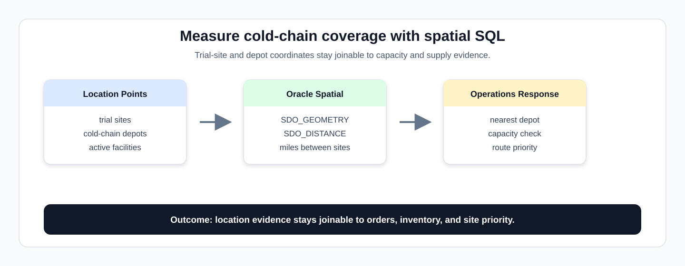
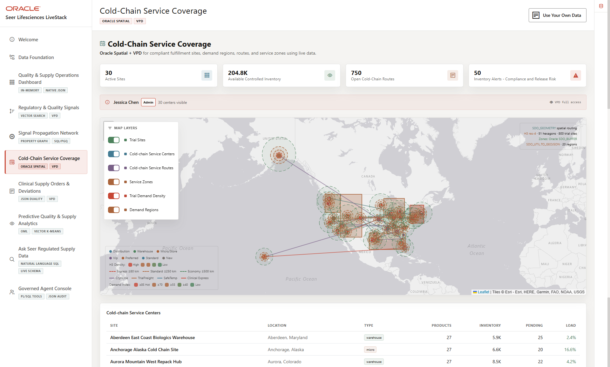

# Cold-Chain Service Coverage with Oracle Spatial

## Introduction

After a supply or quality issue is identified, **Seer Lifesciences** needs to know whether cold-chain capacity is close enough to respond. This lab uses Oracle Spatial to answer a practical operations question: *Where are trial sites, where are cold-chain depots, and which locations can support the response?*



The image below is the Cold-Chain Service Coverage screen from the Seer Lifesciences application. It shows the map layers, depot locations, routes, service zones, inventory alerts, and site table that the spatial SQL in this lab turns into measurable distance and capacity evidence.



### Objectives

- Find cold-chain sites nearest to a trial site.
- Inspect cold-chain site utilization and supply capacity.

Estimated Time: **10 minutes**

### Business Scenario

| Step | Life sciences focus |
| --- | --- |
| Business Problem | Supply leaders need to know whether cold-chain capacity is close enough to trial sites and high-demand regions. |
| Technical Challenge | Operations teams need location-aware decisions without moving geography and inventory into separate mapping systems. |
| Persona Focus | Supply operations leaders evaluate coverage; database developers show distance and capacity evidence with spatial SQL. |
| What You Will See | Spatial data can quantify distance and capacity pressure in SQL. |
| Database Capability | `SDO_GEOMETRY`, `SDO_GEOM.SDO_DISTANCE`, and Life Sciences semantic views support coverage analysis. |
| Outcome | Operations teams can prioritize cold-chain response based on geography and governed supply data. |

<details>
<summary><strong>Key terms: spatial data, point, boundary, and distance</strong></summary>

> - **Spatial data** stores location or shape information in the database. In this lab, trial sites and cold-chain depots are stored as locations that SQL can measure.
>
> - A **point** is a single location, such as a trial site or cold-chain depot.
>
> - A **boundary** is a geographic area, such as a service region or coverage zone, when the application needs to reason about area coverage.
>
> - **Distance** tells the operations team how far one location is from another. Keeping distance and capacity data together in Oracle Database helps planners compare response options without moving location data into a separate mapping store.

</details>

## Task 1: Calculate nearest cold-chain sites for a trial site

Start by calculating the nearest cold-chain sites for a trial site so the response discussion begins with distance and geography, not guesswork:

1. Run this spatial distance query:

  **Note:**
      In order to understand this query, read it in four parts.

    1. `LS_TRIAL_SITES_V` gives you the trial-site business context.
    2. `LS_COLD_CHAIN_SITES_V` gives you cold-chain site names and capacity.
    3. The reusable physical tables `CUSTOMERS` and `FULFILLMENT_CENTERS` hold the `SDO_GEOMETRY` point columns. In this Life Sciences workflow, they represent trial sites and cold-chain depots.
    4. `SDO_GEOM.SDO_DISTANCE` measures distance in miles, and the sort returns the closest covered pairs first.

    > **SQL Worksheet reminder:** Need a reminder on how to open and use the SQL Worksheet? Return to [Getting Started Task 2: Open SQL Worksheet](/workshops/sandbox/index.html?lab=getting-started#Task2:OpenSQLWorksheet) for the step-by-step graphic showing where to paste and run SQL statements.

    ```sql
    <copy>
    SELECT sites.trial_site_name,
           sites.city AS trial_site_city,
           cold.cold_chain_site_name,
           cold.city AS cold_chain_city,
           cold.utilization_pct,
           ROUND(SDO_GEOM.SDO_DISTANCE(
             c.location,
             fc.location,
             0.005,
             'unit=MILE'
           ), 2) AS distance_mi
    FROM ls_trial_sites_v sites
    JOIN customers c ON c.customer_id = sites.trial_site_id
    CROSS JOIN ls_cold_chain_sites_v cold
    JOIN fulfillment_centers fc ON fc.center_id = cold.cold_chain_site_id
    WHERE c.location IS NOT NULL
      AND fc.location IS NOT NULL
      AND cold.is_active = 1
    ORDER BY SDO_GEOM.SDO_DISTANCE(c.location, fc.location, 0.005, 'unit=MILE')
    FETCH FIRST 5 ROWS ONLY;
    </copy>
    ```

    **Expected output: Trial Site Cold-Chain Coverage**

    | Trial Site Name | Trial Site City | Cold Chain Site Name | Cold Chain City | Utilization Pct | Distance Mi |
    | --- | --- | --- | --- | --- | --- |
    | Site LasVegas-1211 | Las Vegas | North Las Vegas West Storage Site | North Las Vegas | 0.0 | 0.2 |
    | Site LasVegas-1841 | Las Vegas | North Las Vegas West Storage Site | North Las Vegas | 0.0 | 0.65 |
    | Site LasVegas-1631 | Las Vegas | North Las Vegas West Storage Site | North Las Vegas | 0.0 | 0.86 |
    | Site LasVegas-0371 | Las Vegas | North Las Vegas West Storage Site | North Las Vegas | 0.0 | 0.9 |
    | Site LasVegas-1141 | Las Vegas | North Las Vegas West Storage Site | North Las Vegas | 0.0 | 0.97 |

2. Review the nearest site.

    The so what: distance and utilization should be read together. A nearby depot that is overloaded may not be the best response option, while a slightly farther depot with more available capacity may be operationally safer.

**Note:** Sample values may change after data refreshes or rebuilds. Focus on the expected result pattern and the business takeaway, not the exact values.

## Task 2: Summarize cold-chain capacity

Next, summarize cold-chain capacity so planners can compare controlled storage, utilization, available units, reserved units, and inbound supply in one reviewable result:

1. Run this capacity summary.

    ```sql
    <copy>
    SELECT cold.cold_chain_site_name,
           cold.cold_chain_site_type,
           cold.city,
           cold.controlled_storage_capacity,
           cold.utilization_pct,
           SUM(cap.available_units) AS available_units,
           SUM(cap.reserved_units) AS reserved_units,
           SUM(cap.incoming_units) AS incoming_units
    FROM ls_cold_chain_sites_v cold
    JOIN ls_supply_capacity_v cap
      ON cap.cold_chain_site_id = cold.cold_chain_site_id
    GROUP BY cold.cold_chain_site_name,
             cold.cold_chain_site_type,
             cold.city,
             cold.controlled_storage_capacity,
             cold.utilization_pct
    ORDER BY cold.utilization_pct DESC;
    </copy>
    ```

  **Note:** The SQL groups supply capacity by cold-chain site, then compares controlled storage capacity, utilization, available units, reserved units, and incoming units.

    **Expected output: Cold-Chain Capacity Summary**

    | Cold Chain Site Name | Cold Chain Site Type | City | Controlled Storage Capacity | Utilization Pct | Available Units | Reserved Units | Incoming Units |
    | --- | --- | --- | --- | --- | --- | --- | --- |
    | Anchorage Alaska Cold Chain Site | Clinical Trial Depot | Anchorage | 40000 | 0.0 | 7195 | 436 | 0 |
    | Brandon Florida Micro Site | Clinical Trial Depot | Brandon | 90000 | 0.0 | 7786 | 378 | 0 |
    | Concord Southeast Micro Site | Clinical Trial Depot | Concord | 100000 | 0.0 | 6543 | 411 | 0 |
    | Fremont Bay Area Compliance Site | Clinical Trial Depot | Fremont | 120000 | 0.0 | 7087 | 325 | 0 |
    | Kapolei Pacific Island Storage Site | Clinical Trial Depot | Kapolei | 50000 | 0.0 | 6649 | 339 | 0 |
    | New Braunfels South Texas Micro Site | Clinical Trial Depot | New Braunfels | 100000 | 0.0 | 6744 | 398 | 0 |
    | Troutdale Pacific Micro Site | Clinical Trial Depot | Troutdale | 80000 | 0.0 | 5070 | 311 | 0 |
    | Aberdeen East Coast Biologics Warehouse | GMP Warehouse | Aberdeen | 240000 | 0.0 | 7038 | 410 | 0 |
    | Aurora Mountain West Repack Hub | GMP Warehouse | Aurora | 200000 | 0.0 | 4977 | 211 | 0 |
    | Etna Midwest Specialty Warehouse | GMP Warehouse | Etna | 220000 | 0.0 | 6024 | 267 | 0 |
    | Goodyear Desert Cold Chain Site | GMP Warehouse | Goodyear | 280000 | 0.0 | 8260 | 479 | 0 |
    | Kent Pacific Biologics Warehouse | GMP Warehouse | Kent | 300000 | 0.0 | 9671 | 501 | 0 |
    | Lancaster Trial Kit Storage Site | GMP Warehouse | Lancaster | 350000 | 0.0 | 7638 | 435 | 0 |
    | Lebanon Central Biologics Warehouse | GMP Warehouse | Lebanon | 250000 | 0.0 | 5618 | 405 | 0 |
    | Missouri City Gulf Coast Warehouse | GMP Warehouse | Missouri City | 300000 | 0.0 | 6152 | 358 | 0 |
    | North Las Vegas West Storage Site | GMP Warehouse | North Las Vegas | 200000 | 0.0 | 5297 | 353 | 0 |
    | Ontario Clinical Supply Warehouse | GMP Warehouse | Ontario | 750000 | 0.0 | 6476 | 381 | 0 |
    | Plainfield Heartland Clinical Hub | GMP Warehouse | Plainfield | 250000 | 0.0 | 6174 | 498 | 0 |
    | Romulus Great Lakes Bioprocess Hub | GMP Warehouse | Romulus | 200000 | 0.0 | 9602 | 529 | 0 |
    | Shakopee Trial Supply Warehouse | GMP Warehouse | Shakopee | 180000 | 0.0 | 5506 | 298 | 0 |
    | Sparks West Coast Cold Chain Hub | GMP Warehouse | Sparks | 280000 | 0.0 | 5461 | 306 | 0 |
    | West Jordan Mountain Clinical Site | GMP Warehouse | West Jordan | 180000 | 0.0 | 7482 | 441 | 0 |
    | Edison Northeast Cold Chain Depot | Regional Cold-Chain Hub | Edison | 500000 | 0.0 | 7444 | 321 | 0 |
    | Edwardsville Central Distribution Site | Regional Cold-Chain Hub | Edwardsville | 320000 | 0.0 | 5564 | 271 | 0 |
    | Fall River Northeast Safety Hub | Regional Cold-Chain Hub | Fall River | 220000 | 0.0 | 7703 | 415 | 0 |
    | Hialeah Import Compliance Site | Regional Cold-Chain Hub | Hialeah | 250000 | 0.0 | 5299 | 383 | 0 |
    | Joliet Midwest Regulatory Hub | Regional Cold-Chain Hub | Joliet | 400000 | 0.0 | 6310 | 372 | 0 |
    | Middletown Mid-Atlantic Cold Chain Hub | Regional Cold-Chain Hub | Middletown | 350000 | 0.0 | 5729 | 321 | 0 |
    | Olive Branch Memphis Logistics Site | Regional Cold-Chain Hub | Olive Branch | 400000 | 0.0 | 4733 | 287 | 0 |
    | Union City Southeast Cold Chain Hub | Regional Cold-Chain Hub | Union City | 450000 | 0.0 | 6615 | 360 | 0 |

2. Compare utilization and units.

    This query connects geography to operational capacity. The database can answer where a site is and whether it has enough controlled storage evidence to support the next supply decision.

**Note:** Sample values may change after data refreshes or rebuilds. Focus on the expected result pattern and the business takeaway, not the exact values.

## Acknowledgements

* **Author** - Oracle Database Product Management
* **Last Updated By/Date** - Oracle Database Product Management, July 2026
