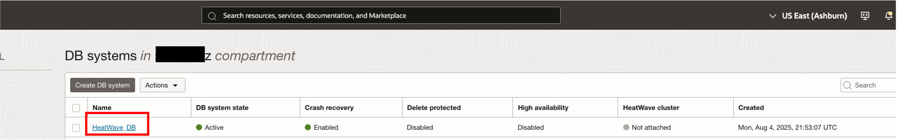
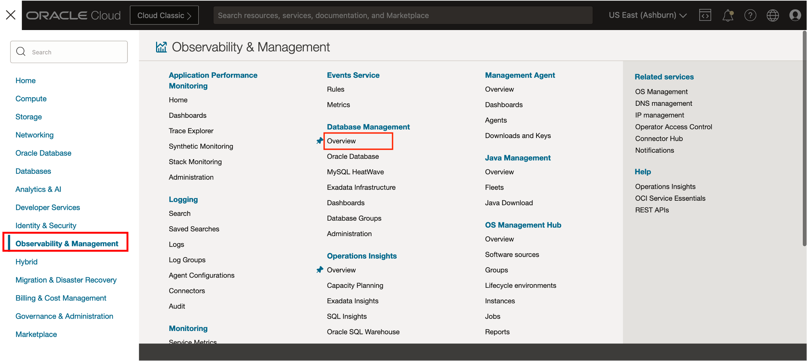
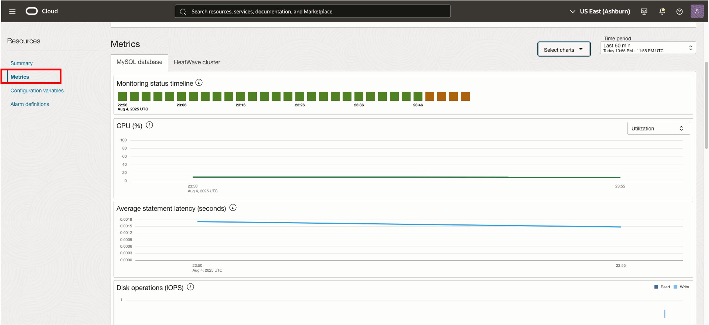
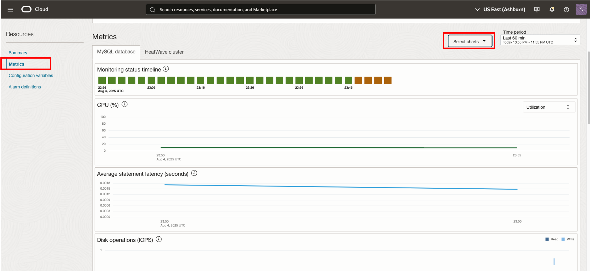
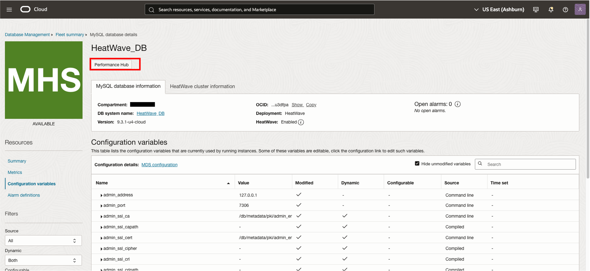
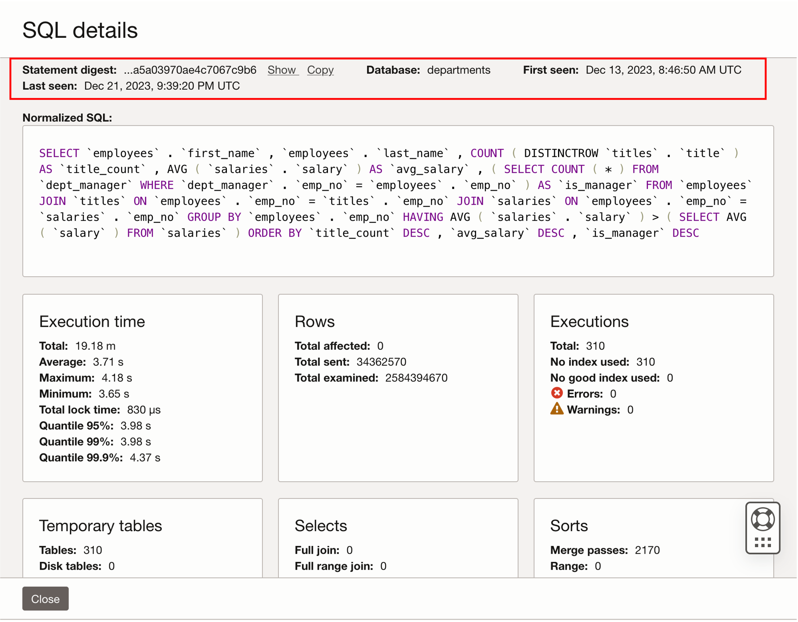
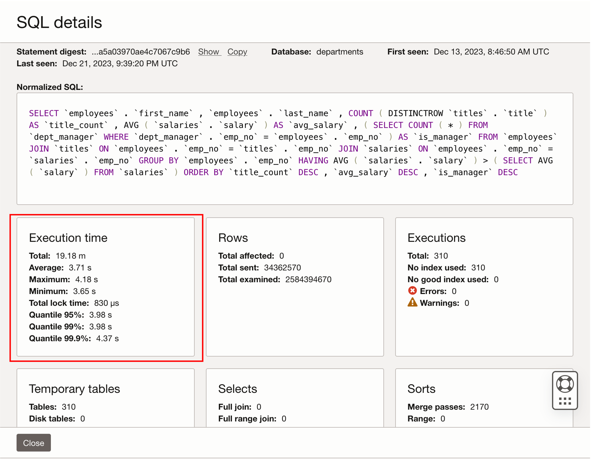
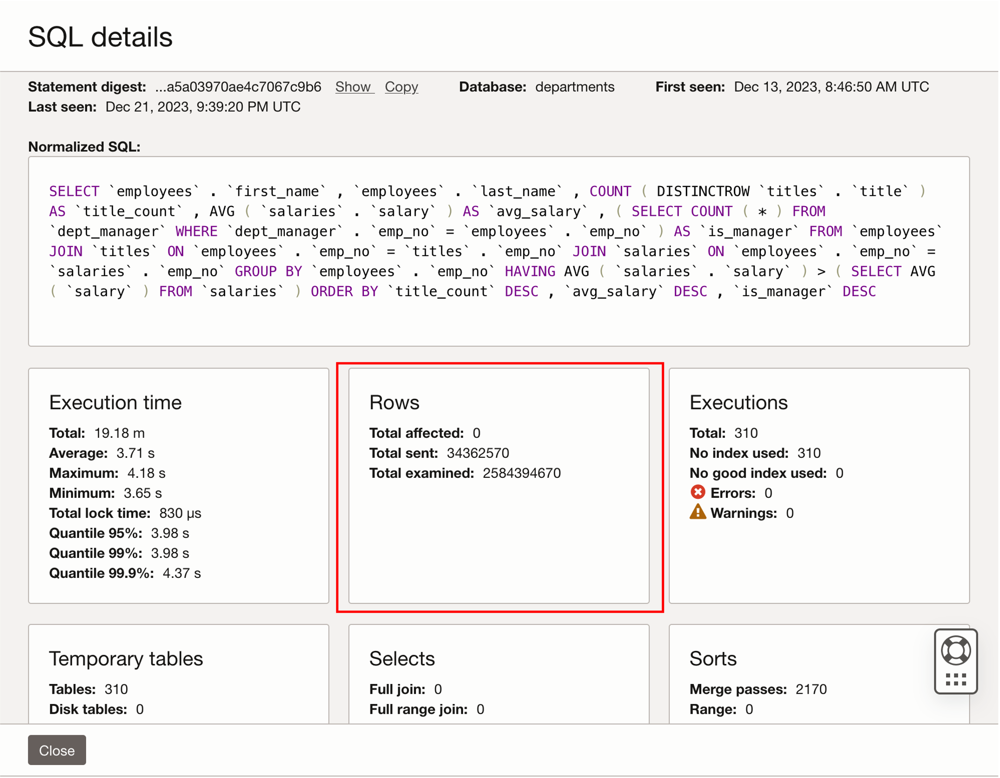

# Introduction

In this lab, you will learn how to enable Database Management for MySQL HeatWave on Oracle Cloud Infrastructure (OCI) and use it to monitor your DB system performance.

Estimated Time: 15 minutes 

### About Database Management for MySQL HeatWave
Database Management for MySQL HeatWave is a free service to monitor and manage your database environment deployments, it provides a single-pane-of-glass view of your MySQL HeatWave deployments for quickly assessing top resource utilization as well as alarm status for your entire fleet.  

Here are some of the tasks you can perform using Database Management, which are categorized under database monitoring and management areas.

* **Fleet Monitoring**
    * Obtain an overview of your fleet of MySQL HeatWave systems
    * View inventory configuration and monitoring status of your fleet
    * View a consolidated resource usage among all deployments
    * View open alarms for your deployments

* **Performance Diagnostics**
    * Diagnose database system performance quickly
    * Explore database performance utilizing metrics and Performance Hub
    * View alerts for non-optimized queries

* **Database Administration**
    * View configuration variables for the MySQL database system

### Objectives

In this lab, you will be guided through the following steps:

* Verify if Database Management service is enabled for your MySQL HeatWave DB system (enable it if not)
* Manage MySQL HeatWave Database Service

## Prerequisites

* An Oracle Free Tier, Always Free, Paid or LiveLabs Cloud Account
* An active MySQL HeatWave Service DB System

## Task 1: Verify Database Management is enabled for MySQL HeatWave 

By default, the service is enabled during the provisioning of your MySQL HeatWave deployment, but you can enable the service from the MySQL HeatWave DB system details page if not already enabled.  Once enabled, you will have additional monitoring capabilities including a fleet overview of your MySQL HeatWave deployments and Performance Hub monitoring for database systems.

1. Log in to the Oracle Cloud Console, click the **Navigation Menu** in the upper left, navigate to **Databases**, and select **DB Systems** under MySQL HeatWave
    

2. In the DB systems section, select **HeatWave_DB**.
    

3.	Verify Database Management is enabled in the Associated services section of the DB system information.

    **If already enabled, proceed to the next task**
    

4.	If Database Management is **not enabled**, click on the **Enable** link to launch the enablement window. 

    

5. Click on the **enable** button.
    

## Task 2: Overview of MySQL Database Management

1. Click the **Navigation Menu** in the upper left, navigate to **Observability & Management**, and select **Overview under Database Management**
    

2.	The MySQL databases (on the Overview page) displays the total number of MySQL HeatWave deployments in the compartment and the number of MySQL HeatWave deployments for which Database Management is **enabled**
    

## Task 3: Database Management for MySQL HeatWave fleet summary 

1.	On the left pane, click **Diagnostics & Management**  
    
    

2.	Then, click **HeatWave & MySQL**  to navigate to the MySQL HeatWave fleet summary page. 
    

    The following tiles are available on the fleet summary page:
    * **Inventory:**  Displays the number of MySQL HeatWave systems in the compartment and enables quick assessment of version disparity between the monitored systems.
    * **Monitoring status:**  Displays the monitoring status of the MySQL HeatWave systems.  The overall health of your systems can be seen here.
    * **Resource usage:**  Displays a summary of the overall CPU, storage, and memory utilization of all deployed and monitored HeatWave systems.
    * **Alarms:**  Displays all open alarms in your monitored MySQL HeatWave systems.  You can view more granular details on the alarms by clicking the link.
    * **MySQL HeatWave system:**  A table listing top individual statistics for a monitored HeatWave system.  You can assess the overall resource utilization and health of your environment at a glance.  The table provides a search feature as well as sortable columns to find systems consuming the most resources.

    
## Task 4: Monitor a single MySQL HeatWave instance
1.	Select **HeatWave_DB** from the list of monitored deployments.
    

     *	 **MySQL database information section** : We can view information for the MySQL HeatWave DB system as well as associated alarms. The alarms section allows drill down to specific errors to quickly resolve any issues that may be occurring within your database.
        
     
     *  **Summary section**: We can monitor database performance attributes for the time period selected in the Time period menu on the top of this page.  Last 60 min is the default time period, and the visual representations or charts provide a quick insight into the health of the database system during the selected time period.
     
        * **Monitoring status timeline**:  Shows if Database Management can collect monitoring metrics for the resource. The Monitoring stopped status indicates metric collection issues caused by network, connection, missing data, or that a resource is down.
     
        * **Top metric charts**:  Key metrics are provided in a single group of charts in the summary section to quickly assess the overall health of your DB system.  Resource charts can be toggled between utilization and usage to provide additional granularity.

        
     
2. On the left pane, click **All metrics** section
    

    Here, you can monitor a wide range of key MySQL database metrics across areas to proactively investigate and identify the root cause of performance issues. The charts in this section include those displayed in the Summary section and other metric charts. 
    
3. In addition to the charts displayed in this section, you can select other metric charts from the Select charts drop-down list for an in-depth examination using different indicators.  Click the **Select charts** button

    
     
     
3. Here, you can toggle which metrics to include in the console. 
    

4. On the left pane, click **Configuration Variables** section  
    
    Here, you can monitor the configuration variables that are **currently used** by the MySQL database. 
    

    * **Note:** Configuration variables are the user, system, initialization, or service-specific variables that define the operation of a MySQL DB system.  The Configuration variables section provides the details of the variables and the option of navigating to the MySQL HeatWave service to edit the variables if required.

4. You can filter and sort the configuration variables based on **source**, **dynamic property**, or **configuration details** utilizing filters in the Filters section
    

## Task 5: Realtime Performance Diagnosis 
1.	On the top of the **HeatWave_DB** details page, click the **Performance Hub** button.
    

2.	This will launch the Performance Hub page.  
    * Performance Hub provides a single view of the DB system’s performance and enables you to perform a rapid diagnosis of its issues.
    * It provides holistic performance management capabilities providing a single view of the database performance using a varied set of features, such as Active statement latency, statement count charts, top 100 queries sorted by metrics, and the ability to drill down into specific SQL details.  
    * Additional details for SQL statements include SQL text, execution statistics, row information, temporary table usage, and select and sort counts.  
    * It enables developers and DBAs to quickly improve the performance of their database applications by monitoring query performance. Accurately pinpoint the SQL code that is causing a slowdown by making use of the rich graphs that drill down into detailed query information, thereby providing significantly better visibility into database performance issues. With Performance Hub, developers can improve SQL code during active development as well as continuously monitor and tune queries running on production systems.

    

3.	The default sorting for statements is Average statement latency.  Click on the **top SQL** to see additional details on the query.

    

    * SQL details provide in-depth metrics associated with a query, it consists of different sections:   
    
        * **First and last seen times** provide more information on when a SQL was loaded into the database and narrows the scope of impact on the database.  
            

        * **Normalized SQL** displays the Full SQL text, to validate the query running against the database.  
             

        * **Execution time** provides key details into query performance over time and allows a DBA to see variability associated with a statements performance utilizing maximum/minimum run times and quantiles to compare execution length for all runs of the query
            

        * **Rows** provide work associated with the query 
            
            
        * **Executions** provide a total count of executions for a single query and their usage of indexes to retrieve the data.  
            

        * Additional tiles provide performance data to further analyze the overall performance for a single query and allows the DBA and developers tools to assess impact and tune query performance.
            

## Acknowledgements

- **Author** - Derik Harlow, MySQL Product Manager 
- **Contributors** - Derik Harlow, MySQL Product Manager; Sriram Vrinda, MySQL Product Manager; Perside Foster, MySQL Solution Engineering; Selena Sánchez MySQL Solution Engineering
- **Last Updated By/Date** - Selena Sánchez, MySQL Solution Engineering, August 2025

