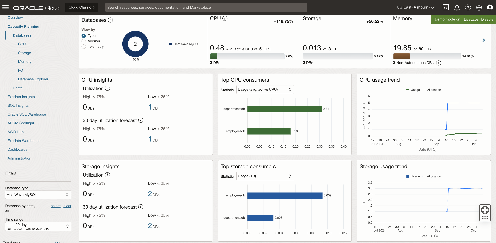
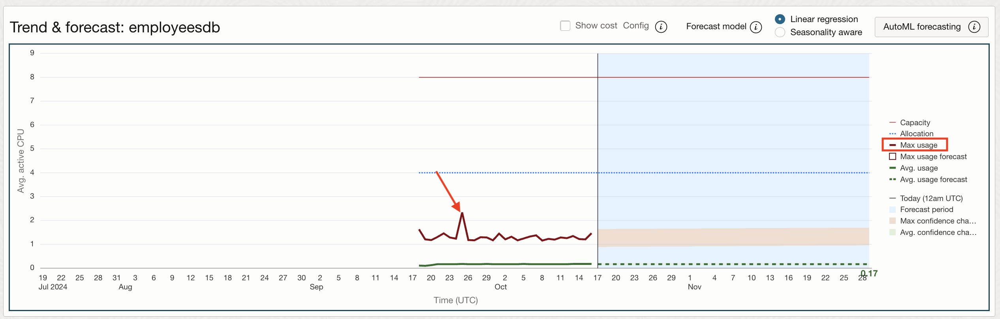
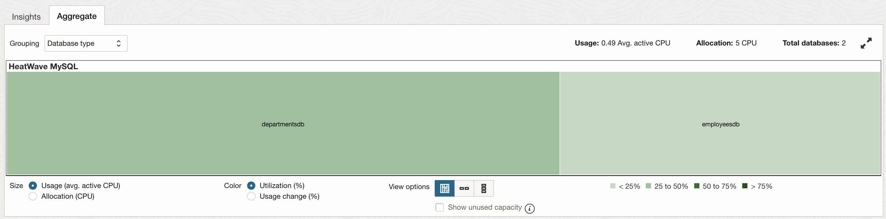
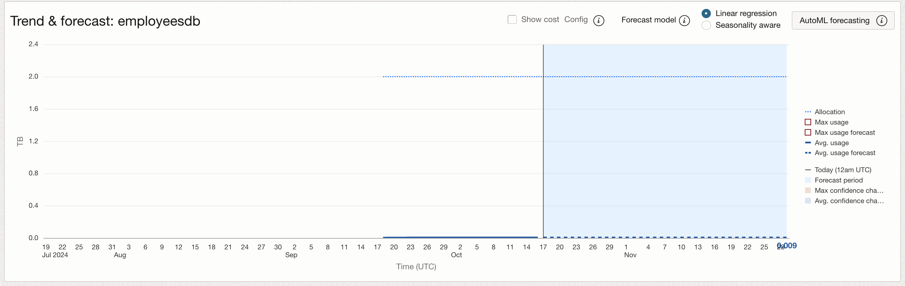
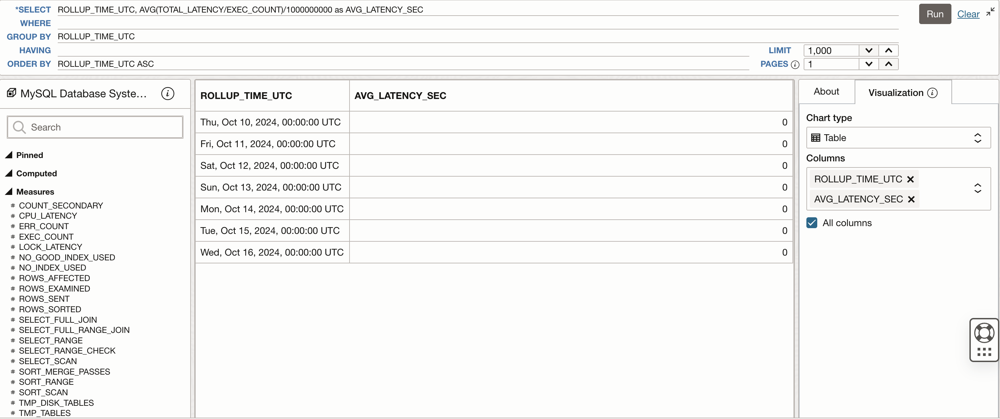
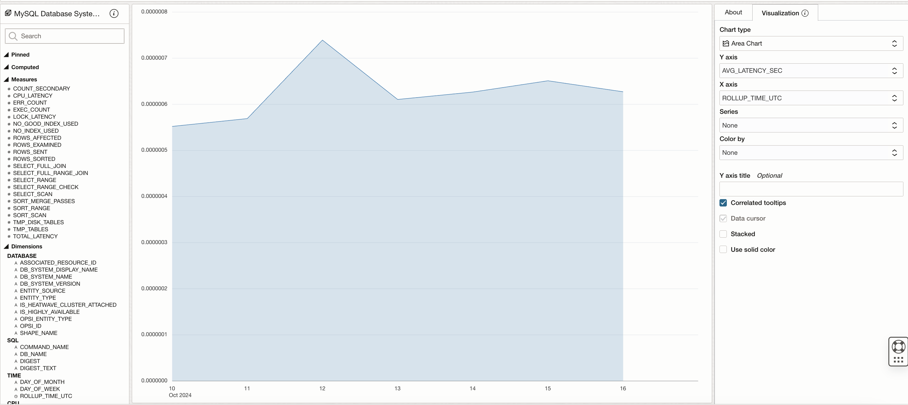

# Enable Demo Mode for Ops Insights

## Introduction

In this lab, you will go through the steps to enable Demo Mode for Oracle Cloud Infrastructure Ops Insights.

Estimated time: 10 minutes

### Objectives

- Log into OCI Tenancy.
- Enable Ops Insights Demo Mode.

### Prerequisites

- Your Oracle Cloud Trial Account

## Task 1: Enable Demo Mode

1.  To access Ops Insights, click on the Oracle Cloud Console **Navigation menu** (aka hamburger menu) located in the upper left. Under **Observability & Management**, go to **Ops Insights** and click **Overview**.

      

2.  Click on **Enable Demo Mode** to enable Demo Mode.

      

3.  On the **Complete prerequisites** pop-up click on **Apply**. When enabling demo mode, a policy is created to allow read-only access to the demo tenancy's data. It may take up to 1 or 2 minutes for the policy to allow data access across the tenancies.  If you are receiving authorization errors you may need to refresh the page until they have cleared, or you will need to engage an administrator or user with elevated privileges to create the policy.

      

4.  Click **Close** after the policy has been created.

      

5.  Once the mode is enabled the overview page will now show resource information for the OperationsInsights compartment, notice the upper-right hand corner will show Demo Mode is now ON for your session.  When you would like to exit demo mode you can either click the disable link in the corner or click the now present **Disable Demo Mode** button where you initially enabled it on the overview page.

      

6.  On the left-hand pane you will find links to quickly navigate to OPSI offerings including Capacity Planning, Exadata Insights, Oracle SQL Warehouse, AWR Hub, and Dashboards.  

      

## Task 2: Capacity Planning - Databases

1.  On the **Ops Insights Overview** page, from the left pane click on **Capacity Planning**.

      

2.  On the **Database Capacity Planning** page, you will obtain a fleet-wide overview of your resource consumption and trends.  CPU insights, storage insights, and memory insights give a quick view into top resource consumers now and forecast potential resource bottlenecks over the selected period.

      

    From this page you can perform the following tasks in support of the Capacity Planning use case goals:

    * View total allocation and utilization of CPU, Storage, Memory, and I/O resources for all (enabled) databases in the compartment
    * Identify top-5 databases of CPU, Storage, and Memory by absolute usage or utilization percentage
    * Identify top-5 databases by CPU, Storage, and Memory growth over the period
    * See aggregated historical usage trends for CPU, Storage, and Memory over the period

3.  On the **Database Capacity Planning** page, you will obtain a fleet-wide overview of your resource consumption and trends.  CPU insights, storage insights, and memory insights give a quick view into top resource consumers now and forecast potential resource bottlenecks over the selected period.

      

4.  From **Time Range** on the left pane select **Last 90 days**.

      

      You can filter based on **Time range**, **Database type** or **Tags**. This let’s you customize the fleet of database of your choice by using combination of one of these.

      

5.  Review the **Inventory** section. The **Inventory** section displays the total number of databases enabled for Ops Insights along with the database types. In addition, the CPU, Storage, Memory, and I/O usage charts display overall resource consumption (Top Consumers and Usage Trend) by these database targets.

      

6.  **CPU Insights** - Database utilization percentage for the 90th percentile value of the daily average CPU Usage over the selected time period. These sections show the number of databases running with low (0–25%) and high (75–100%) utilization of CPU.

      

7.  **Storage Insights** - Database utilization percentage for the 90th percentile value of the daily average Storage Usage over the selected time period.  These sections show the number of databases running with low (0–25%) and high (75–100%) utilization of storage.

      

8.  **Memory Insights** - Database utilization percentage for the 90th percentile value of the daily average Memory Usage over the selected time period.  These sections show the number of databases running with low (0–25%) and high (75–100%) utilization of memory.

      

## Task 3: Capacity Planning - CPU

1.  On the **Database Capacity Planning** page, from the left pane click on **CPU**.

      

2.  **Database CPU** page has a master-detail design with three primary components:

    * Insights – table of databases flagged for CPU utilization insights
    * Aggregate – treemap of CPU utilization over all databases in the compartment
    * Trend & Forecast – time series charts of CPU usage trends and forecasts for individual or groups of databases

      

3.  On the **Database CPU** page, under **Insights** tab, select **30 Day High Utilization Forecast** against **Databases**, to view database CPU utilization forecast for next 30 days.

      

4.  Under the **Database Display Name** column, select the row corresponding to the **CRM-ST** database.

      

5.  Check the **Utilization (%)** and **Usage Change (%)** for database **CRM-ST**.
    
    * Utilization (%) -  Utilization percentage for the 90th percentile value of the daily average storage usage over the selected time period
    * Usage Change (%): Percentage change in the linear trend of storage usage over the selected time

6.  The **Trend and Forecast** chart displays historical time series plots related to CPU allocation and usage for the selected database **CRM-ST**.

      

7.  Historical CPU Usage (dark solid green line) is the Avg Usage - average value of daily (hourly) CPU usage data

8.  Avg Usage Forecast - forecast of Avg Usage data using linear forecast model (Dashed Green line) and the Max Allocation - maximum allocation of CPU for the database.

9.  The value **57.51** AVG ACTIVE CPU USAGE is forecasted for after 15 days for Avg usage of CPU.

10.  Select **Max Usage** from the legend on the right side. The red line is **Max Usage** - maximum value of daily (hourly) CPU usage data for database **CRM-ST**.

      

11.  Select **Max Usage Forecast** from the legend on the right side.

      

12.  The value **77.66** AVG ACTIVE CPU USAGE is forecasted for after 15 days for Max usage of CPU.

    You can see the difference in average forecasted value v/s Max forecasted value. If the workload is critical and cannot tolerate any performance issues then the database must be allocated the max forecasted value. If the workload is not so critical and can tolerate deviations in performance then it is ok to allocate CPU based on average forecasted value and save money.

13.  The trending and forecast chart facilitates:

     * Forecast future maximum and average demand for CPU resources
     * Compare current usage to allocation to detect over-provisioning
     * Compare maximum to average usage and trends to assess demand volatility
     * Forecast difference between the maximum and average daily CPU usage to estimate potential savings from workload smoothing

14.  Click **Aggregate** on the top and from **Grouping** select **Database Type**.

      

     The page displays a Treemap of all databases breaking it down by Database Type. This lets you compare how your different, individual databases are using their resources as well as between various database types.

## Task 4: Capacity Planning - Storage

1.  Click on the **Storage** menu on the left panel.

      

2.  You get a complete view of storage usage across all Ops Insights enabled databases

      

    From here we can identify servers with underused or overused storage and also compare storage utilization between databases.

3.  From the drop-down on the top select **30 Days High Utilization Forecast**.

      

4.  In the **Trend & Forecast** chart View the storage trend and usage forecast for the selected database.

      

5.  In the **Trend & Forecast** chart View click on **Machine Learning** to project future resource consumption. Machine Learning is a more advanced model that considers seasonality.

      

6.  On the **Insights** tab select **30 Day High Utilization Forecast** for **Databases** and search the database **EAMERICA**.

      

7.  In the **Trend & Forecast** chart view select **Tablespace Breakdown** to view details on a tablespace level.

      

## Task 5: SQL Insights

1. On the **Ops Insights Overview** page, from the left pane click **SQL Insights**. On the **SQL Insights - Fleet analysis** page you can view insights and analysis over all SQL and all databases enabled in the compartment.

      

2. Click **SQL activity loadmap** to view the tree map.

         

3. Click the database **SALES-WT** to view **SQL Insights - Database: For database level insights**

      
      

      The Database analysis dashboard is designed to give a broad overview of the SQL workload executing in the database. This includes basic properties of the database and the SQL collected from it, including breakdowns of total time by command and module, and the ratio of time in SQL or PL/SQL. Insight tiles with counts of SQL with SQL having level insights quantify those issues at the database level. SQL activity is shown by day broken down by command type, exposing changes in workload over time. Execute to parse ratio and SQL count and invalidation charts expose important application properties over time.

4. Click the SQL ID **4g97w9wwspvq0** to view **SQL Insights - SQL analysis: For SQL level insights**

      

      

      This is the most granular level for SQL insights, at this level you can view a full picture of the performance properties of given SQL\_ID on a given database. This includes basic properties like the command type and text of the statement as well as average latency and execution frequency, and numerous other metrics from V$SQLSTATS. Insight tiles indicate whether the SQL level insights were true of the SQL_ID over the time period. Daily charts of total database time, average latency, and I/O enable deeper examination of the relationship of SQL plans to resource usage.

## Task 6: SQL Explorer

SQL Explorer provides an easy-to-use interface that lets you interactively explore and visualize detailed performance statistics stored in Ops Insights SQL Warehouse.

With SQL Explorer, you can explore performance statistics via a SQL query to extract the data with which to create an intuitive visualization. This provides interactive data exploration and visualization for deep exploration of application SQL performance statistics. The user interface is designed to simplify and streamline query development.

In this lab create visualuzations using pre-existing performance statistics via a SQL query.

1. In this example we will sum up all the CPU time per SQL ID for one specific DB and then sort them by descending order.

2. On the **Ops Insights Overview** page, from the left pane click **SQL Insights** and then click **SQL Explorer**.

      

3. This will take you to the **SQL Explorer** page.

      

4. Enter the following SQL in the SQL query section (copy & paste the statement line by line)

      ```
      <copy>SELECT DISPLAY_NAME,SQL_ID,sum(CPU_TIME)
            WHERE DISPLAY_NAME='SALES-WT'
            GROUP BY DISPLAY_NAME,SQL_ID
            HAVING
            ORDER BY sum(CPU_TIME)desc</copy>
      ```

      

5. Enter **20** for **LIMIT** to limit 20 records per page.

6. Click **Run** to execute the query.

7. This will display the query result in a tabular format.

      

8. Under the **Visualization** tab on the right pane, select the following -

      **Chart type** : **Bar Chart**

      **Y axis** : **SUM(CPU\_TIME)**
      
      **X axis** : **DISPLAY\_NAME**
      
      **Series** : **SQL\_ID**
      
      **Color by** : **SQL\_ID**
      
      **Y axis title** : **CPU time (s)**
      
      **Legend** : **None**
      
      Check mark **Stacked**

      

9. This will display the visualization as a Stacked Bar Chart.

10. In the second use case we will sum up all the Elapsed time per SQL ID across the fleet of Databases and then sort that in descending order.

11. Click on **Clear** to clear the query section.

      

12. Enter the following SQL in the SQL query section (copy & paste the statement line by line)

      ```
      <copy>SELECT DISPLAY_NAME,SQL_ID,sum(ELAPSED_TIME)
            WHERE
            GROUP BY DISPLAY_NAME,SQL_ID
            HAVING sum(ELAPSED_TIME)>70000000
            ORDER BY DISPLAY_NAME,sum(ELAPSED_TIME)desc</copy>
      ```

      

13. Enter **1000** for **LIMIT** to limit 1000 records per page.

14. Click **Run** to execute the query.

15. This will display the query result in a tabular format.

      

16. Under the **Visualization** tab on the right pane, select the following -

      **Chart type** : **Bar Chart**

      **Y axis** : **SUM(ELAPSED\_TIME)**
      
      **X axis** : **DISPLAY\_NAME**
      
      **Series** : **SQL\_ID**
      
      **Color by** : **SQL\_ID**
            
      **Legend** : **None**
      
      Check mark **Stacked**

      

9. This will display the visualization as a Stacked Bar Chart.

10. Click on **Advanced** Mode to view **SQL Explorer** in advanced mode. The advanced mode give you more control over the SQL queries that you are running against your database to view database performance.

      

11. This will take you to the **SQL Explorer Advanced** Mode page. Advanced mode can be used to execute your own custom queries and obtain more information above the SQLs running in the database.

      

12. Click **Views & columns and sample queries** to view available views and columns which can be used in the explorer.

      

13. **View & columns and sample queries** shows **View and columns** and **Sample query** that can be used in the explorer.

      

13. Click on a View to see the underlying columns that can be used to fetch desired data.

      


## Acknowledgements

- **Author** - Vivek Verma, Master Principal Cloud Architect, North America Cloud Engineering
- **Contributors** - Vivek Verma, Sriram Vrinda, Derik Harlow, Murtaza Husain
- **Last Updated By/Date** - Vivek Verma, Apr 2024
