## Introduction

In this lab, you will go through the steps to enable and explore Ops Insights for HeatWave MySQL DB System which includes ML based resource usage trending, capacity planning, and SQL Insights.

Estimated time: 30 minutes

### Objectives

- Log into OCI Tenancy.
- Enable Ops Insights Demo Mode.
- Explore capacity planning and SQL Insights.

### Prerequisites

- Your Oracle Cloud Trial Account

## Task 1: Enable Demo Mode

1.  To access Ops Insights, click on the Oracle Cloud Console **Navigation menu** (aka hamburger menu) located in the upper left. Under **Observability & Management**, go to **Ops Insights** and click **Overview**.

      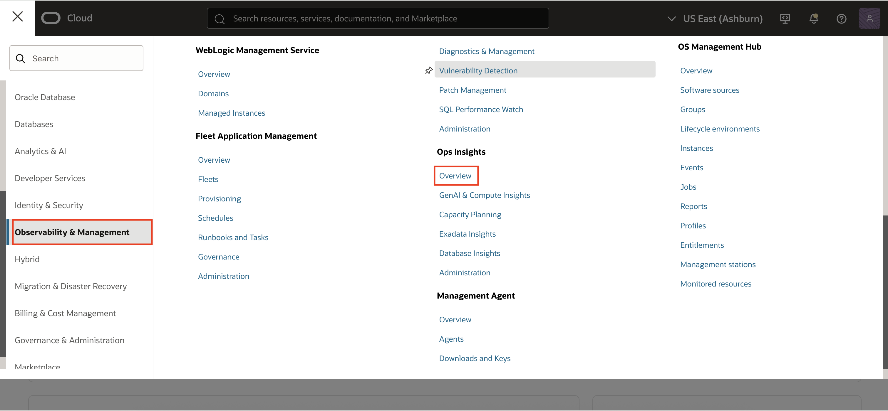

2.  Click on **Enable Demo Mode** to enable Demo Mode.

      

      **Note:** Steps 3-4 is a one-time setup that ensures data access across the tenancy. If you are re-enabling **Demo Mode** and do not see these prompts, it means the policy has already been applied.

3.  On the **Complete prerequisites** pop-up click on **Apply**. When enabling demo mode, a policy is created to allow read-only access to the demo tenancy's data. It may take up to 1 or 2 minutes for the policy to allow data access across the tenancies.  If you are receiving authorization errors you may need to refresh the page until they have cleared, or you will need to engage an administrator or user with elevated privileges to create the policy.

      

4.  Click **Close** after the policy has been created.

      

5.  Once the mode is enabled the overview page will now show resource information for the OperationsInsights compartment, notice the upper-right hand corner will show Demo Mode is now ON for your session.  When you would like to exit demo mode you can either click the disable link in the corner or click the **Disable Demo Mode** button where you initially enabled it on the overview page.

      

6.  On the left-hand pane you will find links to quickly navigate to Ops Insights offerings for HeatWave MySQL which includes Capacity Planning, SQL Insights and Dashboards.

      

## Task 2: Capacity Planning - Databases

1.  On the **Ops Insights Overview** page, from the left pane click on **Capacity Planning**.

      

2.  On the **Database Capacity Planning** page, you will obtain a fleet-wide overview of your resource consumption and trends.  CPU insights, storage insights, and memory insights give a quick view into top resource consumers now and forecast potential resource bottlenecks over the selected period.

      

    From this page you can perform the following tasks in support of the Capacity Planning use case goals:

    * View total allocation and utilization of CPU, Storage, Memory, and I/O resources for all (enabled) databases in the compartment
    * Identify top-5 databases of CPU, Storage, and Memory by absolute usage or utilization percentage
    * Identify top-5 databases by CPU, Storage, and Memory growth over the period
    * See aggregated historical usage trends for CPU, Storage, and Memory over the period

3.  From **Database type** on the left pane select **HeatWave MySQL**.

      

4.  From **Time Range** on the left pane select **Last 90 days**.

      

      You can filter based on **Time range**, **Database type** or **Tags**. This let’s you customize the fleet of database of your choice by using combination of one of these.

      

5.  Review the **Inventory** section. The **Inventory** section displays the total number of databases enabled for Ops Insights along with the database types. In addition, the CPU, Storage, Memory, and I/O usage charts display overall resource consumption (Top Consumers and Usage Trend) by these database targets.

      

6.  **CPU Insights** - Database utilization percentage for the 90th percentile value of the daily average CPU Usage over the selected time period. These sections show the number of databases running with low (0–25%) and high (75–100%) utilization of CPU.

      

7.  **Storage Insights** - Database utilization percentage for the 90th percentile value of the daily average Storage Usage over the selected time period.  These sections show the number of databases running with low (0–25%) and high (75–100%) utilization of storage.

      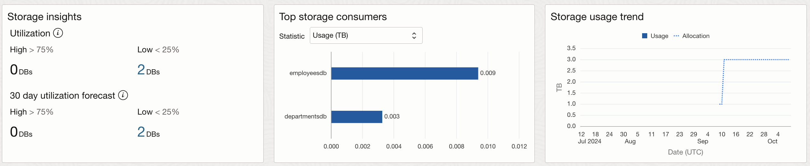

8.  **Memory Insights** - Database utilization percentage for the 90th percentile value of the daily average Memory Usage over the selected time period.  These sections show the number of databases running with low (0–25%) and high (75–100%) utilization of memory.

      

## Task 3: Capacity Planning - CPU

1.  On the **Database Capacity Planning** page, from the left pane click on **CPU**.

      

2.  **Database CPU** page has a master-detail design with three primary components:

    * Insights – table of databases flagged for CPU utilization insights
    * Aggregate – treemap of CPU utilization over all databases in the compartment
    * Trend & Forecast – time series charts of CPU usage trends and forecasts for individual or groups of databases

      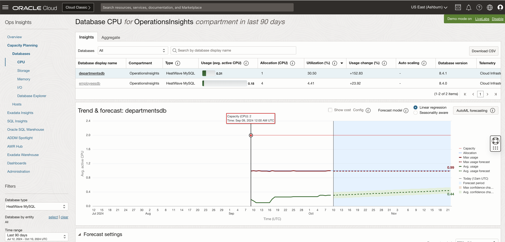

3.  On the **Database CPU** page, under **Insights** tab, select **30 Day Low Utilization Forecast** against **Databases**, to view database CPU utilization forecast for next 30 days.

      

4.  Under the **Database Display Name** column, select the row corresponding to the **employeesdb** database.

      

5.  Check the **Utilization (%)** and **Usage Change (%)** for database **employeesdb**.
    
    * Utilization (%) -  Utilization percentage for the 90th percentile value of the daily average storage usage over the selected time period
    * Usage Change (%): Percentage change in the linear trend of storage usage over the selected time

    

6.  The **Trend and Forecast** chart displays historical time series plots related to CPU allocation and usage for the selected database **employeesdb**.

      

7.  Historical CPU Usage (dark solid green line) is the Avg Usage - average value of daily (hourly) CPU usage data.

      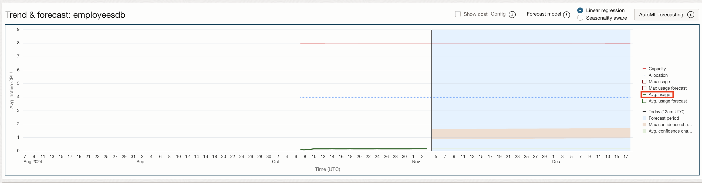

8.  Avg Usage Forecast - forecast of Avg Usage data using linear forecast model (dashed green line) and the Max Allocation - maximum allocation of CPU for the database.

      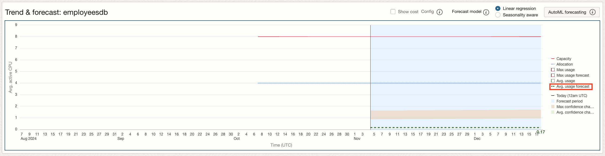

9.  The value **0.17** AVG ACTIVE CPU USAGE is forecasted for after 15 days for Avg usage of CPU.

      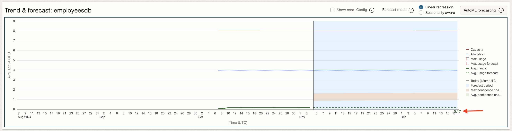

10.  Select **Max Usage** from the legend on the right side. The red line is **Max Usage** - maximum value of daily (hourly) CPU usage data for database **employeesdb**.

      

11.  Select **Max Usage Forecast** from the legend on the right side.

      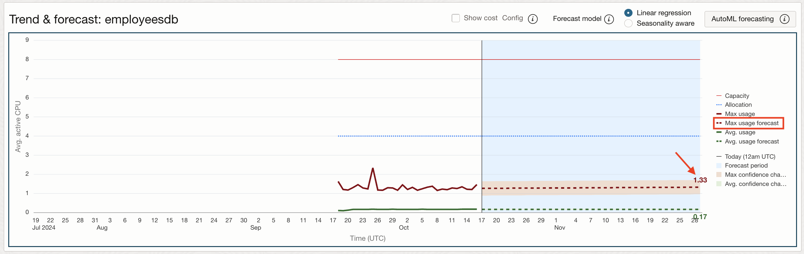

12.  The value **1.33** AVG ACTIVE CPU USAGE is forecasted for after 15 days for Max usage of CPU.

    You can see the difference in average forecasted value v/s Max forecasted value. If the workload is critical and cannot tolerate any performance issues then the database must be allocated the max forecasted value. If the workload is not so critical and can tolerate deviations in performance then it is ok to allocate CPU based on average forecasted value and save money.

13.  The trending and forecast chart facilitates:

     * Forecast future maximum and average demand for CPU resources
     * Compare current usage to allocation to detect over-provisioning
     * Compare maximum to average usage and trends to assess demand volatility
     * Forecast difference between the maximum and average daily CPU usage to estimate potential savings from workload smoothing

14.  The following models can be selected for display on the upper right of the Trend and Forecast chart:

     * **Linear regression**: The linear regression model assumes a linear relationship across variables to predict the future resource usage.

      

     * **Seasonality aware**: The seasonal option combines a simple model that detects basic seasonality with dynamic, user-selectable data.

      

     * **AutoML forecasting**: The AutoML forecasting option selects the best fit from multiple machine learning models trained on fixed data window. AutoML (Machine Learning) forecasting leverages Oracle Data Science, employing metalearning to quickly identify the most relevant features, model and hyperparameters for a given training dataset. Forecast and model are precomputed and the forecasts are periodically retrained. The forecast uses up to 13 months of data, or the highest amount of data available for a resource if the resource has less than 13 months since onboarding.
     
     On the **Database CPU** page, under **Insights** tab, select **All** against **Databases** and choose database **departmentsdb**. Within the **Trend & Forecast** chart, click **AutoML forecasting**

      

      A new pop up will appear with the AutoML forecasting charts loaded. It will state the training period and the selected forecast algorithms for maximum usage and average usage. The maximum and average confidence channels are also displayed within the chart. The confidence interval for these are 95%, meaning that 95% of future points are expected to fall within this radius from the forecast.

      

      Click **Close** to close the **AutoML forecasting** pop-up and return to **Database CPU** page.

15.  Click **Aggregate** on the top and from **Grouping** select **Database Type**.

      

     The page displays a Treemap of all databases breaking it down by Database Type. This lets you compare how your different, individual databases are using their resources as well as between various database types.

## Task 4: Capacity Planning - Storage

1.  Click on the **Storage** menu on the left panel.

      

2.  You get a complete view of storage usage across all Ops Insights enabled databases.

      

    From here we can identify servers with underused or overused storage and also compare storage utilization between databases.

3.  From the drop-down on the top select **30 Days Low Utilization Forecast**.

      

4.  In the **Trend & Forecast** chart view the storage trend and usage forecast for the selected database. View **Max usage** and **Max usage forecast** from the right panel.

      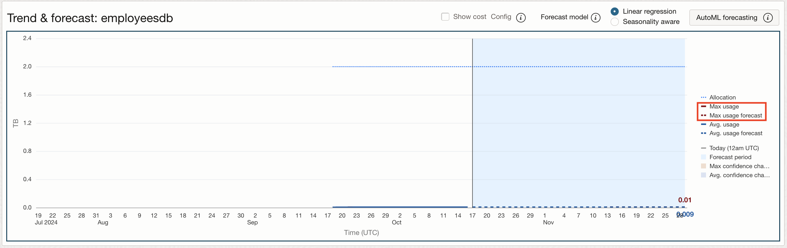

      You can see the average forecasted value v/s Max forecasted value for storage. **Max Usage Forecast** for this database is 0.01 TB, whereas **Allocation** shows that total storage allocated to this database is 2 TB. Since, allocation is more but storage used or forecasted is less, it is ok release some storage for this database and save money on storage.

6.  In the **Trend & Forecast** chart view, the **AutoML forecasting** option selects the best fit from multiple machine learning models trained on fixed data window. AutoML (Machine Learning) forecasting leverages Oracle Data Science, employing metalearning to quickly identify the most relevant features, model and hyperparameters for a given training dataset. Forecast and model are precomputed and the forecasts are periodically retrained. The forecast uses up to 13 months of data, or the highest amount of data available for a resource if the resource has less than 13 months since onboarding.

      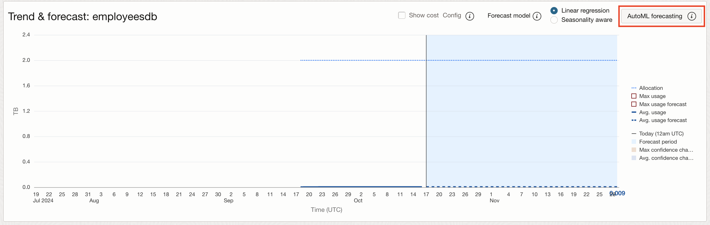
      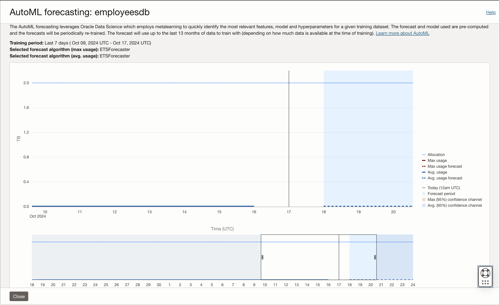

      Click **Close** to go back to the **Database Storage** page.

## Task 5: SQL Insights

1. On the **Ops Insights Overview** page, from the left pane click **SQL Insights**. On the **SQL Insights - Fleet analysis** page and filter by database type as **MySQL**. Now you can view insights and analysis for HeatWave MySQL databases enabled in the compartment.

      

3. Click the database **departmentsdb** to view **SQL Insights - Database: For database level insights**

      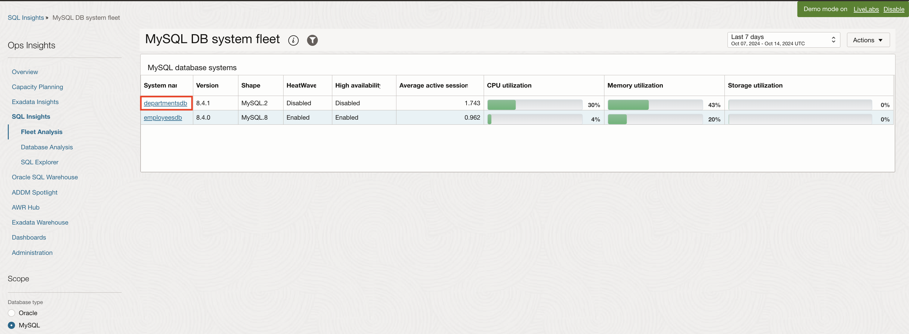

4. HeatWave MySQL DB system dashboard provides a broad overview of the SQL workload executing in the database. This includes basic properties of the database and the SQL collected from it. SQL activity is shown by day broken down by command type and database, exposing changes in the workload over time. Average Active Session (AAS) by database schemas, latency type and Top SQLs additionally provide workload characteristics over time.

      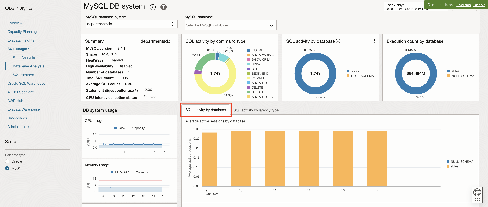

5. Click on **SQL activity by latency type**.

      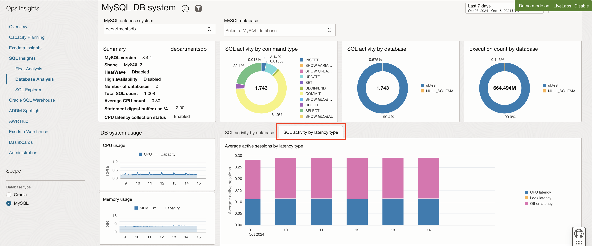

      The Database analysis dashboard is designed to give a broad overview of the SQL workload executing in the database.

## Task 6: SQL Explorer

SQL Explorer provides an easy-to-use interface that lets you interactively explore and visualize detailed performance statistics stored in Ops Insights SQL Warehouse.

With SQL Explorer, you can explore performance statistics via a SQL query to extract the data with which to create an intuitive visualization. This provides interactive data exploration and visualization for deep exploration of application SQL performance statistics. The user interface is designed to simplify and streamline query development.

In this lab create visualizations using pre-existing performance statistics via a SQL query.

1. In this example we will calculate the average latency per execution to analyze the performance of operations over time.

2. On the **Ops Insights Overview** page, from the left pane click **SQL Insights** and then click **SQL Explorer**.

      

3. This will take you to the **SQL Explorer** page.

      

4. Select **Resource type** as **MySQL**.

      

5. Remove default **\*** from SELECT statement line.

      

6. Enter the following SQL in the SQL query section (copy & paste the statement line by line)

      ```
            SELECT <copy> ROLLUP_TIME_UTC, AVG(TOTAL_LATENCY/EXEC_COUNT)/1000000000 as AVG_LATENCY_SEC
            </copy>
      ```

      ```
            <copy>WHERE</copy>
      ```

      ```
            GROUP BY <copy> ROLLUP_TIME_UTC
            </copy>
      ```

      ```
            <copy>HAVING</copy>
      ```

      ```
            ORDER BY <copy>ROLLUP_TIME_UTC ASC</copy>
      ```

      

7. Click **Run** to execute the query.

8. This will display the query result in a tabular format.

      

9. Under the **Visualization** tab on the right pane, select the following -

      **Chart type** : **Area Chart**

      **Y axis** : **AVG\_LATENCY\_SEC**

      **X axis** : **ROLLUP\_TIME\_UTC**

      Check mark **Correlated tooltips**

      

10. This will display the visualization as an **Area Chart**.

11. Click on **Clear** to clear the query section.

      

12. Click on **Advanced** Mode to view **SQL Explorer** in advanced mode. The advanced mode give you more control over the SQL queries that you are running against your database to view database performance.

      

13. This will take you to the **SQL Explorer Advanced** Mode page. Advanced mode can be used to execute your own custom queries and obtain more information above the SQLs running in the database.

      

## Acknowledgements

- **Author** - Sindhuja Banka, HeatWave MySQL Product Manager
- **Contributors** - Sindhuja Banka, Sriram Vrinda, Anand Prabhu, Murtaza Husain
- **Last Updated By/Date** - Sindhuja Banka, November 2024
