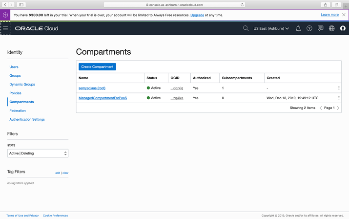
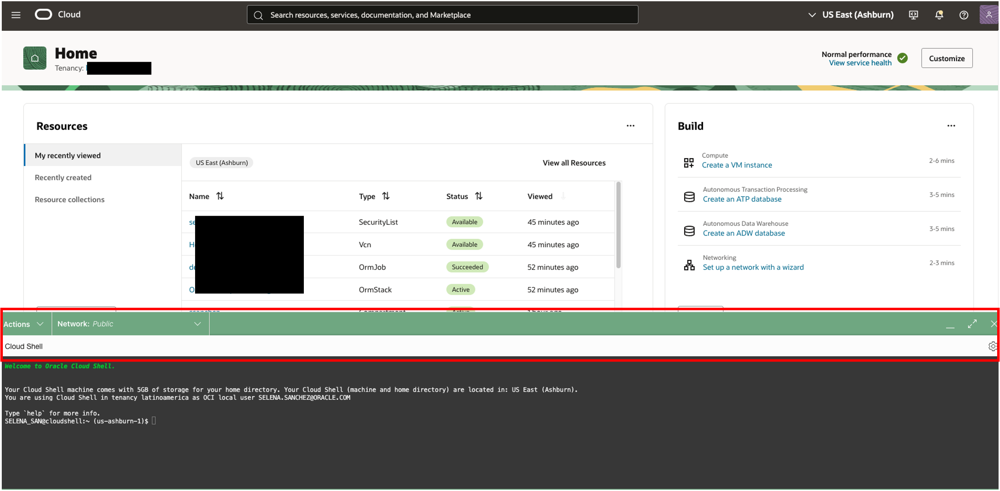
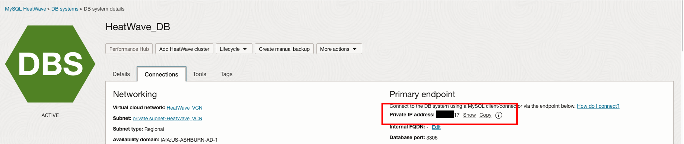
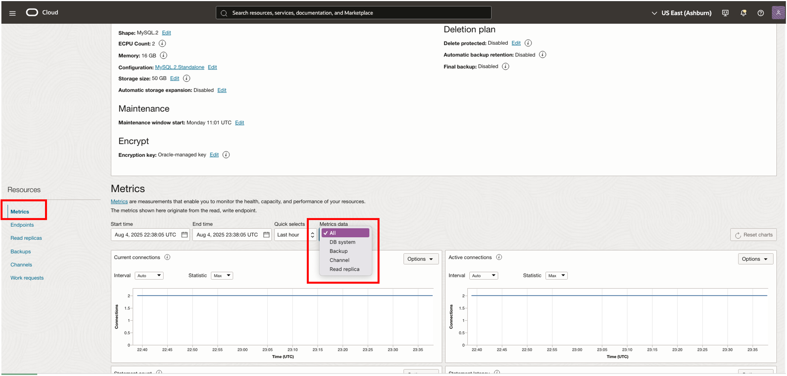

# Create and connect to MySQL HeatWave Service

## Introduction

In this lab, you will learn how to launch a MySQL HeatWave Service instance on Oracle Cloud Infrastructure (OCI) and connect to it using the Oracle Cloud Console.

Estimated Time: 90 minutes

### About MySQL HeatWave Service

MySQL HeatWave is a fully-managed OCI service that is developed, managed, and supported by the MySQL team in Oracle.

### Objectives

In this lab, you will be guided through the following steps:

- Create a Compartment
- Create a policy
- Create a virtual cloud network (VCN)
- Create a MySQL HeatWave Database System
- Create a client virtual machine
- Connect to MySQL HeatWave
- Start, stop, reboot, or delete a MySQL HeatWave

### Prerequisites

- An Oracle Free Tier, Always Free, Paid or LiveLabs Cloud Account
- Some Experience with MySQL Shell
- Create a local Secure Shell (SSH) key

## Task 1: Create a Compartment

You must have an OCI tenancy subscribed to your home region and enough limits configured for your tenancy to create a MySQL HeatWave Database System. Make sure to log in to the Oracle Cloud Console as an Administrator.

1. Click the **Navigation Menu** in the upper left, navigate to **Identity & Security** and select **Compartments**.

    

2. On the Compartments page, click **Create Compartment**.

    

   > **Note:** Two Compartments, _Oracle Account Name_ (root) and a compartment for PaaS, were automatically created by the Oracle Cloud.

3. In the Create Compartment dialog box, in the **NAME** field, enter **HeatWave_Sandbox**, and then enter a Description, select the **Parent Compartment**, and click **Create Compartment**.

    

    The following screen shot shows a completed compartment:

    

## Task 2: Create a Policy

1. Click the **Navigation Menu** in the upper-left corner, navigate to **Identity & Security** and select **Policies**.

     

2. On the Policies page, in the **List Scope** section, select the Compartment (root) and click **Create Policy**.

    

3. On the Create Policy page, in the **Description** field, enter **HeatWave_Policy** and select the root compartment.

4. In the **Policy Builder** section, turn on the **Show manual editor** toggle switch.

    

5. Enter the following required MySQL HeatWave policies:

    - Policy statement 1:

        ```bash
        <copy>Allow group Administrators to {COMPARTMENT_INSPECT} in tenancy</copy>
        ```

    - Policy statement 2:

        ```bash
        <copy>Allow group Administrators to {VCN_READ, SUBNET_READ, SUBNET_ATTACH, SUBNET_DETACH} in tenancy</copy>
        ```

    - Policy statement 3:

        ```bash
        <copy>Allow group Administrators to manage mysql-family in tenancy</copy>
        ```

6. Click **Create**.

    

    > **Note:** The following screen shot shows the completed policy creation:

    

## Task 3: Create a VCN

1. Click the **Navigation Menu** in the upper-left corner, navigate to **Networking**, and select **Virtual Cloud Networks**.

   

2. Click **Start VCN Wizard**.

3. Select **VCN with Internet Connectivity** and click **Start VCN Wizard**.

    

4. On the Create a VCN with Internet Connectivity page, in the **Basic Information** section, in the **VCN Name** field, enter `HeatWave_VCN` and from the **Compartment** drop-down list, select **HeatWave_Sandbox**.
    > **Note:** Your screen should look similar to the following screen shot:

    

5. Click **Next** at the bottom of the screen.

6. Review the **Oracle Virtual Cloud Network (VCN)**, **Subnets**, and **Gateways** sections and click **Create** to create the VCN.

    

    > **Note:** The VCN creation is completing.

    

7. Click **View Virtual Cloud Network** to display the created VCN.

    

8. In the **Name** column, click **HeatWave_VCN**.

   

9. On the Virtual Cloud Network Details page, under **Resources**, select **Security Lists (2)**.

     

## Task 4: Configure security list to allow MySQL incoming connection HeatWave_VCNs

1. In the **Security Lists in _Compartment\_Name_ Compartment** section, click **Security List for Private Subnet-HeatWave_VCN**.

    

2. In the **Security List for Private Subnet-HeatWave_VCN** section, in the **Ingress Rules** section, click **Add Ingress Rules**.

    

3. In the **Add Ingress Rule** dialog box, add an ingress rule with **Source CIDR** `0.0.0.0/0` and destination port number `3306, 33060` and click **Add Ingress Rule**.

    

4. On the Security List for Private Subnet-HeatWave_VCN page, the new ingress rules will be shown in the **Ingress Rules** list.

    

## Task 5: Create a MySQL Database System

1. Click the **Navigation Menu** in the upper-left corner, navigate to **Databases**, and select **Database Systems**.

   

2. Click **Create MySQL Database System**.

    

3. On the Create MySQL Database System dialog box, complete the fields in each section:

    - Provide basic information for the database system
    - Set up your required database system
    - Create administrator credentials
    - Configure networking
    - Configure placement
    - Configure hardware
    - Configure backups
    - Show advanced options

4. In **Provide basic information for the DB System**, select the **HeatWave\_Sandbox** Compartment, in the **Name** field and **Description** field, enter **HeatWave_DB**.

    

5. In **Setup your required Database System**, select **Standalone** to specify a single-instance database system.

    

6. In **Create Administrator credentials**, enter **admin** for the user name, enter **Welcome1!** for the password, and then enter **Welcome1!** to confirm the password.

    

7. In **Configure networking**, keep default values **HeatWave\_VCN** for the VCH and **Private Subnet-HeatWave\_VCN (Regional)** for the subnet.

    

8. In **Configure placement**, keep **Availability Domain** selected.

    > **Note:** Do not select **Choose a Fault Domain** for this database system. Oracle will select the best placement for you.

    

9. In **Configure hardware**, keep default shape **MySQL.VM.Standard.E3.1.8GB** and keep the default value **50** for the **Data Storage Size (GB)**.

    

10. In **Configure Backups**, keep **Enable Automatic Backups** selected. Set the retention period to `7` and select **Default Backup Window**.

    

11. Click **Create**.

    

    > **Note:** The New MySQL Database System will be ready to use after a few minutes. The state will be shown as **Creating** during the creation.

    

    > **Note:** The **Active** state indicates that the database system is ready to use.

12. On the MySQL Database System Details page, verify that the MySQL endpoint (address) displays under **Instances**.

    

## Task 6: Access Cloud Shell via the Console

1. Login to the OCI Console.
2. Click the Cloud Shell icon in the Console header. Note that the OCI CLI running in the Cloud Shell will execute commands against the region selected in the Console's Region selection menu when the Cloud Shell was started.

    

    This displays the Cloud Shell in a "drawer" at the bottom of the console:

    

    You can use the icons in the upper right corner of the Cloud Shell window to minimize, maximize, restart, and close your Cloud Shell session.

## Task 7: Setup Cloud Shell Private Access

1. To change the network your Cloud Shell session is using to the HeatWave Database network, use the drop-down Network menu at the top of the Cloud Shell terminal window:

    

2. Select the Private Network Setup menu item. this will bring up the Private Network Setup panel. This panel allows you to select details for the private network you want to use:

    

3. Select the compartment that you want to use, and then select the VCN and the Subnet to use from the drop-down list boxes. You can also optionally select one or more Network Security groups to use.

    

4. Click on the Connect to this network button to switch your Cloud Shell network connection to the HeatWave Database network.

    Your Cloud Shell session is now connected to your HeatWave private network, as indicated in the Networking drop-down at the top of the Cloud Shell terminal session:

    

    You can see details about your private network connection by clicking the Details link.

    

## Task 8: Install airportdb sample data

The installation procedure involves downloading the airportdb database to cloud shell and importing the data from cloud shell into the MySQL DB System using the MySQL Shell Dump Loading utility. For information about this utility, see Dump Loading Utility: [https://dev.mysql.com/doc/mysql-shell/8.0/en/mysql-shell-utilities-load-dump.htmly](https://dev.mysql.com/doc/mysql-shell/8.0/en/mysql-shell-utilities-load-dump.html)

 To install the airportdb database:

1. Download the airportdb sample database and unpack it. The airportdb sample database is provided for download as a compressed tar or Zip archive. The download is approximately 640 MBs in size.


    a. Get sample file

    ```bash
    <copy>wget https://objectstorage.us-ashburn-1.oraclecloud.com/p/MdFkX2s2_x9Miktl08UoorNTIyE-bIULjDXcbYuU1ukSfw1g48AEUkmH0-UcN5bQ/n/idazzjlcjqzj/b/irportdb-bucket-20230123-2124/o/airportdb_ysqlsh_331.zip</copy>
    ```
  
    b. Unzip sample file

    ```bash
    <copy>unzip airportdb_ysqlsh_331.zip</copy>
    ```

   **Connect to MySQL Database Service**

2. From your cloud shell, connect to HEATWAVE-DB  using the MySQL Shell client tool.

   The endpoint (IP Address) can be found in your notepad or  the HEATWAVE-DB  System Details page, under the "Endpoint" "Private IP Address". 

    

3. Use the following command to connect to MySQL using the MySQL Shell client tool. Be sure to add the HeatWave private IP address at the end of the command. Also enter the admin user and the db password created on Lab 1

    (Example  **mysqlsh -uadmin -p -h10.0.1..**)

    **[opc@...]$**

    ```bash
    <copy>mysqlsh -uadmin -p -h 10.0.1... </copy>
    ```

    

4. Load the airportdb database into the MySQL DB System using the MySQL Shell Dump Loading Utility.

    ```bash
    <copy>\js</copy>
    ```

    ```bash
    <copy>util.loadDump("airportdb", {threads: 16, deferTableIndexes: "all", ignoreVersion: true, loadIndexes:false})</copy>
    ```

    

5. View  the airportdb total records per table

    ```bash
    <copy>\sql</copy>
    ```

    ```bash
    <copy>SELECT table_name, table_rows FROM INFORMATION_SCHEMA.TABLES WHERE TABLE_SCHEMA = 'airportdb';</copy>
    ```

     

6. Exit MySQL Shell

      ```bash
      <copy>\q</copy>
      ```

*********************************************

## Task 9: Create the Client Virtual Machine

> **Important:** If you have not already completed the **Create Local SSH Key** lab, please do so now. When you are finished, return to this task.

1. You need a client machine to connect to your brand new MySQL database. Click the **Navigation Menu** in the upper-left corner, navigate to **Compute**, and select **Instances**.

   

2. In the **Instances in HeatWave_Sandbox Compartment** section, click **Create Instance**.

    

3. In the **Create Compute Instance** section, enter **HeatWave_Client** for the instance name.

4. Make sure the **HeatWave_Sandbox** compartment is selected.

5. Choose an operating system or image source (for this lab, select **Oracle Linux**).

6. In the **Configure placement and hardware** section, keep the default **Availability Domain** and keep the default **Shape**.

   

    > **Note:** For the **Virtual cloud network**, make sure **HeatWave_VCN** is selected and **Assign a public IPv4 address** is set to **Yes**.  

   

7. If you have not already created your SSH key, complete the **Create Local SSH Key** lab. When you are done, continue on to the next step.

8. In the **Add SSH keys** section, generate an SSH key pair or upload your own public key. Select one of the following options:

    - **Generate SSH key pair:** Oracle Cloud Infrastructure (OCI) generates an RSA key pair for the instance. Click **Save Private Key**, and then save the private key on your computer. Optionally, click **Save Public Key** and then save the public key.
    - **Choose public key files:** Upload the public key portion of your key pair. Either browse to the key file that you want to upload, or drag and drop the file into the field. To provide multiple keys, press and hold down the Command key (on Mac) or the CTRL key (on Windows) while selecting files.
    - **Paste public keys:** Paste the public key portion of your key pair in the field.
    - **No SSH keys:** Do _not_ select this option. You will not be able to connect to the compute instance using SSH.

    

9. Click the Create **button**

    > **Note:** The new virtual machine will be ready to use after a few minutes. The state will be shown as **Provisioning** during the creation.

    

    > **Note:** The **Running** state indicates that the virtual machine is ready for use. **Save the Public IP Address** is under **Instance Access**  on the **HeatWave_Client** page.

    

## Task 10: Connect to MySQL Database

If you are a Linux, Mac, or  Windows 10 Powershell user, skip the first step.

1. If you are a Windows user, click the Start menu from your windows machine to access Git, which should include the Git Bash command. select the Git Bash command.

    > **Note:** This will take you to the Git Bash terminal.

2. From a terminal window on your local system, connect to the compute instance with the SSH command.

3. Indicate the location of the private key that you created earlier with **HeatWave_Client**.

4. Enter the user name `opc` and the public **IP Address**.

      > **Note:** The **HeatWave\_Client** shows the public IP Address as mentioned at the end of **Task 5: Create the Client Virtual Machine**. For example, **ssh -i ~/.ssh/id_rsa opc@&132.145.170.990**

    ```bash
    <copy>ssh -i ~/.ssh/id_rsa opc@&<your_compute_instance_ip>;</copy>
    ```

     

5. Install MySQL Shell with the following command:

    ```bash
    <copy>[opc@...]$ sudo yum install –y mysql-shell</copy>
    ```

     

6. From your compute instance, connect to MySQL using the MySQL Shell client tool.

     > **Note:** The endpoint (IP address) can be found on the MySQL Database System Details page, under **Endpoints**.

     

7. Use the following command to connect to MySQL using the MySQL Shell client tool. For example,  **mysqlsh -uadmin -p -h132.145.170.990**.

    ```bash
    <copy>[opc@...]$ mysqlsh -u<HeatWave_admin_username> -p -h<HeatWave_endpoint></copy>
    ```

     

8. On MySQL Shell, switch to SQL mode to try some SQL commands. Type the following command at the prompt:

    ```bash
     <copy>\SQL</copy>
     ```

     

9. To display a list of databases, type the following command at the prompt:

    ```bash
     <copy>SHOW DATABASES;</copy>
     ```

10. To display the database version, current date, and user, type the following command at the prompt:

    ```bash
     <copy>SELECT VERSION(), CURRENT_DATE, USER();</copy>
     ```

11. To display MysQL user and host from user table type the following command at the prompt:

    ```bash
     <copy>SELECT USER, HOST FROM mysql.user;</copy>
     ```

     > **Note:** Optionally, you can use MySQL Workbench from your local machine to connect to the MySQL endpoint using your new compute instance as a jump box.

12. If required, in your pre-installed **MySQL Workbench**, configure a connection using the **Standard TCP/IP over SSH** method and use the credentials of the compute instance for SSH.

    - MySQL Workbench configuration for MySQL HeatWave:

     

    - MySQL Workbench launched for MySQL HeatWave :

     

## Task 11: View MySQLHeatWave Metrics

Do the following to view the metrics for your DB system:

1. Open the navigation menu and click Databases. Under MySQL HeatWave, click DB systems.
2. Choose the Compartment from the List scope.
3. Click the name of the DB system to open the DB system details page.
4. Under Resources, click Metrics.
5. Use the Metrics data filter to view metrics for a particular resource:
    - All: Displays metrics for all resources.
    - DB system: Displays metrics for the current DB system.
    - Backup: Displays metrics for all backups of the current DB system.

    

## Task 12: Start, Stop, or Reboot MySQL HeatWave System

1. Click the **Navigation Menu** in the upper-left corner, navigate to **Databases**, and select **DB Systems**.

   

2. List Database Systems.

   

3. Select the **HeatWave\_Sandbox** Compartment and click **HeatWave\_DB** to open the MySQL DB System Details page.

    

4. Select one of the following actions:

    - Start: Starts a stopped database system. After the database system is started, the **Stop** action is enabled and the **Start** option is disabled.
    - Stop: Stops a running database system. After the database system is powered off, the **Start** action is enabled.
    - Restart: Shuts down a database system, and restarts it.

     > **Note:**  Stopping a database system stops billing for all OCPUs associated with it.
       - Billing continues for storage.
       - Billing for OCPUs resumes if you restart the database system.
       - If you selected **Stop** or **Restart**, the Stop/Restart MySQL Database System dialog box is displayed.

5. Select a shutdown type:

     - Fast: Flushes dirty pages before shutting down the database system. Some flush operations must        be performed during the next startup, potentially increasing the duration of the start-up    process.
     - Slow: Flushes dirty pages and purges undo log pages for older transactions. The shutdown itself can take longer, but the subsequent startup is faster.
     - Immediate: Does not flush dirty pages and does not purge any undo log pages. Stops MySQL immediately. Page flushes and log purging will take place during the next startup, increasing the duration of the start-up process.

6. Select the required shutdown type and click **Stop** or **Restart**, depending on the action chosen.

## Task 13: Delete the MySQL Database System

Deleting a database system is permanent. Any manual backups associated with the deleted database system are retained for their retention periods. Automatic backups are deleted with the database system.

1. Click the **Navigation Menu** in the upper-left corner, navigate to **Databases**, and select **DB Systems**.

   

2. List Database Systems.

   

3. Choose the **HeatWave_Sandbox** Compartment.

4. Click **HeatWave_DB** to open the MySQL DB System Details page.

    

5. From the **More Actions** drop-down list, select **Delete**.

    

    > **Note:** A prompt is displayed, asking you to confirm the deletion.

    

When the delete process is done, **HeatWave_DB** will be set to the **Delete** status.

## Learn More

* [MySQL Heatwave Documentation](https://docs.oracle.com/en-us/iaas/mysql-database/)

* [MySQL Database Documentation](https://www.mysql.com)

## Acknowledgements

* **Author** -  Perside Foster, MySQL Solution Engineering
* **Contributors** -  Sriram Vrinda, MySQL Product Manager
* **Last Updated By/Date** - Perside Foster, MySQL Solution Engineering, February 2024
