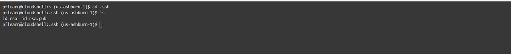
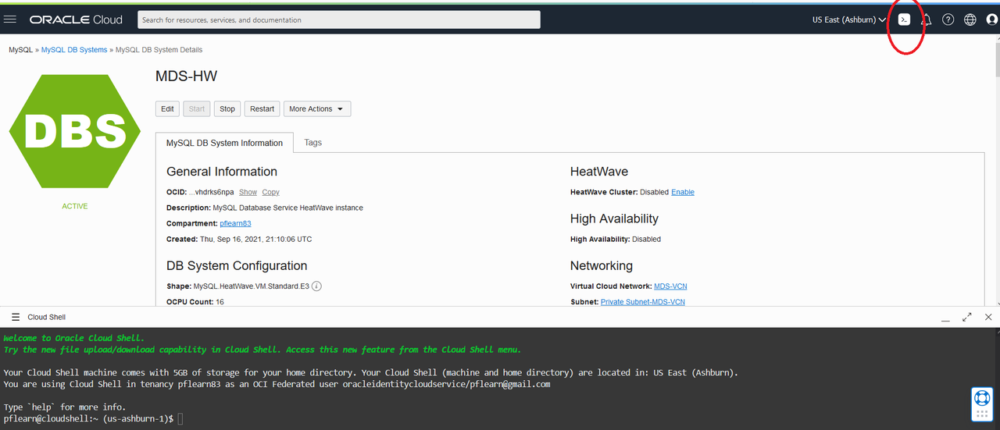
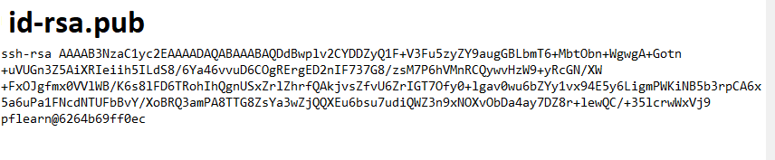

# Create Linux Compute Instance
 


## Introduction

Oracle Cloud Infrastructure Compute lets you provision and manage compute hosts, known as instances . You can create instances as needed to meet your compute and application requirements. After you create an instance, you can access it securely from your computer or cloud shell.


**Create Linux Compute Instance**

In this lab, you use Oracle Cloud Infrastructure to create an Oracle Linux instance. In another lab, you will use it to install the required LAMP stack (Linux Apache MySQL PHP) components.

_Estimated Time:_ 15 minutes


### Objectives

In this lab, you will be guided through the following tasks:

- Create SSH Key on OCI Cloud 
- Create Compute Instance
- Setup Compute Instance with MySQL Shell
- Connect to MySQL DB System

### Prerequisites

* An Oracle Free Tier or Paid Cloud Account
* A web browser
* Should have completed Lab 2

## Task 1: Create SSH Key on OCI Cloud Shell

The Cloud Shell machine is a small virtual machine running a Bash shell which you access through the Oracle Cloud Console (Homepage). You will start the Cloud Shell and generate a SSH Key to use  for the Bastion  session.

1.  To start the Oracle Cloud shell, go to your Cloud console and click the cloud shell icon at the top right of the page. This will open the Cloud Shell in the browser, the first time it takes some time to generate it.

    

    

    **Note:**  You can use the icons in the upper right corner of the Cloud Shell window to minimize, maximize, restart, and close your Cloud Shell session.

2.  Once the cloud shell has started, create the SSH Key using the following command:

    ```
    <copy>ssh-keygen -t rsa</copy>
    ```
    
    Press enter for each question.
    
    Here is what it should look like.  
    
    

3.  The public  and  private SSH keys  are stored in ~/.ssh/id_rsa.pub.

4.  Examine the two files that you just created.

    ```
    <copy>cd .ssh</copy>
    ```
    
    ```
    <copy>ls</copy>
    ```

    

    **Note:**  in the output there are two files, a *private key:* `id_rsa` and a *public key:* `id_rsa.pub`. Keep the private key safe and don't share its content with anyone. The public key will be needed for various activities and can be uploaded to certain systems as well as copied and pasted to facilitate secure communications in the cloud.

## Task 2: Create Compute instance
You will need a compute Instance to connect to your brand new MySQL database. 

1. Before creating the Compute instance open a notepad 

2. Do the followings steps to copy the public SSH key to the  notepad 

    Open the Cloud shell
        

    Enter the following command  

    ```
    <copy>cat ~/.ssh/id_rsa.pub</copy>
    ``` 
     

3. Copy the id_rsa.pub content the notepad
        
    Your notepad should look like this
      

4. To launch a Linux Compute instance, go to 
    Navigation Menu
    Compute
    Instances
    

5. On Instances in **(root)** Compartment, click  **Create Instance**
    

6. On Create Compute Instance 

 Enter Name
    ```
    <copy>MDS-Client</copy>
    ```   
7. Make sure **(root)** compartment is selected 

8. On Placement, keep the selected Availability Domain

9. On Image and Shape click the **Edit** link 
    - On Image: Keep the selected Image, Oracle Linux 8 

        

    - On Shape - Click the **change shape** button
    - Select Instance Shape: VM.Standard.E2.2

        

10. On Networking, make sure '**MDS-VCN**' is selected

    'Assign a public IP address' should be set to Yes 
   
  

11. On Add SSH keys, paste the public key from the notepad. 
  
    

12. Click '**Create**' to finish creating your Compute Instance. 

13. The New Virtual Machine will be ready to use after a few minutes. The state will be shown as 'Provisioning' during the creation

    

14.	The state 'Running' indicates that the Virtual Machine is ready to use. 

    

You successfully made it to the end this lab Interval Partitions. You may now [proceed to the next lab](#next)


## Acknowledgements
* **Author** - Perside Foster, MySQL Solution Engineering 
* **Contributors** - Frédéric Descamps, MySQL Community Manager, Orlando Gentil, Principal Training Lead and Evangelist
* **Last Updated By/Date** - Perside Foster, MySQL Solution Engineering, March 2022
