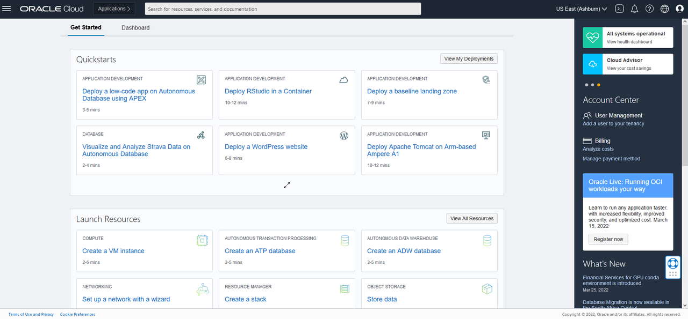
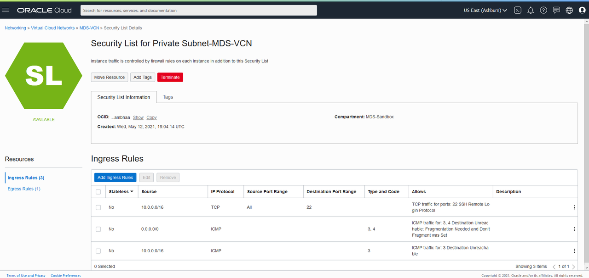
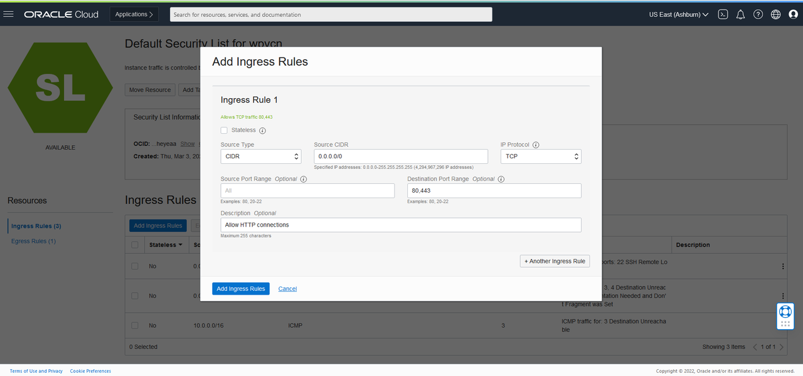

# Create your Virtual Cloud Network and Related Components
 


## Introduction

**Create your VCN and subnets**

Set up a Virtual Cloud Network (VCN) to connect your Linux instance to the internet. You will configure all the components needed to create your virtual network.

_Estimated Time:_ 15 minutes

### Objectives

In this lab, you will be guided through the following tasks:


- Create Virtual Cloud Network 
- Configure security list to allow MySQL incoming connections
- Configure security list to allow HTTP incoming connections


### Prerequisites

* An Oracle Free Tier or Paid Cloud Account
* A web browser
* Login to OCI to land on OCI Dashboard (This image shows a trial account)

 

## Task 1: Create Virtual Cloud Network 

1. Click Navigation Menu   
    Select Networking  
    Select Virtual Cloud Networks
    

2. Click **Start VCN Wizard**
    

3. Select 'Create VCN with Internet Connectivity'

    Click 'Start VCN Wizard' 
    

4. Create a VCN with Internet Connectivity 

    On Basic Information, complete the following fields:

 VCN Name: 
     ```
    <copy>MDS-VCN</copy>
    ```
 Compartment: Select  **(root)**

 Your screen should look similar to the following
    

5. Click 'Next' at the bottom of the screen 

6. Review Oracle Virtual Cloud Network (VCN), Subnets, and Gateways
         
    Click 'Create' to create the VCN
    

7. The Virtual Cloud Network creation is completing 
    
    
8. Click 'View Virtual Cloud Network' to display the created VCN
    

## Task 2: Configure security list to allow MySQL incoming connections

1. On MDS-VCN page under 'Subnets in (root) Compartment', click  '**Private Subnet-MDS-VCN**' 
     

2.	On Private Subnet-MDS-VCN page under 'Security Lists',  click  '**Security List for Private Subnet-MDS-VCN**'
    

3.	On Security List for Private Subnet-MDS-VCN page under 'Ingress Rules', click '**Add Ingress Rules**' 
    

4.	On Add Ingress Rules page under Ingress Rule 1
 
 Add an Ingress Rule with Source CIDR 
    ```
    <copy>0.0.0.0/0</copy>
    ```
 Destination Port Range 
     ```
    <copy>3306,33060</copy>
     ```
Description 
     ```
    <copy>MySQL Port Access</copy>
     ```
 Click 'Add Ingress Rule'
    

5.	On Security List for Private Subnet-MDS-VCN page, the new Ingress Rules will be shown under the Ingress Rules List
    

## Task 3: Configure security list to allow HTTP incoming connections

1. Navigation Menu > Networking > Virtual Cloud Networks

2. Open MDS-VCN

3. Click  Public Subnet-MDS-VCN

4. Click Default Security List for mds_vcn

5.	Click Add Ingress Rules page under Ingress Rule 1

 Add an Ingress Rule with Source CIDR 
    ```
    <copy>0.0.0.0/0</copy>
    ```
 Destination Port Range
     ````
    <copy>80,443</copy>
     ````
    Description
     ````
    <copy>Allow HTTP connections</copy>
     ````

    
6.	On Security List for Default Security List for mds_vcn page, the new Ingress Rules will be shown under the Ingress Rules List
    

You successfully made it to the end this lab Interval Partitions. You may now [proceed to the next lab](#next)


## Acknowledgements
* **Author** - Perside Foster, MySQL Solution Engineering 
* **Contributors** - Frédéric Descamps, MySQL Community  Manager, Orlando Gentil, Principal Training Lead and Evangelist
* **Last Updated By/Date** - Perside Foster, MySQL Solution Engineering, March 2022
