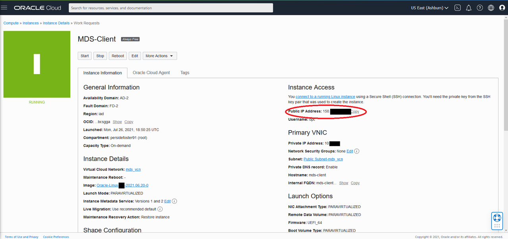
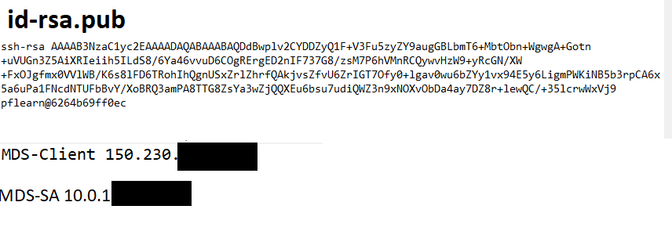
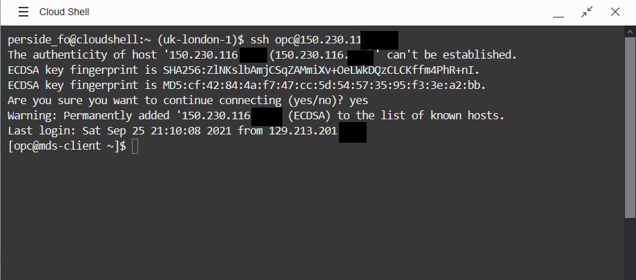

# Install Apache, PHP, and WordPress
 


## Introduction

WordPress is built on top of LAMP. A LAMP Stack is a set of open-source software used to create websites and web applications. LAMP is an acronym, and these stacks typically consist of the Linux operating system, the Apache HTTP Server, the MySQL relational database management system, and the PHP programming. 

**Install Apache, PHP, and WordPress**

In this lab, you will install an Apache web server with PHP, and MySQL Shell is also installed for connecting to your MySQL Database Service. You will then add the WordPress application to host your website and write information to your MySQL Database Service Stand-Alone server.


_Estimated Time:_ 20 minutes


### Objectives

In this lab, you will be guided through the following tasks:

- Install Apache
- Install PHP
- Install WordPress
- Install MySQL Shell
- Complete WordPress Installation

### Prerequisites

* An Oracle Free Tier or Paid Cloud Account
* A web browser
* Should have completed Lab 3

## **Task 1:** Intall Apache
1. Copy the public IP address of the active Compute Instance to your notepad

    - Go to Navigation Menu 
            Compute 
            Instances
            
    

    - Click the `MDS-Client` Compute Instance link

    
    
    - Copy `MDS-Client` plus  the `Public IP Address` to the notepad

2. Your notepad should look like the following:
    
    
3. Indicate the location of thepublic key you created earlier with **MDS-Client**. 
    
    Enter the username **opc** and the Public **IP Address**.

    **Note:**  The **MDS-Client**  shows the  Public IP Address as mentioned on TASK 5: #11
    
    (Example: **ssh -i ~/.ssh/id_rsa opc@132.145.170...**) 

    ```
    <copy>ssh -i ~/.ssh/id_rsa opc@<your_compute_instance_ip></copy>
    ```
    

4.	Install app server

    ````
    <copy>sudo yum install httpd -y</copy>
    ````

    ````
    <copy>sudo systemctl enable httpd</copy>
    ````

    ````
    <copy>sudo systemctl restart httpd</copy>
    ````

    ````
    <copy>sudo firewall-cmd --permanent --add-port=80/tcp</copy>
    ````

    ````
    <copy>sudo firewall-cmd --reload</copy>
    ````

5.	From a browser test apache from your loacal machine using the Public IP Address of your Compute Instance

    Example: http://129.213....

## **Task 2:** Intall PHP 

1.	Install php:

    ````
    <copy> sudo dnf module install php:7.4 -y</copy>
    ````
    ````
    <copy>sudo yum install php-cli php-mysqlnd php-zip php-gd php-mbstring php-xml php-json -y</copy>
    ````

    ````
    <copy>php -v</copy>
    ````
    ````
    <copy>php -m |grep mysql</copy>
    ````
    ````
    <copy>sudo systemctl restart httpd</copy>
    ````

2.	Create test php file (info.php)

    ````
    <copy>sudo nano /var/www/html/info.php</copy>   
    ````
3. Add the following code to the editor and save the file (ctr + o) (ctl + x)

    ````
    <copy><?php
phpinfo();
?></copy>
    ````
4. From your local machine, browse the page info.php

   Example: http://129.213.167.../info.php

## **Task 3:** Install WordPress

1. Install WordPress required packages.

    ````
    <copy>sudo yum install -y php-mysqlnd php-zip php-gd php-mcrypt php-mbstring php-xml php-json</copy>   
    ````

    ````
    <copy>sudo systemctl restart httpd</copy>   
    ````
2. Download the latest WordPress.

    ````
    <copy>curl -O https://wordpress.org/latest.tar.gz</copy>   
    ````
3. Extract latest.tar.gz to /var/www/html (Apache document root).

    ````
    <copy>sudo tar zxf latest.tar.gz -C /var/www/html/ --strip 1</copy>   
    ````
4. Adjust ownership.

    ````
    <copy>sudo chown apache. -R /var/www/html/</copy>   
    ````
5. Create upload directory, adjust ownership.

    ````
    <copy>sudo mkdir /var/www/html/wp-content/uploads</copy>   
    ````
    
    ````
    <copy>sudo chown apache:apache /var/www/html/wp-content/uploads</copy>   
    ````
6. Adjust SE Linux.

    ````
    <copy>sudo chcon -t httpd_sys_rw_content_t /var/www/html -R</copy>   
    ````
7. Allow Apache to connect to an external database.

    ````
    <copy>sudo setsebool -P httpd_can_network_connect_db 1</copy>   
    ````

## **Task 4:** Install MySQL Shell,  and create the WordPress user and database.

1. Install MySQL Shell and setup wordpress database

    ````
    <copy>sudo yum -y install mysql-shell</copy>   
    ````

2. Connect to the MySql database service using MySQL Shell.

    ````
    <copy>mysqlsh --sql -u admin -h <MDS end point IP> </copy>   
    ````

3. Create WordPress database and user.

    ````
    <copy>create database wordpress;</copy>   
    ````

    ````
    <copy>create user wp IDENTIFIED BY 'Welcome#12345';</copy>   
    ````

    ````
    <copy>GRANT ALL PRIVILEGES ON wordpress.* To wp;</copy>   
    ````

    ````
    <copy>\q</copy>   
    ````

## **Task 5:** Configure WordPress

1. From a browser access http://instance public IP/wp-admin/setup-config.php.

2. Click Let’s Go.

3. Fill the following information:
    - Database Name: database you created for WordPress
    - Username: Your database username
    - Password: Your database password
    - Database Host: MySQL Database Service IP address
    - Table Prefix: leave as is. only need to change if multiple WordPress running on the same database

4. Click Run the installation.

5. Fill the following information in the welcome screen:
    - Site Title: WordPress site title
    - Username: WordPresss admin
    - Password: WordPresss admin password
    - Your Email: your email
    - Click Install WordPress.
    
You may now **follow the instuctions on:**
 * [First Steps with WordPress](https://wordpress.org/support/article/first-steps-with-wordpres)
## Acknowledgements
* **Author** - Perside Foster, MySQL Solution Engineering 
* **Contributors** - Frédéric Descamps, MySQL Community Manager, Orlando Gentil, Principal Training Lead and Evangelist
* **Last Updated By/Date** - Perside Foster, MySQL Solution Engineering, March 2022
