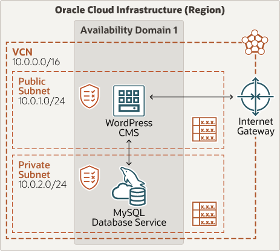

# Introduction
 

### About this Workshop

WordPress is a versatile content management system (CMS) and a powerful website builder. MySQL Database Service(MDS) is a fully managed Oracle Cloud Infrastructure (OCI) native service. Together they create a resilient hosting infrastructure for your web application. Use this workshop as a starting point and have a complete installation is built on Oracle Linux and Oracle MySQL Database Service. 

_Estimated Time:_ 1 hour

*Architecture*
The following architecture diagram illustrates the system that you will be creating. A single node WordPress CMS and one instance of MySQL Database Service. All of the  components are in an Oracle Cloud Infrastructure region. The Oracle Cloud Infrastructure region has an availability domain with a VCN that has an Internet Gateway, a public subnet, and a private subnet. The WordPress CMS is located in the public subnet and Oracle MySQL Database Service is located in the private subnet.

   

### Objectives

In this lab, you will be guided through the following steps:

- Create Virtual Cloud Network and Related Components
- Create Oracle MySQL Database Service
- Create Linux Compute Instance 
- Install Apache, PHP, and WordPress
- Configure WordPress 

### Prerequisites
* An Oracle Free Tier or Paid Cloud Account
* A web browser
* An SSH Terminal - Cloud Shell (provided in the OCI console). 
  Alternatively, terminal with SSH (Linux or MAC), Windows machine with GitBash/Putty or WSL (Windows Subsystem for Linux).
* An Oracle Cloud Account - Please view this workshop's LiveLabs landing page to see which environments are supported.

**Note:** If you have a **Free Trial** account, when your Free Trial expires, your account will be converted to an **Always Free** account. You will not be able to conduct Free Tier workshops unless the Always Free environment is available.

**[Click here for the Free Tier FAQ page.](https://www.oracle.com/cloud/free/faq.html)**

You successfully made it to the end this lab Interval Partitions. You may now [proceed to the next lab](#next)

## Acknowledgements
* **Author** - Perside Foster, MySQL Solution Engineering 
* **Contributors** - Frédéric Descamps, MySQL Community Manager, Orlando Gentil, Principal Training Lead and Evangelist
* **Last Updated By/Date** - Perside Foster, MySQL Solution Engineering, March 2022