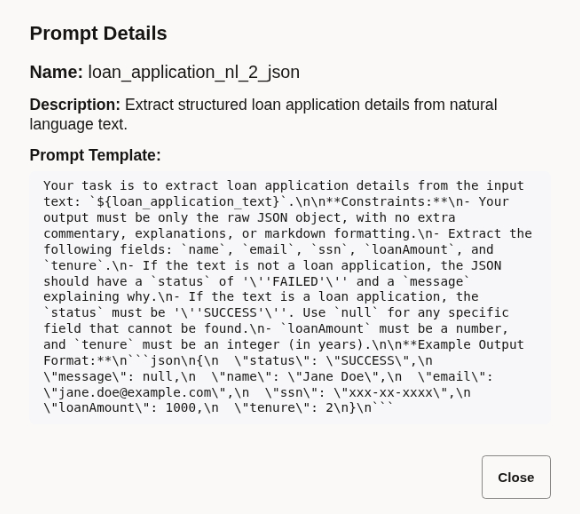
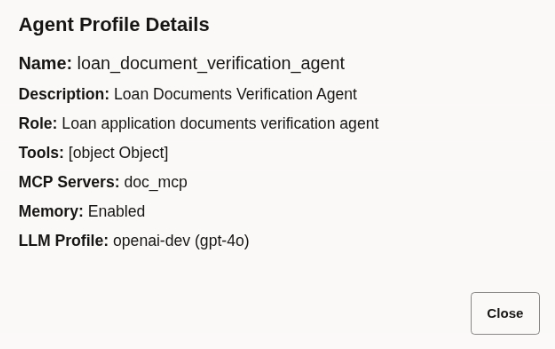

# View AI Agents

## Introduction

This lab walks you through the steps to view reusable AI agents. These agents are defined using prompts, memory settings, and tool integrations. Once created, you can invoke agents seamlessly from workflows or tasks by name.

AI agents are one of the main building blocks of the agentic workflow. This lab will help you understand the different components of an agentic workflow. This knowledge will help you build your own workflows later.

Estimated Lab Time: 5 minutes

### About AI Agents

You can create AI agents, such as prompt defintions and agent profiles.

* An agent profile specifies an AI agent's role, capabilities, tool access, and behavior through detailed configuration settings. By defining these attributes, developers can build specialized agents tailored to perform complex tasks across various business processes.

* Prompts are the natural language instructions that guide an agent's behavior, such as summarizing content, generating plans, or making decisions. They define the core competency of the AI agent in a form that is easy to author, update, and reuse.

### Objectives

In this lab, you will:
* View prompts
* View an agent profile

### Prerequisites

This lab assumes you have:
* An Oracle Cloud account
* All previous labs successfully completed

## Task 1: View Prompt Definitions

1. Open the navigation menu and click **Agentic AI**.

2. Click the **Prompt** tab. The Prompt Definitions list page opens. All the prompts that you have defined are displayed in a table.

3. Identify the definition that you want to view, and then click  (View).

	

4. Click **Close**.

Similarly, you can view the details of the other prompt.

## Task 2: View an Agent Profile

1. Open the navigation menu and click **Agentic AI**.

2. Click the **Agent Profile** tab. The Agent Profile list page opens. All the agent profiles that you have defined are displayed in a table.

3. Identify the profile that you want to view, and then click  (View).

	

4. Click **Close**.

## Acknowledgements
* **Author** - Sylaja Kannan, Consulting User Assistance Developer
* **Contributors** - Brijesh Kumar Deo and Bharath MC
* **Last Updated By/Date** - Sylaja Kannan, September 2025