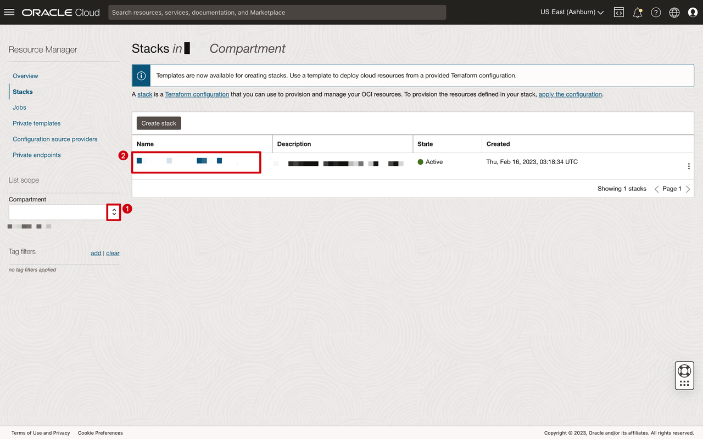
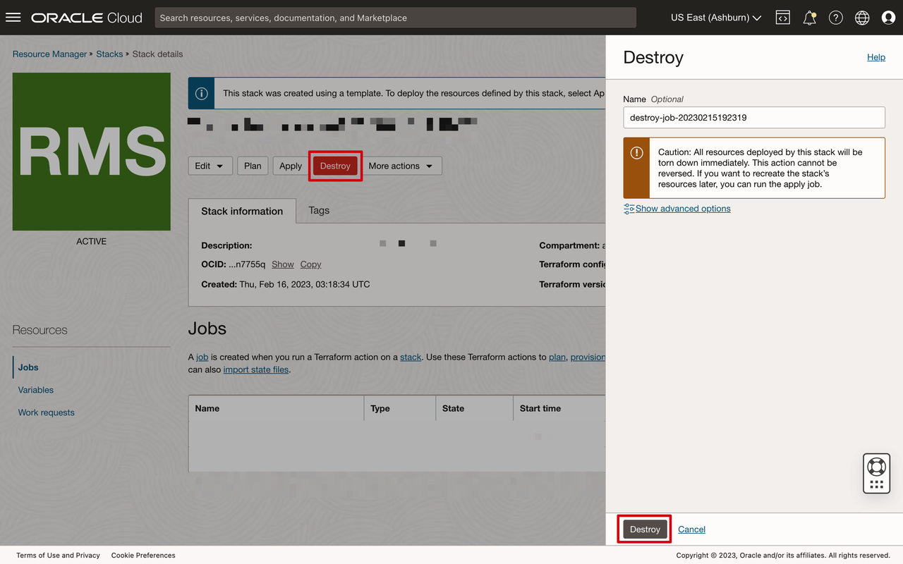
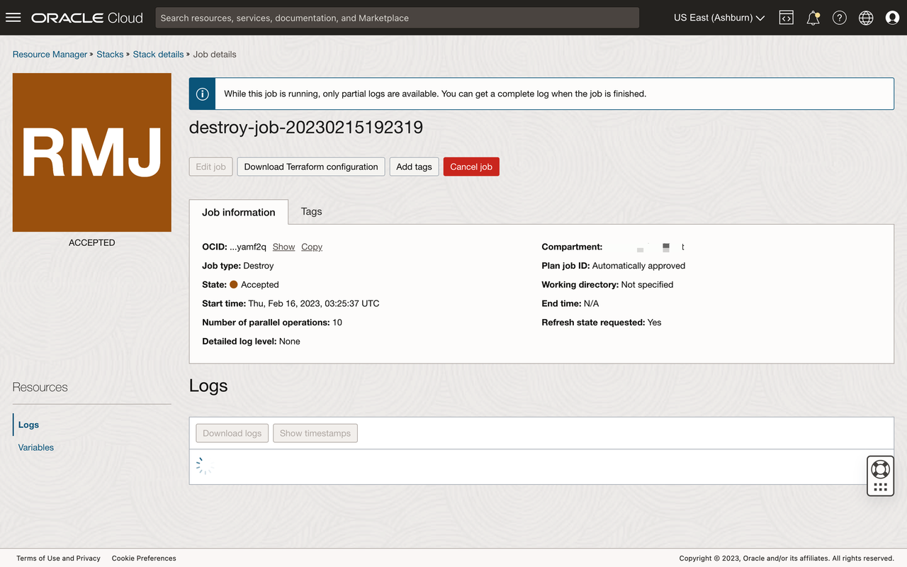
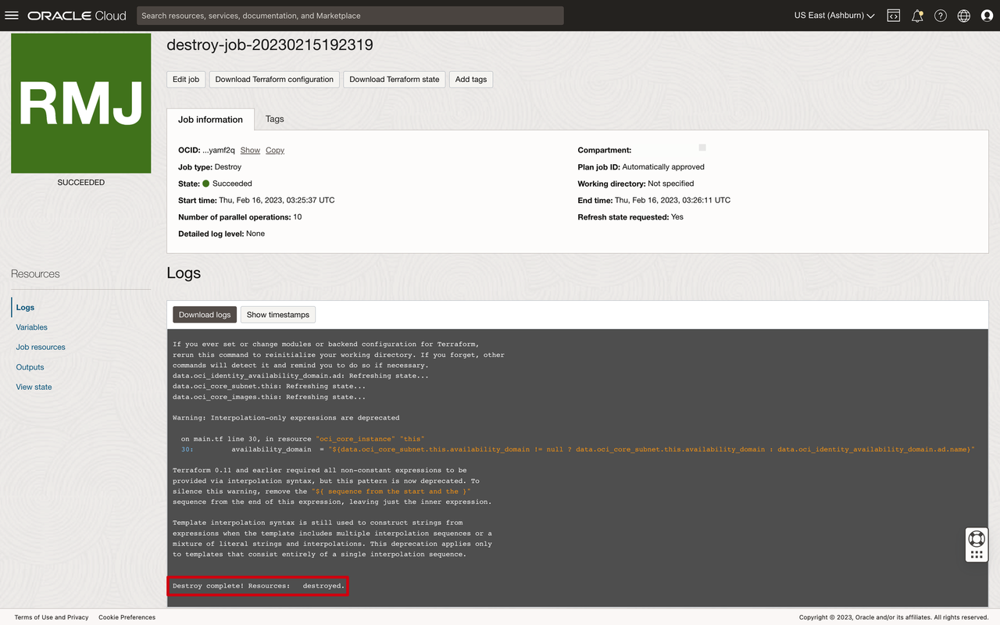
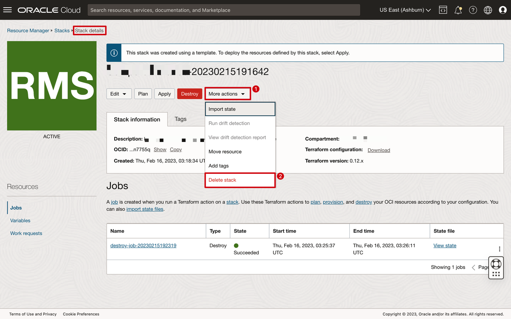
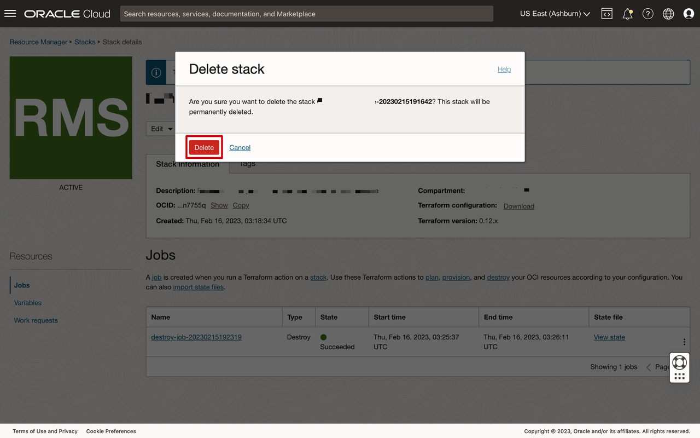

# Environment Clean Up

## Introduction
Upon completing your labs, we recommend that you perform a cleanup to dispose of all OCI resources created by Oracle Resource Manager (ORM). This lab will guide you to properly destroy these resources and delete the stack.

Estimated Time: 10 minutes

### Objectives
-   Delete the API key in the Open AI Developer Platform
-   Destroy Resources with ORM
-   Delete ORM Stack

### Prerequisites
This lab assumes you have:
- An Oracle Cloud account
- You have completed:
    - Lab: Prepare Setup
    - Lab: Environment Setup

## Task 1: Delete the API Key

-   Delete the API key from the [API Keys page](https://platform.openai.com/api-keys) of the OpenAI Developer Platform or use the [OpenAI API](https://platform.openai.com/docs/api-reference/admin_api_keys/delete).

## Task 2: Destroy ORM Stack Created Resources

1. Log in to Oracle Cloud.
2. Open up the hamburger menu in the left hand corner.  Click **Developer Services**, choose **Resource Manager > Stacks**.

    

3. Choose the compartment in which you created the stack and select it.

    

4. Click on **Destroy** and confirm again as prompted on the lower-right.

    

5. Wait for the job to complete and review the output.

    
    

## Task 3: Delete ORM Stack

Now that you have successfully destroyed all the resources provisioned for your workshop, you can now safely delete the stack to return the environment to it original state.

1. Follow the breadcrumbs links in the upper-left and click on **Stack Details**, the **More Actions > Delete Stack**.  

    

    

This completes the workshop.

## Acknowledgements
* **Author** - Rene Fontcha, LiveLabs Platform Lead, NA Technology
* **Contributors** - Arabella Yao, Product Manager, Database Product Manager
* **Last Updated By/Date** - Rene Fontcha, LiveLabs Platform Lead, NA Technology, November 2022
