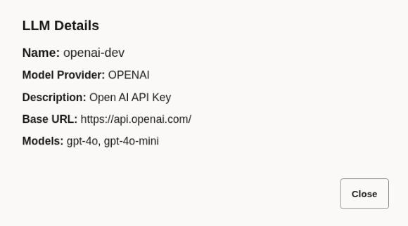
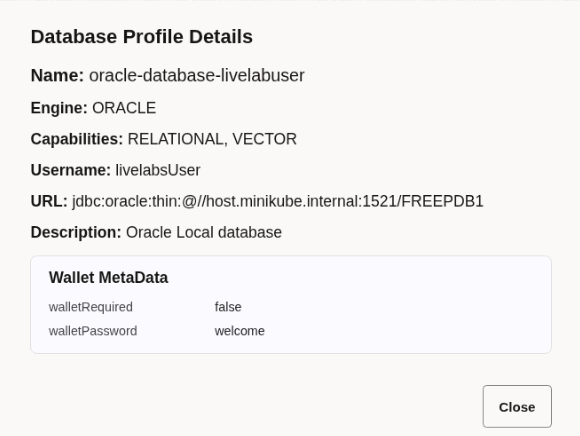
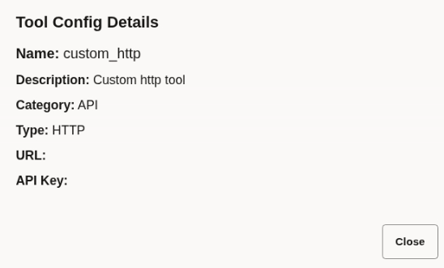
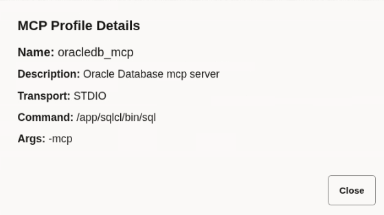
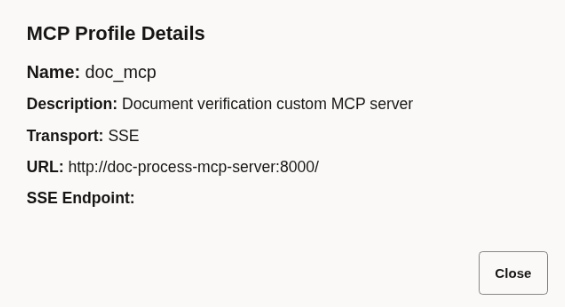

# View Connectors

## Introduction

This lab walks you through the steps to view different types of connectors, which enable seamless integration of external services—such as databases, Large Language Models (LLMs), Managed Compute Platform (MCP) servers, external tools, message queues, notification systems, and more—into the MicroTx Workflow runtime environment.

Connectors are one of the main building blocks of the agentic workflow. This lab will help you understand the different components of an agentic workflow. This knowledge will help you build your own workflows later.

Estimated Lab Time: 5 minutes

### About Connectors
You can define connector configurations centrally to efficiently reference and reuse these connections across multiple workflow tasks. This approach streamlines integration, reduces configuration overhead, and ensures consistency in how external services are accessed within workflows. It also offers greater agility in adapting to new or changing external services—with no need to duplicate sensitive credentials or configuration across tasks.

### Objectives

In this lab, you will:
* View LLM connector to OpenAI
* View the database connection details in database profile
* View a connector to a custom HTTP tool
* View connectors to MCP servers

### Prerequisites

This lab assumes you have:
* An Oracle Cloud account
* All previous labs successfully completed

## Task 1: View an LLM Connector for OpenAI

Let's view an LLM connector that includes API details and the list of supported models for OpenAI provider. This profile acts as a reference point—meaning you can easily embed advanced AI capabilities in workflow tasks by simply specifying the defined LLM connector.

1. Open the navigation menu and click **Connectors**.

2. Click the **LLM** tab. The LLM Definitions list page opens. All the LLMs that you have defined are displayed in a table.

3. Identify the definition that you want to view, and then click  (View).

	

4. Click **Close**.

## Task 2: View a Database Profile

You can use database profile to define and manage connections to your application database. It defines connection parameters, such as the type of database engine, supported capabilities, connection URL, user credentials, and secure wallet options.

1. Open the navigation menu and click **Connectors**.

2. Click the **Database Profiles** tab. The Database Profiles list page opens. All the database profiles that you have defined are displayed in a table.

3. Identify the profile that you want to view, and then click  (View).

	

4. Click **Close**.

## Task 3: View Details of a Tools Configuration

View configuration details of an HTTP tool, which is used in the agentic tasks.

1. Open the navigation menu and click **Connectors**.

2. Click the **Tools Configs** tab. The Tools Configs list page opens. All the tool configurations that you have defined are displayed in a table.

3. Identify the configuration that you want to view, and then click  (View).

	

4. Click **Close**.

## Task 4: View details of an MCP Server Connector for Oracle AI Database

1. Open the navigation menu and click **Connectors**.

2. Click the **MCP** tab. The MCP Definitions list page opens. All the MCPs that you have defined are displayed in a table.

3. Identify the connector that you want to view, and then click  (View)

	

4. Click **Close**.

## Task 5: View details of an MCP Server Connector for Document Verification

1. Open the navigation menu and click **Connectors**.

2. Click the **MCP** tab. The MCP Definitions list page opens. All the MCPs that you have defined are displayed in a table.

3. Identify the connector that you want to view, and then click  (View)

	

4. Click **Close**.

## Acknowledgements
* **Author** - Sylaja Kannan, Consulting User Assistance Developer
* **Contributors** - Brijesh Kumar Deo and Bharath MC
* **Last Updated By/Date** - Sylaja Kannan, September 2025