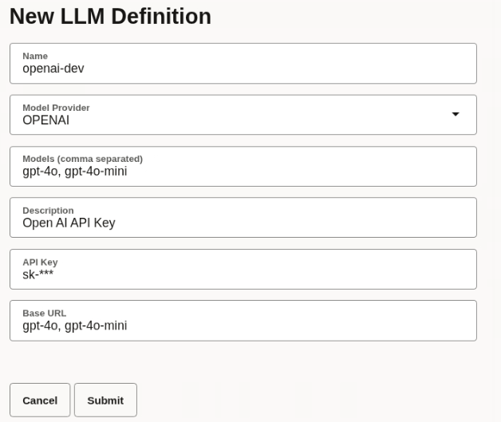
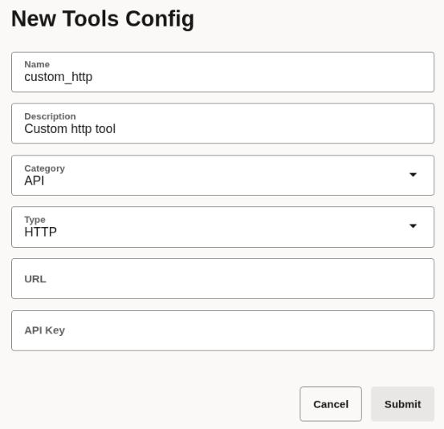
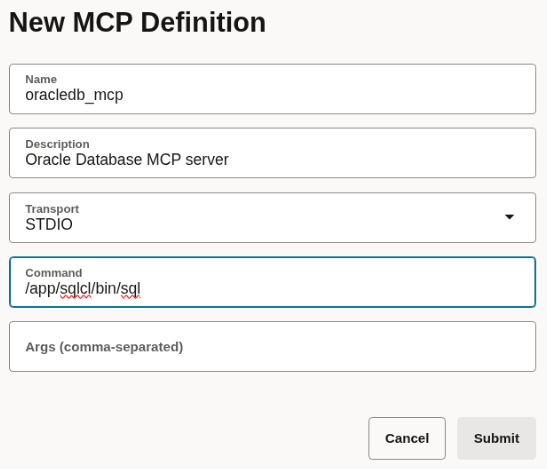
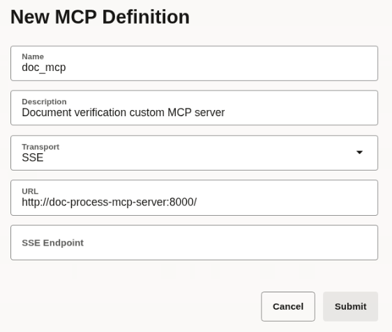

# Title of the Lab

## Introduction

This lab walks you through the steps to create all the connectors, which enable seamless integration of external services—such as databases, Large Language Models (LLMs), Managed Compute Platform (MCP) servers, external tools, message queues, notification systems, and more—into the MicroTx Workflow runtime environment.

Estimated Lab Time: 15 minutes

### About Connectors
Define connector configurations centrally to efficiently reference and reuse these connections across multiple workflow tasks. This approach streamlines integration, reduces configuration overhead, and ensures consistency in how external services are accessed within workflows. It also offers greater agility in adapting to new or changing external services—with no need to duplicate sensitive credentials or configuration across tasks.

### Objectives

*List objectives for this lab using the format below*

In this lab, you will:
* Objective 1
* Objective 2
* Objective 3

### Prerequisites

This lab assumes you have:
* An Oracle Cloud account
* All previous labs successfully completed

## Task 1: Create an LLM Connector

Let's create an LLM connector to define an LLM profile that includes API details and the list of supported models for OpenAI provider. This profile acts as a reference point—meaning you can easily embed advanced AI capabilities in workflow tasks by simply specifying the defined LLM connector.

1. Open the navigation menu and click **Connectors**.

2. Click the **LLM** tab.

3. Click **New LLM Definition**. The New LLM Definition dialog box appears.

4. Enter the following information.

    - **Name**: Enter `openaai-dev` as a unique and descriptive name to identify this LLM definition in workflows.
    - **Model Provider**: Select **OPENAI** as the model provider.
    - **Models**: Enter `gpt-4o, gpt-4o-mini` as a comma-separated list of the names of the models which you intend to use.
    - **Description**: Enter a description for the LLM definition.
    - **API Key**: Paste your OpenAI API key, which authenticates your requests.
    - **Base URL**: Enter `https://api.openai.com/` as the URL to access the API endpoint of the LLM.

	

5. Click **Submit**.

Your new definition appears in the list of available LLM definitions.

## Task 2: Create a Database Profile

Create a database profile to define and manage connections to your application database. Define connection parameters, such as the type of database engine, supported capabilities, connection URL, user credentials, and secure wallet options.

1. Open the navigation menu and click **Connectors**.

2. Click the **Database Profiles** tab.

3. Click **New Database Profiles**. The New Database Profiles dialog box appears.

4. Enter the following information.

    - **Name**: Enter `oracle-database-livelabuser` as a unique and descriptive name to identify this database profile in workflows.
    - **Engine**: Enter **ORACLE** as the database that you want to use.
    - **Capabilities**: Enter `RELATIONAL, VECTOR` as the supported features for the database profile. This indicates that the database can be used for traditional relational database operations and vector-based operations.
    - **Username**: Enter `livelabsUser` as the username to authenticate and connect to the database.
    - **Password**: Enter the password for the specified database user name.
    - **URL**: Provide the full connection URL to the database. For example, jdbc:oracle:thin:@host:port/service.
    - **Description**: Enter a description for the database profile.
    - **Wallet Password**: If you are using an Oracle Wallet for secure credential storage, enter the wallet password here. This is used for decrypting wallet files and securing connections.
    - **Wallet File**: Upload the Oracle Wallet file if your connection requires it. The wallet file contains encrypted credentials and security details for secure authentication.

5. Click **Submit**.

Your new definition appears in the list of available database profiles.

## Task 3: Create a Tools Configuration

Create a tools configuration for use in the agentic tasks.

1. Open the navigation menu and click **Connectors**.

2. Click the **Tools Configs** tab.

3. Click **New Tools Config**. The New Tools Config dialog box appears.

4. Enter the following information.

    - **Name**: Enter `custom_http` as a unique and descriptive name to identify this tool configuration in workflows.
    - **Description**: Enter a description for the tool configuration, such as `custom http tool`.
    - **Category**: Select **API** as the category.
    - **Type**: Select **HTTP** as the type of tool.

	

5. Click **Submit**.

Your new definition appears in the list of available tool configurations.

## Task 4: Create an MCP Server Connector for Oracle Database

1. Open the navigation menu and click **Connectors**.

2. Click the **MCP** tab.

3. Click **New MCP Definition**. The New MCP Definition dialog box appears.

4. Enter the following information.

    - **Name**: Enter `oracledb_mcp` as a unique and descriptive name to identify this MCP server definition in workflows.
    - **Description**: Enter a description for the tool configuration, such as `custom http tool`.
    - **Transport**: Select **STDIO** from the drop-down list to specify the network transport protocol used by the MCP server for communication.
    - **Command**: Enter **/app/sqlcl/bin/sql**.

	

5. Click **Submit**.

Your new connector appears in the list of available MCP definitions.

## Task 5: Create an MCP Server Connector for Document Verification

1. Open the navigation menu and click **Connectors**.

2. Click the **MCP** tab.

3. Click **New MCP Definition**. The New MCP Definition dialog box appears.

4. Enter the following information.

    - **Name**: Enter `doc_mcp` as a unique and descriptive name to identify this MCP server definition in workflows.
    - **Description**: Enter a description for the tool configuration, such as `Document verification custom MCP server`.
    - **Transport**: Select **SSE** from the drop-down list to specify the network transport protocol used by the MCP server for communication.
    - **URL**: Enter the URL of the MCP server **http://doc-process-mcp-server:8000/**.

	

5. Click **Submit**.

Your new connector appears in the list of available MCP definitions.

## Acknowledgements
* **Author** - Sylaja Kannan, Consulting User Assistance Developer
* **Contributors** - Brijesh Kumar Deo and Bharath MC
* **Last Updated By/Date** - Sylaja Kannan, September 2025