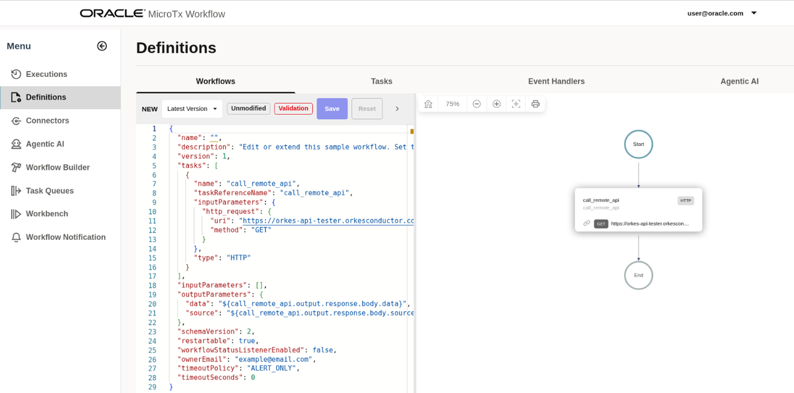
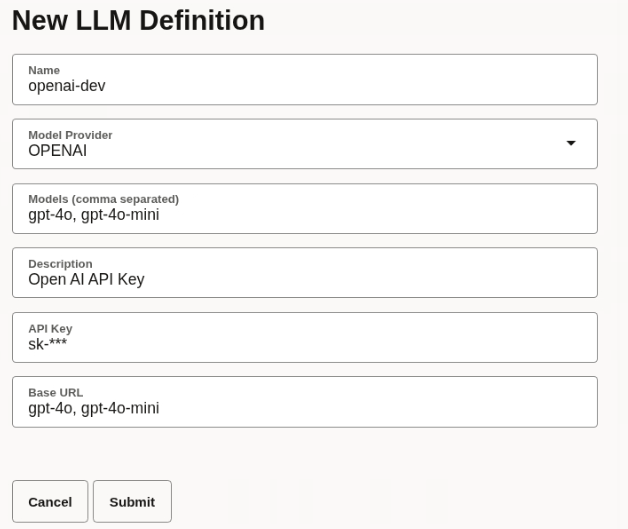

# Create Loan Application Processing Workflow

## Introduction

This lab walks you through the steps to create a workflow for a loan processing application.

**Note**: A complete workflow is already available in MicroTx Workflow on your remote desktop. You can use this workflow as a reference. To directly run the workflow, jump to the next lab and skip this lab.

In this lab, you will understand the various building blocks of the workflow, such as tasks, prompts, and agent profile. You will also build a few of these blocks. In this lab, you will add multiple tasks in a step-by-step manner. Each task accomplishes a specific goal. This workflow accepts user input in natural language.

Estimated Lab Time: 20 minutes

### Objectives

In this lab, you will:
* Understand the various building blocks of a workflow and create a few building blocks.

This lab assumes you have:
* An Oracle Cloud account
* All previous labs successfully completed

## Task 1: Create a New Workflow

1. Open the navigation menu and click **Definitions**.

2. Click the **Workflow** tab.

3. Click **New Workflow Definition**.
   A JSON file is displayed, which is the default workflow in the left pane. In the right pane, the components of the workflow are depicted visually.
	 

4. Delete the JSON code that appears by default and paste the following code.

  	```
    <copy>
    {
     "name": "acme_bank_loan_processing_workflow",
     "description": "Acme bank Loan processing workflow with multi agent orchestration",
     "tasks": []
    }
    </copy>
    ```

5. Click **Save**.

## Task 2: Extract Loan Application Details

The workflow accepts user input in natural language. Use a GenAI task type to extract the loan application details from the input provided by a user. Since a GenAI task requires LLM, let's start by creating a connector for accessing the LLM.

1. Open the navigation menu and click **Connectors**.

2. Click the **LLM** tab.

3. Click **New LLM Definition**. The **New LLM Definition** dialog box appears.

4. Enter the following information.

    * Name: Enter openaai-dev as a unique and descriptive name to identify this LLM definition in workflows.
    * Model Provider: Select OPENAI as the model provider.
    * Models: Enter gpt-4o, gpt-4o-mini as a comma-separated list of the names of the models which you intend to use.
    * Description: Enter a description for the LLM definition.
    * API Key: Paste your OpenAI API key, which authenticates your requests.
    * Base URL: Enter https://api.openai.com/ as the URL to access the API endpoint of the LLM.

	 

5. Click **Submit**.
    Your new definition appears in the list of available LLM definitions.

6. In the navigation menu, click **Definitions**, and then click the **Tasks** tab.

7. Delete the JSON code that appears by default and paste the following code.
  	```
    <copy>
    {
    "name": "Extract Loan Application details",
    "taskReferenceName": "extract_loan_details",
    "inputParameters": {
        "llmProfile": {
            "name": "openai-dev",
            "model": "gpt-4o-mini"
        },
        "promptTemplate": "loan_application_nl_2_json",
        "promptVariables": {
            "loan_application_text": "${workflow.input.loan_application_text}"
        }
    },
    "type": "GENAI_TASK"
    }
    </copy>
    ```

8. Click **Save**.

9. Let's look at the input parameters required by this GenAI task. It requires the LLM profile definition that we created earlier and a prompt template. Next, let's create the prompt template.

10. In the navigation menu, click **Agentic AI**, and then click the **Prompt** tab. The Prompt Definitions list page opens. All the prompts that you have defined are displayed in a table.

11. Click **New Prompt Definition**.

12. Enter the following information.

	  

    * Name: Enter `loan_application_nl_2_json` as a unique and descriptive name to identify this prompt definition in workflows.
  
    * Description: Optional. Enter the following description for the prompt definition.
      	```text
        <copy>
        Extract the input parameters from natural language input.
        </copy>
        ```

    * Prompt Template: Create a prompt template to guide the planner's decision-making strategy. Here's an example prompt template which extracts the loan application details, such as loan amount and tenure from the input text.

      	```text
        <copy>
        Extract the loan application details like loan amount, tenure, ssn, id etc. from the input text. 
        Input: ${loan_application_text}
        Constraints:
          - Only output the structured plan in JSON format. No extra commentary.
          - Return only the raw JSON object as plain text — no json, no backticks, no explanation.
          - Don't extract any other garbage info. If nothing related to loan application found in input text, just mark the status as failed with message. Or else mark status as success.
        Example output format:
        json
        {
          "status": "SUCCCESS/FAILED"
          "ssn": "xxx-xx",
          "loanAmount": 1000,
          "tenure": 2,
          "name":"xyz",
          "email":"xyz@o.com"
        }
        </copy>
        ```

13. Click **Submit**.

## Task 3: Loan Application Completeness Check

Check the details provides for the loan application and terminate the workflow if any required information is absent from the user input.
To achieve this, let's add a SWITCH statement task and define the decision cases. If the check fails, send a notification and then terminate the workflow processing.

1. In the navigation menu, click **Definitions**, and then click the **Tasks** tab.

2. Delete the JSON code that appears by default and paste the following code.

  	```
    <copy>
    {
    "name": "Check loan application completeness",
    "taskReferenceName": "check_loan_application_completeness",
    "inputParameters": {
        "switchCaseValue": "${extract_loan_details.output.status}"
    },
    "type": "SWITCH",
    "decisionCases": {
        "FAILED": [
            {
                "name": "Notify incomplete loan application",
                "taskReferenceName": "notify_incomplete_loan_application",
                "inputParameters": {
                    "http_request": {
                        "method": "POST",
                        "uri": "http://notification-service:8085/email-service/sendMail",
                        "headers": {
                            "Content-Type": "application/json"
                        },
                        "body": {
                            "from": "microtx.user@localhost",
                            "to": "microtx.user@microtx.com",
                            "cc": "",
                            "subject": "Loan application rejected!",
                            "body": "Loan application rejected due to incomplete details. ${workflow.input.loan_application_text}",
                            "isEmailBodyText": true
                        }
                    }
                },
                "type": "HTTP",
                "decisionCases": {},
                "defaultCase": [],
                "forkTasks": [],
                "startDelay": 0,
                "joinOn": [],
                "optional": false,
                "defaultExclusiveJoinTask": [],
                "asyncComplete": false,
                "loopOver": [],
                "onStateChange": {},
                "permissive": false
            },
            {
                "name": "terminate",
                "taskReferenceName": "terminate_ref",
                "inputParameters": {
                    "terminationStatus": "TERMINATED",
                    "terminationReason": "Incomplete loan application details",
                    "workflowOutput": "${extract_loan_details.output}"
                },
                "type": "TERMINATE",
                "decisionCases": {},
                "defaultCase": [],
                "forkTasks": [],
                "startDelay": 0,
                "joinOn": [],
                "optional": false,
                "defaultExclusiveJoinTask": [],
                "asyncComplete": false,
                "loopOver": [],
                "onStateChange": {},
                "permissive": false
            }
        ]
    },
    "defaultCase": [],
    "forkTasks": [],
    "startDelay": 0,
    "joinOn": [],
    "optional": false,
    "defaultExclusiveJoinTask": [],
    "asyncComplete": false,
    "loopOver": [],
    "evaluatorType": "value-param",
    "expression": "switchCaseValue",
    "onStateChange": {},
    "permissive": false
    }
    </copy>
    ```

3. Click **Save**.

## Task 4: Create the Loan Application Record

Once the application is deemed complete, create an application record in the database using a SQL Task.

1. In the navigation menu, click **Definitions**, and then click the **Tasks** tab.

2. Delete the JSON code that appears by default and paste the following code.

  	```
    <copy>
    {
    "name": "auditLoanOracleSql",
    "taskReferenceName": "audit_loan_oracle_sql_task_ref",
    "inputParameters": {
        "databaseProfile": "oracle-database-livelabuser",
        "sqlStatement": "INSERT INTO LOAN_APPLICATIONS (APPLICATION_ID, USER_SSN, LOAN_AMOUNT, TENURE_MONTHS, APPLICATION_STATUS) VALUES (?, ?, ?, ?, ?);",
        "parameters": [
            "${workflow.workflowId}",
            "${extract_loan_details.output.ssn}",
            "${extract_loan_details.output.loanAmount}",
            "${extract_loan_details.output.tenure}",
            "PENDING"
        ],
        "type": "UPDATE"
    },
    "type": "SQL",
    "decisionCases": {},
    "defaultCase": [],
    "forkTasks": [],
    "startDelay": 0,
    "joinOn": [],
    "optional": false,
    "defaultExclusiveJoinTask": [],
    "asyncComplete": false,
    "loopOver": [],
    "onStateChange": {},
    "permissive": false
    }
    </copy>
    ```

3. Click **Save**.

## Task 6: Check the Execution Status of the Orchestrator (Planner)

Terminate the workflow if the Agentic planner fails the multi-agent orchestration. Add a SWITCH statement task to achieve this.

1. In the navigation menu, click **Definitions**, and then click the **Tasks** tab.

2. Delete the JSON code that appears by default and paste the following code.

  	```
    <copy>
    {
      "name": "Check planner execution status",
      "taskReferenceName": "check_planner_execution_status",
      "inputParameters": {
        "switchCaseValue": "${agentic_planner.output.status}"
      },
      "type": "SWITCH",
      "decisionCases": {
        "FAILED": [
          {
            "name": "Notify loan application rejection",
            "taskReferenceName": "notify_loan_application_rejection",
            "inputParameters": {
              "http_request": {
                "method": "POST",
                "uri": "http://notification-service:8085/email-service/sendMail",
                "headers": {
                  "Content-Type": "application/json"
                },
                "body": {
                  "from": "microtx.user@localhost",
                  "to": "microtx.user@microtx.com",
                  "cc": "",
                  "subject": "Loan application rejected!",
                  "body": "Loan application rejected due to planner failure. ${agentic_planner.output}",
                  "isEmailBodyText": true
                }
              }
            },
            "type": "HTTP",
            "decisionCases": {},
            "defaultCase": [],
            "forkTasks": [],
            "startDelay": 0,
            "joinOn": [],
            "optional": false,
            "defaultExclusiveJoinTask": [],
            "asyncComplete": false,
            "loopOver": [],
            "onStateChange": {},
            "permissive": false
          },
          {
            "name": "terminate loan application",
            "taskReferenceName": "terminate_loan_application_ref",
            "inputParameters": {
              "terminationStatus": "TERMINATED",
              "terminationReason": "loan application rejected",
              "workflowOutput": "${agentic_planner.output}"
            },
            "type": "TERMINATE",
            "decisionCases": {},
            "defaultCase": [],
            "forkTasks": [],
            "startDelay": 0,
            "joinOn": [],
            "optional": false,
            "defaultExclusiveJoinTask": [],
            "asyncComplete": false,
            "loopOver": [],
            "onStateChange": {},
            "permissive": false
          }
        ]
      },
      "defaultCase": [],
      "forkTasks": [],
      "startDelay": 0,
      "joinOn": [],
      "optional": false,
      "defaultExclusiveJoinTask": [],
      "asyncComplete": false,
      "loopOver": [],
      "evaluatorType": "value-param",
      "expression": "switchCaseValue",
      "onStateChange": {},
      "permissive": false
    }
    </copy>
    ```

    Where, 'http://notification-service:8085/email-service/sendMail' is the email webhook that you have added for sending email notifications in case of a failure.

3. Click **Save**.

## Task 7: Human Intervention to Validate Workflow Execution

Before sharing the final decision with the user, a human operator conducts a final review and approves or rejects the loan through a dedicated task.

1. In the navigation menu, click **Definitions**, and then click the **Tasks** tab.

2. Delete the JSON code that appears by default and paste the following code.

  	```
    <copy>
    {
      "name": "Send Email notification",
      "taskReferenceName": "email_notify",
      "inputParameters": {
        "http_request": {
          "method": "POST",
          "uri": "http://notification-service:8085/email-service/sendMail",
          "headers": {
            "Content-Type": "application/json"
          },
          "body": {
            "from": "microtx.user@localhost",
            "to": "microtx.user@microtx.com",
            "cc": "",
            "subject": "Loan approval request!",
            "body": "Please approve loan req ${workflow.workflowId}",
            "isEmailBodyText": true
          }
        }
      },
      "type": "HTTP",
      "decisionCases": {},
      "defaultCase": [],
      "forkTasks": [],
      "startDelay": 0,
      "joinOn": [],
      "optional": false,
      "defaultExclusiveJoinTask": [],
      "asyncComplete": false,
      "loopOver": [],
      "onStateChange": {},
      "permissive": false
    },
    {
      "name": "human_approval_task",
      "taskReferenceName": "wait_for_approval",
      "inputParameters": {
        "applicant": "${extract_loan_details.output}"
      },
      "type": "HUMAN",
      "decisionCases": {},
      "defaultCase": [],
      "forkTasks": [],
      "startDelay": 0,
      "joinOn": [],
      "optional": false,
      "defaultExclusiveJoinTask": [],
      "asyncComplete": false,
      "loopOver": [],
      "onStateChange": {},
      "permissive": false
    }
    </copy>
    ```

3. Click **Save**.

## Task 8: Update the Loan Application Status

Update the final status of the loan application using a SQL Task.

1. In the navigation menu, click **Definitions**, and then click the **Tasks** tab.

2. Delete the JSON code that appears by default and paste the following code.

  	```
    <copy>
    {
      "name": "auditFInalLoanOracleSql",
      "taskReferenceName": "audit_final_loan_oracle_sql_task_ref",
      "inputParameters": 
      {
        "databaseProfile": "oracle-database-livelabuser",
        "sqlStatement": "UPDATE LOAN_APPLICATIONS SET APPLICATION_STATUS = 'APPROVED' WHERE APPLICATION_ID = ?;",
        "parameters": [
          "${workflow.workflowId}"
        ],
        "type": "UPDATE"
      },
      "type": "SQL",
      "decisionCases": {},
      "defaultCase": [],
      "forkTasks": [],
      "startDelay": 0,
      "joinOn": [],
      "optional": false,
      "defaultExclusiveJoinTask": [],
      "asyncComplete": false,
      "loopOver": [],
      "onStateChange": {},
      "permissive": false
    }
    ],
     "inputParameters": [],
     "outputParameters": {},
     "schemaVersion": 2,
     "restartable": true,
     "workflowStatusListenerEnabled": false,
     "ownerEmail": "you@example.com",
     "timeoutPolicy": "ALERT_ONLY",
     "timeoutSeconds": 0,
     "variables": {},
     "inputTemplate": {},
     "enforceSchema": true,
     "metadata": {}
    }
    </copy>
    ```

3. Click **Save**.

## Acknowledgements
* **Author** - Sylaja Kannan, Consulting User Assistance Developer
* **Contributors** - Brijesh Kumar Deo and Bharath MC
* **Last Updated By/Date** - Sylaja Kannan, September 2025