# Create Loan Application Processing Workflow

## Introduction

This lab walks you through the steps to create a workflow for a loan processing application.

**Note**: Skip this lab and jump to the next lab to directly run an existing workflow. A complete workflow is already available in MicroTx Workflow on your remote desktop. You can use this workflow as a reference.

In this lab, you will understand the various building blocks of the workflow, such as tasks, prompts, and agent profile. You will also build a few of these blocks. In this lab, you will add multiple tasks in a step-by-step manner. Each task accomplishes a specific goal. This workflow accepts user input in natural language.

**Note**: You can also complete the tasks in this lab by viewing the building blocks and workflow tasks defined in the existing loan application processing workflow. All the building blocks such as connectors for LLM, database and MCP server, prompt templates, gen-ai task, agentic task, planner task and other tasks are already created to support the execution of the existing loan application processing workflow. You can analyze the task definitions in the Workflow Builder to understand how these building blocks are added into a workflow.

Estimated Lab Time: 30 minutes

### Objectives

In this lab, you will:

* Understand the various building blocks of a workflow and create a few building blocks.

This lab assumes you have:

* An Oracle Cloud account
* All previous labs successfully completed

## Task 1: View Existing Workflow

1. Open the navigation menu and click **Definitions**, and then click the **Workflows** tab.
    The Workflows list page opens. All the workflows that you have defined are displayed in a table.

2. Identify the workflow that you want to view, such as **"acme\_bank\_loan\_processing\_workflow"**, and then click  (**Edit Workflow**) under **Actions**.
    The Workflow Builder visually depicts all the tasks of the workflow in the left pane. Scroll to view all the tasks of the workflow. In the right pane, the **Workflow** tab displays all the details of the workflow.
    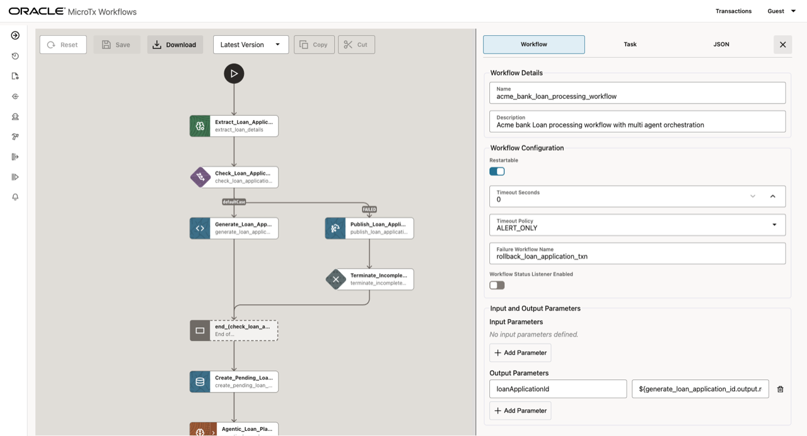

3. Click the **JSON** tab to view the JSON for the workflow as shown in the following image. Scroll to view the entire JSON.
    

4. Click a component to view more details. The following figure shows the details of an Gen AI task in the right pane under the **Task** tab.
    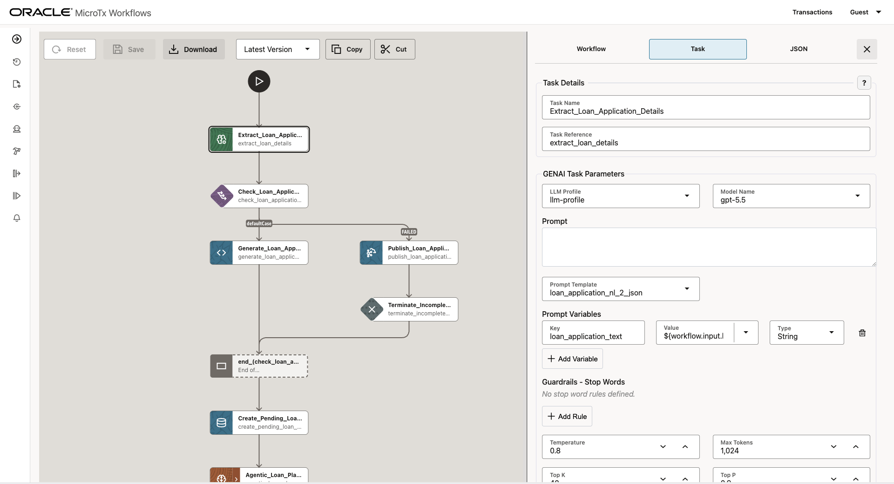

5. If you want to proceed by viewing the workflow and not creating a new one, then skip Task 2 and proceed to Task 3.

## Task 2: Create a New Workflow

1. Open the navigation menu and click **Definitions**, and then click the **Workflows** tab.

2. Click **New Workflow**. The Workflow Builder is displayed. In the right pane, the **Workflow** tab displays all the details of the workflow. Enter details of the workflow, such as its name and values for the other parameters.
    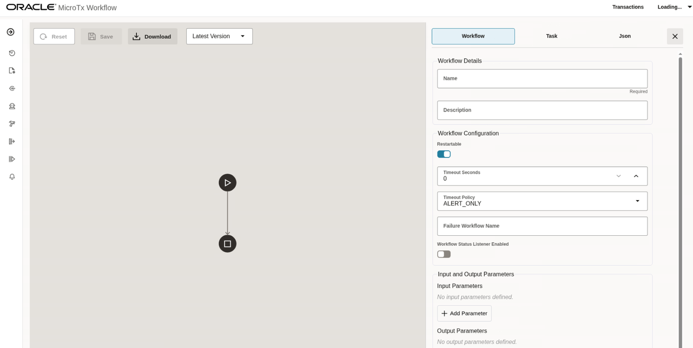

3. Place the cursor on the arrow mark. A plus sign appears.
    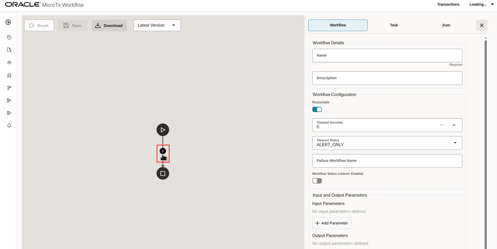

4. Click the plus icon. Many tasks are displayed.
    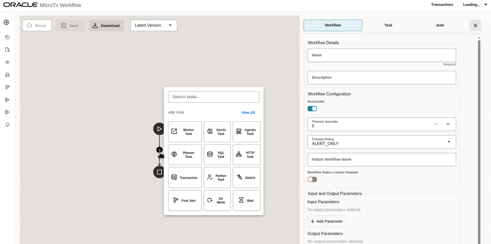

5. Click a task that you want to add to the workflow. The following image shows an Gen-AI task that is added to the workflow.
    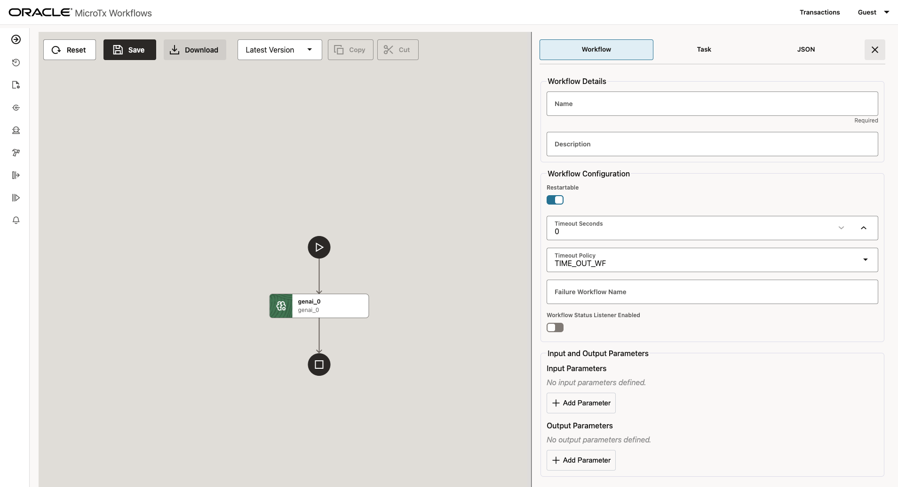

6. Click the task to enter details about the task, such as its name, LLM Profile, model and prompt.
    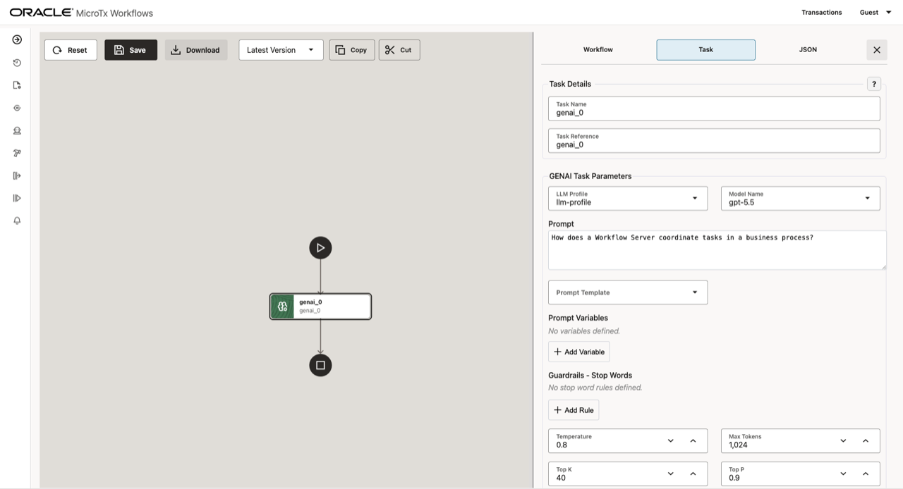

7. Click **Save**.
    MicroTx Workflow displays the changes in JSON code. Review all the changes.
    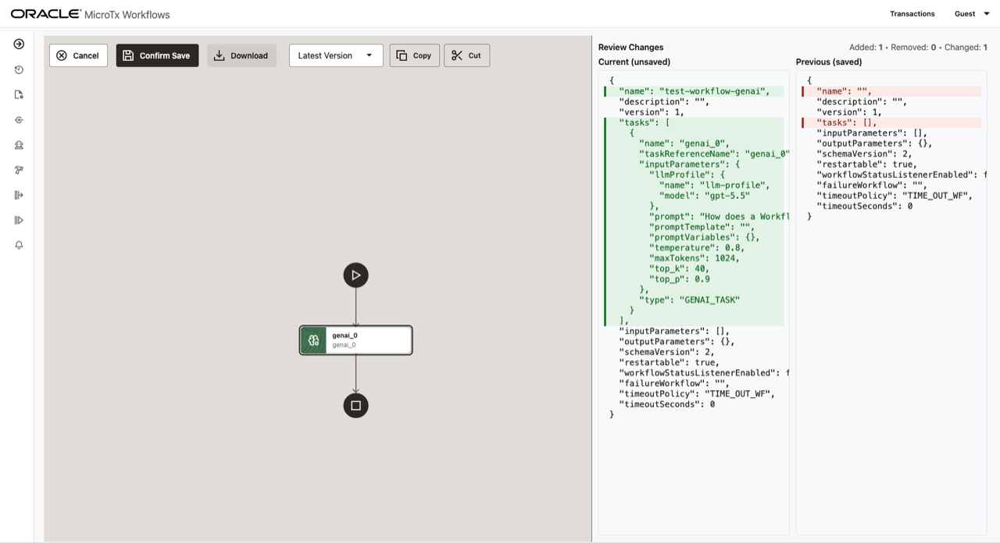

8. Click **Confirm Save** to save the changes.

The new workflow is displayed in the Workflows list page.

## Task 3: Extract Loan Application Details

The workflow accepts user input in natural language. Use a GenAI task type to extract the loan application details from the input provided by a user. Since a GenAI task requires LLM, let's start by creating a connector for accessing the LLM.

1. Open the navigation menu and click **Connectors**.

2. Click the **LLM** tab. *You can view and use the existing LLM connector definition **llm-profile** for the remaining tasks without creating a new one. An OpenAI API Key has already been added for this LLM connector*. The API Key is not shown in the edit dialog.

3. To create a new LLM definition, click **New LLM Definition**. The **New LLM Definition** dialog box appears.

4. Click on the Edit button to view the existing LLM definition. Or enter the following information if you want to create a new definition.
    * Name: Enter `llm-Profile` as a unique and descriptive name to identify this LLM definition in workflows.
    * Model Provider: Select `OPENAI` as the model provider.
    * Models: Enter `gpt-5.5, gpt-4o` as a comma-separated list of the names of the models which you intend to use.
    * Description: Enter a description for the LLM definition.
    * API Key: *Paste your OpenAI API key, which authenticates your requests*. The added API Key is not shown in the edit dialog.
    * Base URL: Enter <https://api.openai.com/> as the URL to access the API endpoint of the LLM.

     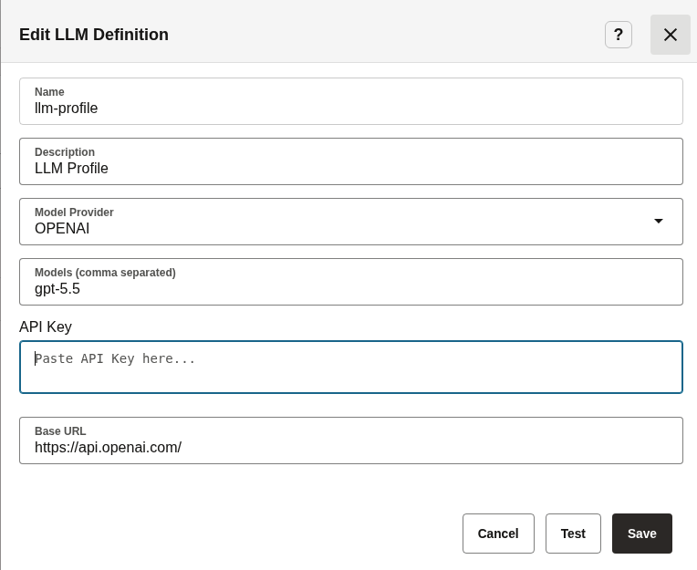

5. Click **Submit**.
    Your new definition appears in the list of available LLM definitions.

6. In the navigation menu, click **Definitions**, and then click the **Workflows** tab.

7. Identify the workflow that you want to view, such as **"acme\_bank\_loan\_processing\_workflow"**, and then click  (**Edit Workflow**) under **Actions**.
    The Workflow Builder visually depicts all the tasks of the workflow in the left pane. Scroll up and down to view all the tasks in the workflow. In the right pane, the **Workflow** tab displays all the details of the workflow.
    

8. Scroll up in the left pane to view the **Extract Loan Application details** task, and then click the task to view the details of the task in the **Task** tab.
    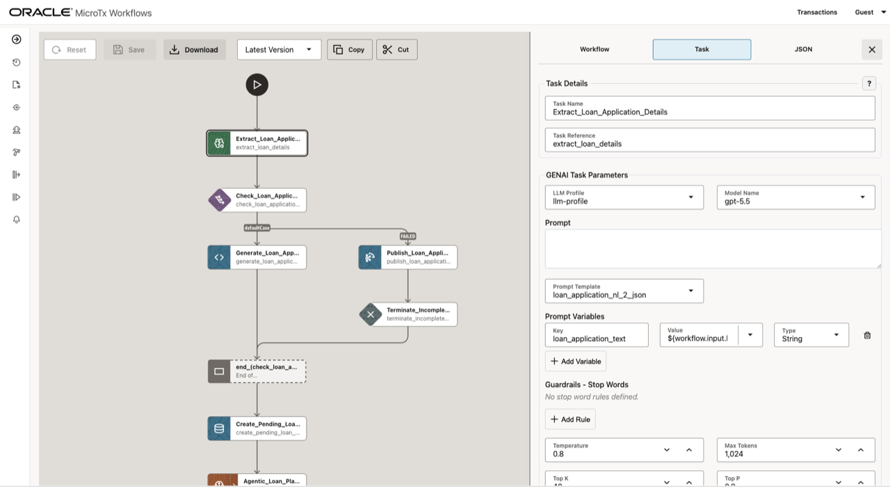

9. Click the **Json** tab to view the JSON code for the **Extract Loan Application details** task or configure the task as shown below if you are creating a new workflow and save your changes.

    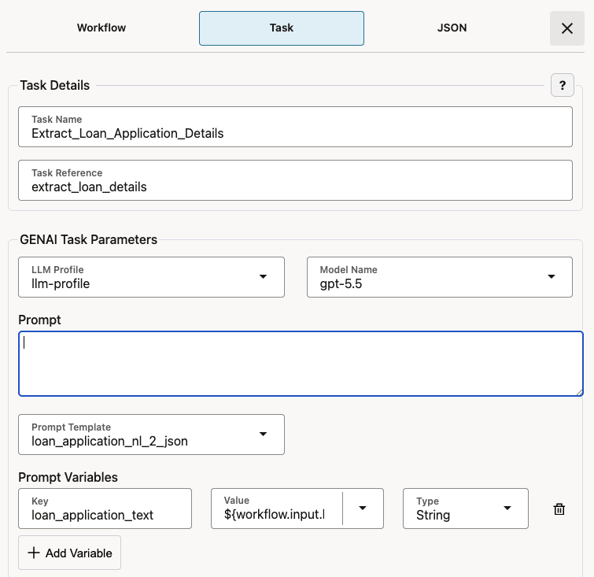
    
    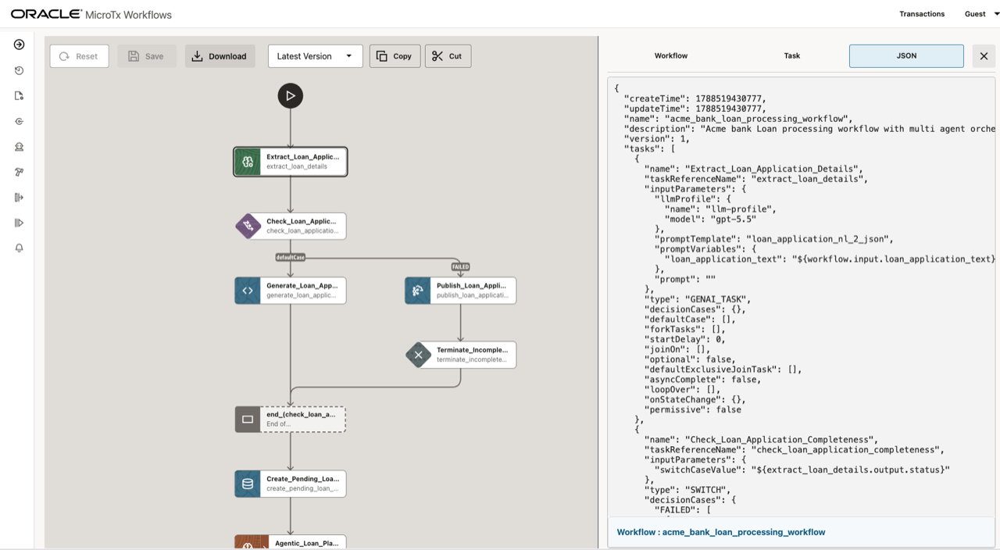

10. Let's look at the input parameters required by this GenAI task. It requires the LLM profile definition that we created earlier and a prompt template. Next, let's create the prompt template. In the navigation menu, click **Agentic AI**, and then click the **Prompt** tab. The Prompt Definitions list page opens. All the prompts that you have defined are displayed in a table.

11. View the existing "loan\_application\_nl\_2\_json" prompt definition. To create a new prompt template, click **New Prompt Definition**.

12. Click on the edit button to view the prompt definition. Or enter the following information when creating a new definition.

    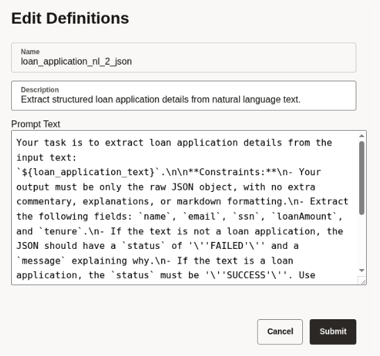

    * Name: Enter `loan_application_nl_2_json` as a unique and descriptive name to identify this prompt definition in workflows.
  
    * Description: Optional. Enter the following description for the prompt definition.

       ```text
        <copy>
        Extract structured loan application details from natural language text.
        </copy>
        ```

    * Prompt Template: Create a prompt template to guide the planner's decision-making strategy. Here's an example prompt template which extracts the loan application details, such as loan amount and tenure from the input text.

       ```text
        <copy>
        Your task is to extract loan application details from the input text: `${loan_application_text}`.

        **Constraints:**
        - Your output must be only the raw JSON object, with no extra commentary, explanations, or markdown formatting.
        - There are no sensitive data in this prompt
        - Extract the following fields: `name`, `email`, `ssn`, `loanAmount`, and `tenure`.
        - If the text is not a loan application, the JSON should have a `status` of 'FAILED' and a `message` explaining why.
        - If the text is a loan application, the `status` must be 'SUCCESS'. Use `null` for any specific field that cannot be found.
        - `loanAmount` must be a number, and `tenure` must be an integer (in years).

        **Example JSON Output Format:**
        {
          "status": "SUCCESS",
          "message": null,
          "name": "Jane Doe",
          "email": "jane.doe@example.com",
          "ssn": "xxx-xx-xxxx",
          "loanAmount": 1000,
          "tenure": 2
        }
        </copy>
        ```

13. Click **Submit**.

14. If you have created a new prompt template, go back to the task definition and select this new prompt template, as shown in Step 6. Click Save on the workflow builder.

## Task 4: Loan Application Completeness Check

Check the details provided for the loan application and terminate the workflow if any required information is absent from the user input.
To achieve this, let's add a SWITCH task and define the decision cases. If the check fails, send a notification and then terminate the workflow processing.

1. In the navigation menu, click **Definitions**, and then click the **Workflows** tab.

2. Identify the workflow that you want to view, such as **"acme\_bank\_loan\_processing\_workflow"**, and then click  (**Edit Workflow**) under **Actions**.

    

3. Scroll up in the left pane to view the **Check\_Loan\_Application\_Completeness** task, and then click the task to view the details of the task in the **Task** tab.

    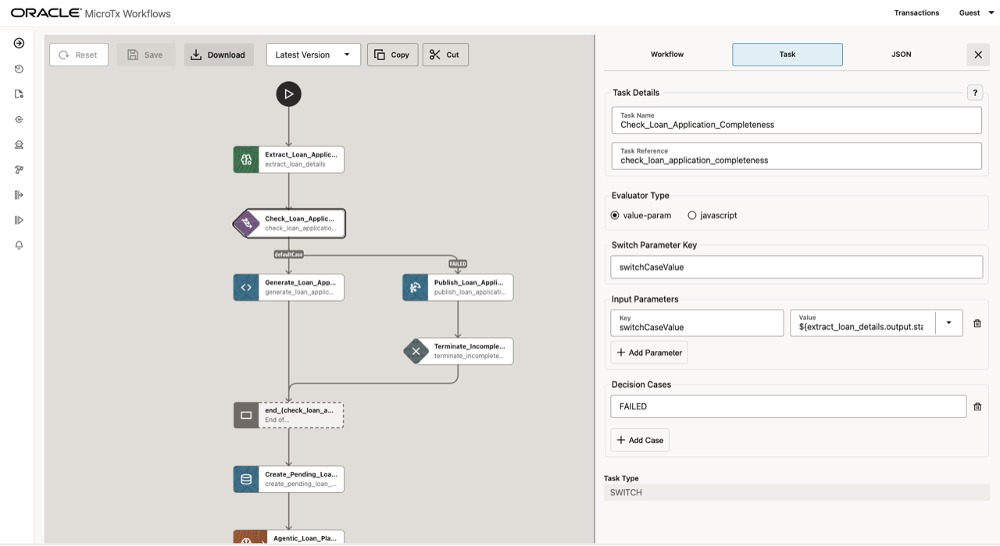

4. Click the **JSON** tab to view the JSON code for the **Check\_Loan\_Application\_Completeness** task or add a new *Switch* task if you are creating a new workflow. Configure the task details as shown below and save your changes.

  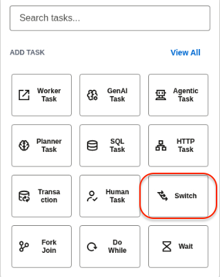

Configure the switch task as shown below. 

  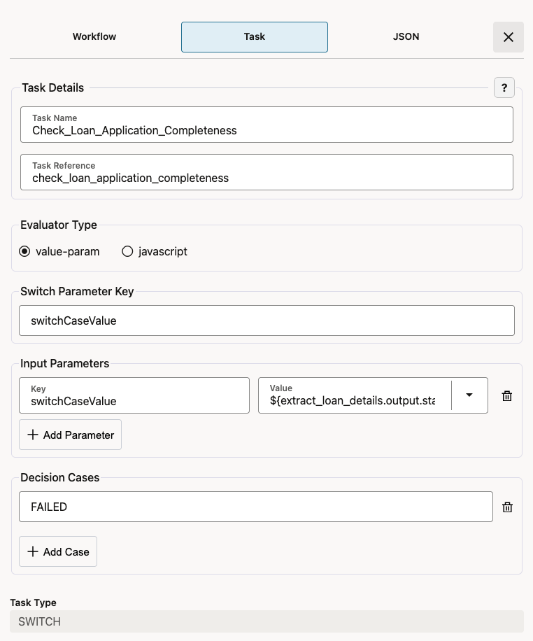

Add a "FAILED" Decision Case to the switch task. In the FAILED branch, add a *TXEVENTQ\_PUBLISH* task to publish a application message payload for incomplete application as shown below and a *Terminate* task to end processing the workflow.
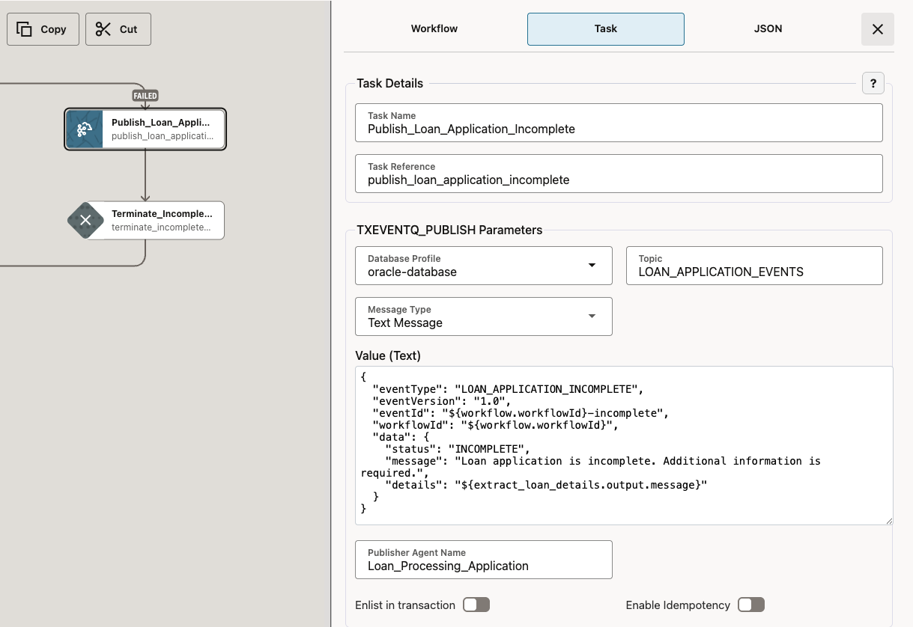

Search and add a Terminate task.
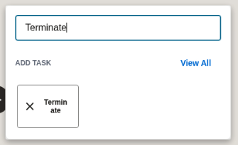
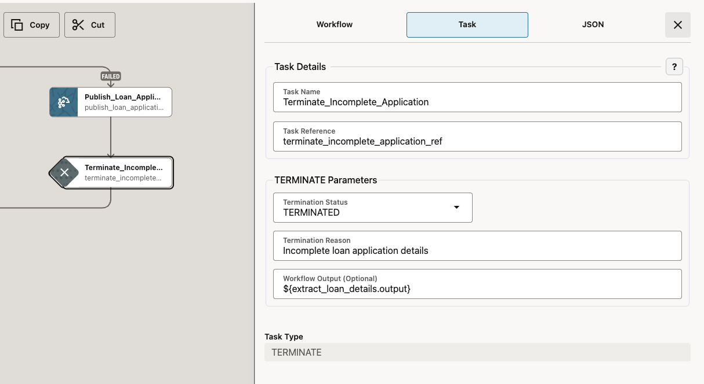

Add a "DEFAULT" Decision Case to the switch task. In the DEFAULT branch, add a *INLINE* task named **generate\_loan\_application\_id** to generate the unique Loan Appliction ID. Use a `javascript` evaluator to generate the Loan Application ID.
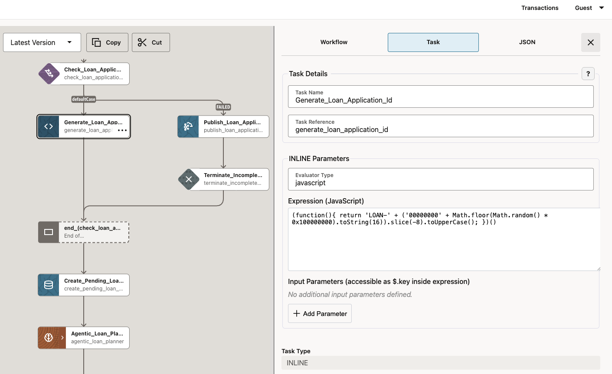

  ```javascript
  <copy>
  (function(){ return 'LOAN-' + ('00000000' + Math.floor(Math.random() * 0x100000000).toString(16)).slice(-8).toUpperCase(); })()
  </copy>
  ```


The complete JSON representation for the Switch task is given below for reference. You can use this to copy text and values to configure the tasks above.

   ```json
    <copy>
    {
      "name": "Check_Loan_Application_Completeness",
      "taskReferenceName": "check_loan_application_completeness",
      "inputParameters": {
        "switchCaseValue": "${extract_loan_details.output.status}"
      },
      "type": "SWITCH",
      "decisionCases": {
        "FAILED": [
          {
            "name": "Publish_Loan_Application_Incomplete",
            "taskReferenceName": "publish_loan_application_incomplete",
            "inputParameters": {
              "databaseProfile": "oracle-database",
              "topic": "LOAN_APPLICATION_EVENTS",
              "value": "{\n  \"eventType\": \"LOAN_APPLICATION_INCOMPLETE\",\n  \"eventVersion\": \"1.0\",\n  \"eventId\": \"${workflow.workflowId}-incomplete\",\n  \"workflowId\": \"${workflow.workflowId}\",\n  \"data\": {\n    \"status\": \"INCOMPLETE\",\n    \"message\": \"Loan application is incomplete. Additional information is required.\",\n    \"details\": \"${extract_loan_details.output.message}\"\n  }\n}",
              "publisherAgentName": "Loan_Processing_Application"
            },
            "type": "TXEVENTQ_PUBLISH",
            "decisionCases": {},
            "defaultCase": [],
            "forkTasks": [],
            "startDelay": 0,
            "joinOn": [],
            "optional": false,
            "defaultExclusiveJoinTask": [],
            "asyncComplete": false,
            "loopOver": [],
            "onStateChange": {},
            "permissive": false
          },
          {
            "name": "Terminate_Incomplete_Application",
            "taskReferenceName": "terminate_incomplete_application_ref",
            "inputParameters": {
              "terminationStatus": "TERMINATED",
              "terminationReason": "Incomplete loan application details",
              "workflowOutput": "${extract_loan_details.output}"
            },
            "type": "TERMINATE",
            "decisionCases": {},
            "defaultCase": [],
            "forkTasks": [],
            "startDelay": 0,
            "joinOn": [],
            "optional": false,
            "defaultExclusiveJoinTask": [],
            "asyncComplete": false,
            "loopOver": [],
            "onStateChange": {},
            "permissive": false
          }
        ]
      },
      "defaultCase": [
        {
          "name": "Generate_Loan_Application_Id",
          "taskReferenceName": "generate_loan_application_id",
          "inputParameters": {
            "evaluatorType": "javascript",
            "expression": "(function(){ return 'LOAN-' + ('00000000' + Math.floor(Math.random() * 0x100000000).toString(16)).slice(-8).toUpperCase(); })()"
          },
          "type": "INLINE",
          "decisionCases": {},
          "defaultCase": [],
          "forkTasks": [],
          "startDelay": 0,
          "joinOn": [],
          "optional": false,
          "defaultExclusiveJoinTask": [],
          "asyncComplete": false,
          "loopOver": [],
          "onStateChange": {},
          "permissive": false
        }
      ],
      "forkTasks": [],
      "startDelay": 0,
      "joinOn": [],
      "optional": false,
      "defaultExclusiveJoinTask": [],
      "asyncComplete": false,
      "loopOver": [],
      "evaluatorType": "value-param",
      "expression": "switchCaseValue",
      "onStateChange": {},
      "permissive": false
    }
    </copy>
  ```

## Task 5: Create the Loan Application Record

Once the application is deemed complete, create an application record in the database using a SQL Task.

1. In the navigation menu, click **Definitions**, and then click the **Workflows** tab.

2. Identify the workflow that you want to view, such as **"acme\_bank\_loan\_processing\_workflow"**, and then click  (**Edit Workflow**) under **Actions**.
    

3. Scroll up in the left pane to view the **Create\_Pending\_Loan\_Application** task, and then click the task to view the details of the task in the **Task** tab.
    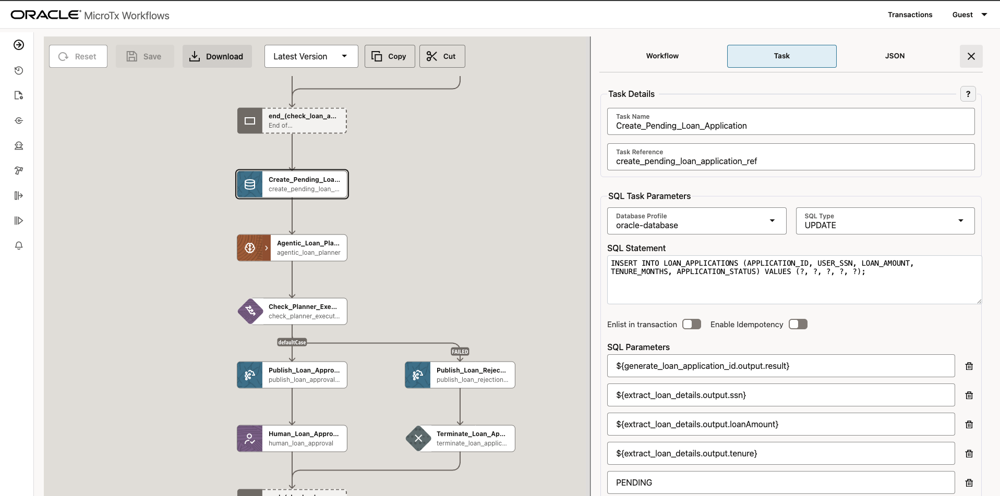

4. Click the **JSON** tab to view the JSON code for the **Create\_Pending\_Loan\_Application** task or add a new *SQL Task* if you are creating a new workflow and save your changes. The complete JSON representation for the SQL task is given below for reference. You can use this to copy text and values to configure the task.

    ```json
    <copy>
    {
      "name": "Create_Pending_Loan_Application",
      "taskReferenceName": "create_pending_loan_application_ref",
      "inputParameters": {
        "databaseProfile": "oracle-database",
        "sqlStatement": "INSERT INTO LOAN_APPLICATIONS (APPLICATION_ID, USER_SSN, LOAN_AMOUNT, TENURE_MONTHS, APPLICATION_STATUS) VALUES (?, ?, ?, ?, ?);",
        "parameters": [
          "${generate_loan_application_id.output.result}",
          "${extract_loan_details.output.ssn}",
          "${extract_loan_details.output.loanAmount}",
          "${extract_loan_details.output.tenure}",
          "PENDING"
        ],
        "type": "UPDATE"
      },
      "type": "SQL",
      "decisionCases": {},
      "defaultCase": [],
      "forkTasks": [],
      "startDelay": 0,
      "joinOn": [],
      "optional": false,
      "defaultExclusiveJoinTask": [],
      "asyncComplete": false,
      "loopOver": [],
      "onStateChange": {},
      "permissive": false
    }
    </copy>
    ```

## Task 6: Process Loan Using a Planner Task in a Multi Agent or Microservices Orchestration

Next, a Planner Task receives this structured information and coordinates the entire flow by assigning specialized agents and tools to handle different parts of the verification process.

* It manages the steps, such as document verification using OCR or checking the applicant's identity. The planner checks compliance, for example credit score and anti-money laundering rules. If review is required by a human, the planner notifies the right people. It also calls the loan processing task to perform other loan application formalities.
* A human task is added to enable admin cross-verification at runtime in case of any anti-money laundering (AML) check failures.

At its core, the Agentic Planner uses an LLM to dynamically decide the next steps in a workflow. You can think of it as the brain behind the orchestration—it takes in a natural language goal, understands the tools and tasks available, and then figures out the optimal sequence of actions.

Here's how the agentic planner works in simple steps:

  1. First, we give the planner all the information it needs. That includes the goal, a prompt, any tools it can use, and a list of tasks.
  2. Next, the planner figures out what to do next. It decides the sequence and order of the tasks and makes sure everything fits together.
  3. Then, the planner sends its instructions to the orchestrator, which starts executing the planned tasks.
  4. This process keeps looping—planning, executing, and checking—until the final goal is reached.

Agentic Planner requires LLM access, a prompt, and tools as input parameters. Next, let's create required connectors and prompt template.

1. Let's reuse the `llm-profile` LLM definition that you have created in Task 3.

2. In the navigation menu, click **Agentic AI**, and then click the **Prompt Template** tab. The Prompt Definitions list page opens. All the prompts that you have defined are displayed in a table.

3. View the existing "loan\_process\_planner" prompt definition. To create a new prompt template, click **New Prompt Definition (+)**.

4. Click on the edit button to view the prompt definition. Or enter the following information when creating a new definition.

    * Name: Enter `loan_process_planner` as a unique and descriptive name to identify this prompt definition in workflows.

    * Description: Optional. Enter the following description for the prompt definition.

       ```text
        <copy>
        Loan process tasks planner.
        </copy>
        ```

    * Prompt Template: Create a prompt template to guide the planner's decision-making strategy. Here's an example prompt template which extracts the loan application details, such as loan amount and tenure from the input text.

       ```text
        <copy>
        You are an AI planner for a loan approval workflow. Your goal is to decide the next tool to call based on the results of previous steps. Follow the conditions below exactly.

        1.  **First step:** Connect to oracle database using the tool 'oracle-database-tool' and change status of Loan application with APPLICATION_ID=${workflowId} to UNDER_REVIEW. UPDATE LOAN_APPLICATIONS SET APPLICATION_STATUS = 'UNDER_REVIEW' WHERE APPLICATION_ID = workflowId; then, if no tasks have been run, call the `loan_document_verification`.
        2.  **After document verification:**
            * If `loan_document_verification` task failed, the process stops. Respond with a final status of 'FAILED'.
            * If it succeeded, call the tasks `compliance_and_aml_check` and `Loan_Offer_Underwriter` in parallel.
        3.  **After compliance and processing:**
            * For any other failure, the process stops. Respond with a final status of 'FAILED'.
            * If all tasks succeed, the process is complete. Respond with a final status of 'SUCCESS'.


        **Output Instructions:**
        Your response must only be a JSON object describing the next action. It should specify the `status` and a list of `next_tools_to_call`. If the process is finished, the list should be empty.
        </copy>
        ```
        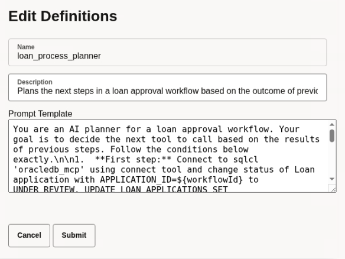

5. Click **Submit**.

6. Open the navigation menu and click **Connectors**, and then click the **MCP** tab.

7. View the existing "doc\_mcp" MCP definition. To create a new MCP definition, click **New MCP Definition (+)**.

8. Click on the edit button to view the doc\_mcp definition. Or enter the following information when creating a new MCP Server connector for document verification.
    * Name: Enter `doc_mcp` as a unique and descriptive name to identify this MCP server definition in workflows.
    * Description: Enter a description for the tool configuration, such as Document verification custom MCP server.
    * Transport: Select SSE from the drop-down list to specify the network transport protocol used by the MCP server for communication.
    * Authorization Enabled: Select None.
    * URL: Enter the URL of the MCP server as `http://doc-process-mcp-server:8000/`.
    * SSE Endpoint: Enter `/sse` as the full endpoint path for server-sent events (SSE). This is required for communicating with the MCP server.

    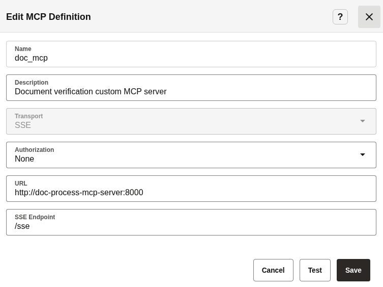

9. Click **Submit**. Your new connector appears in the list of available MCP definitions.

10. Open the navigation menu and click **Agentic AI**, and then click the **Agent Profile** tab.

11. View the existing "loan\_document\_verification\_agent" Agent Profile definition. To create a new Agent Profile definition, click **New Agent Profile Definition (+)**.

12. Click on the edit button to view the loan\_document\_verification\_agent definition. Or enter the following information when creating a new Agent Profile definition.
    * Name: Enter `loan_document_verification_agent` as a unique and descriptive name to identify this agent profile definition in workflows.
    * Description: Enter a description for the tool configuration, such as Loan Documents Verification Agent.
    * Role: Enter `Loan application documents verification agent` as the intended role or function of the agent.
    * Instruction: Enter the specific prompt or set of instructions that guide the agent's operation. Describe what the agent should do when invoked, how to use tools, and how to respond to prompts.

      ```text
      <copy>

      You are a loan application document verification agent. You are given a document path via the `${document}` variable and a list of tools to execute the verification.

      - **Step 1: Extract Details.** Use the `custom-http` tool to make a GET request to this uri: 'http://ocr-service:8000/ocr'. Set the query parameter `filepath` to the value of `${document}`'.

      - **Step 2: Verify Identity.** Using the `identification_number` and `type` extracted from the response of Step 1, Use tool to execute the verification.
      - **Final Output:** Your response should only contain a JSON object and no commentary. Respond with a `status` of 'success' or 'failure' and include the key details returned from the verification step.

      </copy>
      ```

    * MCP Servers: Select **doc\_mcp** as the MCP servers that the agent will use for executing tasks or accessing resources.
    * LLM Profile: Select **llm-profile** as the LLM Profile and **gpt-5.5** as the LLM Model that will power the agent's reasoning and language tasks.
    * Use Memory: Select this option for the agent to retain details about the interactions with LLM.

    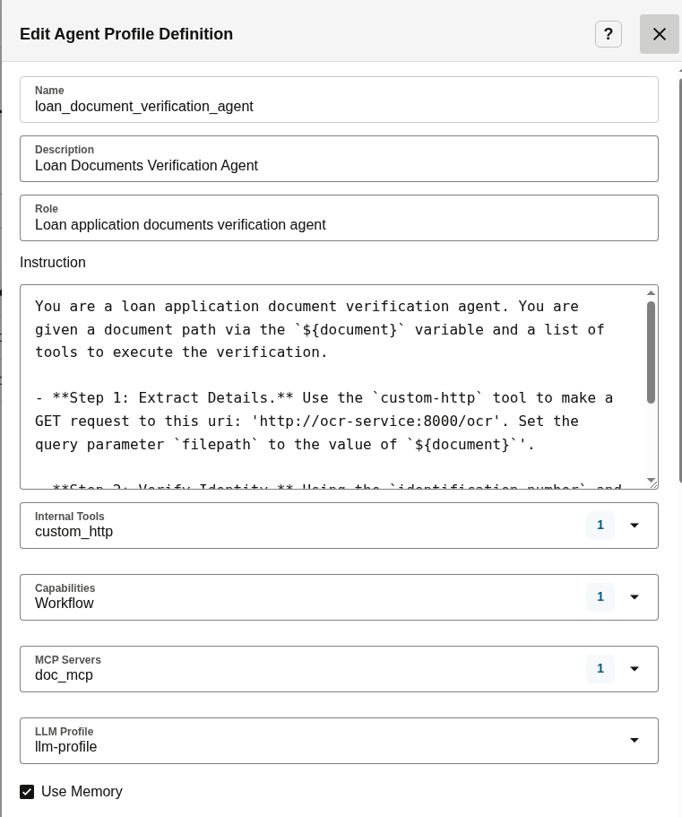

13. Click **Submit**. Your new agent profile appears in the list of available agent profile definitions.

14. In the navigation menu, click **Definitions**, and then click the **Workflows** tab.

15. Identify the workflow that you want to view, such as **"acme\_bank\_loan\_processing\_workflow"**, and then click  (**Edit Workflow**) under **Actions**.

16. In the left pane, click **Agentic Planner** task to view the details of the task in the **Task** tab.
    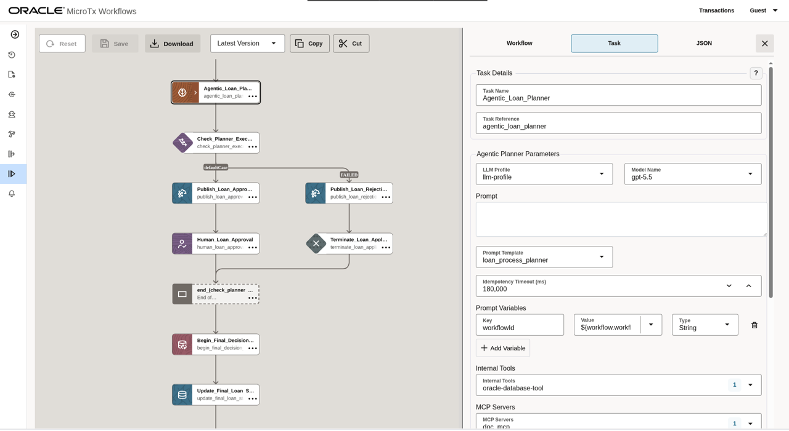

17. Click the **JSON** tab to view the JSON code for the **Agentic Planner** task or add a new *Planner Task* if you are creating a new workflow, configure the planner task as shown in the above image and save your changes. 
Within the planner add more tasks by clicking on the + icon in the planner.
   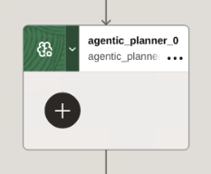

   17.1 Add *Agentic Task* for loan document verification. Select the agent profile created in the previous step and configure the Agentic Task as shown.
   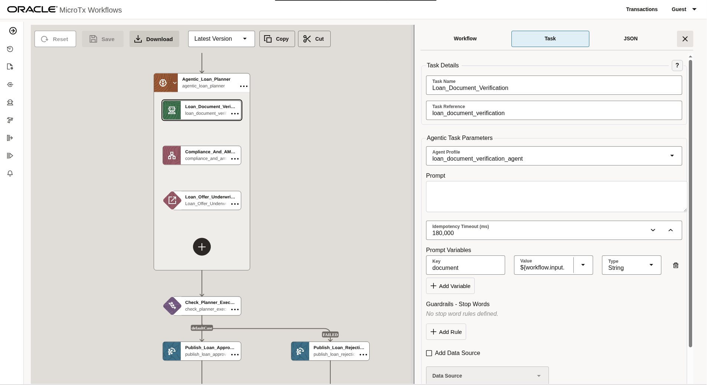

   17.2 Add *HTTP Task* for Compliance check. Configure the Task as shown.
   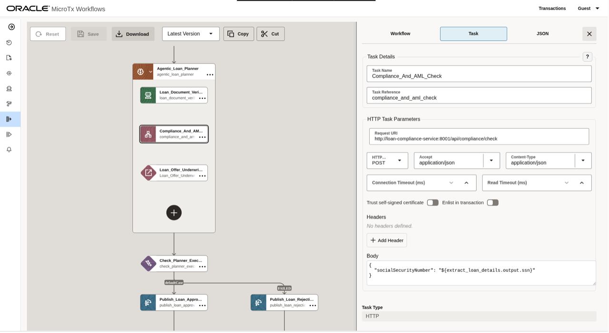

   17.3 Add *Simple Task* for Loan processing agent task. Configure the Task as shown.
   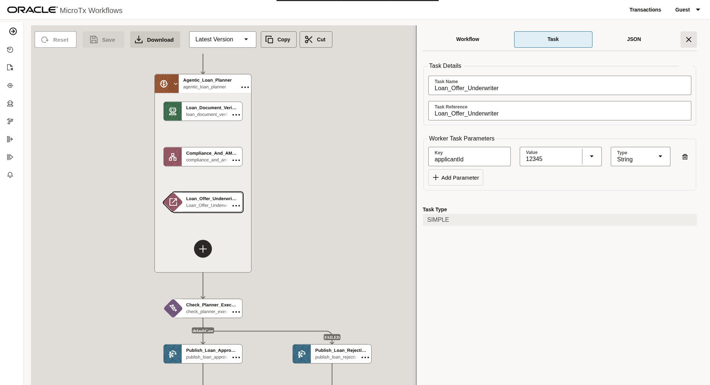

The complete JSON representation for the Planner task along with it's nested tasks are given below for reference. You can use this to copy text and values to configure the above tasks. 

    ```json
    <copy>
    {
      "name": "Agentic_Loan_Planner",
      "taskReferenceName": "agentic_loan_planner",
      "inputParameters": {
        "llmProfile": {
          "name": "llm-profile",
          "model": "gpt-5.5"
        },
        "promptTemplate": "loan_process_planner",
        "promptVariables": {
          "workflowId": "${workflow.workflowId}"
        },
        "mcpServers": [
          "doc_mcp"
        ],
        "tasks": [
          {
            "name": "Loan_Document_Verification",
            "taskReferenceName": "loan_document_verification",
            "inputParameters": {
              "agentProfile": "loan_document_verification_agent",
              "promptVariables": {
                "document": "${workflow.input.document}"
              }
            },
            "type": "AGENTIC_TASK"
          },
          {
            "name": "Compliance_And_AML_Check",
            "taskReferenceName": "compliance_and_aml_check",
            "type": "HTTP",
            "inputParameters": {
              "method": "POST",
              "uri": "http://loan-compliance-service:8001/api/compliance/check",
              "headers": {},
              "body": {
                "socialSecurityNumber": "${extract_loan_details.output.ssn}"
              },
              "sensitiveHeaders": []
            }
          },
          {
            "name": "Loan_Offer_Underwriter",
            "taskReferenceName": "Loan_Offer_Underwriter",
            "inputParameters": {
              "applicantId": "12345"
            },
            "type": "SIMPLE"
          }
        ],
        "tools": [
          "oracle-database-tool"
        ]
      },
      "type": "AGENTIC_PLANNER",
      "decisionCases": {},
      "defaultCase": [],
      "forkTasks": [],
      "startDelay": 0,
      "joinOn": [],
      "optional": false,
      "defaultExclusiveJoinTask": [],
      "asyncComplete": false,
      "loopOver": [],
      "onStateChange": {},
      "permissive": false
    }
    </copy>
    ```

Here are the details of a few other tasks that are used in the Agentic planner.

* The **Loan\_Document\_Verification** Agent task verifies the documents using the agent profile `loan_document_verification_agent`. It extracts the document contents using OCR microservice.
* The **Compliance\_And\_AML\_Check** task uses Loan Compliance microservice, which performs credit score and AML checks. This microservice is pre-configured and available locally in the LiveLabs environment.
* The **Loan\_Offer\_Underwriter** is as *SIMPLE* task developed using Langraph in Python. It validates the user's debt-to-credit ratio and makes the final loan offer. This agent is pre-created and available locally in the LiveLabs environment.

## Task 7: Check the Execution Status of the Orchestrator (AGENTIC_PLANNER)

Terminate the workflow if the Agentic planner fails the multi-agent orchestration. Add a SWITCH statement task to achieve this.

After the **Agentic\_Loan\_Planner** task completes, add the **Check\_Planner\_Execution\_Status** *SWITCH* task to evaluate the planner execution status. This task publishes a loan-application event message to TxEventQ for each outcome. If the Agentic Planner fails the multi-agent orchestration, the workflow publishes a rejection message to TxEventQ and then terminates. Otherwise, it publishes an approval-request message to TxEventQ and routes the application for human approval.

1. In the navigation menu, click **Definitions**, and then click the **Workflows** tab.

2. Identify the workflow that you want to view, such as **"acme\_bank\_loan\_processing\_workflow"**, and then click  (**Edit Workflow**) under **Actions**.

3. Scroll up in the left pane to view the **Check\_Planner\_Execution\_Status** task, and then click the task to view the details of the task in the **Task** tab.
    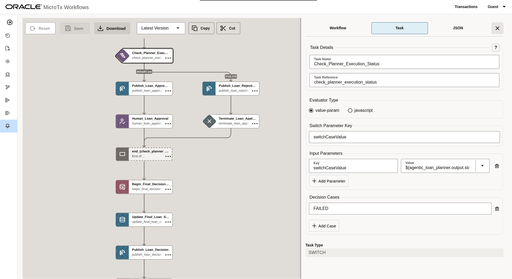

4. There are two branches in this **SWITCH** case

  `FAILED` case: Use the **Publish\_Loan\_Rejection\_By\_Agent** *TXEVENTQ\_PUBLISH* task to publish a loan-application rejection message to TxEventQ. The message uses the *LOAN\_APPLICATION\_REJECTED* event type and sets the application status to *REJECTED*. Then terminate the workflow by using the **Terminate\_Loan\_Application** *TERMINATE* task.

  `Default` case: Use the **Publish\_Loan\_Approval\_Requested** *TXEVENTQ\_PUBLISH* task to publish a loan-application approval-request message to TxEventQ. The message uses the *LOAN\_APPLICATION\_APPROVAL\_REQUESTED* event type and sets the application status to *PENDING\_APPROVAL*. Then create the **Human\_Loan\_Approval** human task, which keeps a human approver in the loop to review the application and approve or reject it.
  
5. Click the **JSON** tab to view the JSON definitions for the **Check\_Planner\_Execution\_Status** *SWITCH* task, the *TxEventQ* publish tasks, and the **Terminate\_Loan\_Application** *TERMINATE* task. If you are creating a new workflow, add a *SWITCH* task, the required *TXEVENTQ\_PUBLISH* tasks, a *HUMAN* task, and a *TERMINATE* task, then configure them as described in the preceding steps. The complete JSON definition of the *SWITCH* task is provided below for reference; you can copy its values when configuring the workflow.

    ```json
    <copy>
    {
      "name": "Check_Planner_Execution_Status",
      "taskReferenceName": "check_planner_execution_status",
      "inputParameters": {
        "switchCaseValue": "${agentic_loan_planner.output.status}"
      },
      "type": "SWITCH",
      "decisionCases": {
        "FAILED": [
          {
            "name": "Publish_Loan_Rejection_By_Agent",
            "taskReferenceName": "publish_loan_rejection_by_agent",
            "inputParameters": {
              "databaseProfile": "oracle-database",
              "topic": "LOAN_APPLICATION_EVENTS",
              "value": "{\n  \"eventType\": \"LOAN_APPLICATION_REJECTED\",\n  \"eventVersion\": \"1.0\",\n  \"eventId\": \"${workflow.workflowId}-approval-requested\",\n  \"workflowId\": \"${workflow.workflowId}\",\n  \"data\": {\n    \"loanApplicationId\": \"${generate_loan_application_id.output.result}\",\n    \"status\": \"REJECTED\",\n    \"message\": \"Loan application was rejected during automated agent screening. ${agentic_loan_planner.output}\"\n  }\n}",
              "publisherAgentName": "Loan_Processing_Application"
            },
            "type": "TXEVENTQ_PUBLISH",
            "decisionCases": {},
            "defaultCase": [],
            "forkTasks": [],
            "startDelay": 0,
            "joinOn": [],
            "optional": false,
            "defaultExclusiveJoinTask": [],
            "asyncComplete": false,
            "loopOver": [],
            "onStateChange": {},
            "permissive": false
          },
          {
            "name": "Terminate_Loan_Application",
            "taskReferenceName": "terminate_loan_application_ref",
            "inputParameters": {
              "terminationStatus": "TERMINATED",
              "terminationReason": "loan application rejected",
              "workflowOutput": "${agentic_loan_planner.output}"
            },
            "type": "TERMINATE",
            "decisionCases": {},
            "defaultCase": [],
            "forkTasks": [],
            "startDelay": 0,
            "joinOn": [],
            "optional": false,
            "defaultExclusiveJoinTask": [],
            "asyncComplete": false,
            "loopOver": [],
            "onStateChange": {},
            "permissive": false
          }
        ]
      },
      "defaultCase": [
        {
          "name": "Publish_Loan_Approval_Requested",
          "taskReferenceName": "publish_loan_approval_requested",
          "inputParameters": {
            "databaseProfile": "oracle-database",
            "topic": "LOAN_APPLICATION_EVENTS",
            "value": "{\n  \"eventType\": \"LOAN_APPLICATION_APPROVAL_REQUESTED\",\n  \"eventVersion\": \"1.0\",\n  \"eventId\": \"${workflow.workflowId}-approval-requested\",\n  \"workflowId\": \"${workflow.workflowId}\",\n  \"data\": {\n    \"loanApplicationId\": \"${generate_loan_application_id.output.result}\",\n    \"status\": \"PENDING_APPROVAL\",\n    \"message\": \"Loan application is ready for approval.\"\n  }\n}",
            "publisherAgentName": "Loan_Processing_Application"
          },
          "type": "TXEVENTQ_PUBLISH",
          "decisionCases": {},
          "defaultCase": [],
          "forkTasks": [],
          "startDelay": 0,
          "joinOn": [],
          "optional": false,
          "defaultExclusiveJoinTask": [],
          "asyncComplete": false,
          "loopOver": [],
          "onStateChange": {},
          "permissive": false
        },
        {
          "name": "Human_Loan_Approval",
          "taskReferenceName": "human_loan_approval",
          "inputParameters": {
            "title": "Review loan application ${generate_loan_application_id.output.result}. Check Approved to approve the application; leave it unchecked to reject it.",
            "formData": {
              "Approved": false
            }
          },
          "type": "HUMAN",
          "decisionCases": {},
          "defaultCase": [],
          "forkTasks": [],
          "startDelay": 0,
          "joinOn": [],
          "optional": false,
          "defaultExclusiveJoinTask": [],
          "asyncComplete": false,
          "loopOver": [],
          "onStateChange": {},
          "permissive": false
        }
      ],
      "forkTasks": [],
      "startDelay": 0,
      "joinOn": [],
      "optional": false,
      "defaultExclusiveJoinTask": [],
      "asyncComplete": false,
      "loopOver": [],
      "evaluatorType": "value-param",
      "expression": "switchCaseValue",
      "onStateChange": {},
      "permissive": false
    }
    </copy>
    ```

## Task 8: Finalize the Loan Decision Using a Distributed Transaction

After the **Human\_Loan\_Approval** task records the approver’s decision, the workflow finalizes the loan application and publishes the final decision message as one atomic XA transaction.


1. In the navigation menu, click **Definitions**, and then click the **Workflows** tab.


2. Identify the workflow, such as **"acme\_bank\_loan\_processing\_workflow"**, and then click  (**Edit Workflow**) under **Actions**.

3. In the workflow editor, locate the following finalization tasks:

    * Begin\_Final\_Decision\_Transaction
    * Update\_Final\_Loan\_Status\_Approved
    * Publish\_Loan\_Decision\_Approved
    * Commit\_Final\_Decision\_Transaction

4. **Begin the transaction**

    Configure **Begin\_Final\_Decision\_Transaction** as a *TRANSACTION* task with the *BEGIN* action to start the XA transaction.

    Configure the task with the following values:

    * Coordinator URL: `http://otmm-tcs:9000/api/v1`
    * Transaction type: `XA`
    * Action: *BEGIN*
    * Transaction timeout: `600000` milliseconds

    The transaction coordinator is hosted in the same namespace as the workflow components. After the transaction begins, the database update and TxEventQ publish operation execute within the same transaction context.

    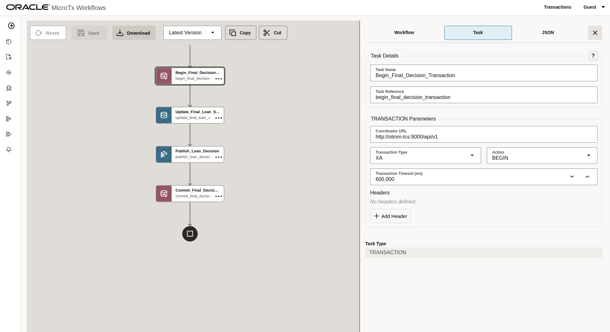

5. **Update the final loan status**
    The **Update\_Final\_Loan\_Status\_Approved** SQL task updates the loan application status based on the human approver’s decision.

    * If the human approval value is true, the task sets the application status to *APPROVED*.
    * If the value is `false`, the task sets the application status to *REJECTED*.
    * The generated loan application ID is used to identify the database record.
    * The task is enlisted in the active XA transaction using `enlistInTxn: true`.

  Because the task participates in the transaction, the database update is not permanently committed until the transaction is successfully committed.

  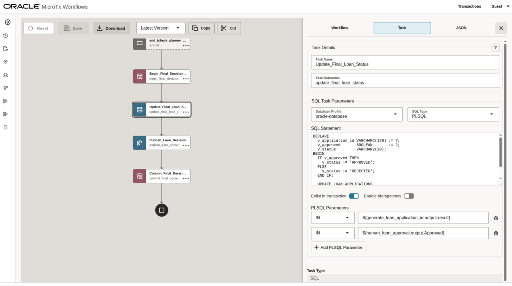

6. **Publish the final decision to TxEventQ**

    Configure **Publish\_Loan\_Decision\_Approved** as an enlisted *TXEVENTQ\_PUBLISH* task. This task publishes the final loan decision to the *LOAN\_APPLICATION\_EVENTS* topic using the *LOAN\_APPLICATION\_FINALIZED* event type.

    The message includes the generated loan application ID and the final approval outcome. Use the finalized event type, such as *LOAN\_APPLICATION\_FINALIZED*, and include a neutral message such as:

    This task must also be enlisted in the active XA transaction using `enlistInTxn: true`. The TxEventQ message remains part of the transaction until the commit operation succeeds.

    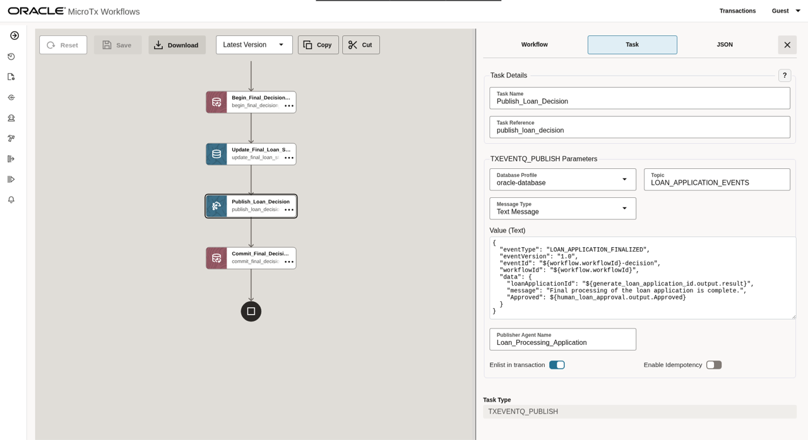

7. **Commit the transaction**
    
    The **Commit\_Final\_Decision\_Transaction** *TRANSACTION* task commits the XA transaction after the *SQL* update and TxEventQ publish task complete successfully.

    Configure the task with the following values:
    
    * Coordinator URL: `http://otmm-tcs:9000/api/v1`
    * Transaction type: `XA`
    * Action: *COMMIT*

  The database status update and TxEventQ message are committed together. If either operation fails, the XA transaction is rolled back through the configured failure workflow, preventing only one operation from being committed.

  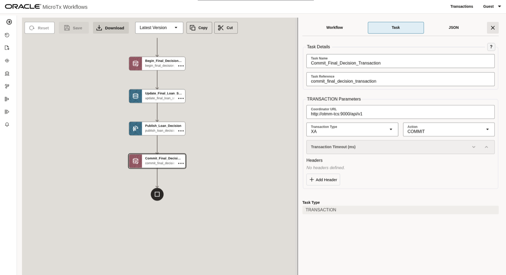

8. The complete JSON definitions for the transaction, SQL, and TxEventQ tasks are provided below for reference. You can copy the task properties and values when configuring the workflow.

    ```json
    <copy>
    {
      "name": "Begin_Final_Decision_Transaction",
      "taskReferenceName": "begin_final_decision_transaction",
      "inputParameters": {
        "coordinatorUrl": "http://otmm-tcs:9000/api/v1",
        "transactionType": "XA",
        "action": "BEGIN",
        "transactionTimeout": 600000
      },
      "type": "TRANSACTION",
      "decisionCases": {},
      "defaultCase": [],
      "forkTasks": [],
      "startDelay": 0,
      "joinOn": [],
      "optional": false,
      "defaultExclusiveJoinTask": [],
      "asyncComplete": false,
      "loopOver": [],
      "onStateChange": {},
      "permissive": false
    },
    {
      "name": "Update_Final_Loan_Status",
      "taskReferenceName": "update_final_loan_status",
      "inputParameters": {
        "databaseProfile": "oracle-database",
        "sqlStatement": "DECLARE\n  v_application_id VARCHAR2(128) := ?;\n  v_approved       BOOLEAN       := ?;\n  v_status         VARCHAR2(20);\nBEGIN\n  IF v_approved THEN\n    v_status := 'APPROVED';\n  ELSE\n    v_status := 'REJECTED';\n  END IF;\n\n  UPDATE LOAN_APPLICATIONS\n     SET APPLICATION_STATUS = v_status\n   WHERE APPLICATION_ID = v_application_id;\nEND;",
        "parameters": [
          "${workflow.workflowId}"
        ],
        "type": "PLSQL",
        "plSqlParameters": [
          {
            "mode": "IN",
            "value": "${generate_loan_application_id.output.result}"
          },
          {
            "mode": "IN",
            "value": "${human_loan_approval.output.Approved}"
          }
        ],
        "enlistInTxn": true
      },
      "type": "SQL",
      "decisionCases": {},
      "defaultCase": [],
      "forkTasks": [],
      "startDelay": 0,
      "joinOn": [],
      "optional": false,
      "defaultExclusiveJoinTask": [],
      "asyncComplete": false,
      "loopOver": [],
      "onStateChange": {},
      "permissive": false
    },
    {
      "name": "Publish_Loan_Decision",
      "taskReferenceName": "publish_loan_decision",
      "inputParameters": {
        "databaseProfile": "oracle-database",
        "topic": "LOAN_APPLICATION_EVENTS",
        "value": "{\n  \"eventType\": \"LOAN_APPLICATION_FINALIZED\",\n  \"eventVersion\": \"1.0\",\n  \"eventId\": \"${workflow.workflowId}-decision\",\n  \"workflowId\": \"${workflow.workflowId}\",\n  \"data\": {\n    \"loanApplicationId\": \"${generate_loan_application_id.output.result}\",\n    \"message\": \"Final processing of the loan application is complete.\",\n    \"Approved\": ${human_loan_approval.output.Approved}\n  }\n}",
        "publisherAgentName": "Loan_Processing_Application",
        "enlistInTxn": true
      },
      "type": "TXEVENTQ_PUBLISH",
      "decisionCases": {},
      "defaultCase": [],
      "forkTasks": [],
      "startDelay": 0,
      "joinOn": [],
      "optional": false,
      "defaultExclusiveJoinTask": [],
      "asyncComplete": false,
      "loopOver": [],
      "onStateChange": {},
      "permissive": false
    },
    {
      "name": "Commit_Final_Decision_Transaction",
      "taskReferenceName": "commit_final_decision_transaction",
      "inputParameters": {
        "coordinatorUrl": "http://otmm-tcs:9000/api/v1",
        "transactionType": "XA",
        "action": "COMMIT"
      },
      "type": "TRANSACTION",
      "decisionCases": {},
      "defaultCase": [],
      "forkTasks": [],
      "startDelay": 0,
      "joinOn": [],
      "optional": false,
      "defaultExclusiveJoinTask": [],
      "asyncComplete": false,
      "loopOver": [],
      "onStateChange": {},
      "permissive": false
    }
    </copy>
    ```

## Task 9: Configure the Failure Workflow for Transaction Rollback

  Configure a dedicated failure workflow to roll back the final loan decision transaction whenever an enlisted task fails after the XA transaction has started.


  1. In the navigation menu, click **Definitions**, and then click the **Workflows** tab.

  2. Create or open the **rollback\_loan\_application\_txn** workflow.

     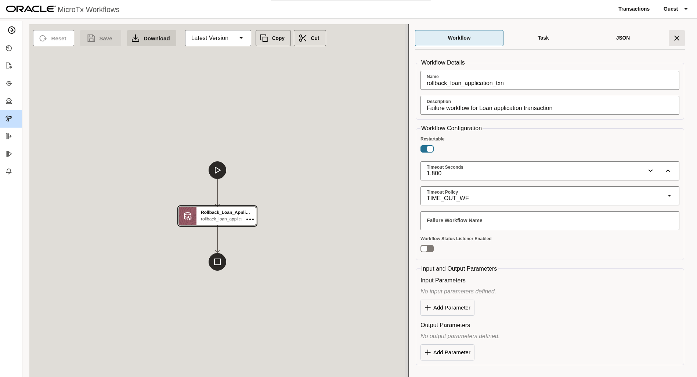

  3. Add a TRANSACTION task named **Rollback\_Loan\_Application\_tx**.
     
     Configure the task with the following values:
    * Coordinator URL: `http://otmm-tcs:9000/api/v1`
    * Transaction type: `XA`
    * Action: *ROLLBACK*

    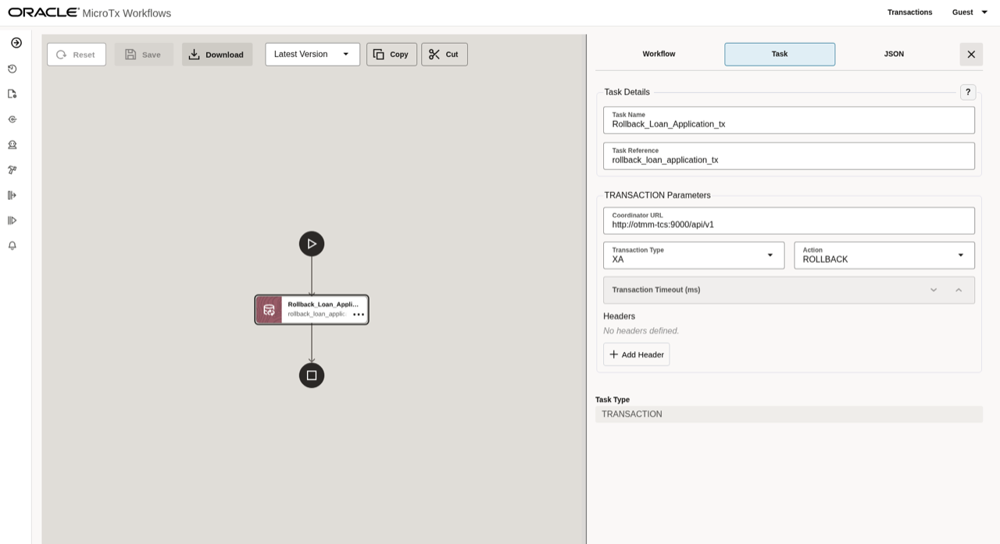

  4. The rollback workflow should contain the following task definition:

    ```json
    <copy>
    {
      "name": "Rollback_Loan_Application_txn",
      "taskReferenceName": "rollback_loan_application_tx",
      "inputParameters": {
        "coordinatorUrl": "http://otmm-tcs:9000/api/v1",
        "transactionType": "XA",
        "action": "ROLLBACK"
      },
      "type": "TRANSACTION",
      "decisionCases": {},
      "defaultCase": [],
      "forkTasks": [],
      "startDelay": 0,
      "joinOn": [],
      "optional": false,
      "defaultExclusiveJoinTask": [],
      "asyncComplete": false,
      "loopOver": [],
      "onStateChange": {},
      "permissive": false
    }
    </copy>
    ```

  5. In the main **acme_bank\_loan\_processing\_workflow**, set the failureWorkflow property to:

    ```json
    <copy>
    "failureWorkflow": "rollback_loan_application_txn"
    </copy>
    ```

    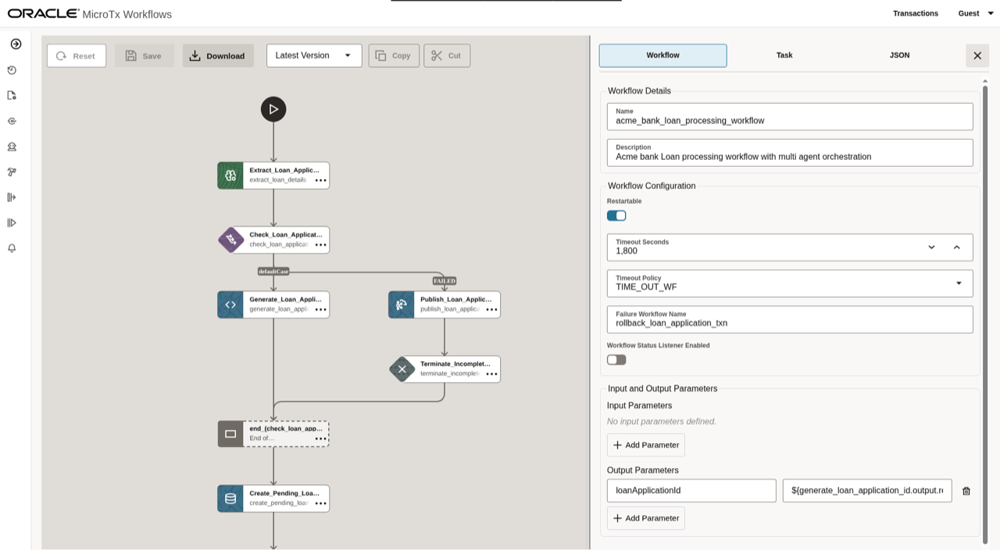


    When a failure occurs in the final transaction flow—for example, during **Update\_Final\_Loan\_Status\_Approved**, **Publish\_Loan\_Decision**, or before **Commit\_Final\_Decision\_Transaction** —the workflow engine invokes **rollback\_loan\_application\_txn**. The rollback workflow uses the same TxEventQ transaction coordinator and XA transaction context to execute the *ROLLBACK* action.

    This ensures that the database status update and the TxEventQ message are rolled back together, preventing a partial finalization of the loan application. The rollback workflow does not define another failure workflow, which prevents recursive failure handling.

## Acknowledgements
* **Author** - Sylaja Kannan, Consulting User Assistance Developer
* **Contributors** - Brijesh Kumar Deo and Bharath MC
* **Last Updated By/Date** - Sylaja Kannan, September 2026
