# Create Loan Application Processing Workflow

## Introduction

This lab walks you through the steps to create a workflow for a loan processing application.

**Note**: Skip this lab and jump to the next lab to directly run an existing workflow. A complete workflow is already available in MicroTx Workflow on your remote desktop. You can use this workflow as a reference.

In this lab, you will understand the various building blocks of the workflow, such as tasks, prompts, and agent profile. You will also build a few of these blocks. In this lab, you will add multiple tasks in a step-by-step manner. Each task accomplishes a specific goal. This workflow accepts user input in natural language.

**Note**: You can also complete the tasks in this lab by viewing the building blocks and workflow tasks defined in the existing loan application processing workflow. All the building blocks such as connectors for LLM, database and MCP server, prompt templates, gen-ai task, agentic task, planner task and other tasks are already created to support the execution of the existing loan application processing workflow. You can analyze the task definitions in the Workflow Builder to understand how these building blocks are added into a workflow.

Estimated Lab Time: 30 minutes

### Objectives

In this lab, you will:

* Understand the various building blocks of a workflow and create a few building blocks.

This lab assumes you have:

* An Oracle Cloud account
* All previous labs successfully completed

## Task 1: View Existing Workflow

1. Open the navigation menu and click **Definitions**, and then click the **Workflows** tab.
   The Workflows list page opens. All the workflows that you have defined are displayed in a table.

2. Identify the workflow that you want to view, such as **"acme\_bank\_loan\_processing\_workflow"**, and then click  (**Edit Workflow**) under **Actions**.
   The Workflow Builder visually depicts all the tasks of the workflow in the left pane. Scroll to view all the tasks of the workflow. In the right pane, the **Workflow** tab displays all the details of the workflow.
  

3. Click the **JSON** tab to view the JSON for the workflow as shown in the following image. Scroll to view the entire JSON.
   

4. Click a component to view more details. The following figure shows the details of an Agentic Planner task in the right pane under the **Task** tab.
   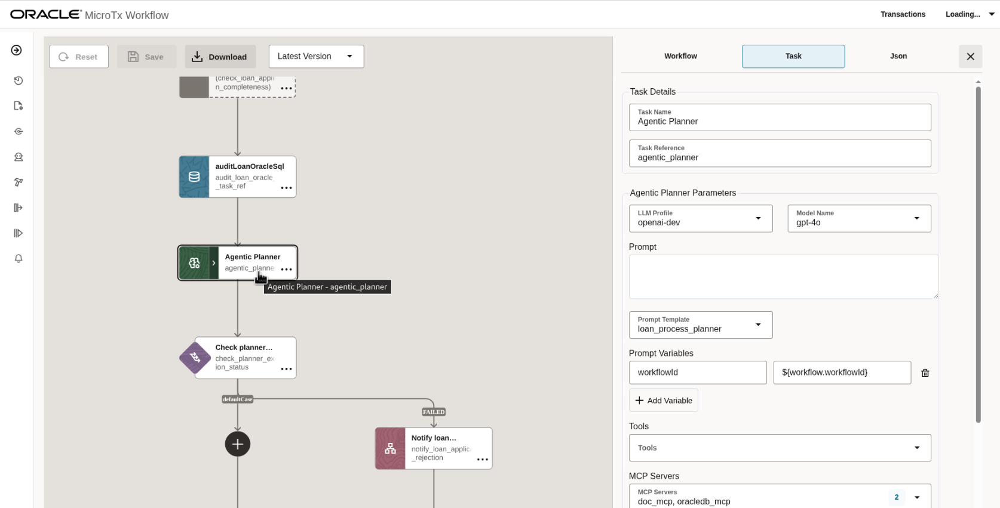

5. If you want to proceed by viewing the workflow and not creating a new one, then skip Task 2 and proceed to Task 3.

## Task 2: Create a New Workflow

1. Open the navigation menu and click **Definitions**, and then click the **Workflows** tab.

2. Click **New Workflow**. The Workflow Builder is displayed. In the right pane, the **Workflow** tab displays all the details of the workflow. Enter details of the workflow, such as its name and values for the other parameters.
   

3. Place the cursor on the arrow mark. A plus sign appears.
   

4. Click the plus icon. Many tasks are displayed.
   

5. Click a task that you want to add to the workflow. The following image shows an agentic task that is added to the workflow.
   

6. Click the task to enter details about the task, such as its name and parameters.
   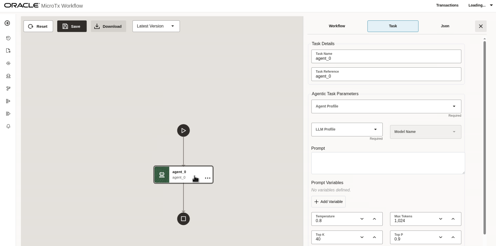

7. Click **Save**.
   MicroTx Workflow displays the changes in JSON code. Review all the changes.
   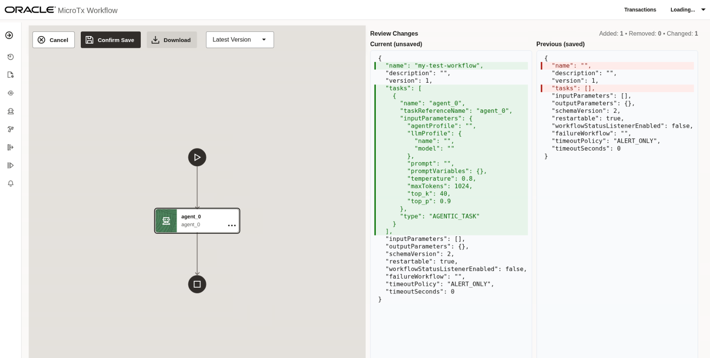

8. Click **Confirm Save** to save the changes.

The new workflow is displayed in the Workflows list page.

## Task 3: Extract Loan Application Details

The workflow accepts user input in natural language. Use a GenAI task type to extract the loan application details from the input provided by a user. Since a GenAI task requires LLM, let's start by creating a connector for accessing the LLM.

1. Open the navigation menu and click **Connectors**.

2. Click the **LLM** tab. *You can view and use the existing LLM connector definition **openai-dev** for the remaining tasks without creating a new one. An OpenAI API Key has already been added for this LLM connector*. The API Key is not shown in the edit dialog.

3. To create a new LLM definition, click **New LLM Definition**. The **New LLM Definition** dialog box appears.

4. Click on the Edit button to view the existing LLM definition. Or enter the following information if you want to create a new definition.
    * Name: Enter openai-dev as a unique and descriptive name to identify this LLM definition in workflows.
    * Model Provider: Select OPENAI as the model provider.
    * Models: Enter gpt-4o, gpt-4o-mini as a comma-separated list of the names of the models which you intend to use.
    * Description: Enter a description for the LLM definition.
    * API Key: *Paste your OpenAI API key, which authenticates your requests*. The added API Key is not shown in the edit dialog.
    * Base URL: Enter <https://api.openai.com/> as the URL to access the API endpoint of the LLM.

     

5.  Click **Submit**.
    Your new definition appears in the list of available LLM definitions.

6.  In the navigation menu, click **Definitions**, and then click the **Workflows** tab.

7. Identify the workflow that you want to view, such as **"acme\_bank\_loan\_processing\_workflow"**, and then click  (**Edit Workflow**) under **Actions**.
   The Workflow Builder visually depicts all the tasks of the workflow in the left pane. Scroll up and down to view all the tasks in the workflow. In the right pane, the **Workflow** tab displays all the details of the workflow.
  

8. Scroll up in the left pane to view the **Extract Loan Application details** task, and then click the task to view the details of the task in the **Task** tab.
   

9. Click the **Json** tab to view the JSON code for the **Extract Loan Application details** task or configure the task as shown below if you are creating a new workflow and save your changes.
   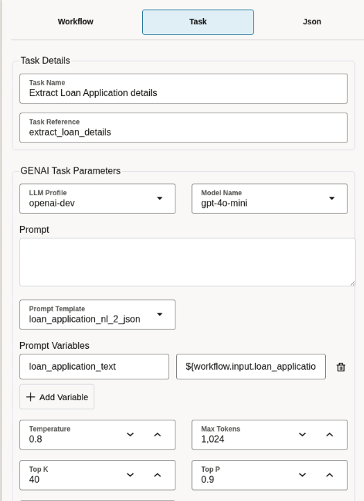
   

10. Let's look at the input parameters required by this GenAI task. It requires the LLM profile definition that we created earlier and a prompt template. Next, let's create the prompt template. In the navigation menu, click **Agentic AI**, and then click the **Prompt** tab. The Prompt Definitions list page opens. All the prompts that you have defined are displayed in a table.

11. View the existing "loan\_application\_nl\_2\_json" prompt definition. To create a new prompt template, click **New Prompt Definition**.

12. Click on the edit button to view the prompt definition. Or enter the following information when creating a new definition.

   

    * Name: Enter `loan_application_nl_2_json` as a unique and descriptive name to identify this prompt definition in workflows.
  
    * Description: Optional. Enter the following description for the prompt definition.

       ```text
        <copy>
        Extract structured loan application details from natural language text.
        </copy>
        ```

    * Prompt Template: Create a prompt template to guide the planner's decision-making strategy. Here's an example prompt template which extracts the loan application details, such as loan amount and tenure from the input text.

       ```text
        <copy>
        Your task is to extract loan application details from the input text: `${loan_application_text}`.
        **Constraints:**
          - Your output must be only the raw JSON object, with no extra commentary, explanations, or markdown formatting.
          - Extract the following fields: `name`, `email`, `ssn`, `loanAmount`, and `tenure`.
          - If the text is not a loan application, the JSON should have a `status` of 'FAILED' and a `message` explaining why.
          - If the text is a loan application, the `status` must be 'SUCCESS'. Use 'null' for any specific field that cannot be found.
          - `loanAmount` must be a number, and `tenure` must be an integer (in years).

        **Example Output Format:**
        {
            "status": "SUCCESS",
            "message": null,
            "name": "Jane Doe",
            "email": "jane.doe@example.com",
            "ssn": "xxx-xx-xxxx",
            "loanAmount": 1000,
            "tenure": 2
        }
        </copy>
        ```

13. Click **Submit**.

14. If you have created a new prompt template, go back to the task definition and select this new prompt template, as shown in Step 6. Click Save on the workflow builder.

## Task 4: Loan Application Completeness Check

Check the details provided for the loan application and terminate the workflow if any required information is absent from the user input.
To achieve this, let's add a SWITCH task and define the decision cases. If the check fails, send a notification and then terminate the workflow processing.

1. In the navigation menu, click **Definitions**, and then click the **Workflows** tab.

2. Identify the workflow that you want to view, such as **"acme\_bank\_loan\_processing\_workflow"**, and then click  (**Edit Workflow**) under **Actions**.
  

3. Scroll up in the left pane to view the **Check loan application completeness** task, and then click the task to view the details of the task in the **Task** tab.
   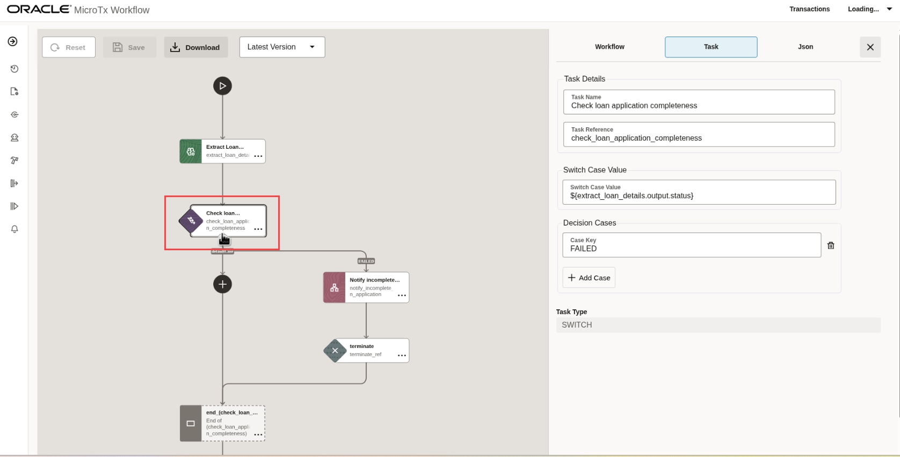

4. Click the **JSON** tab to view the JSON code for the **Check loan application completeness** task or add a new *Switch* task if you are creating a new workflow. Configure the task details as shown below and save your changes.

Configure the switch task as shown below. 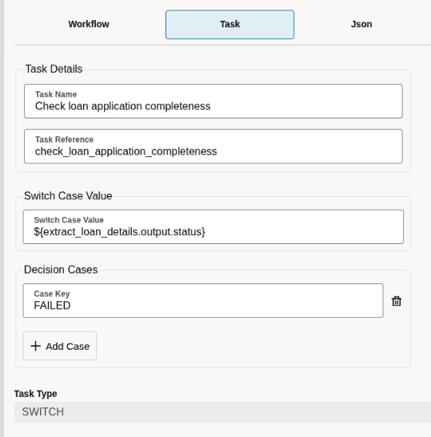

Add a "FAILED" Decision Case to the switch task. In the FAILED branch, add a *HTTP task* to send a notification email for incomplete application as shown below and a *Terminate task* to end processing the workflow.


Search and add a Terminate task.


The complete JSON representation for the Switch task is given below for reference. You can use this to copy text and values to configure the tasks above.

   ```json
    <copy>
    {
    "name": "Check loan application completeness",
    "taskReferenceName": "check_loan_application_completeness",
    "inputParameters": {
        "switchCaseValue": "${extract_loan_details.output.status}"
    },
    "type": "SWITCH",
    "decisionCases": {
        "FAILED": [
            {
                "name": "Notify incomplete loan application",
                "taskReferenceName": "notify_incomplete_loan_application",
                "inputParameters": {
                    "http_request": {
                        "method": "POST",
                        "uri": "http://notification-service:8085/email-service/sendMail",
                        "headers": {
                            "Content-Type": "application/json"
                        },
                        "body": {
                            "from": "microtx.user@localhost",
                            "to": "microtx.user@microtx.com",
                            "cc": "",
                            "subject": "Loan application rejected!",
                            "body": "Loan application rejected due to incomplete details. ${workflow.input.loan_application_text}",
                            "isEmailBodyText": true
                        }
                    }
                },
                "type": "HTTP",
                "decisionCases": {},
                "defaultCase": [],
                "forkTasks": [],
                "startDelay": 0,
                "joinOn": [],
                "optional": false,
                "defaultExclusiveJoinTask": [],
                "asyncComplete": false,
                "loopOver": [],
                "onStateChange": {},
                "permissive": false
            },
            {
                "name": "terminate",
                "taskReferenceName": "terminate_ref",
                "inputParameters": {
                    "terminationStatus": "TERMINATED",
                    "terminationReason": "Incomplete loan application details",
                    "workflowOutput": "${extract_loan_details.output}"
                },
                "type": "TERMINATE",
                "decisionCases": {},
                "defaultCase": [],
                "forkTasks": [],
                "startDelay": 0,
                "joinOn": [],
                "optional": false,
                "defaultExclusiveJoinTask": [],
                "asyncComplete": false,
                "loopOver": [],
                "onStateChange": {},
                "permissive": false
            }
        ]
    },
    "defaultCase": [],
    "forkTasks": [],
    "startDelay": 0,
    "joinOn": [],
    "optional": false,
    "defaultExclusiveJoinTask": [],
    "asyncComplete": false,
    "loopOver": [],
    "evaluatorType": "value-param",
    "expression": "switchCaseValue",
    "onStateChange": {},
    "permissive": false
    }
    </copy>
    ```

## Task 5: Create the Loan Application Record

Once the application is deemed complete, create an application record in the database using a SQL Task.

1. In the navigation menu, click **Definitions**, and then click the **Workflows** tab.

2. Identify the workflow that you want to view, such as **"acme\_bank\_loan\_processing\_workflow"**, and then click  (**Edit Workflow**) under **Actions**.
  

3. Scroll up in the left pane to view the **auditLoanOracleSql** task, and then click the task to view the details of the task in the **Task** tab.
   

4. Click the **JSON** tab to view the JSON code for the **auditLoanOracleSql** task or add a new *SQL Task* if you are creating a new workflow and save your changes. The complete JSON representation for the SQL task is given below for reference. You can use this to copy text and values to configure the task.

   ```json
    <copy>
    {
    "name": "auditLoanOracleSql",
    "taskReferenceName": "audit_loan_oracle_sql_task_ref",
    "inputParameters": {
        "databaseProfile": "oracle-database-livelabuser",
        "sqlStatement": "INSERT INTO LOAN_APPLICATIONS (APPLICATION_ID, USER_SSN, LOAN_AMOUNT, TENURE_MONTHS, APPLICATION_STATUS) VALUES (?, ?, ?, ?, ?);",
        "parameters": [
            "${workflow.workflowId}",
            "${extract_loan_details.output.ssn}",
            "${extract_loan_details.output.loanAmount}",
            "${extract_loan_details.output.tenure}",
            "PENDING"
        ],
        "type": "UPDATE"
    },
    "type": "SQL",
    "decisionCases": {},
    "defaultCase": [],
    "forkTasks": [],
    "startDelay": 0,
    "joinOn": [],
    "optional": false,
    "defaultExclusiveJoinTask": [],
    "asyncComplete": false,
    "loopOver": [],
    "onStateChange": {},
    "permissive": false
    }
    </copy>
    ```

## Task 6: Process Loan Using a Planner Task in a Multi Agent or Microservices Orchestration

Next, a Planner Task receives this structured information and coordinates the entire flow by assigning specialized agents and tools to handle different parts of the verification process.

* It manages the steps, such as document verification using OCR or checking the applicant's identity. The planner checks compliance, for example credit score and anti-money laundering rules. If review is required by a human, the planner notifies the right people. It also calls the loan processing task to perform other loan application formalities.
* A human task is added to enable admin cross-verification at runtime in case of any anti-money laundering (AML) check failures.

At its core, the Agentic Planner uses an LLM to dynamically decide the next steps in a workflow. You can think of it as the brain behind the orchestration—it takes in a natural language goal, understands the tools and tasks available, and then figures out the optimal sequence of actions.

Here's how the agentic planner works in simple steps:

  1. First, we give the planner all the information it needs. That includes the goal, a prompt, any tools it can use, and a list of tasks.
  2. Next, the planner figures out what to do next. It decides the sequence and order of the tasks and makes sure everything fits together.
  3. Then, the planner sends its instructions to the orchestrator, which starts executing the planned tasks.
  4. This process keeps looping—planning, executing, and checking—until the final goal is reached.

Agentic Planner requires LLM access, a prompt, and tools as input parameters. Next, let's create required connectors and prompt template.

1. Let's reuse the `openai-dev` LLM definition that you have created in Task 3.

2. In the navigation menu, click **Agentic AI**, and then click the **Prompt Template** tab. The Prompt Definitions list page opens. All the prompts that you have defined are displayed in a table.

3. View the existing "loan\_process\_planner" prompt definition. To create a new prompt template, click **New Prompt Definition (+)**.

4. Click on the edit button to view the prompt definition. Or enter the following information when creating a new definition.

    * Name: Enter `loan_process_planner` as a unique and descriptive name to identify this prompt definition in workflows.

    * Description: Optional. Enter the following description for the prompt definition.

       ```text
        <copy>
        Loan process tasks planner.
        </copy>
        ```

    * Prompt Template: Create a prompt template to guide the planner's decision-making strategy. Here's an example prompt template which extracts the loan application details, such as loan amount and tenure from the input text.

       ```text
        <copy>
        You are an AI planner for a loan approval workflow. Your goal is to decide the next tool to call based on the results of previous steps. Follow the conditions below exactly.
        1.  **First step:** Connect to sqlcl 'oracledb_mcp' using connect tool and change status of Loan application with APPLICATION_ID=${workflowId} to UNDER_REVIEW. UPDATE LOAN_APPLICATIONS SET APPLICATION_STATUS = 'UNDER_REVIEW' WHERE APPLICATION_ID = workflowId; then, if no tasks have been run, call the `document_verification_task`.
        2.  **After document verification:**
              * If `document_verification_task` failed, the process stops. Respond with a final status of 'FAILED'.
              * If it succeeded, call the `compliance_agent` and `loan_processing_agent` in parallel.
        3.  **After compliance and processing:**
              * If `compliance_agent` failed due to an 'AML_CHECK', call `notify_aml_check_failure_to_admin` and `human_aml_verification` in parallel.
              * For any other failure, the process stops. Respond with a final status of 'FAILED'.
              * If all tasks succeed, the process is complete. Respond with a final status of 'SUCCESS'.

        **Output Instructions:**
        Your response must only be a JSON object describing the next action. It should specify the `status` and a list of `next_tools_to_call`. If the process is finished, the list should be empty.
        </copy>
        ```
        

5. Click **Submit**.

6. Open the navigation menu and click **Connectors**, and then click the **MCP** tab.

7. View the existing "doc\_mcp" MCP definition. To create a new MCP definition, click **New MCP Definition (+)**.

8. Click on the edit button to view the doc\_mcp definition. Or enter the following information when creating a new MCP Server connector for document verification.
    * Name: Enter `doc_mcp` as a unique and descriptive name to identify this MCP server definition in workflows.
    * Description: Enter a description for the tool configuration, such as Document verification custom MCP server.
    * Transport: Select SSE from the drop-down list to specify the network transport protocol used by the MCP server for communication.
    * Authorization Enabled: Select None.
    * URL: Enter the URL of the MCP server as `http://doc-process-mcp-server:8000/`.
    * SSE Endpoint: Enter `/mcp` as the full endpoint path for server-sent events (SSE). This is required for communicating with the MCP server.

   

9. Click **Submit**. Your new connector appears in the list of available MCP definitions.

10. View the existing "oracledb\_mcp" MCP definition. To create a new MCP definition, click **New MCP Definition (+)**.

11. Click on the edit button to view the oracledb\_mcp definition. Or enter the following information when creating a new MCP server connector for Oracle AI Database.
    * Name: Enter `oracledb_mcp` as a unique and descriptive name to identify this MCP server definition in workflows.
    * Description: Enter a description for the tool configuration, such as Oracle AI Database MCP server.
    * Transport: Select STDIO from the drop-down list to specify the network transport protocol used by the MCP server for communication.
    * Command: Enter '/app/sqlcl/bin/sql'.
    * Args: Enter `-mcp` as the command argument.

     

12. Click **Submit**. Your new connector appears in the list of available MCP definitions.

13. Open the navigation menu and click **Agentic AI**, and then click the **Agent Profile** tab.

14. View the existing "loan\_document\_verification\_agent" Agent Profile definition. To create a new Agent Profile definition, click **New Agent Profile Definition (+)**.

15. Click on the edit button to view the loan\_document\_verification\_agent definition. Or enter the following information when creating a new Agent Profile definition.
    * Name: Enter `loan_document_verification_agent` as a unique and descriptive name to identify this agent profile definition in workflows.
    * Description: Enter a description for the tool configuration, such as Loan Documents Verification Agent.
    * Role: Enter `Loan application documents verification agent` as the intended role or function of the agent.
    * Instruction: Enter the specific prompt or set of instructions that guide the agent's operation. Describe what the agent should do when invoked, how to use tools, and how to respond to prompts.

      ```text
      <copy>

      You are a loan application document verification agent. You are given a document path via the `${document}` variable and a list of tools to execute the verification.

        - **Step 1: Extract Details.** Use the `custom-http` tool to make a GET request to this uri: "http://ocr-service:8000/ocr". Set the query parameter `filepath` to the value of `${document}`.
        - **Step 2: Verify Identity.** Using the `identification_number` and `type` extracted from the response of Step 1, Use tool to execute the verification.
        - **Final Output:** Your response should only contain a JSON object and no commentary. Respond with a `status` of 'success' or 'failure' and include the key details returned from the verification step.

      </copy>
      ```

    * MCP Servers: Select **doc\_mcp** as the MCP servers that the agent will use for executing tasks or accessing resources.
    * LLM Profile: Select **openai-dev** as the LLM Profile and **gpt-4o** as the LLM Model that will power the agent's reasoning and language tasks.
    * Use Memory: Select this option for the agent to retain details about the interactions with LLM.

    

16. Click **Submit**. Your new agent profile appears in the list of available agent profile definitions.

17. In the navigation menu, click **Definitions**, and then click the **Workflows** tab.

18. Identify the workflow that you want to view, such as **"acme\_bank\_loan\_processing\_workflow"**, and then click  (**Edit Workflow**) under **Actions**.

19. In the left pane, click **Agentic Planner** task to view the details of the task in the **Task** tab.
   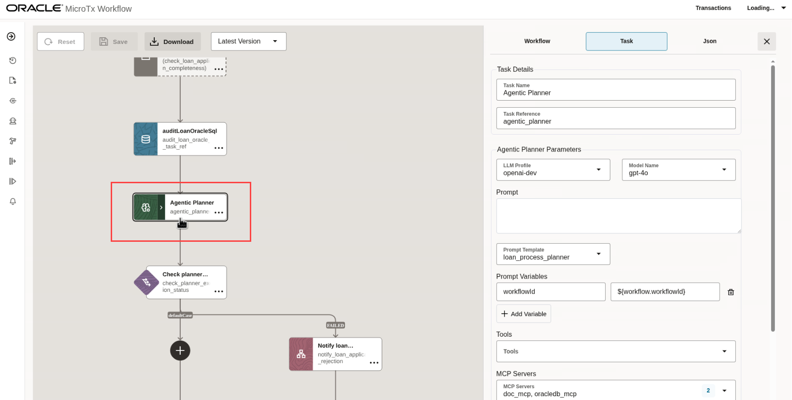

20. Click the **JSON** tab to view the JSON code for the **Agentic Planner** task or add a new *Planner Task* if you are creating a new workflow, configure the planner task as shown in the above image and save your changes. 
Within the planner add more tasks by clicking on the + icon in the planner.
 

  20.1 Add *Agentic Task* for loan document verification. Select the agent profile created in the previous step and configure the Agentic Task as shown.
  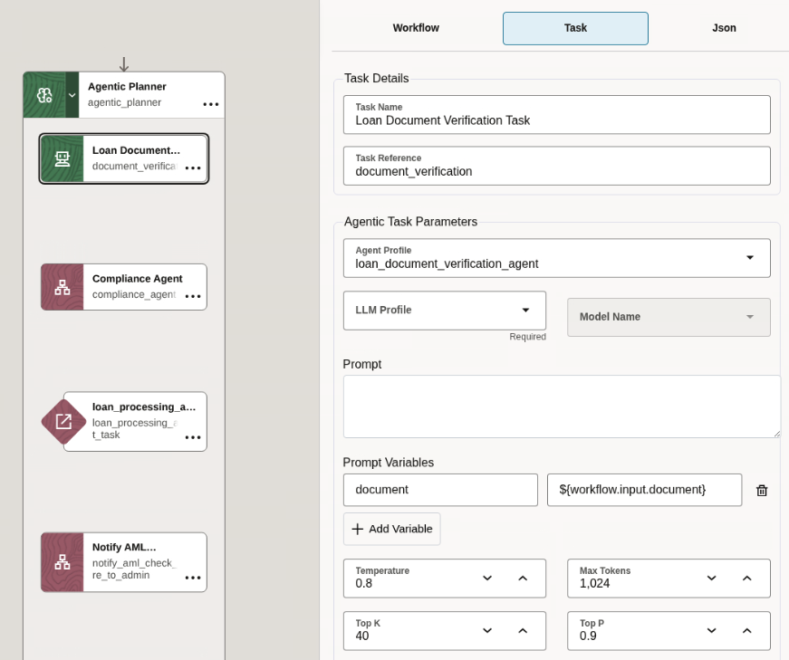

  20.2 Add *HTTP Task* for Compliance check. Configure the Task as shown.
  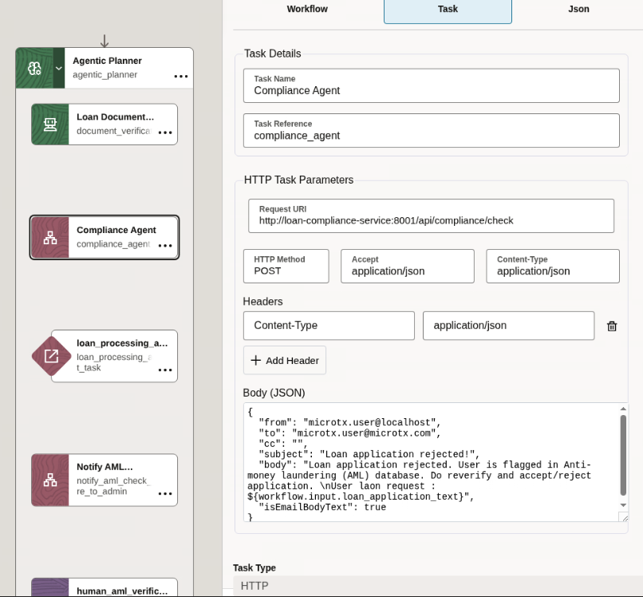

  20.3 Add *Simple Task* for Loan processing agent task. Configure the Task as shown.
  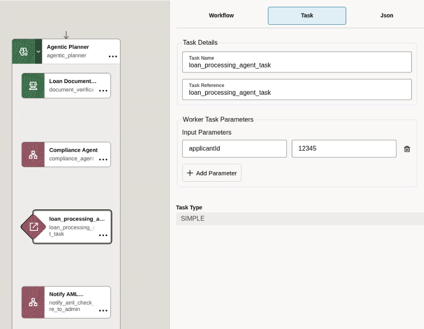

  20.4 Add *HTTP Task* to notify AML verification failure. Configure the Task as shown.
  

   20.5 Add *Human Task* for manual verification. Configure the Task as shown.
  

The complete JSON representation for the Planner task along with it's nested tasks are given below for reference. You can use this to copy text and values to configure the above tasks. 

    ```json
    <copy>
    {
      "name": "Agentic Planner",
      "taskReferenceName": "agentic_planner",
      "inputParameters": {
        "llmProfile": {
          "name": "openai-dev",
          "model": "gpt-4o"
        },
        "promptTemplate": "loan_process_planner",
        "promptVariables": {
          "workflowId": "${workflow.workflowId}"
        },
        "mcpServers": [
          "doc_mcp",
          "oracledb_mcp"
        ],
        "tasks": [
          {
            "name": "Loan Document Verification Task",
            "taskReferenceName": "document_verification",
            "inputParameters": {
              "agentProfile": "loan_document_verification_agent",
              "promptVariables": {
                "document": "${workflow.input.document}"
              }
            },
            "type": "AGENTIC_TASK"
          },
          {
            "name": "Compliance Agent",
            "taskReferenceName": "compliance_agent",
            "type": "HTTP",
            "inputParameters": {
              "method": "POST",
              "uri": "http://loan-compliance-service:8001/api/compliance/check",
              "headers": {
                "Content-Type": "application/json"
              },
              "body": {
                "socialSecurityNumber": "${extract_loan_details.output.ssn}"
              }
            }
          },
          {
            "name": "loan_processing_agent_task",
            "taskReferenceName": "loan_processing_agent_task",
            "inputParameters": {
              "applicantId": "12345"
            },
            "type": "SIMPLE"
          },
          {
            "name": "Notify AML verification failure for reverification",
            "taskReferenceName": "notify_aml_check_failure_to_admin",
            "type": "HTTP",
            "inputParameters": {
              "method": "POST",
              "uri": "http://notification-service:8085/email-service/sendMail",
              "headers": {
                "Content-Type": "application/json"
              },
              "body": {
                "from": "microtx.user@localhost",
                "to": "microtx.user@microtx.com",
                "cc": "",
                "subject": "Loan application rejected!",
                "body": "Loan application rejected. User is flagged in Anti-money laundering (AML) database. Do reverify and accept/reject application. \nUser laon request : ${workflow.input.loan_application_text}",
                "isEmailBodyText": true
              }
            },
            "readResponse": false
          },
          {
            "name": "human_aml_verification_task",
            "taskReferenceName": "human_aml_verification",
            "type": "HUMAN",
            "inputParameters": {
              "applicant": "${extract_loan_details.output}"
            }
          }
        ]
      },
      "type": "AGENTIC_PLANNER",
      "decisionCases": {},
      "defaultCase": [],
      "forkTasks": [],
      "startDelay": 0,
      "joinOn": [],
      "optional": false,
      "defaultExclusiveJoinTask": [],
      "asyncComplete": false,
      "loopOver": [],
      "onStateChange": {},
      "permissive": false
    }
    </copy>
    ```

Here are the details of a few other tasks that are used in the Agentic planner.

* The Loan Compliance microservice performs credit score and AML checks. This microservice is pre-configured and available locally in the LiveLabs environment.
* The Loan Processing agent is developed using Langraph in Python. It validates the user's debt-to-credit ratio and makes the final loan offer. This agent is pre-created and available locally in the LiveLabs environment.
* Human task validates AML failure. If the loan compliance agent fails the workflow due to an AML check failure, invoke human intervention to validate the rejection. If the user is wrongly flagged, it allow the workflow to proceed or reject and fail the workflow. The workflow will remain paused until manual verification and sign-off are completed.


## Task 7: Check the Execution Status of the Orchestrator (Planner)

Terminate the workflow if the Agentic planner fails the multi-agent orchestration. Add a SWITCH statement task to achieve this.

1. In the navigation menu, click **Definitions**, and then click the **Workflows** tab.

2. Identify the workflow that you want to view, such as **"acme\_bank\_loan\_processing\_workflow"**, and then click  (**Edit Workflow**) under **Actions**.

3. Scroll up in the left pane to view the **Check planner execution status** task, and then click the task to view the details of the task in the **Task** tab.
   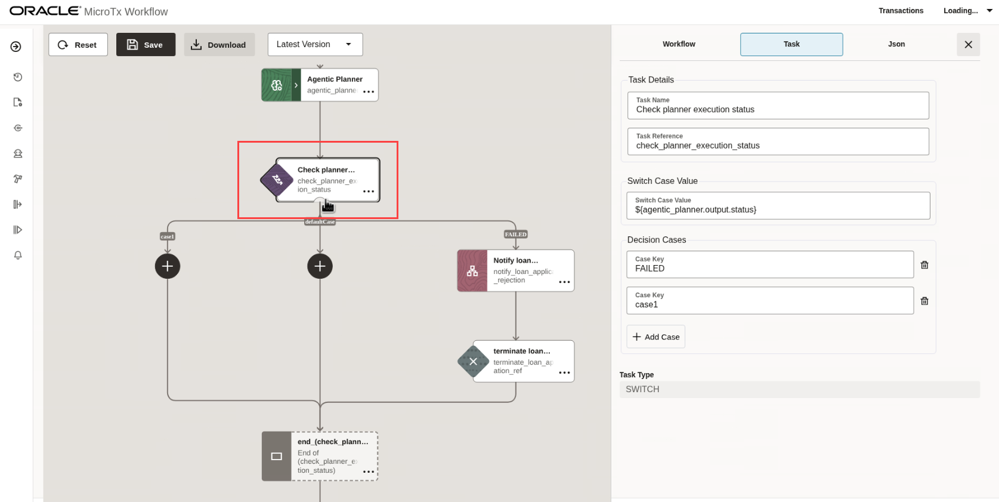

4. Click the **JSON** tab to view the JSON code for the **Check planner execution status** and **Terminate** task or add a new *Switch* task along with a *HTTP Task* and a *Terminate Task* if you are creating a new workflow. Configure the task details as shown in Task 4 above. The complete JSON representation for the Switch task is given below for reference. You can use this to copy text and values to configure the tasks.

   ```
    <copy>
    {
      "name": "Check planner execution status",
      "taskReferenceName": "check_planner_execution_status",
      "inputParameters": {
        "switchCaseValue": "${agentic_planner.output.status}"
      },
      "type": "SWITCH",
      "decisionCases": {
        "FAILED": [
          {
            "name": "Notify loan application rejection",
            "taskReferenceName": "notify_loan_application_rejection",
            "inputParameters": {
              "method": "POST",
              "uri": "http://notification-service:8085/email-service/sendMail",
              "headers": {
                "Content-Type": "application/json"
              },
              "body": {
                "from": "microtx.user@localhost",
                "to": "microtx.user@microtx.com",
                "cc": "",
                "subject": "Loan application rejected!",
                "body": "Loan application rejected due to planner failure. ${agentic_planner.output}",
                "isEmailBodyText": true
              }
            },
            "type": "HTTP",
            "decisionCases": {},
            "defaultCase": [],
            "forkTasks": [],
            "startDelay": 0,
            "joinOn": [],
            "optional": false,
            "defaultExclusiveJoinTask": [],
            "asyncComplete": false,
            "loopOver": [],
            "onStateChange": {},
            "permissive": false
          },
          {
            "name": "terminate loan application",
            "taskReferenceName": "terminate_loan_application_ref",
            "inputParameters": {
              "terminationStatus": "TERMINATED",
              "terminationReason": "loan application rejected",
              "workflowOutput": "${agentic_planner.output}"
            },
            "type": "TERMINATE",
            "decisionCases": {},
            "defaultCase": [],
            "forkTasks": [],
            "startDelay": 0,
            "joinOn": [],
            "optional": false,
            "defaultExclusiveJoinTask": [],
            "asyncComplete": false,
            "loopOver": [],
            "onStateChange": {},
            "permissive": false
          }
        ]
      },
      "defaultCase": [],
      "forkTasks": [],
      "startDelay": 0,
      "joinOn": [],
      "optional": false,
      "defaultExclusiveJoinTask": [],
      "asyncComplete": false,
      "loopOver": [],
      "evaluatorType": "value-param",
      "expression": "switchCaseValue",
      "onStateChange": {},
      "permissive": false
    }
    </copy>
    ```

    Where, 'http://notification-service:8085/email-service/sendMail' is the email webhook that you have added for sending email notifications in case of a failure.

## Task 8: Human Intervention to Validate Workflow Execution

Before sharing the final decision with the user, a human operator conducts a final review and approves or rejects the loan through a dedicated task.

1. In the navigation menu, click **Definitions**, and then click the **Workflows** tab.

2. Identify the workflow that you want to view, such as **"acme\_bank\_loan\_processing\_workflow"**, and then click  (**Edit Workflow**) under **Actions**.

3. Scroll down in the left pane to view the **Send Email notification** task, and then click the task to view the details of the task in the **Task** tab.
   

4. Click the **JSON** tab to view the JSON code for the **Send Email notification** and **human\_approval\_task** tasks or Add a new *Http Task* for email notification and *Human Task* for final verification and sign off. 


Human Task for final approval.
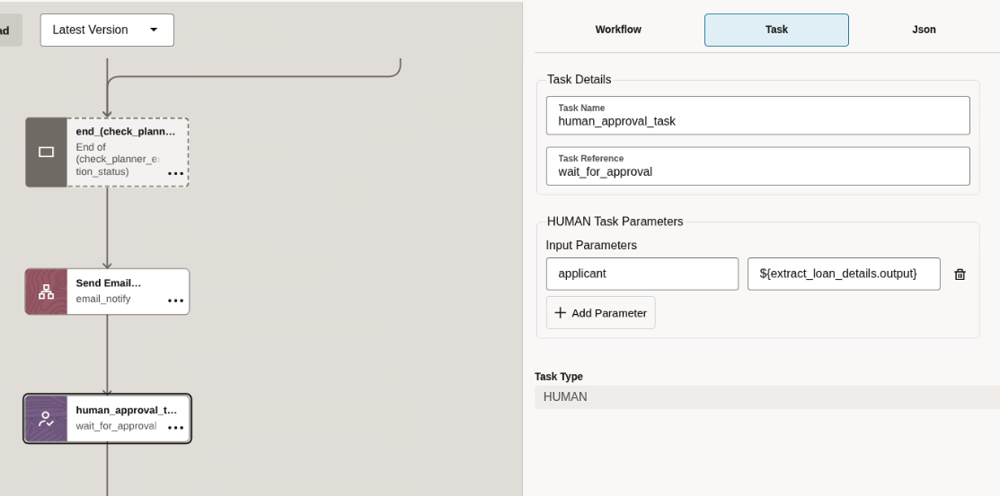

The complete JSON representation for the Http task and the Human Task is given below for reference. You can use this to copy text and values to configure the tasks.

   ```
    <copy>
    {
      "name": "Send Email notification",
      "taskReferenceName": "email_notify",
      "inputParameters": {
        "method": "POST",
        "uri": "http://notification-service:8085/email-service/sendMail",
        "headers": {
          "Content-Type": "application/json"
        },
        "body": {
          "from": "microtx.user@localhost",
          "to": "microtx.user@microtx.com",
          "cc": "",
          "subject": "Loan approval request!",
          "body": "Please approve loan req ${workflow.workflowId}",
          "isEmailBodyText": true
        }
      },
      "type": "HTTP",
      "decisionCases": {},
      "defaultCase": [],
      "forkTasks": [],
      "startDelay": 0,
      "joinOn": [],
      "optional": false,
      "defaultExclusiveJoinTask": [],
      "asyncComplete": false,
      "loopOver": [],
      "onStateChange": {},
      "permissive": false
    },
    {
      "name": "human_approval_task",
      "taskReferenceName": "wait_for_approval",
      "inputParameters": {
        "applicant": "${extract_loan_details.output}"
      },
      "type": "HUMAN",
      "decisionCases": {},
      "defaultCase": [],
      "forkTasks": [],
      "startDelay": 0,
      "joinOn": [],
      "optional": false,
      "defaultExclusiveJoinTask": [],
      "asyncComplete": false,
      "loopOver": [],
      "onStateChange": {},
      "permissive": false
    }
    </copy>
    ```

## Task 9: Check Final Loan Approval And Update The Loan Application Status

Update the final status of the loan application using a SQL Task depending on whether the loan application was approved or rejected.

1. In the navigation menu, click **Definitions**, and then click the **Workflows** tab.

2. Identify the workflow that you want to view, such as **"acme\_bank\_loan\_processing\_workflow"**, and then click  (**Edit Workflow**) under **Actions**.

3. Scroll up in the left pane to view the **check\_loan_approval\_from\_admin** task, and then click the task to view the details of the task in the **Task** tab.
   

4. Click the **JSON** tab to view the JSON code for the **check\_loan_approval\_from\_admin** task or Add a new *Switch* Task along with the two *SQL Task* - one for each decision case in the switch task. Save your changes.

  SQL Task for approved status.
  

  SQL Task for rejected status.
  

The complete JSON representation for the Switch task and the SQL Tasks is given below for reference. You can use this to copy text and values to configure the tasks.

   ```
    <copy>
    {
      "name": "Check Loan Approval By Admin",
      "taskReferenceName": "check_loan_approval_from_admin",
      "inputParameters": {
        "switchCaseValue": "${wait_for_approval.output.approved}"
      },
      "type": "SWITCH",
      "decisionCases": {
        "true": [
          {
            "name": "auditFInalLoanOracleSql Approved",
            "taskReferenceName": "audit_final_loan_oracle_sql_task_approved_ref",
            "inputParameters": {
              "databaseProfile": "oracle-database-livelabuser",
              "sqlStatement": "UPDATE LOAN_APPLICATIONS SET APPLICATION_STATUS = 'APPROVED' WHERE APPLICATION_ID = ?;",
              "parameters": [
                "${workflow.workflowId}"
              ],
              "type": "UPDATE"
            },
            "type": "SQL",
            "decisionCases": {},
            "defaultCase": [],
            "forkTasks": [],
            "startDelay": 0,
            "joinOn": [],
            "optional": false,
            "defaultExclusiveJoinTask": [],
            "asyncComplete": false,
            "loopOver": [],
            "onStateChange": {},
            "permissive": false
          }
        ],
        "false": [
          {
            "name": "auditFInalLoanOracleSql Rejected",
            "taskReferenceName": "audit_final_loan_oracle_sql_task_rejected_ref",
            "inputParameters": {
              "databaseProfile": "oracle-database-livelabuser",
              "sqlStatement": "UPDATE LOAN_APPLICATIONS SET APPLICATION_STATUS = 'REJECTED' WHERE APPLICATION_ID = ?;",
              "parameters": [
                "${workflow.workflowId}"
              ],
              "type": "UPDATE"
            },
            "type": "SQL",
            "decisionCases": {},
            "defaultCase": [],
            "forkTasks": [],
            "startDelay": 0,
            "joinOn": [],
            "optional": false,
            "defaultExclusiveJoinTask": [],
            "asyncComplete": false,
            "loopOver": [],
            "onStateChange": {},
            "permissive": false
          }
        ]
      },
      "defaultCase": [],
      "forkTasks": [],
      "startDelay": 0,
      "joinOn": [],
      "optional": false,
      "defaultExclusiveJoinTask": [],
      "asyncComplete": false,
      "loopOver": [],
      "evaluatorType": "value-param",
      "expression": "switchCaseValue",
      "onStateChange": {},
      "permissive": false
    }
    </copy>
    ```

## Acknowledgements
* **Author** - Sylaja Kannan, Consulting User Assistance Developer
* **Contributors** - Brijesh Kumar Deo and Bharath MC
* **Last Updated By/Date** - Sylaja Kannan, September 2025
