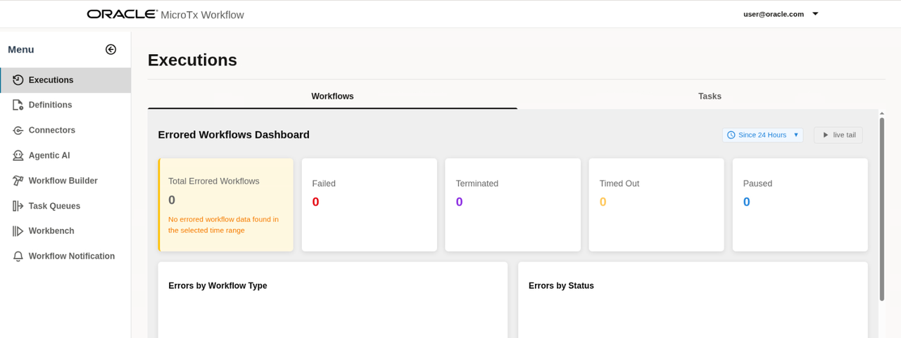

# Initialize Environment

## Introduction

In this lab, we will review and startup all components required to successfully run this workshop.

*Estimated Lab Time:* 30 Minutes.

### Objectives
- Initialize the workshop environment.

### Prerequisites
This lab assumes you have:
- An Oracle Cloud account
- Successfully completed the previous labs
    - Lab: Prepare Setup (*Free-tier* and *Paid Tenants* only)
    - Lab: Environment Setup

>**Note:** *When doing Copy/Paste using the convenient* **Copy** *function used throughout the guide, you must hit the* **ENTER** *key after pasting. Otherwise, the last line will remain in the buffer until you hit* **ENTER!**

## Task 1: Create an API Key to Access OpenAI

1. Create a new API key in the [API Keys page](https://platform.openai.com/api-keys) of the OpenAI Developer Platform or use the [OpenAI API](https://platform.openai.com/docs/api-reference/admin-api-keys/create). Use the default settings to create the API key.

2. Copy the name and value of the created key and save it safely. You will need to provide this information later.

## Task 2: Create a Webhook in Slack

Create webhook to send notifications about the loan approval request to a Slack channel.

1. [Create an incoming webhook](https://api.slack.com/messaging/webhooks) in Slack.

2. Copy the incoming webhook URL and save it. You'll need to provide this information later.

## Task 3: Start the Services

1. Click **Activities** in the remote desktop window to open a new terminal.

2. From your remote desktop session as an *oracle* user, run the following commands to start all the services.

    ```
    <copy>
    cd $HOME/WorkflowScripts/
    ./startMicrotxWorkflowServices.sh
    </copy>
    ```

    When you run this script, it opens 4 new terminal windows (or tabs). Each tab is for one of the following services or process: document processing agent service, loan processing agent, loan compliance service, and workflow server.

    It takes around 90 seconds or more to build and start all the services. After all the services are built, a new terminal is opened for workflow UI and the Workflow UI is displayed as shown in the following image.

	

3.  The Workflow UI is displayed by default. In case the Workflow UI is not displayed, open `http://localhost:5000/` in any browser tab to access the Workflow UI.

## Task 4: Add the OpenAI API Key to MicroTx Workflow Engine

1. In the Workflow UI, open the navigation menu, and then click **Connectors**.
   The following LLM definition is displayed.

	

2. Click  (Edit).
   The **Edit LLM Definition** dialog box appears. A dummy value is displayed for **API Key**.

	

3. Replace the **API Key** value with the value of the OpenAI API key that you have copied in step 1.

4. Click **Save**.

## Task 5: View the Overall Workflow and add the Slack Webhook

1. In the Workflow UI, click **Definitions**.

2. In the **Workflows** tab,  click the `acme_bank_loan_processing_workflow` workflow.
   

3. View the workflow definition in UI to understand the different components of the workflow and how the workflow is executed.
   

4. Find occurrences of `slack.com` in the workflow code and replace the entire URI with the incoming webhook URL that you had copied in step 2. Repeat this step for all 4 occurrences of `slack.com` in the workflow code.

5. Click **Save** to save the changes.
   The changes that you have made are highlighted.

6. View the changes, and then click **Save** to save the changes.

You may now [proceed to the next lab](#next).

## Acknowledgements
* **Author** - Sylaja Kannan, Consulting User Assistance Developer
* **Contributors** - Brijesh Kumar Deo and Bharath MC
* **Last Updated By/Date** - Sylaja Kannan, September 2025
