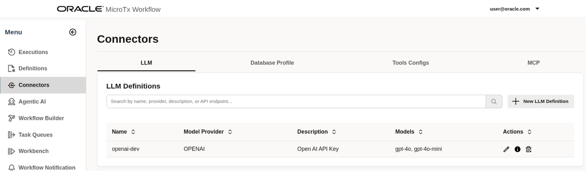
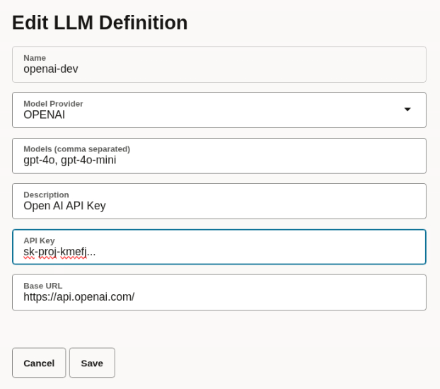
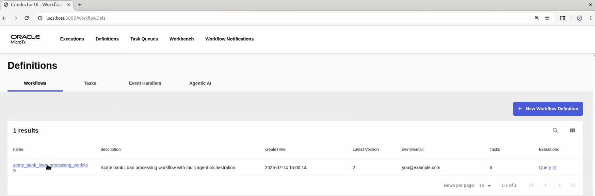
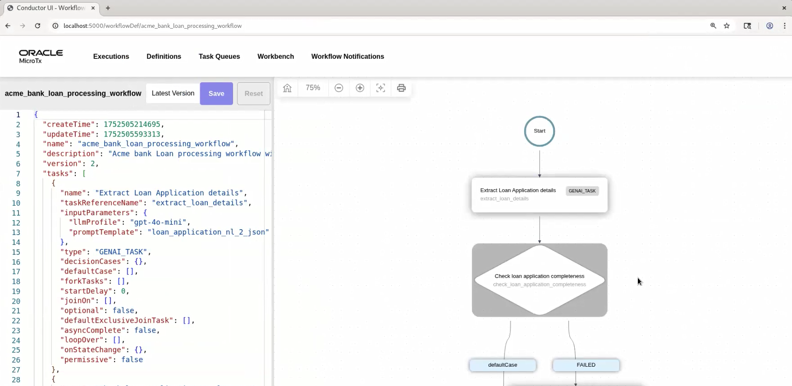

# Initialize Environment

## Introduction

In this lab, we will complete the prerequisites, configure, and start all the components required to successfully run this workshop.

*Estimated Lab Time:* 20 Minutes.

### Objectives
- Initialize the workshop environment.
* Configure Minikube
* Start a tunnel between Minikube and MicroTx
* Run 


### Prerequisites
This lab assumes you have:
- An Oracle Cloud account
- Successfully completed the previous labs
    - Lab: Prepare Setup (*Free-tier* and *Paid Tenants* only)
    - Lab: Environment Setup
    - Logged in using remote desktop URL as an `oracle` user. If you have connected to your instance as an `opc` user through an SSH terminal using auto-generated SSH Keys, then you must switch to the `oracle` user before proceeding with the next step.

      ```text
      <copy>
      sudo su - oracle
      </copy>
      ```

>**Note:** *When doing Copy/Paste using the convenient* **Copy** *function used throughout the guide, you must hit the* **ENTER** *key after pasting. Otherwise, the last line will remain in the buffer until you hit* **ENTER!**

## Task 1: Start the Oracle Database Instance

1. Click **Activities** in the remote desktop window to open a new terminal.

2. From your remote desktop session as an *oracle* user, run the following commands to start an instance of Oracle Database 23ai Free.

    ```
    <copy>
    cd $HOME/WorkflowScripts
    ./start_oracle_db.sh
    </copy>
    ```

   Wait for a few seconds. When the database instance is ready, you will see the following message.

    ```text
    Status of the Oracle FREE 23ai service:
    LISTENER status: RUNNING
    FREE Database status: RUNNING
    ```

   This Oracle Database 23ai Free instance is configured with two schemas. MicroTx Workflow uses one schema to store the transaction data. A SQL task uses the other schema, named `livelabsUser`. The MCP server connects to the `livelabsUser` schema.

## Task 2: Set the Password to Receive Email Notifications

The Thunderbird email client on your remote desktop has been pre-configured with the user name `microtx.user`. MicroTx Workflow sends  emails notifications whenever a loan request requires approval.

1. Run the following command to reset the password for the `microtx.user` user who receives email notifications to approve a loan request.

    ```
    <copy>
    sudo passwd microtx.user
    </copy>
   ```

2. You are prompted to enter the password, and then confirm it. The following message is displayed when the password is reset.

    ```text
    passwd: all authentication token updated successfully.
    ```

    Remember the password as you must provide this password to access the SMTP server and also provide this password to log into the Thunderbird email client.

3. Open the Thunderbird email client on your remote desktop. You are prompted to enter a password for the `microtx.user`.

   

4. Enter the password that you had reset in the previous step, and then click OK.

You can now view your emails in Thunderbird email client.

## Task 3: Configure Minikube

Follow the instructions in this section to configure Minikube and start a tunnel between Minikube and MicroTx Workflow.

1. Run the following commands to start Minikube and start a tunnel.

    ```text
    <copy>
    cd $HOME/WorkflowScripts
    ./start_minikube.sh
    </copy>
    ```
   After a few seconds, the following message is displayed.

    ```text
    Minikube started successfully.
    ```

    It also starts a Minikube tunnel in a new tab.

    **Example output**

    

    > [! WARNING]
    > Do not close this tab. Keep this tab open for the entire duration of the workshop.

    This command also returns the external IP address of the ngnix ingress controller.

2. Run the following command to verify that the external IP address of the load balance which was returned in the previous step is correct.

    ```text
    <copy>
    kubectl get svc -n ngnix-ingress
    </copy>
    ```

    **Example output**

    ```text
    NAME                                               TYPE           CLUSTER-IP      EXTERNAL-IP    PORT(S)                      AGE
    nginx-ingress-ingress-nginx-controller             LoadBalancer   192..........   192..........  80:31572/TCP,443:32415/TCP   23h
    nginx-ingress-ingress-nginx-controller-admission   ClusterIP      192.0.........  <none>         443/TCP
    ```

    From the output note down the value of `EXTERNAL-IP` for the load balance. You will use this value later to access MicroTx Workflow.

    Let's consider that the value of the external IP in the above example is 192.0.2.117.

3. Store the external IP address in an environment variable named `CLUSTER_IPADDR` as shown in the following command.

    ```text
    <copy>
    export CLUSTER_IPADDR=192.0.2.117
    </copy>
    ```

    Note that, if you don't do this, then you must explicitly specify the IP address when required in the commands.

## Task 4: Start MicroTx Workflow Services

1. From your remote desktop session as an `oracle` user, run the following commands to start all the services that are required to run the Loan Processing application in MicroTx Workflow.

    ```
    <copy>
    cd $HOME/WorkflowScripts/
    ./startMicrotxWorkflowServices.sh
    </copy>
    ```

    When you run this script, it starts the following services or processes: document processing agent service, loan processing agent, loan compliance service, Optical Character Recognition (OCR) service, MicroTx Workflow server, and MicroTx Workflow UI.

    It takes a few seconds to build and start all the services.

	

2. Open `http://$CLUSTER_IPADDR/workflow/` in any browser tab to access the MicroTx Workflow UI.

3. Run the following commands to initialize the SQLcl MCP server and configure the  The workflow uses this MCP server 

    ```
    <copy>
    cd $HOME/WorkflowScripts
    ./initilize_oracledb_mcp_server.sh
    </copy>
    ```

## Task 5: Create an API Key to Access OpenAI

1. Create a new API key in the [API Keys page](https://platform.openai.com/api-keys) of the OpenAI Developer Platform or use the [OpenAI API](https://platform.openai.com/docs/api-reference/admin-api-keys/create). Use the default settings to create the API key.

2. Copy the name and value of the created key and save it safely. You will need to provide this information later.

## Task 6: Add the OpenAI API Key to MicroTx Workflow

1. In the Workflow UI, open the navigation menu, and then click **Connectors**.
   The following LLM definition is displayed.

	

2. Click  (Edit).
   The **Edit LLM Definition** dialog box appears. A dummy value is displayed for **API Key**.

	

3. Replace the **API Key** value with the value of the OpenAI API key that you have copied in step 1.

4. Click **Save**.

## Task 7: View the Overall Workflow

1. Open the navigation menu and then click **Definitions**.

2. In the **Workflows** tab, click the `acme_bank_loan_processing_workflow` workflow.
   

3. View the workflow definition in UI to understand the different components of the workflow and how the workflow is executed.
   

You may now [proceed to the next lab](#next).

## Acknowledgements
* **Author** - Sylaja Kannan, Consulting User Assistance Developer
* **Contributors** - Brijesh Kumar Deo and Bharath MC
* **Last Updated By/Date** - Sylaja Kannan, September 2025
