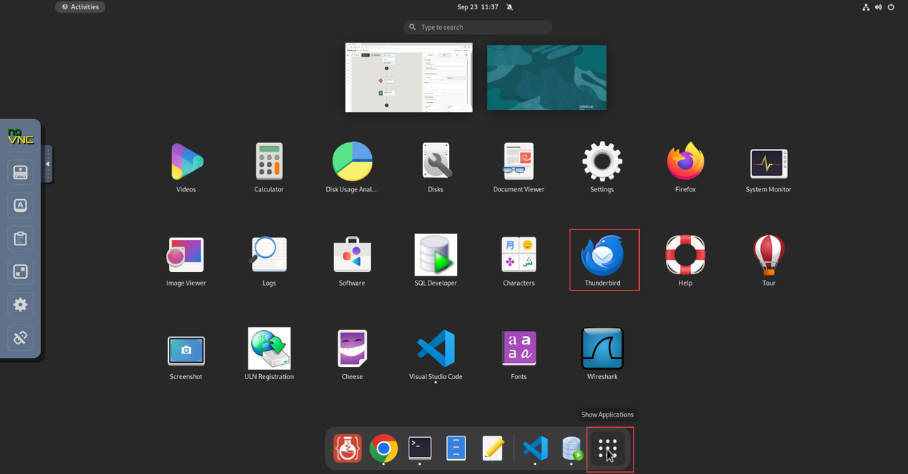
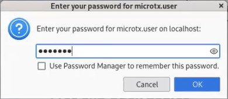
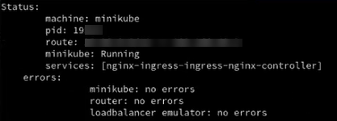
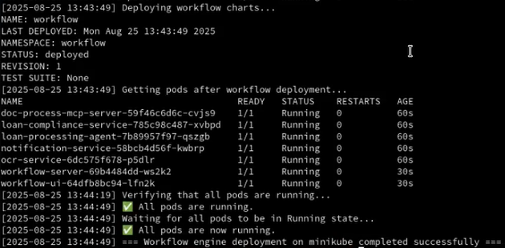
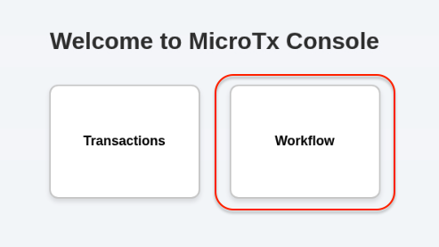

# Initialize Environment

## Introduction

In this lab, we will complete the prerequisites, configure, and start all the components required to successfully run this workshop.

*Estimated Lab Time:* 20 Minutes.

### Objectives
- Initialize the workshop environment.

### Prerequisites
This lab assumes you have:
- An Oracle Cloud account
- Successfully completed the previous labs
    - Lab: Prepare Setup (*Free-tier* and *Paid Tenants* only)
    - Lab: Environment Setup
    - Logged in using remote desktop URL as an `oracle` user. If you have connected to your instance as an `opc` user through an SSH terminal using auto-generated SSH Keys, then you must switch to the `oracle` user before proceeding with the next step.

      ```text
      <copy>
      sudo su - oracle
      </copy>
      ```

>**Note:** *When doing Copy/Paste using the convenient* **Copy** *function used throughout the guide, you must hit the* **ENTER** *key after pasting. Otherwise, the last line will remain in the buffer until you hit* **ENTER!**

## Task 1: Start the Oracle AI Database Instance

1. Click **Activities** in the remote desktop window to open a new terminal.

2. From your remote desktop session as an *oracle* user, run the following commands to start an instance of Oracle AI Database 26ai Free.

    ```
    <copy>
    cd $HOME/WorkflowScripts
    ./start_oracle_db.sh
    </copy>
    ```

   Wait until the database starts. *This can take from 90 seconds to a couple of minutes.* When the database instance is ready, you will see the following message.

    ```text
    Status of the Oracle FREE 26ai service:
    LISTENER status: RUNNING
    FREE Database status: RUNNING
    ```

   This Oracle AI Database 26ai Free instance is configured with two schemas. MicroTx Workflows uses one schema to store the workflow definitions and the execution state data. A SQL task uses the other schema, named `livelabsUser` which stores the loan application data. The Oracle MCP server connects to the `livelabsUser` schema.

## Task 2: Set the Password to Receive Email Notifications

The Thunderbird email client on your remote desktop has been pre-configured with the user name `microtx.user`. MicroTx Workflows sends  emails notifications whenever a loan request requires approval.

1. Run the following command to reset the password for the `microtx.user` user who receives email notifications to approve a loan request.

    ```
    <copy>
    sudo passwd microtx.user
    </copy>
   ```

2. You are prompted to enter the password, and then confirm it. The following message is displayed when the password is reset.

    ```text
    passwd: all authentication token updated successfully.
    ```

    Remember the password as you must provide this password to access the SMTP server and also provide this password to log into the Thunderbird email client.

3. Click **Activities** in the remote desktop window, and then click **Show Applications**.
   

4. Click Thunderbird to open the Thunderbird email client on your remote desktop. You are prompted to enter a password for the `microtx.user`.

   

5. Enter the password that you had reset in the previous step, and then click OK.

You can now view your emails in the Thunderbird email client.

## Task 3: Configure Minikube

Click **Activities** in the remote desktop window, and then go back to the terminal window. Follow the instructions in this section to configure Minikube and start a tunnel between Minikube and MicroTx Workflows.

1. In a new terminal tab, run the following commands to start Minikube and start a tunnel.

    ```text
    <copy>
    cd $HOME/WorkflowScripts
    ./start_minikube.sh
    </copy>
    ```

   After a few seconds, the following message is displayed.

    ```text
    Minikube started successfully.
    ```

    It also starts a Minikube tunnel in a new tab. *This can take from 90 seconds to a couple of minutes.*

    **Example output**

    

    > [! WARNING]
    > Do not close this tab. Keep this tab open for the entire duration of the workshop. Go back to the previous terminal tab, if you are on the tab running the minikube tunnel.

    This command also returns the external IP address of the ngnix ingress controller.

2. Run the following command to verify that the external IP address of the load balancer which was returned in the previous step is correct.

    ```text
    <copy>
    kubectl get svc -n istio-system
    </copy>
    ```

    **Example output**

    

    From the output note down the value of `EXTERNAL-IP` for the load balancer. You will use this value later to access MicroTx Workflows.

    Let's consider that the value of the external IP in the above example is 10.107.38.138.

## Task 4: Start Services in MicroTx Workflows

1. From your remote desktop session, open a new terminal tab.

2. As an `oracle` user, run the following commands to deploy and start all the services that are required to run the Loan application processing workflow in MicroTx Workflows.

    ```
    <copy>
    cd $HOME/WorkflowScripts/
    ./deploy_services_on_minikube.sh
    </copy>
    ```

    When you run this script, it starts the following services or processes: document processing agent service, loan processing agent, loan compliance service, Optical Character Recognition (OCR) service, MicroTx Workflows server, and MicroTx Workflows UI.

    *It can take 5-6 minutes to deploy and start all the services.* Wait until all services are started.

	

3. Click **Activities** in the remote desktop window, and then click the Chrome browser icon to launch the browser.

4. Open `http://10.107.38.138/consoleui/` in any browser tab to access the MicroTx Workflows GUI. Replace, `10.107.38.138` with the external IP address of the load balancer that you have copied in the previous step in case the external IP address is different.

5. If the following options are displayed, then click **Workflow**.
    

## Task 5: Create an API Key to Access OpenAI

1. Create a new API key in the [API Keys page](https://platform.openai.com/api-keys) of the OpenAI Developer Platform or use the [OpenAI API](https://platform.openai.com/docs/api-reference/admin-api-keys/create). Use the default settings to create the API key. If you already have an API key or an API key has been provided, you can use that instead of creating a new key. Get an API key [here](https://github.com/oracle-samples/microtx-samples/blob/main/others/sharing.md).
>**Note:**  *An OpenAI API Key has already been added to the default LLM Connector definition. You can skip this task.* In case the existing key has expired or does not work, you can come back and perform this task later.

2. Copy the name and value of the created/existing key and save it safely. You will need to provide this information later.

You may now [proceed to the next lab](#next).

## Acknowledgements
* **Author** - Sylaja Kannan, Consulting User Assistance Developer
* **Contributors** - Brijesh Kumar Deo and Bharath MC
* **Last Updated By/Date** - Sylaja Kannan, February 2026
