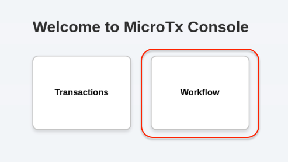

# Initialize Environment

## Introduction

In this lab, we will complete the prerequisites, configure, and start all the components required to successfully run this workshop.

*Estimated Lab Time:* 20 Minutes.

### Objectives
- Initialize the workshop environment.

### Prerequisites
This lab assumes you have:
- An Oracle Cloud account
- Successfully completed the previous labs
    - Lab: Prepare Setup (*Free-tier* and *Paid Tenants* only)
    - Lab: Environment Setup
    - Logged in using remote desktop URL as an `oracle` user. If you have connected to your instance as an `opc` user through an SSH terminal using auto-generated SSH Keys, then you must switch to the `oracle` user before proceeding with the next step.

      ```text
      <copy>
      sudo su - oracle
      </copy>
      ```

>**Note:** *When doing Copy/Paste using the convenient* **Copy** *function used throughout the guide, you must hit the* **ENTER** *key after pasting. Otherwise, the last line will remain in the buffer until you hit* **ENTER!**

## Task 1: Set Up MicroTx Workflows

1. Click **Activities** in the remote desktop window to open a new terminal.

2. From your remote desktop session as an *oracle* user, run the following commands to set up MicroTx Workflows.

    ```
    <copy>
    cd $HOME/WorkflowScripts
    ./setup_microtx.sh
    </copy>
    ```

    Wait until the MicroTx setup is complete. *This can take 5-6 minutes to deploy and start all the services.* Wait until all services are started. When the MicroTx setup is complete, the following messages are displayed.

    **Example output**

    ```text
    [2026-09-03 12:38:41] INFO  ************************************************************
    [2026-09-03 12:38:41] INFO  === MicroTx setup completed successfully ===
    [2026-09-03 12:38:41] INFO  Oracle restart phase: completed
    [2026-09-03 12:38:41] INFO  Minikube profile: minikube
    [2026-09-03 12:38:41] INFO  Istio ingress address: 10.101.253.115
    MicroTx Console URL: http://10.101.253.115/consoleui/
    [2026-09-03 12:38:41] INFO  Tunnel log: /home/oracle/WorkflowScripts/.microtx/tunnel.log
    [2026-09-03 12:38:41] INFO  Session log: /home/oracle/WorkflowScripts/.microtx/logs/setup_microtx_20260903_123644_383599.log
    NAME             NAMESPACE  REVISION  UPDATED                                  STATUS    CHART                                APP VERSION
    loan-app-demo    otmm       1         2026-09-03 07:54:05.13585969 +0000 UTC  deployed  workflow-sample-microservices-0.1.0  1.0
    otmm             otmm       1         2026-09-02 15:15:15.304751328 +0000 UTC deployed  microtx-26.1.2                       26.1.2
    NAME                                       READY   STATUS    RESTARTS   AGE
    doc-process-mcp-server-7c99f589c-jn4bc     2/2     Running   0          4h44m
    loan-compliance-service-5c8c8b474b-qpdcp   2/2     Running   0          4h44m
    loan-processing-agent-7b8f6f4b5c-tzq8b     2/2     Running   0          4h44m
    notification-service-586688b6cc-hshnf      2/2     Running   0          4h44m
    ocr-service-59d499d5bf-j7hxq               2/2     Running   0          4h44m
    otmm-console-d8b8ffc89-rhfj8               2/2     Running   0          21h
    otmm-tcs-0                                 2/2     Running   0          21h
    workflow-server-7659b6ff7-q4wtd            2/2     Running   0          21h
    [2026-09-03 12:38:41] INFO  Discovered Istio virtual-service routes:
    otmm/microtx hosts=  paths=/health /admin/v1 /api/v1 /metrics /config /workflow-server /workflow-ui/ws /workflow-ui /ws /workflow-fb /consoleui /consoleapi /oidc/logout /openid-connect/logout /console/oidc/redirect /console/
    otmm/notification-service hosts=  paths=/notification-service/
    [2026-09-03 12:38:41] INFO  ************************************************************
    ```

3. Copy the following MicroTx Console URL to access the MicroTx Workflows GUI:

    ```
    <copy>
    http://10.101.253.115/consoleui/
    </copy>
    ```

    >**Note:** *The IP address in this URL is a reference IP address. The IP address in your environment might be different. Use the MicroTx Console URL displayed in the setup output.*

4. Click **Activities** in the remote desktop window, and then click the Chrome browser icon to launch the browser.

5. Paste the MicroTx Console URL in a browser tab to access the MicroTx Workflows GUI.

6. If the following options are displayed, then click **Workflow**.
    

## Task 2: Create an API Key to Access OpenAI

1. Create a new API key in the [API Keys page](https://platform.openai.com/api-keys) of the OpenAI Developer Platform or use the [OpenAI API](https://platform.openai.com/docs/api-reference/admin-api-keys/create). Use the default settings to create the API key. If you already have an API key or an API key has been provided, you can use that instead of creating a new key. Get an API key [here](https://github.com/oracle-samples/microtx-samples/blob/main/others/sharing.md).
    >**Note:**  *An OpenAI API Key has already been added to the default LLM Connector definition. You can skip this task.* In case the existing key has expired or does not work, you can come back and perform this task later.

2. Copy the name and value of the created/existing key and save it safely. You will need to provide this information later.

You may now [proceed to the next lab](#next).

## Informational: TxEventQ Setup

The *LOAN\_APPLICATION\_EVENTS* transactional event queue, queue startup, and *LOAN\_APP\_CONSUMER* subscriber are already configured on the LiveLabs VM database. No queue setup is required during this lab.

The queue is configured with *multiple_consumers => TRUE*, allowing multiple subscribers to receive the published events—for example, email, chat, SMS, or other notification services.

The following SQL statements are provided for reference only. They describe the existing TxEventQ configuration and should not be executed unless specifically instructed.

1. Transactional Event Queue

    The following statement creates the *LOAN\_APPLICATION\_EVENTS* transactional event queue. The queue accepts JSON payloads published by the Java application as JMS text messages.

    ```sql
    <copy>
    BEGIN
    DBMS_AQADM.CREATE_TRANSACTIONAL_EVENT_QUEUE(
        queue_name         => 'LOAN_APPLICATION_EVENTS',
        multiple_consumers => TRUE,
        queue_payload_type => DBMS_AQADM.JMS_TYPE,
        comment            => 'Loan application events - JSON payload via JMS'
    );
    END;
    /
    </copy>
    ```

2. Queue Status
    The queue is started and available to receive and deliver loan application event messages.

    ```sql
    <copy>
    BEGIN
    DBMS_AQADM.START_QUEUE(
        queue_name => 'LOAN_APPLICATION_EVENTS'
    );
    END;
    /
    </copy>
    ```

3. Queue Subscriber
    The *LOAN\_APP\_CONSUMER* subscriber is registered to consume messages from the queue.

    ```sql
    <copy>
    BEGIN
    DBMS_AQADM.ADD_SUBSCRIBER(
        queue_name => 'LOAN_APPLICATION_EVENTS',
        subscriber => SYS.AQ$_AGENT(
        'LOAN_APP_CONSUMER',
        NULL,
        NULL
        )
    );
    END;
    /
    </copy>
    ```

    These statements document the preconfigured environment. During the lab, use the queue to publish and inspect loan application event messages through TxEventQ.


## Acknowledgements

* **Author** - Sylaja Kannan, Consulting User Assistance Developer
* **Contributors** - Brijesh Kumar Deo and Bharath MC
* **Last Updated By/Date** - Sylaja Kannan, September 2026
