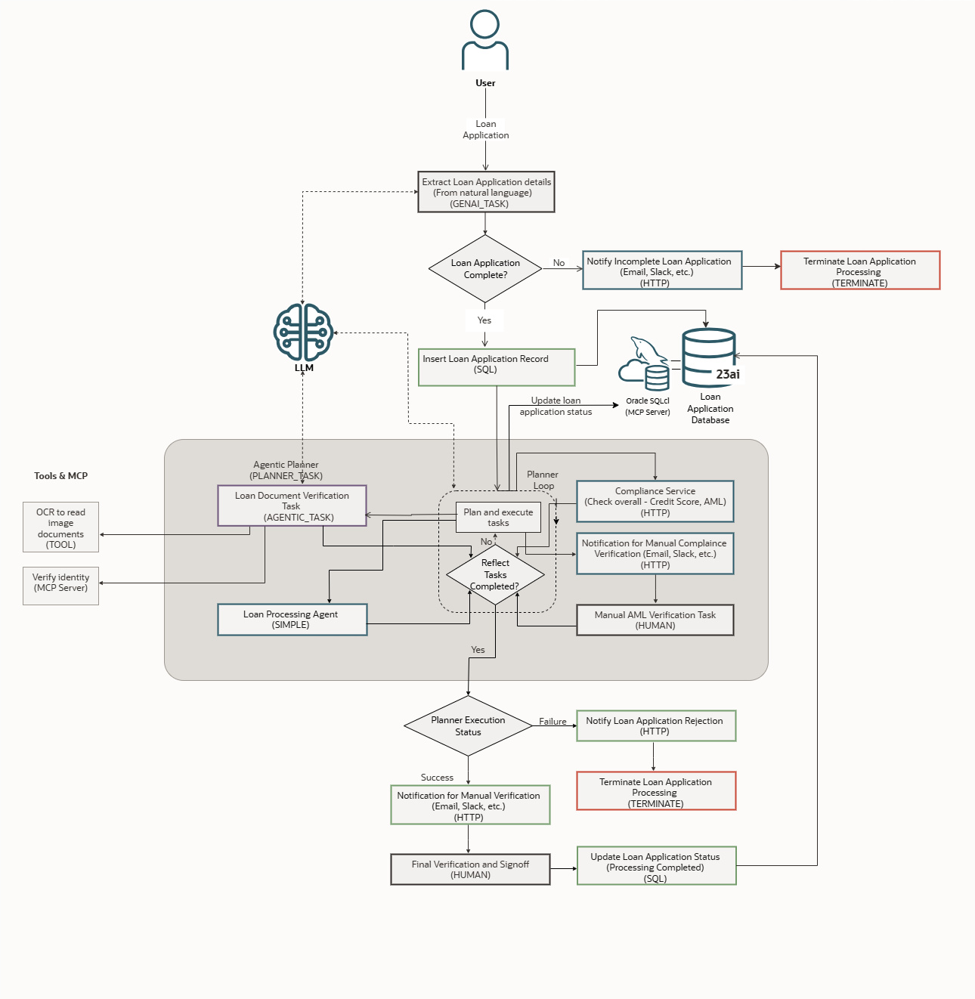

# Introduction

## About this Workshop

In this workshop, we will explore a real-world loan application processing use case. Traditional rule-based loan application processing workflows often fall short - unable to handle real-time decision-making, natural language inputs, and orchestration across diverse systems. Agentic workflows present a powerful alternative by combining LLMs, reusable AI agents, and external tools into intelligent, traceable, and adaptable flows.

You will learn how to build scalable, no-code agentic workflows using Oracle® Transaction Manager for Microservices (MicroTx) Workflow, a flexible, cloud-native, enterprise-ready orchestration engine. You'll learn how to integrate LLMs, REST apis/services, human-in-the-loop steps, agentic tasks, an agentic planner, stateful memory, and tools. You will create GenAI task to extract structured data from natural language input, invoke verification agents, perform compliance checks, and connect external tools using the Model Context Protocol (MCP) - all within a resilient and observable workflow.

The following diagram illustrates how an agentic workflow processes a loan application. This agentic workflow seamlessly blends automation with human oversight to ensure accurate, compliant, and efficient loan application processing.

1. Submission and data extraction: The process begins when a user submits a loan application. AI algorithms automatically extract all relevant details from the application, even if the information is provided in natural language.
2. Completeness check: The system checks whether all required information is present. If any details are missing, the applicant is immediately notified, and the process is paused pending their response.
3. Loan Application record creation: Once the application is deemed complete, a new load application record is created in the database.
4. Orchestration by agentic planner: The agentic planner takes over, orchestrating key workflow steps—such as verifying submitted documents using OCR technology and validating the applicant’s identity.
5. Compliance and review: The workflow then performs compliance checks, including evaluating the applicant’s credit score and ensuring adherence to anti-money laundering (AML) regulations. If any step requires human intervention, the planner promptly alerts the appropriate personnel for manual review.
6. Iterative processing (Plan-reflect-replan): The planner continuously assesses and executes the necessary tasks, looping through verification and compliance checks until a final decision is reached. The final decision could be one of the following:
    * Approval: If the application passes all checks, a final manual signoff is requested. Once confirmed, the system updates the application status to approved.
    * Rejection: If any check fails, the applicant is promptly notified of the decision, and the process concludes.

Estimated Workshop Time: 1 hour 30 minutes

### Objectives

In this workshop, you will learn how to:
* Model and orchestrate agentic workflows for real-world, production-grade use cases.
* Use a planner task powered by LLMs to drive real-time, adaptive decision-making within your workflows.
* Build modular no-code agentic task.
* Combine AI and orchestration with MicroTx Workflow to boost flexibility, automation, and control in complex business operations.

By the end of this LiveLab, you'll not only understand the architectural benefits and capabilities of MicroTx Workflow, but you'll have hands-on experience to define, configure, and execute AI-enhanced workflows in real-world scenarios with dynamic control flow, and decision-making.

### Prerequisites

This lab assumes you have:
* An Oracle account
* At least 4 OCPUs, 24 GB memory, and 128 GB of bootable storage volume or more is available in your Oracle Cloud Infrastructure tenancy.

## Acknowledgements
* **Author** - Sylaja Kannan, Consulting User Assistance Developer
* **Contributors** -  Brijesh Kumar Deo and Bharath MC
* **Last Updated By/Date** - Sylaja Kannan, September 2025