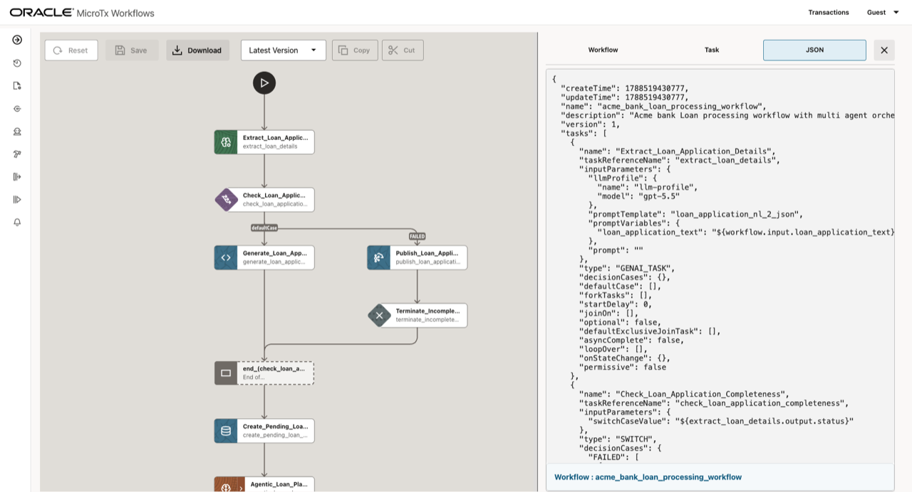
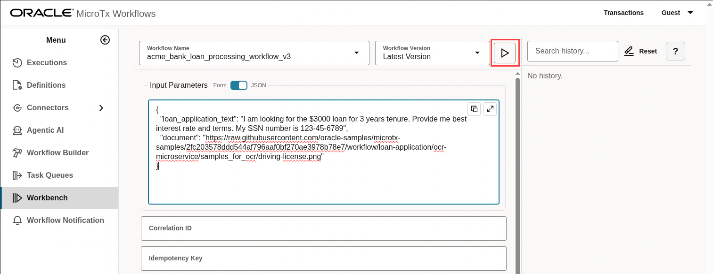
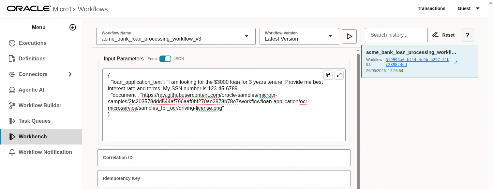
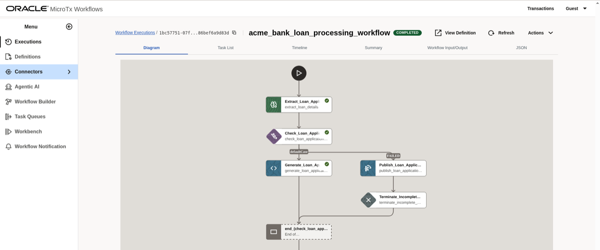
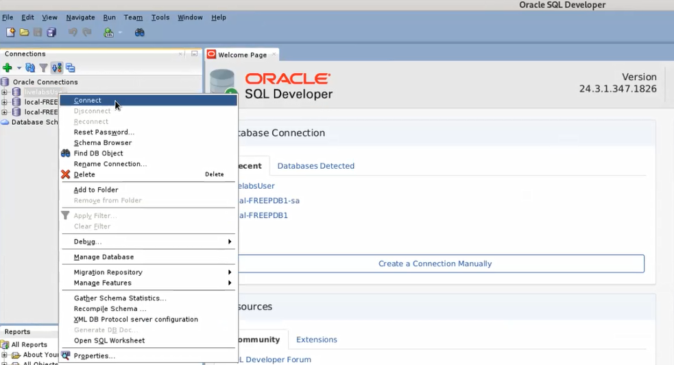
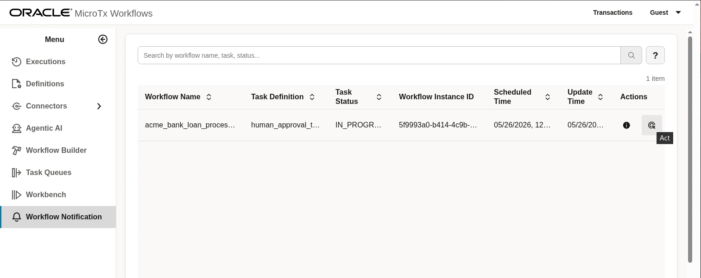
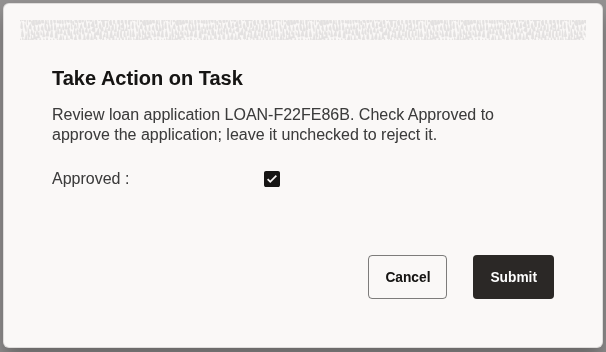
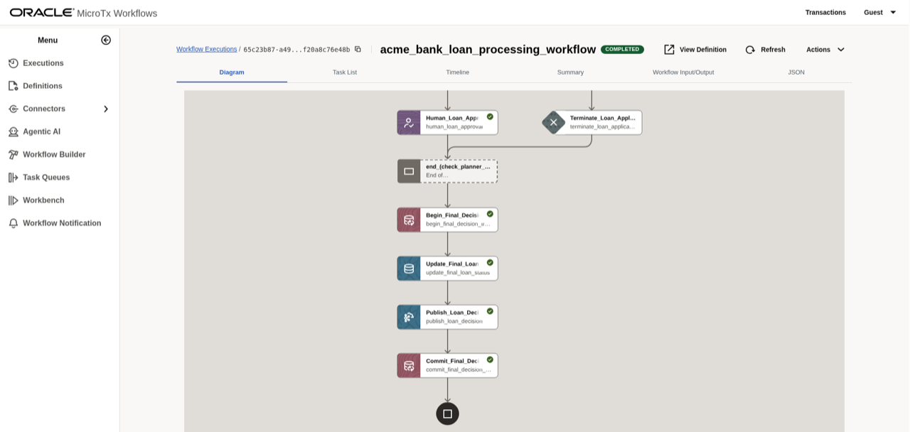
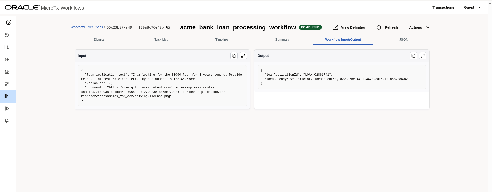
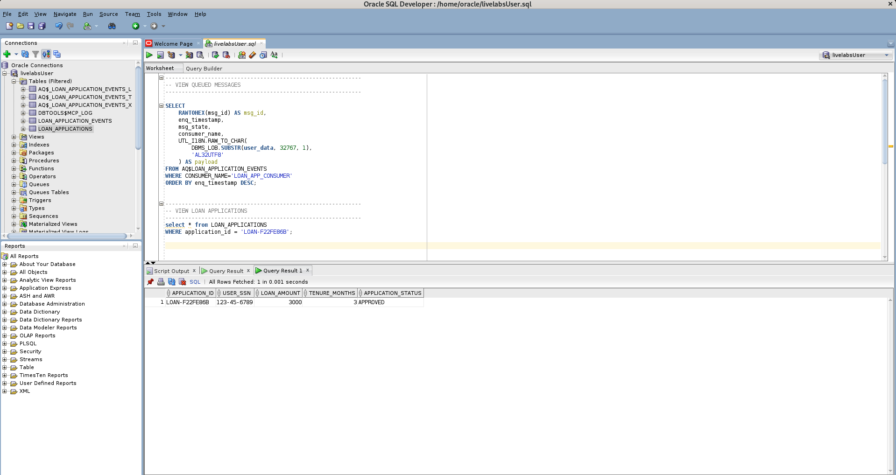

# Run the Workflow

## Introduction

This lab walks you through the steps to run the workflow and view the output.

Estimated Time: 10 minutes

### About MicroTx Workflow Engine

MicroTx Workflow is a no-code solution that helps you design and configure workflows visually, develop agents and agentic workflows, while drastically reducing the need for custom code.

### Objectives

In this lab, you will:
* Assemble reusable tasks, other agents in a workflow
* Provide instructions in natural language
* Use built-in access to tools, including MCP servers
* Leverage planner to transform the high-level goal into actionable tasks with real time adjustments based on the executed task outcome

### Prerequisites

This lab assumes you have:
* An Oracle Cloud account
* All previous labs successfully completed

## Task 1: View the Overall Workflow

1. Open the navigation menu and click **Definitions**, and then click the **Workflows** tab.
    The Workflows list page opens. All the workflows that you have defined are displayed in a table.

2. Identify the workflow that you want to view, such as **"acme\_bank\_loan\_processing\_workflow"**, and then click  (**Edit Workflow**) under **Actions**.
    The Workflow Builder visually depicts all the tasks of the workflow in the left pane. Scroll to view all the tasks in the workflow and how the workflow is executed. In the right pane, the **Workflow** tab displays all the details of the workflow.
    

3. Click **JSON** tab to view the JSON for the workflow as shown in the following image. Scroll to view the JSON.
   

## Task 2: Execute the Workflow

1. Open the navigation menu and click **Workbench**.
    The **Workflow Workbench** page is displayed.

2. In the **Workflow Name** drop-down list, select the `acme_bank_loan_processing_workflow` workflow.

3. In the **Workflow Version** drop-down list, select **Latest Version**.

4. In the **Input (JSON)** text box, paste the following lines of code which provides details about the loan amount, loan tenure, and SSN number of the customer. For document verification, upload a driver's license, this file is already available in object storage.

    ```
    <copy>
    {
      "loan_application_text": "I am looking for the $3000 loan for 3 years tenure. Provide me best interest rate and terms. My SSN number is 123-45-6789",
      "document": "https://raw.githubusercontent.com/oracle-samples/microtx-samples/2fc203578ddd544af796aaf0bf270ae3978b78e7/workflow/loan-application/ocr-microservice/samples_for_ocr/driving-license.png"
    }
    </copy>
    ```

5. Click **Execute** to run the selected workflow.
    

    Under **History**, a new workflow execution ID is displayed along with the status of the workflow.

    

6. Click the workflow execution ID. The status of the workflow execution is displayed as shown in the following image. Green tick inside a task indicates that the steps have already been executed successfully.
    

7. View the TxEventQ Notification and Human Approval Task. Click **Refresh** to view the updated status of the workflow after a few seconds. It might take 90 seconds or more for the workflow to reach the human approval task.

    After the Agentic Planner completes successfully, the **Publish\_Loan\_Approval\_Requested** *TXEVENTQ\_PUBLISH* task publishes an approval-request notification to the *LOAN\_APPLICATION\_EVENTS* TxEventQ topic.

    Open **Oracle SQL Developer**, connect to the **livelabsUser** schema, and run the following query to view the queued message:

    

    ```sql
    <copy>
    SELECT
        RAWTOHEX(msg_id) AS msg_id,
        enq_timestamp,
        msg_state,
        consumer_name,
        UTL_I18N.RAW_TO_CHAR(
            DBMS_LOB.SUBSTR(user_data, 32767, 1),
            'AL32UTF8'
        ) AS payload
    FROM AQ$LOAN_APPLICATION_EVENTS
    WHERE CONSUMER_NAME='LOAN_APP_CONSUMER'
    ORDER BY enq_timestamp DESC;
    </copy>
    ```

    The payload displays the loan application ID, the *LOAN\_APPLICATION\_APPROVAL\_REQUESTED* event type, and the *PENDING\_APPROVAL* status.


    Run the following query to view the loan application records and their current status:

    ```sql
    <copy>
    SELECT * FROM LOAN_APPLICATIONS;
    </copy>
    ```

    Return to the workflow execution page and click Refresh. The **Human\_Loan\_Approval** task is now active and waiting for human input.

    The workflow pauses at the **Human\_Loan\_Approval** task and does not continue until a human approver reviews the request and approves or rejects the loan application.

## Task 3: Approve the Loan Request

1. Open the MicroTx Workflow UI in a new browser tab.

2. Open the navigation menu and click **Workflow Notification**.
    

3. Click **Act**.
    The **Take Action on Task** dialog box appears.

4. Select the **Approved** check box.
    

5. Click **Submit**.
    A message is displayed that the task was updated successfully.

6. Click **OK**.

7. Refresh the browser tab where the status of the workflow execution is displayed in Workbench.
    A green tick mark appears on the human approval task to indicate that the steps have been executed successfully and status of the workflow changes to **Completed**.
    

## Task 4: Verify the Status of the Loan Application

1. On the Workflow Executions page, click the **Workflow Input/Output** tab and copy the *loanApplicationId* value, such as `LOAN-C2861741`.
    

1. Open Oracle SQL Developer.

2. Under **Oracle Connections**, right-click **livelabsUser**, and then click **Connect** to connect to the `livelabUser` schema.
    

3. Enter the following query to retrieve the status of an application. Replace `<workflow-id>` with the value that you have copied in step 1.

    ```
    <copy>
    SELECT * FROM loan_applications
    WHERE application_id = '<loanApplicationId>';
    </copy>
    ```

    To view messages published to TxEventQ, run below query:

    ```sql
    <copy>
    SELECT
        RAWTOHEX(msg_id) AS msg_id,
        enq_timestamp,
        msg_state,
        consumer_name,
        UTL_I18N.RAW_TO_CHAR(
            DBMS_LOB.SUBSTR(user_data, 32767, 1),
            'AL32UTF8'
        ) AS payload
    FROM AQ$LOAN_APPLICATION_EVENTS
    WHERE CONSUMER_NAME='LOAN_APP_CONSUMER'
    ORDER BY enq_timestamp DESC;
    </copy>
    ```

4. Click Run to run the query.
    As shown in the following image, the **Query Result** displays the status of the application as **APPROVED**. Which indicates that the application has been processed successfully.
    

## Acknowledgements
* **Author** - Sylaja Kannan, Consulting User Assistance Developer
* **Contributors** -  Brijesh Kumar Deo and Bharath MC
* **Last Updated By/Date** - Sylaja Kannan, September 2026
