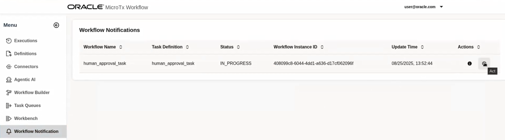

# Run the Workflow

## Introduction

This lab walks you through the steps to run the workflow and view the output.

Estimated Time: 10 minutes

### About MicroTx Workflow Engine

MicroTx provides a No-code solution to develop agents and agentic workflows.

### Objectives

In this lab, you will:
* Assemble reusable tasks, other agents in a workflow 
* Provide instructions in natural language
* Use built-in access to tools, including MCP servers
* Leverage planner to transform the high-level goal into actionable tasks with real time adjustments based on the executed task outcome

### Prerequisites

This lab assumes you have:
* An Oracle Cloud account
* All previous labs successfully completed

## Task 1: Initiate the Workflow
   
1. In the Workflow UI, click **Workbench**.
    The **Workflow Workbench** dialog box appears.

2. In the **Workflow Name** drop-down list, select the **acme_bank_loan_processing_workflow** workflow.

3. In the **Input (JSON)** text box, paste the following lines of code which provides details about the loan amount, loan tenure, and SSN number of the customer. For document verification, upload a driver's license, this file is already available in object storage.

    ```
    <copy>
    {
     "loan_application_text": "I am looking for the $3000 loan for 3 years tenure. Provide me best interest rate and terms. My ssn number is 123-45-6789",
     "document": "Californian_sample_driver's_license,_c._2019-1.jpeg"
    }
    </copy>
    ```

4. Click **Execute Workflow** to run the selected workflow.
   

    Under **Execution History**, a new workflow execution ID is displayed along with the status of the workflow.

    

5. Click the ID. The status of the workflow execution is displayed in a new browser tab as shown in the following image. Green indicates that the steps have already been executed.
    

6. Click **Refresh** to view the updated status of the workflow after a few seconds. It might take 90 seconds or more to execute the workflow completely.
    When the Send Slack notification step turns green as shown in the following image, the workflow stops executing.
    

    A notification is sent on Slack to approve the loan as shown in the following figure.
    


## Task 2: Approve the Loan Request

1. In the other browser tab where the Workflow UI is running, click **Workflow Notifications**.
   

2. Click **Act**.
   The **Take Action on Task** dialog box appears.

3. Select **Completed** in the **Status** drop-down list to approve the loan.

4. Select the **Approved** check box.
   

5. Click **Submit**.
    A message is displayed that the task was updated successfully.

6. Click **OK**.

7. Refresh the **Workflow Notifications** page.
    No workflow notification is displayed.

8. Refresh the browser tab where the status of the workflow execution is displayed.
    The human approval task is now marked in green and status of the workflow changes to **Completed**.
    

9. Click **human_approval_task**, and then click the **Output** tab to view the output as shown in the following image.
    

## Acknowledgements
* **Author** - Sylaja Kannan, Consulting User Assistance Developer
* **Contributors** -  Brijesh Kumar Deo and Bharath MC
* **Last Updated By/Date** - Sylaja Kannan, September 2025