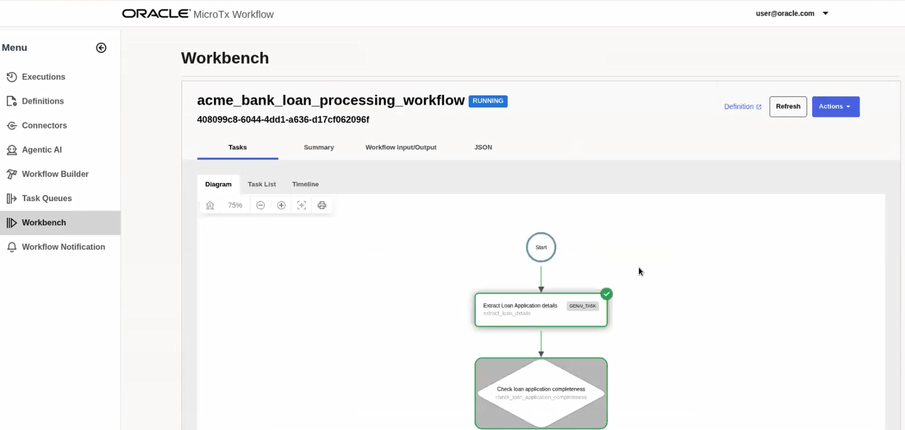

# Run the Workflow

## Introduction

This lab walks you through the steps to run the workflow and view the output.

Estimated Time: 10 minutes

### About MicroTx Workflow Engine

MicroTx Workflow is a no-code solution that helps you design and configure workflows visually, develop agents and agentic workflows, while drastically reducing the need for custom code.

### Objectives

In this lab, you will:
* Assemble reusable tasks, other agents in a workflow
* Provide instructions in natural language
* Use built-in access to tools, including MCP servers
* Leverage planner to transform the high-level goal into actionable tasks with real time adjustments based on the executed task outcome

### Prerequisites

This lab assumes you have:
* An Oracle Cloud account
* All previous labs successfully completed

## Task 1: View the Overall Workflow

1. Open the navigation menu and click **Definitions**, and then click the **Workflows** tab.
   The Workflows list page opens. All the workflows that you have defined are displayed in a table.

2. Identify the workflow that you want to view, such as **"acme\_bank\_loan\_processing\_workflow"**, and then click  (**Edit Workflow**) under **Actions**.
   The Workflow Builder visually depicts all the tasks of the workflow in the left pane. Scroll to view all the tasks in the workflow and how the workflow is executed. In the right pane, the **Workflow** tab displays all the details of the workflow.
  

3. Click **JSON** tab to view the JSON for the workflow as shown in the following image. Scroll to view the JSON.
   

## Task 2: Execute the Workflow

1. Open the navigation menu and click **Workbench**.
    The **Workflow Workbench** page is displayed.

2. In the **Workflow Name** drop-down list, select the `acme_bank_loan_processing_workflow` workflow.

3. In the **Workflow Version** drop-down list, select **Latest Version**.

4. In the **Input (JSON)** text box, paste the following lines of code which provides details about the loan amount, loan tenure, and SSN number of the customer. For document verification, upload a driver's license, this file is already available in object storage.

    ```
    <copy>
    {
      "loan_application_text": "I am looking for the $3000 loan for 3 years tenure. Provide me best interest rate and terms. My SSN number is 123-45-6789",
      "document": "https://raw.githubusercontent.com/oracle-samples/microtx-samples/2fc203578ddd544af796aaf0bf270ae3978b78e7/workflow/loan-application/ocr-microservice/samples_for_ocr/driving-license.png"
    }
    </copy>
    ```

5. Click **Execute Workflow** to run the selected workflow.
   

    Under **Execution History**, a new workflow execution ID is displayed along with the status of the workflow.

    

6. Click the workflow execution ID. The status of the workflow execution is displayed as shown in the following image. Green indicates that the steps have already been executed successfully.
    

7. Click **Refresh** to view the updated status of the workflow after a few seconds. It might take 90 seconds or more to execute the workflow completely.
    When the Send Email notification step turns green as shown in the following image, the workflow stops executing.
    

A notification is sent to the Thunderbird email client that you had configured earlier. As shown in the following figure the notification is a request to approve the loan. Note that the email notification is sent for the highlighted workflow ID. This requires a human being to review the documents and approve the loan request.


The workflow does not progress until a human approves or rejects the loan request.

## Task 3: Approve the Loan Request

1. Open the MicroTx Workflow UI in a new browser tab.

2. Open the navigation menu and click **Workflow Notification**.
   

3. Click **Act**.
   The **Take Action on Task** dialog box appears.

4. Select **Completed** in the **Status** drop-down list to approve the loan.

5. Select the **Approved** check box.
   

6. Click **Submit**.
    A message is displayed that the task was updated successfully.

7. Click **OK**.

8. Refresh the browser tab where the status of the workflow execution is displayed in Workbench.
    The human approval task is now marked in green and status of the workflow changes to **Completed**.
    

## Task 4: Verify the Status of the Loan Application

1. Copy the Workflow ID from the Workbench as shown in the following image.
    

1. Open Oracle SQL Developer.

2. Under **Oracle Connections**, right-click **livelabsUser**, and then click **Connect** to connect to the `livelabUser` schema.
    

3. Enter the following query to retrieve the status of an application. Replace `<workflow-id>` with the value that you have copied in step 1.

    ```
    <copy>
        SELECT * FROM loan_applications
        WHERE application_id = '<workflow-id>';
    </copy>
    ```

4. Click Run to run the query.
    As shown in the following image, the **Query Result** displays the status of the application as **APPROVED**. Which indicates that the application has been processed successfully.
    

## Acknowledgements
* **Author** - Sylaja Kannan, Consulting User Assistance Developer
* **Contributors** -  Brijesh Kumar Deo and Bharath MC
* **Last Updated By/Date** - Sylaja Kannan, February 2026