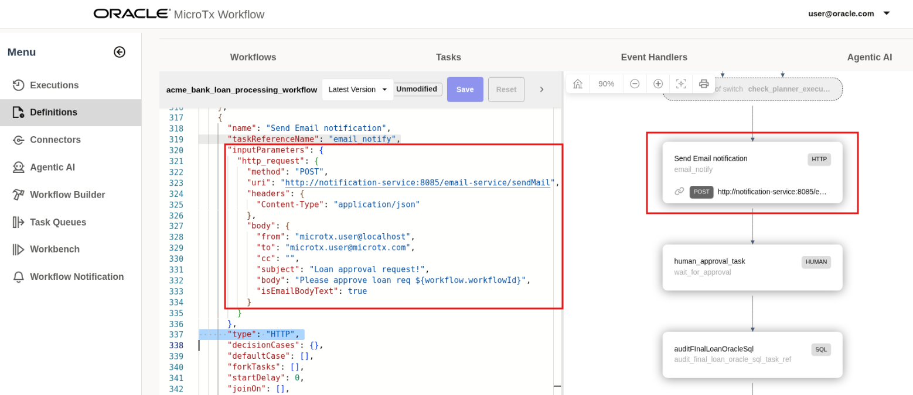

# View Tasks

## Introduction

This lab walks you through the steps to view tasks.

 This lab will help you understand how the building blocks created in the previous two labs are used in tasks. This knowledge will help you build your own tasks later.

Estimated Lab Time: 5 minutes

### About Tasks

TBD.

### Objectives

In this lab, you will:
* View workflow
* View tasks

### Prerequisites

This lab assumes you have:
* An Oracle Cloud account
* All previous labs successfully completed

## Task 1: View the Overall Workflow

1. Open the navigation menu and click **Definitions**.

2. In the **Workflows** tab,  click the `acme_bank_loan_processing_workflow` workflow.
   

3. View the workflow definition in UI to understand the different components of the workflow and how the workflow is executed.
   

## Task 2: View a GenAI Task

This GenAI task is used to extract details for a loan application.

1. In the Workflow definition, let's look at the first task, which is a GenAI task.

   

2. Let's look at the input parameters required by this task. It requires the LLM profile definition that we viewed in Lab 4 and the prompt template that we viewed in Lab 5.

This is how the building blocks that we viewed earlier are pieced together inside a task.

## Task 3: View an Agentic Planner

1. In the Workflow definition, scroll down to view the Agentic Planner task.

2. Click the task to view the associated code.
   

3. Let's look at the input parameters required by agentic planner. It requires the LLM profile definition that we viewed in Lab 4, the prompt template that we viewed in Lab 5, the MCP server definitions that we viewed in Lab 4, and tasks that were defined previously in this workflow.

This is how the building blocks that we viewed earlier are pieced together inside a agentic planner.

## Task 4: View an HTTP Task

1. In the Workflow definition, scroll down to view an HTTP task.

2. Click the task to view the associated code.
   

3. Let's view the input parameters required by HTTP task.

## Task 5: View a Human Task

1. In the Workflow definition, scroll down to view a human task.

2. Click the task to view the associated code.
   

3. Let's view the input parameters required by a Human task.

## Acknowledgements
* **Author** - Sylaja Kannan, Consulting User Assistance Developer
* **Contributors** - Brijesh Kumar Deo and Bharath MC
* **Last Updated By/Date** - Sylaja Kannan, September 2025